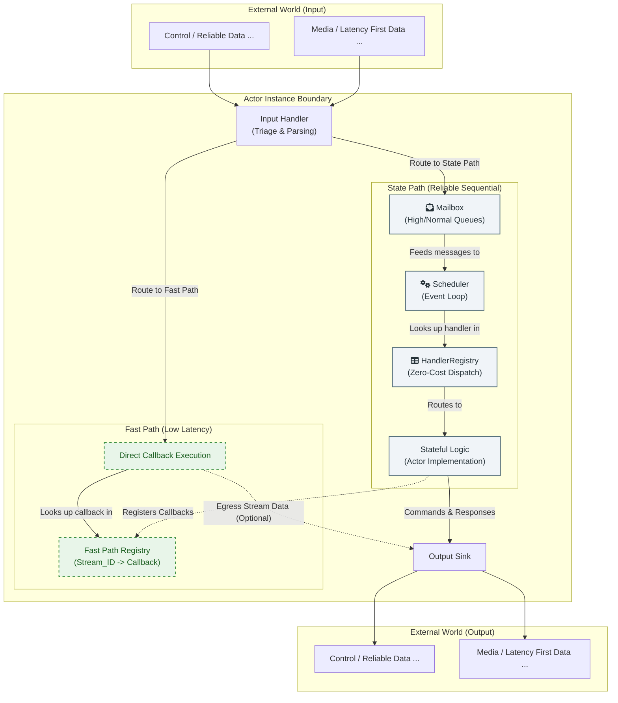

### **理念与架构**

> **📚 相关文档导航**
> - **概念说明**: 本文 | [1.1 ActrSystem 与 Actor](./1.1-actrsystem-and-actor.zh.md) | [1.2 框架内部协议](./1.2-framework-internal-protocols.zh.md)
> - **开发指南**: [2 开发者指南](./2-developer-guide.zh.md) | [2.4 项目清单与 CLI](./2.4-project-manifest-and-cli.zh.md)
> - **实现细节**: [3 框架实现内幕](./3-how-it-works.zh.md) | [4.1 系统架构总览](./4.1-overall.zh.md)

#### **1. 摘要**

本文档阐述了一个专为构建高性能分布式应用的编程框架。其核心在于将经典的 Actor 模型思想与 WebRTC 提供的现代化、多通道点对点通信能力相结合。

框架的设计目标，是为开发者提供一个清晰、健壮的基础架构，以简化构建复杂分布式系统的难度。这既包括中心化的服务节点，也涵盖了运行于边缘设备或用户本地的点对点应用。

#### **2. 架构分层与实现原理**

> **核心架构等式**：
>
> ```
> ActrNode = ActrSystem + Workload
> ```
>
> 这不是"容器包含内容"的关系，而是**两个平行组件的组合**。
>
> **命名约定**：
> - **Actr**: 框架名称
> - **Actor (宏观 Actor)**: 指代一个独立的 Actor 进程，是网络中的基本通信单元
> - **ActrSystem**: 运行时基础设施，提供 Scheduler、Mailbox、Registry、Network 等核心组件
> - **Workload**: 业务逻辑单元，实现具体的消息处理逻辑
> - **ActrNode**: 完整的运行时节点，由 ActrSystem 和 Workload **平行组合**而成
>
> **平行组合理念**：
> ```
> ┌──────────────────┐          ┌──────────────────┐
> │  ActrSystem     │          │    Workload      │
> │  ━━━━━━━━━━━━━   │          │  ━━━━━━━━━━━━━   │
> │  运行时基础设施   │          │  业务逻辑单元     │
> └──────────────────┘          └──────────────────┘
>          │                            │
>          └────────── attach ──────────┘
>                       │
>          ┌────────────▼────────────┐
>          │      ActrNode           │
>          └─────────────────────────┘
> ```
>
> - ActrSystem 本身**不直接存储** Workload；attach 之后由 ActrNode<W> 以 `Arc<W>` 持有
> - HandlerRegistry **存储** 指向 Workload 的 Arc 引用
> - `attach` 操作建立连接，完成组装
> - 清晰的职责分离：基础设施与业务逻辑解耦

**Realm：多租户隔离的设计动机**

在分布式系统中，多个组织或用户群体可能共享同一套基础设施（如信令服务器、TURN 服务器），但需要确保彼此的通信完全隔离。框架通过 **Realm (领域)** 概念实现这一需求。

> **什么是 Realm？**
>
> Realm 是一个逻辑隔离域，用于将 ActrNode 划分为互不干扰的通信群组。只有属于同一个 Realm 的 Actor 才能彼此发现和通信。

**典型应用场景**:

1. **SaaS 多租户**: 每个租户拥有独立的 Realm（如 `tenant-acme`, `tenant-corp`），确保租户 A 的服务无法连接到租户 B 的服务

2. **环境隔离**: 开发、测试、生产环境使用不同的 Realm（如 `dev`, `staging`, `prod`），防止误操作影响生产

3. **权限分组**: 同一组织内的不同部门或项目使用独立 Realm，实现访问控制

**配置示例**:

```toml
# Actr.toml
[package]
manufacturer = "acme"
type = "storage-service"
realm = "tenant-acme"  # 指定所属 Realm
```

**运行时行为**:

- **服务发现**: 信令服务器仅返回同 Realm 的服务列表
- **连接建立**: 不同 Realm 的 ActrNode 尝试连接时会被拒绝
- **日志隔离**: 可按 Realm 过滤日志和监控数据

**关键设计**:

- Realm 在 Protobuf 协议层定义（参见 `1.2-framework-internal-protocols`）
- 默认 Realm 为 `"default"`，适用于简单场景
- Realm 是平坦结构（无层级），确保简单性

> **💡 延伸阅读**:
> - Realm 协议定义 → [1.2 框架内部协议](./1.2-framework-internal-protocols.zh.md)
> - ACL 配置 → [3.13 动态发现与 ACL](./3.13-dynamic-discovery-and-acls.zh.md)
> - 完整术语定义 → [附录：术语表](./appendix-glossary.zh.md)

在深入讨论设计哲学之前，我们需要明确区分框架的两个核心实现层次，这对理解整个架构至关重要：

**🏗️ 系统实现层（Framework Layer）**：
- **编译时优化**：类型推断、零成本抽象、代码生成
- **运行时核心**：Actr 生命周期、内存管理、并发调度
- **底层通信**：WebRTC 连接管理、数据通道抽象

**🌐 协议交互层（Protocol Layer）**：
- **消息路由**：编译时确定的直接函数调用分发
- **网络序列化**：Protobuf 编码/解码
- **服务发现**：动态路由和兼容性协商

**关键设计**：
系统实现层和协议交互层都实现了编译时优化：系统层在编译期确定类型和调用路径，协议交互层则通过代码生成为每个服务依赖创建独立的客户端，由开发者在代码中显式选择调用目标，从而在编译期就确定了完整的调用路径，两层协同实现全面的零成本抽象。

**类比理解**：
这种分层设计超越了传统的 JavaScript VM 模式。传统 VM 架构在系统层高度优化（如 V8 引擎），但协议层仍需动态类型检查。而我们的架构实现了从系统层到协议层的全面编译时优化，类似于 Rust 编译器在所有层级都提供零成本抽象。

同样，我们的框架在系统实现层实现了零成本抽象，在协议交互层通过代码生成的类型安全客户端实现零开销的消息分发 —— 这种“编译时生成，代码内选择”的设计实现了真正的分布式零成本抽象，是现代分布式系统架构的理想形态。

#### **3. 设计哲学与核心选择**

*   **3.1. 基础：WebRTC 与 Actor 模型的结合**

    我们选择 WebRTC 作为底层的通信基石，因为它天生提供了构建现代实时应用所需的多样化通道：可靠有序的数据通道、不可靠无序的数据通道以及高效的音视频媒体通道。同时，我们借鉴 Actor 模型作为组织上层应用逻辑的核心思想，因为它提供了强大的状态隔离和消息驱动的并发模型，能有效降低复杂系统的开发难度。

    本框架的使命，就是将这两者的优势有机地融合在一起。

    更重要的是，WebRTC 内置了对 **ICE (Interactive Connectivity Establishment)** 协议的支持，并可通过 STUN 和 TURN 服务器实现强大的 **NAT（网络地址转换）穿透**能力。这意味着，基于本框架构建的 Actr 进程，即使一方位于复杂的家庭或企业内网中，另一方在移动网络下，双方依然有很大概率可以建立直接的点对点连接。这为实现去中心化的、私有的、低延迟的创新应用（例如，远程桌面、私有文件共享、物联网设备直连）提供了坚实的基础，而无需让所有流量都经过中心服务器中转。

*   **3.2. 范式选择：专注于"宏观 Actor" (The 'Macro-Actor' Model)**

    "宏观 Actor"是我们框架区别于传统 Actor 模式（如 Akka, Erlang）的核心理念。传统框架中的 Actor 通常是微观的、轻量级的，开发者会创建成千上万个实例。

    我们的不同之处在于：
    1.  **宏观层面**: 我们在进程级别（一个独立的服务单元）应用 Actor 模型的思想。**每个进程恰好是一个宏观的 Actr**，无论在云端或边缘。它拥有独立的状态，通过消息与网络中的其他 Actr 进程隔离。
    2.  **分布式视角**: 整个系统由多个这样的 Actr 进程组成，它们通过 WebRTC 相互连接。每个进程内部只有一个 Actr（通过类型系统保证），但网络中可以有任意多个这样的进程。
    3.  **微观层面**: 框架在 Actr 内部的微观并发和组织结构上，是完全不干涉的。开发者可以根据业务场景和自己技术栈偏好，在该宏观 Actor (进程)之下自由选择组织方式，甚至是再组织一层经典 Actor 或者使用其他任何模式。

    我们做出这一选择，是因为我们希望在宏观上，为开发者提供 Actor 模型带来的状态隔离、消息驱动等核心价值，从而简化分布式系统的设计；同时在微观上，将最大的灵活性交还给开发者。

    **微服务视角的补充理解**：

    如果用微服务架构来类比，每个 Actr 进程更像是一个**使用了 Actor 模型的微服务**：
    - **进程级隔离**：每个 Actr 是独立的进程（类似于独立部署的微服务实例）
    - **消息驱动通信**：通过 WebRTC/WebSocket 进行服务间通信（类似于 gRPC/REST API）
    - **状态封装**：每个服务管理自己的状态（类似于微服务的数据库）
    - **显式错误传播**：调用方处理错误而非框架自动重试（类似于微服务的故障处理）

    与传统微服务的关键区别：
    1. **P2P 优先**：默认使用 WebRTC 直连，无需所有流量经过中心网关
    2. **多通道原生支持**：内置可靠消息、低延迟流、媒体轨道等多种通道
    3. **契约驱动**：通过 Protobuf 契约和代码生成实现编译时类型安全

    这种"宏观 Actor = 微服务单元"的设计哲学，决定了框架的错误处理、重试策略、可观测性等方面都遵循微服务的最佳实践，而非经典 Actor 系统的 Supervision 模式。详见《[3.11 生产环境就绪](./3.11-production-readiness.zh.md)》中的错误处理策略。

*   **3.3. 架构基石：双路径处理模型**

    分布式应用的数据流天然具有不同的特性。例如，一个 RPC 调用要求可靠按序，而一个游戏的位置同步则优先考虑低延迟。为了高效处理这些差异，框架引入了双路径处理的核心机制。

    框架提供了一个默认的、经过优化的处理策略，我们称之为“**双路径模型**”：
    *   **状态路径 (The State Path)**：此路径用于处理需要与 Actr 核心状态交互的、必须保证顺序性和原子性的消息。例如，服务的建立与销毁、元数据的交换、状态变更请求等。所有送往状态路径的消息，都会被首先提交到 Actr 的 **Mailbox** 中。

        Mailbox 是一个逻辑概念，代表了 Actor 的**持久化、有序的事务入口**。就实现而言，它是一个基于 **SQLite 数据库**的双优先级队列系统。消息通过 SQLite 事务写入对应的优先级表后，调度器从数据库中按优先级获取消息进行处理：
        
        - **高优通道**：用于系统关键操作（如连接管理、流生命周期控制）
        - **普通通道**：用于一般业务逻辑
        
        每条通道内部严格保证 FIFO 顺序，但框架不保证两条通道间的执行顺序。因此，如果一组业务操作需要严格的先后顺序，开发者必须确保将这些消息稳定地发送到同一个通道中。

    *   **快车道 (The Fast Path)**：此路径用于处理高吞吐量、低延迟的流式数据，例如音视频流或大量的数据块。默认情况下，这些数据会绕过 `Mailbox`，被直接路由到预先绑定的处理回调函数上，以获得最低的处理开销。

    **关键在于，这套“双路径”行为是框架的默认推荐实践，而非强制约束。** 开发者可以通过自定义**输入处理器 (Handler)**，来精确地控制任何类型的数据应该遵循哪条路径，从而为特定的业务场景实现最恰如其分的性能与一致性权衡。

    **重要提示**: 和 `State Path` 内有两条独立 FIFO 通道，继而需要开发者需要确保同一组操作序列的消息，必须稳定地发送到同一个通道中类似，当需要结合使用 `State Path` 和 `Fast Path` 时，开发者也需要充分理解它们之间的关系和特点，以确保能正确地组织业务逻辑。

*   **3.4. 传输层抽象：PayloadType 与 DataLane**

    为了高效地将不同类型的数据路由到最合适的传输通道，框架定义了三层抽象体系。这套抽象是理解双路径模型如何在底层实现的关键。

    **PayloadType (消息负载类型)**

    描述消息的业务语义和传输需求，是框架中所有消息路由的分类依据：

    - `RpcReliable`: 可靠有序的 RPC 消息（请求-响应）
    - `RpcSignal`: 高优先级的信令消息（连接管理、流控制）
    - `StreamReliable`: 可靠有序的流式数据（DataStream 大块传输）
    - `StreamLatencyFirst`: 低延迟优先的流式数据（实时数据同步）
    - `MediaRtp`: WebRTC 原生媒体流（音视频 RTP 包）

    **DataLaneType (数据通道类型)**

    底层传输协议的枚举，代表实际的物理/逻辑传输方式：

    - `Mpsc`: 进程内 tokio mpsc 通道（零序列化，~10μs 延迟）
    - `WebRtcDataChannel(qos)`: WebRTC 数据通道（支持三种 QoS 配置）
      - `Signal`: 可靠有序 + 无限重传
      - `Reliable`: 可靠有序 + 无限重传
      - `LatencyFirst`: 不可靠无序 + 3 次重传 + 100ms 超时
    - `WebSocket`: WebSocket 连接（用于信令或降级传输）

    **DataLane (统一传输抽象)**

    统一的传输通道接口，屏蔽底层协议差异。`DataLane` 是一个 enum，包含以上所有 `DataLaneType` 的具体实例，提供统一的 `send()` 和 `recv()` 方法。框架的 TransportManager 根据 `PayloadType` 自动选择最优的 `DataLaneType` 并创建对应的 `DataLane`。

    **映射关系示例**:

    ```rust
    // PayloadType → DataLaneType 的路由策略
    RpcReliable → [Mpsc, WebRtcDataChannel(Reliable), WebSocket]
    RpcSignal → [Mpsc, WebRtcDataChannel(Signal), WebSocket]
    StreamReliable → [Mpsc, WebRtcDataChannel(Reliable)]
    StreamLatencyFirst → [Mpsc, WebRtcDataChannel(LatencyFirst)]
    MediaRtp → [WebRtcMediaTrack]  // 原生 RTP 通道
    ```

    **进程内 vs 跨进程自动选择**:

    - **进程内通信 (Inproc)**: 自动使用 `Mpsc` 通道，零序列化，直接传递 Rust 对象
    - **跨进程通信 (Outproc)**: 自动选择 WebRTC DataChannel（首选）或 WebSocket（降级）

    **关键设计优势**:

    1. **编译时路由**: `PayloadType` 到 `DataLaneType` 的映射在编译时通过 trait 确定，零运行时开销
    2. **零成本抽象**: 进程内路径完全绕过序列化，跨进程路径使用零拷贝 `Bytes` 类型
    3. **透明降级**: 当 WebRTC 不可用时，框架自动降级到 WebSocket，对上层透明

    > **💡 延伸阅读**:
    > - 详细路由策略 → [附录：Lane 选择策略](./appendix-lane-selection-strategy.zh.md)
    > - 完整术语定义 → [附录：术语表](./appendix-glossary.zh.md)
    > - 实现细节 → [4.6 actr-runtime 架构](./4.6-actr-runtime.zh.md)

*   **3.5. 核心交互接口：`Context` 对象**

    为了将 Actr 的业务逻辑与底层系统能力安全地解耦，框架引入了 `Context` 对象的概念。在任何被调用的 Actr 方法中，`context` 都是其与外部世界交互的唯一、受控的接口。这一设计的核心是"请求，而非命令" (Ask, Don't Command) 原则，它将所有副作用（如 I/O 操作、定时任务）转化为对系统的"请求"，从而最大化业务逻辑的纯粹性和可测试性。

    `Context` 对象主要承载三项职责：

    1.  **副作用的桥梁**: Actr 不直接执行日志记录、网络通信或定时器等操作，而是通过 `context` 发出请求（例如 `context.logger.info(...)`, `context.schedule_tell(...)`）。这使得在测试中可以轻易地用一个模拟的 `Context` 来验证 Actr 的行为，而无需执行真实的 I/O。

    2.  **请求上下文的载体**: `Context` 封装了每次方法调用的环境信息，如调用者身份 (`caller_id`) 和分布式追踪ID (`trace_id`)。这使得业务逻辑可以访问必要的环境信息，而无需污染方法签名。

    3.  **Actr间通信的媒介**: `Context` 提供了类型安全的 `tell` (发送单向消息) 和 `call` (发送请求-响应消息) 方法，用于 Actr 之间的交互。它将 `.proto` 文件中定义的 `service` 契约，转化为符合 Actor 思想的、基于消息传递的 API，保证了通信的健壮性和类型安全。

    > 关于 `Context` 设计哲学的更完整阐述，请参阅《[专题解析之：Context 的设计哲学](./3.2-the-context-philosophy.zh.md)》。

*   **3.6. 框架定位：作为库与配套工具链**

    actr 框架的核心模块（`actr-framework` 和 `actr-runtime`）本质上是强大的**库 (Library)**，旨在嵌入到您的 Rust 应用中，为其提供构建分布式实时通信系统的能力。

    为了简化使用这个库的开发体验，框架提供了一套名为 `actr-cli` 的**配套命令行工具链**。它并非一个隐藏实现细节的“黑盒”，而是旨在自动化繁琐流程的“脚手架”和“构建助手”。

    *   **作为库 (As a Library)**: 您需要在一个标准的二进制项目（即拥有 `src/main.rs`）中引入 `actr-framework` 和 `actr-runtime`。您拥有对进程的完全控制权，负责编写 `main` 函数来实例化 Actr、配置 `ActrSystem`、注入依赖（如数据库连接池、配置管理器），并启动系统。这使得 actr 可以轻松地集成到全新的或已有的复杂应用中。

    *   **配套工具链 (`actr-cli`)**: `actr-cli` 旨在为您处理开发中最繁琐的部分：
        *   `actr-cli init`: 快速搭建一个推荐的项目结构，包含预设的 `Cargo.toml`、示例 `.proto` 文件以及一个 `main.rs` 模板，让您可以立即开始。
        *   `actr-cli build`: 自动处理所有与 Protobuf 相关的**代码生成**。它会调用 `protoc` 和框架插件，将 `.proto` 契约转化为类型安全的 Rust `trait` 和 `Adapter`，然后编译您的整个项目。
        *   `actr-cli run`: 方便地运行您编译好的 Actr 应用。

    这种“库 + 工具链”的模式，既保证了框架的灵活性和可集成性，又通过自动化工具显著降低了上手门槛和日常开发的复杂度。

#### **3. 整体架构与数据流**

框架的内部结构由一系列协同工作的核心组件构成，其交互关系和数据流向如下图所示：



*   **数据在框架中的旅程**
    1.  所有数据首先到达**输入处理器 (Input Handler)**。
    2.  Handler 进行分诊：需要可靠处理的**状态类消息**被送入 **State Path - Mailbox**；需要高性能处理的**流式数据**被直接派发至**Fast Path**。
    3.  **调度器 (Scheduler)** 以预设的优先级策略，从 **Mailbox** 中取出消息。
    4.  **调度器 (Scheduler)** 使用 **处理器注册表 (HandlerRegistry)** 进行消息分发，调用相应 Actor 的具体业务逻辑。
    5.  这些业务逻辑可能会改变 Actor 的内部状态，或在**快车道注册表 (Fast Path Registry)** 中增删条目。
    6.  当业务逻辑需要向外发送数据时，统一通过**输出接口 (Sink)** 完成。

#### **4. 从架构到 API：开发者体验优先**

一个优秀的底层架构，其最终价值体现在能为上层应用开发者提供一套简单、安全、高效的编程接口。本框架通过以下设计，将强大的内部机制转化为对开发者友好的体验：

*   **4.1. 以契约为中心的开发 (Contract-Driven)**
    框架的开发流程始于一份 Protobuf (`.proto`) 文件。开发者通过 `service` 和 `message` 关键字，以一种语言无关的方式，精确地定义 Actor 的能力与数据结构。这份“契约”是整个系统类型安全的基石。

*   **4.2. 自动化与类型安全 (Automation & Type Safety)**
    基于 `.proto` 契约，框架通过代码生成插件，自动创建开发者所需的服务端接口和客户端存根。这免除了大量重复、易错的模板代码编写工作。开发者在实现业务逻辑或调用远程服务时，可以享受到完整的编译时类型检查和 IDE 自动补全，极大地提升了开发效率和代码质量。

*   **4.3. 分层通信模式 (Layered Communication Patterns)**
    强大的底层架构使得优雅的高级 API 设计成为可能。框架提供了一系列分层的通信模式，开发者可以根据需求选用：
    *   **基础层 (`Call`/`Tell`)**: 提供原子的请求-响应和单向消息能力。
    *   **模式层 (`Pub/Sub`, `Streaming`)**: 在基础层之上构建了经典的发布订阅和长连接流式会话模型。
    *   **应用层 (`Media Track Pub/Sub`)**: 领域特定的 API，将复杂的 WebRTC 媒体协商流程封装为简单的发布和订阅调用。

    这些高级模式让开发者得以使用熟悉的、声明式的 API 来表达复杂的业务意图。而框架则在内部负责将这些意图正确地映射到底层通道或平面上。例如，一个流式会话的建立和关闭信令会自动走状态路径，而其间传输的大量数据则会自动走快车道。在一些高级 API 中，这个映射过程对开发者甚至是完全透明的。

#### **5. 总结**

本框架并非意图创造一个全新的并发模型，而是站在巨人（WebRTC, Actor Model）的肩膀上，做了一次专注而务实的整合。它通过聚焦于宏观层面的 Actor 抽象，并提供一套灵活且高性能的数据分类处理机制，致力于为开发者构建下一代实时分布式应用，提供一个简单、可靠、高效的基础。其最终目标，是让开发者能将精力聚焦于业务创新本身，而非底层的复杂性。
