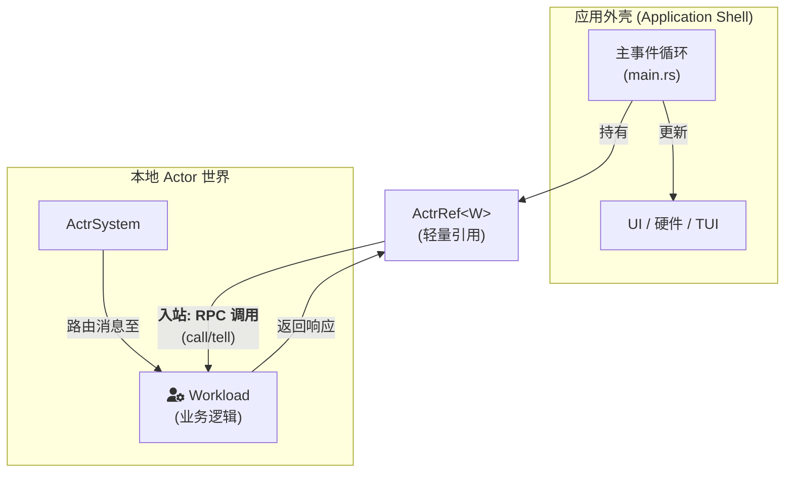

# 专题解析：与外部世界交互 - ActrRef 模式

`actr` 框架的核心是 Actor 模型，它提供了一个隔离的、通过消息传递进行通信的"Actor 世界"。然而，任何有价值的应用都需要与"外部世界"（即由所有 Actor 构成的网络之外的一切）进行交互，例如：

*   响应用户的图形界面（GUI）操作
*   从硬件设备（如传感器、摄像头）读取数据
*   将内部状态的变化反馈给终端界面（TUI）

本文档定义了 **ActrRef 模式**，这是 `actr` 框架中处理"Actor 世界"与"外部世界"之间双向通信的标准方式。我们称外部世界的管理者为 **应用外壳** (Application Shell)。

---

## 核心原则：统一的 Actor 模型

在 `actr` 的设计中，不存在"客户端"和"服务端"的本质区别。任何一个 `actr` 应用，无论其作用是提供服务、消费服务，还是与用户交互，其内部都是一个标准的、完整的 `ActrNode`：它拥有一个 `Workload` (业务逻辑) 和一个 `ActrSystem` (运行时)。

应用外壳（例如一个 GUI 应用的 `main` 函数）的职责，就是初始化这个本地的 `ActrSystem`，并通过 **ActrRef** 与本地 Actor 交互。



---

## 1. ActrRef：Shell 与 Workload 的桥梁

### 1.1 什么是 ActrRef？

`ActrRef<W>` 是 Shell 与 Workload 之间通信的 **唯一句柄**。它由 `ActrNode::start()` 返回，具有以下特性：

- **轻量级**：内部只包含一个 `Arc<ActrRefShared>`，克隆成本极低
- **类型安全**：泛型参数 `W` 绑定到具体 Workload 类型
- **零配置**：无需在 `Actr.toml` 或配置中声明任何 Shell 相关内容
- **代码生成友好**：代码生成器会为每个 RPC 方法生成类型化的扩展方法

### 1.2 ActrRef 的创建

```rust
use actr_runtime::ActrNode;

#[tokio::main]
async fn main() -> Result<(), Box<dyn std::error::Error>> {
    // 1. Create ActrNode with your Workload
    let node = ActrNode::new(MyWorkload::new());

    // 2. Start the node and get ActrRef
    let actr: ActrRef<MyWorkload> = node.start().await?;

    // 3. Now you can interact with Workload via actr
    // ...

    Ok(())
}
```

**关键点**：
- `ActrNode::start()` 自动创建双向 Shell ↔ Workload 通信基础设施
- 所有 ActrNode 都支持 Shell 交互，无需额外配置
- ActrRef 可以被克隆并在多个任务中使用

---

## 2. 入站通信：Shell → Workload

ActrRef 提供两种消息发送方式：

### 2.1 RPC 调用：`call()` - 等待响应

```rust
// Proto 定义
// service EchoService {
//   rpc Echo(EchoRequest) returns (EchoResponse);
// }

// Shell 代码
let request = EchoRequest {
    message: "Hello from Shell".to_string(),
};

// 方式 1: 使用泛型 call() 方法
let response: EchoResponse = actr.call(request).await?;

// 方式 2: 使用代码生成的类型化方法（推荐）
let response = actr.echo(request).await?;

println!("Received: {}", response.message);
```

**特点**：
- ✅ **等待响应**：阻塞直到 Workload 返回结果
- ✅ **类型安全**：编译器检查请求和响应类型
- ✅ **超时机制**：默认 30s 超时（可配置）
- ✅ **错误处理**：返回 `ActorResult<M::Response>`

### 2.2 Fire-and-Forget：`tell()` - 单向消息

```rust
// Proto 定义
// message LogEvent {
//   string level = 1;
//   string message = 2;
// }

// Shell 代码
let event = LogEvent {
    level: "INFO".to_string(),
    message: "User logged in".to_string(),
};

// 发送消息，不等待响应
actr.tell(event).await?;

// 继续执行，Workload 异步处理
println!("Event sent, continuing...");
```

**特点**：
- ✅ **不等待响应**：发送后立即返回
- ✅ **低延迟**：~10μs（进程内，零序列化）
- ✅ **适用场景**：日志、通知、状态更新等
- ⚠️ **无确认**：调用方不知道消息是否被处理

### 2.3 通信流程图

```mermaid
sequenceDiagram
    participant Shell as 应用外壳 (main.rs)
    participant ActrRef as ActrRef&lt;W&gt;
    participant InprocGate as InprocOutGate
    participant Lane as Lane::Mpsc
    participant Workload as Workload

    Note over Shell,Workload: RPC 调用流程 (call)

    Shell->>ActrRef: 1. actr.call(EchoRequest {...})
    ActrRef->>ActrRef: 2. Encode proto request
    ActrRef->>InprocGate: 3. send_request(envelope)
    InprocGate->>InprocGate: 4. pending_requests.insert(id, tx)
    InprocGate->>Lane: 5. send_envelope(envelope)
    Note right of Lane: 零序列化！直接传递对象

    Lane->>Workload: 6. recv_envelope()
    Workload->>Workload: 7. Router::route() → handle_echo()
    Workload->>Lane: 8. send_envelope(response)

    Lane->>InprocGate: 9. recv_envelope() (response)
    InprocGate->>InprocGate: 10. complete_response(id, payload)
    InprocGate->>ActrRef: 11. Return response bytes
    ActrRef->>ActrRef: 12. Decode proto response
    ActrRef->>Shell: 13. Return EchoResponse

    Note over Shell,Workload: Fire-and-Forget 流程 (tell)

    Shell->>ActrRef: 1. actr.tell(LogEvent {...})
    ActrRef->>InprocGate: 2. send_message(envelope)
    InprocGate->>Lane: 3. send_envelope(envelope)
    Lane->>Workload: 4. recv_envelope()
    Workload->>Workload: 5. Router::route() → handle_log_event()
    ActrRef->>Shell: 6. Return Ok(()) (immediately)
```

---

## 3. 代码生成模式

### 3.1 Proto 定义

```protobuf
// proto/echo.proto
syntax = "proto3";

package echo.v1;

service EchoService {
  rpc Echo(EchoRequest) returns (EchoResponse);
  rpc Log(LogEvent) returns (google.protobuf.Empty);
}

message EchoRequest {
  string message = 1;
}

message EchoResponse {
  string message = 1;
}

message LogEvent {
  string level = 1;
  string message = 2;
}
```

### 3.2 生成的 ActrRef 扩展

```rust
// generated/echo_service_actr_ref.rs

use actr_runtime::ActrRef;
use super::echo_service_actor::{EchoServiceWorkload, EchoServiceHandler};
use super::echo::{EchoRequest, EchoResponse, LogEvent};

impl<T: EchoServiceHandler> ActrRef<EchoServiceWorkload<T>> {
    /// Call Echo RPC method
    pub async fn echo(&self, request: EchoRequest) -> ActorResult<EchoResponse> {
        self.call(request).await
    }

    /// Call Log RPC method (fire-and-forget if response is Empty)
    pub async fn log(&self, request: LogEvent) -> ActorResult<()> {
        self.tell(request).await
    }
}
```

### 3.3 Shell 使用

```rust
use generated::echo_service_actr_ref::*;  // Import ActrRef extensions

#[tokio::main]
async fn main() -> Result<(), Box<dyn std::error::Error>> {
    let node = ActrNode::new(MyEchoServiceWorkload::new());
    let actr = node.start().await?;

    // 类型安全的 RPC 调用（IDE 自动补全！）
    let response = actr.echo(EchoRequest {
        message: "Hello".to_string(),
    }).await?;
    println!("Echo: {}", response.message);

    // Fire-and-forget 日志
    actr.log(LogEvent {
        level: "INFO".to_string(),
        message: "Operation completed".to_string(),
    }).await?;

    Ok(())
}
```

---

## 4. 生命周期管理

### 4.1 启动和关闭

```rust
use actr_runtime::ActrNode;

#[tokio::main]
async fn main() -> Result<(), Box<dyn std::error::Error>> {
    // 1. Create and start
    let node = ActrNode::new(MyWorkload::new());
    let actr = node.start().await?;

    // 2. Use ActrRef
    let response = actr.echo(EchoRequest { ... }).await?;

    // 3. Shutdown
    actr.shutdown();
    actr.wait_for_shutdown().await;

    Ok(())
}
```

### 4.2 Ctrl+C 处理（便捷方法）

```rust
#[tokio::main]
async fn main() -> Result<(), Box<dyn std::error::Error>> {
    let node = ActrNode::new(MyWorkload::new());
    let actr = node.start().await?;

    // 在后台任务中使用 ActrRef
    let actr_clone = actr.clone();
    tokio::spawn(async move {
        loop {
            let response = actr_clone.echo(EchoRequest { ... }).await?;
            tokio::time::sleep(Duration::from_secs(5)).await;
        }
    });

    // 主线程等待 Ctrl+C
    actr.wait_for_ctrl_c_and_shutdown().await?;

    Ok(())
}
```

### 4.3 自动清理

```rust
{
    let node = ActrNode::new(MyWorkload::new());
    let actr = node.start().await?;

    // ... use actr ...

} // actr 离开作用域时自动触发 shutdown 和清理
```

**关键点**：
- `ActrRef::Drop` 会自动调用 `shutdown()` 并中止所有后台任务
- 最后一个 `ActrRef` 被释放时触发完整清理

---

## 5. 性能特性

### 5.1 通信开销

```
┌────────────────────────────────────────────────────────────┐
│  Shell → Workload RPC (call)                               │
├────────────────────────────────────────────────────────────┤
│  1. Proto encode:         ~1μs (small message)             │
│  2. InprocOutGate:        ~2μs (pending_requests insert)   │
│  3. Lane::Mpsc send:      ~5μs (zero-copy mpsc)            │
│  4. Workload processing:  (depends on business logic)      │
│  5. Lane::Mpsc recv:      ~5μs                             │
│  6. InprocOutGate:        ~2μs (pending_requests remove)   │
│  7. Proto decode:         ~1μs                             │
│                                                              │
│  Total overhead:          ~16μs (without business logic)   │
└────────────────────────────────────────────────────────────┘

┌────────────────────────────────────────────────────────────┐
│  Shell → Workload Fire-and-Forget (tell)                   │
├────────────────────────────────────────────────────────────┤
│  1. Proto encode:         ~1μs                             │
│  2. InprocOutGate:        ~1μs (no pending_requests)       │
│  3. Lane::Mpsc send:      ~5μs                             │
│  4. Return to Shell:      immediate                        │
│                                                              │
│  Total overhead:          ~7μs                             │
└────────────────────────────────────────────────────────────┘
```

### 5.2 内存效率

```
ActrRef<W> 大小:
  └─ Arc<ActrRefShared>: 8 bytes (pointer)

ActrRefShared 大小:
  ├─ ActrId: ~32 bytes
  ├─ Arc<InprocOutGate>: 8 bytes (pointer)
  ├─ CancellationToken: ~24 bytes
  └─ Vec<JoinHandle>: ~24 bytes (empty vec)

Total per ActrRef: ~8 bytes (Arc pointer)
Total shared state: ~88 bytes (single allocation)
```

### 5.3 并发性

```rust
// ActrRef 是 Clone，可以在多个任务中并发使用
let actr1 = actr.clone();
let actr2 = actr.clone();

tokio::spawn(async move {
    loop {
        actr1.echo(EchoRequest { ... }).await?;
    }
});

tokio::spawn(async move {
    loop {
        actr2.log(LogEvent { ... }).await?;
    }
});
```

**关键点**：
- ✅ **线程安全**：所有方法都是 `async` 和 `Send`
- ✅ **零竞争**：每个 RPC 有独立的 request_id
- ✅ **高吞吐**：InprocTransportManager 使用 tokio::mpsc，无锁设计

---

## 6. 最佳实践

### 6.1 错误处理

```rust
// ❌ 不要忽略错误
actr.echo(request).await;

// ✅ 正确处理错误
match actr.echo(request).await {
    Ok(response) => println!("Success: {}", response.message),
    Err(e) => eprintln!("RPC failed: {:?}", e),
}

// ✅ 或使用 ? 传播错误
let response = actr.echo(request).await?;
```

### 6.2 超时控制

```rust
use tokio::time::{timeout, Duration};

// 自定义超时（覆盖默认 30s）
let result = timeout(
    Duration::from_secs(5),
    actr.echo(request)
).await;

match result {
    Ok(Ok(response)) => println!("Success: {}", response.message),
    Ok(Err(e)) => eprintln!("RPC failed: {:?}", e),
    Err(_) => eprintln!("Timeout after 5s"),
}
```

### 6.3 选择 call() vs tell()

```rust
// 使用 call() 当需要响应时
let user_info = actr.get_user_info(user_id).await?;

// 使用 tell() 当不关心响应时
actr.log_user_action(action).await?;

// 使用 tell() 当需要最低延迟时
for event in events {
    actr.tell(event).await?; // ~7μs overhead
}
```

### 6.4 资源清理

```rust
// ✅ 显式关闭
actr.shutdown();
actr.wait_for_shutdown().await;

// ✅ 或依赖 Drop（作用域结束时自动）
{
    let actr = node.start().await?;
    // ... use actr ...
} // 自动 shutdown

// ⚠️ 如果有后台任务持有 ActrRef，需要手动管理
```

---

## 7. 常见问题

### Q1: 为什么 ActrRef 没有 `events()` 方法？

**A**: 当前设计专注于 Shell → Workload 的 RPC 调用。如果需要 Workload → Shell 的事件通知，推荐以下模式：

```rust
// Workload 实现
impl MyHandler for MyWorkload {
    async fn on_event<C: Context>(&self, event: Event, ctx: &C) -> Result<()> {
        // 通过 RPC 回调 Shell（如果 Shell 提供了回调接口）
        // 或者通过外部 channel（如 tokio::mpsc）
    }
}
```

未来版本可能会增加内置的事件订阅机制。

### Q2: ActrRef 是否线程安全？

**A**: 是的，`ActrRef` 实现了 `Clone + Send + Sync`，可以在多个任务和线程中安全使用。

### Q3: 可以在 Workload 内部获取 ActrRef 吗？

**A**: 不可以。ActrRef 仅用于 Shell → Workload 通信。如果 Workload 需要与其他 Actor 通信，应使用 `ctx.call()` 或 `ctx.tell()`。

### Q4: ActrRef 的生命周期如何管理？

**A**: ActrRef 使用引用计数（Arc），最后一个引用被释放时自动触发 shutdown。建议在主线程持有一个引用，后台任务克隆使用。

---

## 8. 与 Context 的对比

| 方面 | ActrRef (Shell 侧) | Context (Workload 侧) |
|------|-------------------|---------------------|
| **调用方** | Shell (main.rs) | Workload |
| **目标** | 本地 Workload（固定） | 任何 Actor（需指定 target） |
| **方法签名** | `actr.echo(req)` | `ctx.call(target, req)` |
| **代码生成** | 具体 impl 块 | Extension trait |
| **性能** | ~16μs (inproc) | ~16μs (inproc) or ~2ms (outproc) |
| **类型安全** | 编译时检查 | 编译时检查 |

**关键区别**：
- **ActrRef** 是外部 Shell 与内部 Workload 的桥梁
- **Context** 是 Workload 与其他 Actor（本地或远程）的桥梁

---

## 9. 总结

ActrRef 模式提供了：

✅ **零配置**：无需在配置中声明 Shell 支持，所有 ActrNode 自动启用
✅ **类型安全**：通过泛型和代码生成实现编译时类型检查
✅ **高性能**：进程内通信 ~16μs，零序列化（直接传递对象）
✅ **灵活性**：支持 RPC（call）和 fire-and-forget（tell）两种模式
✅ **易用性**：简单的 API，丰富的代码生成支持

通过 ActrRef，应用外壳可以以类型安全、低延迟、零配置的方式与本地 Workload 交互，构建出响应迅速、易于维护的应用程序。

---

**相关文档**：
- [4.6 actr-runtime Runtime Architecture](4.6-actr-runtime.zh.md) - Runtime 架构详解
- [3.2 The Context Philosophy](3.2-the-context-philosophy.zh.md) - Context 设计理念
- [3.1 Attach and Codegen](3.1-attach-and-codegen.zh.md) - 代码生成机制
