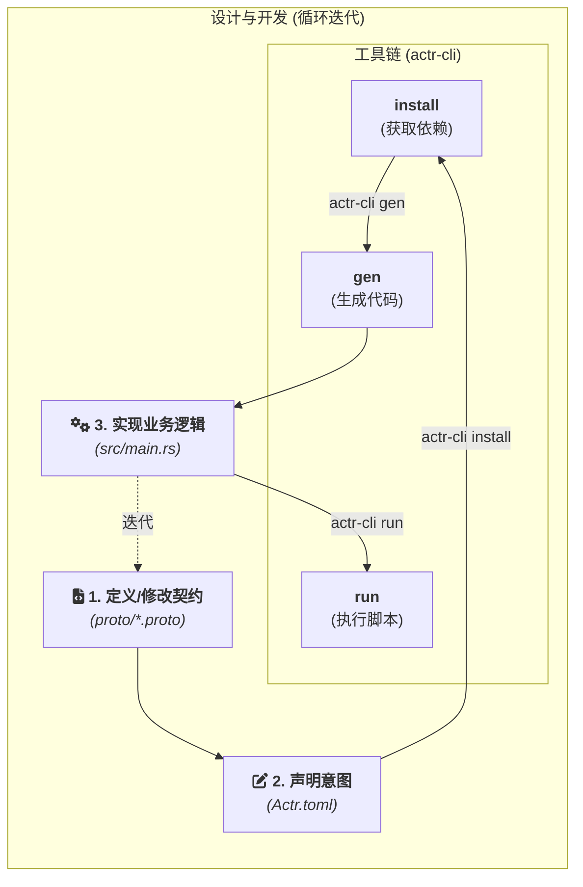

# 开发者指南

> **📖 术语约定**：
> - **Actor-rtc / actr**: 框架名称
> - **ActrNode**: 一个运行的进程实例（ActrSystem + Workload）
> - **宏观 Actor**: 架构模式（区别于 Akka/Erlang 的微观 Actor）
> - **Actr**: 口语简称，根据上下文指代框架或节点
>
> 完整术语定义请参见 [附录：术语表](./appendix-glossary.zh.md)

这份指南站在使用者的角度，以 Rust 为示例语言，通过实际的代码和简明的步骤，展示如何利用 `actr` 生态系统构建一个应用。本文档专注于"如何做"，而非"为什么"。

## 1. 核心工作流

`actr` 的开发围绕一个以“契约”为中心的、清晰的迭代循环展开。



**开发者的工作流程**:
1.  **定义/修改契约**: 在 `.proto` 文件中定义服务接口和数据结构。
2.  **声明意图**: 在 `Actr.toml` 中声明 Actor 的类型、提供的服务、依赖的服务以及如何运行它。
3.  **安装依赖**: (如果依赖外部服务) 运行 `actr-cli install`，工具会下载远程 `.proto` 依赖并生成 `actr.lock.toml`。
4.  **生成代码**: 运行 `actr-cli gen`，工具会根据 `.proto` 契约生成 Rust 代码（包括 `Handler` trait 和消息类型）。
5.  **实现业务**: 在 Rust 代码中（如 `src/main.rs`）为你的业务结构体实现生成的 `Handler` trait。
6.  **运行测试**: 运行 `actr-cli run test` 或 `actr-cli run` 来启动和测试应用。
7.  重复以上步骤，持续迭代。

### 1.5. 服务身份与版本管理

在开始构建应用之前，理解 Actor-RTC 的服务标识和版本管理机制非常重要。这决定了你的服务如何被识别、如何与其他服务交互。

#### **ActrType - 服务类型标识**

每个 ActrNode 都有一个**服务类型标识符** (`ActrType`)，格式为：

```
<manufacturer>:<name>
```

**示例**:
- `acme:echo-service` - ACME 公司的回声服务
- `openai:chat-gpt` - OpenAI 的 ChatGPT 服务
- `my-org:video-encoder` - 自定义的视频编码服务

**配置位置**: 在 `Actr.toml` 中声明：

```toml
[package]
manufacturer = "acme"
type = "echo-service"  # 最终生成 ActrType: "acme:echo-service"
```

**用途**:
- **服务发现**: 其他 Actor 通过 ActrType 查找和连接你的服务
- **权限控制**: 可配置哪些 ActrType 允许连接（ACL）
- **日志追踪**: 系统日志中识别服务来源

#### **Fingerprint - 服务指纹（版本锁定）**

**什么是 Fingerprint？**

Fingerprint 是基于 `.proto` 文件内容计算的**语义哈希**，用于精确锁定服务版本。它确保你依赖的服务契约不会在运行时发生意外变化。

**两种类型**:

1. **Proto 级指纹** (`semantic:abc123...`)
   - 单个 `.proto` 文件的内容哈希
   - 只要文件内容相同，指纹就相同（忽略空格、注释）

2. **服务级指纹** (`service_semantic:xyz789...`)
   - 所有 `exports` 文件组合的哈希
   - 代表完整服务契约的版本

**实际应用场景**:

**场景 1: 安装依赖**

当你运行 `actr-cli install` 时，会提示你选择服务的 fingerprint：

```bash
$ actr-cli install
Found 3 versions for 'acme:storage-service':
1. semantic:abc123 (2024-01-15) - v1.2.0
2. semantic:def456 (2024-02-20) - v1.3.0
3. semantic:ghi789 (2024-03-10) - v1.4.0

Select version: 2
```

选中后，该 fingerprint 会被锁定到 `actr.lock.toml`：

```toml
[[dependencies]]
actr_type = "acme:storage-service"
fingerprint = "semantic:def456"
proto_files = ["storage.v1.proto"]
```

**场景 2: 运行时兼容性检查**

当两个 ActrNode 建立连接时，框架会自动检查双方的服务契约是否兼容：

```
ActrNode A 依赖 "acme:storage-service" (fingerprint: semantic:def456)
ActrNode B 提供 "acme:storage-service" (fingerprint: semantic:def456)
✅ Fingerprint 匹配，允许连接
```

如果不匹配：

```
ActrNode A 依赖 "acme:storage-service" (fingerprint: semantic:def456)
ActrNode B 提供 "acme:storage-service" (fingerprint: semantic:ghi789)
❌ Fingerprint 不匹配，拒绝连接（版本不兼容）
```

**关键优势**:

1. **防止版本漂移**: 即使服务提供者更新了 `.proto`，你的应用仍使用锁定的版本
2. **显式升级**: 必须手动运行 `actr-cli install --upgrade` 才能更新依赖
3. **协商透明**: 运行时自动进行版本协商，无需手动检查

#### **ActrId - 运行时实例标识**

除了 ActrType，每个**运行中**的 ActrNode 实例还有一个唯一的 `ActrId`，格式为：

```
<manufacturer>:<name>:<serial_number>
```

**示例**: `acme:echo-service:550e8400-e29b-41d4-a716-446655440000`

- `acme:echo-service` 是 ActrType（服务类型）
- `550e8400-...` 是运行时生成的 UUID（实例编号）

**用途**:
- **消息路由**: 框架通过 ActrId 路由消息到具体实例
- **追踪调试**: 日志中区分同一服务的不同实例
- **点对点通信**: 直接向特定实例发送消息

#### **术语对比表**

| 术语 | 作用域 | 用途 | 示例 |
|------|--------|------|------|
| **ActrType** | 服务类型级别 | 服务发现、权限控制 | `acme:echo-service` |
| **Fingerprint** | 服务版本级别 | 版本锁定、兼容性检查 | `semantic:abc123` |
| **ActrId** | 运行时实例级别 | 消息路由、实例追踪 | `acme:echo-service:550e8400-...` |

#### **最佳实践**

1. **使用语义化版本注释**: 在 `.proto` 文件中添加版本注释
   ```proto
   // Version: v1.2.0
   service EchoService { ... }
   ```

2. **定期检查依赖更新**: 运行 `actr-cli install --check-updates`

3. **测试环境先验证**: 升级依赖 fingerprint 前，在测试环境验证兼容性

4. **记录重大变更**: 如果修改了 `exports` 的 `.proto`，在 CHANGELOG 中说明

> **💡 延伸阅读**:
> - 完整配置参考 → [2.4 项目清单与 CLI](./2.4-project-manifest-and-cli.zh.md)
> - 服务发现机制 → [3.12 服务发现与兼容性](./3.12-service-discovery-and-compatibility.zh.md)
> - 完整术语定义 → [附录：术语表](./appendix-glossary.zh.md)

---

## 2. 快速入门：构建一个回声服务

本节将指导你完成一个完整的 `actr` 项目，该项目将实现一个可通过 WebRTC 数据通道进行回声测试的 Actor 服务。我们将使用“库模式”进行开发，以清晰地展示系统的组装过程。

### 2.1. 环境准备

*   **Rust 工具链**: `rustup toolchain install stable`
*   **`protoc` 编译器**: 
    *   **Ubuntu/Debian**: `sudo apt update && sudo apt install protobuf-compiler`
    *   **macOS (Homebrew)**: `brew install protobuf`
*   **本框架的命令行工具**:
    `cargo install actr-cli` (待发布)

### 2.2. 项目搭建

#### **Step 1: 创建项目**

使用 `actr-cli init` 来创建一个新的 Actor 项目骨架。

```bash
actr-cli init webrtc-echo-actor
cd webrtc-echo-actor
```
工具会生成一个包含 `Actr.toml`、`proto/echo.v1.proto` 和 `src/main.rs` 等文件的项目结构。

#### **Step 2: 声明意图 (`Actr.toml`)**

打开 `Actr.toml`，检查工具生成的配置。它定义了 Actor 的类型、提供的服务以及运行脚本。

```toml
[package]
name = "webrtc-echo-actor"
manufacturer = "acme"
# Actr 在网络中的服务类型，用于服务发现
type = "echo-service"

# 声明此 Actor 实现的 .proto 契约文件集合
exports = ["proto/echo.v1.proto"]

# 本项目没有外部 proto 依赖，所以 [dependencies] 为空

[scripts]
# 定义 `run` 命令，用于启动 Actor
run = "cargo run --release"
test = "cargo test"

# 运行时所需的信令服务器配置
[system.signaling]
url = "ws://localhost:8081"
```

#### **Step 3: 定义契约 (`proto/echo.v1.proto`)**

打开 `proto/echo.v1.proto`，这里定义了服务的接口和数据结构。

```protobuf
syntax = "proto2";
package echo.v1;

message EchoRequest {
  optional string message = 1;
}

message EchoResponse {
  optional string reply = 1;
}

service EchoService {
  rpc SendEcho(EchoRequest) returns (EchoResponse);
}
```

#### **Step 4: 生成代码**

在实现业务逻辑之前，先运行一次 `gen` 命令，让 `actr-cli` 为我们生成所需的 Rust 代码。

```bash
# 此命令会解析 proto 文件，并生成服务端 trait 和其他类型
actr-cli gen
```
执行后，`src/generated/` 目录中会生成相应的 Rust 代码，我们将在下一步中实现它。

#### **Step 5: 实现业务逻辑 (`src/main.rs`)**

现在，打开 `src/main.rs` 并实现业务逻辑。你需要定义一个代表 Actor 的 `struct`，并为它实现由代码生成器创建的 `Handler` trait。

```rust
// src/main.rs

// 1. 引入框架的核心抽象
// 这些是构建任何 Actor 都需要的基础组件
use actr_framework::prelude::*;
use actr_framework::actr_runtime::prelude::*;
use std::sync::Arc;

// 2. 引入由 `actr gen` 生成的代码
// a. Protobuf 消息类型
mod generated {
    include!(concat!(env!("OUT_DIR"), "/echo.v1.rs"));
}
use generated::{EchoRequest, EchoResponse};
// b. 生成的服务 Handler trait 和路由配置
include!(concat!(env!("OUT_DIR"), "/echo.v1_actr.rs"));

// 3. 定义 Actor 业务逻辑的结构体 (Workload)
#[derive(Default)]
pub struct EchoActor;

// 4. 为业务结构体实现生成的服务 Handler trait
// 代码生成器为 .proto 中的每个 service 生成一个 trait（如 EchoServiceHandler）
// 这是 Actor 处理具体消息的地方
#[async_trait]
impl EchoServiceHandler for EchoActor {
    async fn send_echo(&self, request: EchoRequest, _ctx: &Context) -> ActorResult<EchoResponse> {
        println!("收到消息: '{}'", request.message.as_deref().unwrap_or_default());
        let reply = format!("回声: {}", request.message.as_deref().unwrap_or_default());
        Ok(EchoResponse { reply: Some(reply) })
    }
}

// 5. 通过 blanket impl 自动获得 MessageHandler<M> 和 Workload trait
// 代码生成器会自动提供这些实现，开发者无需手动编写
// 这是实现零成本抽象和编译时路由的关键

// 6. 程序入口：组装并启动 ActrSystem
// ActrSystem 和 Workload 是平行组合的关系，通过 attach() 方法组装
#[tokio::main]
async fn main() -> Result<(), Box<dyn std::error::Error>> {
    // 实例化 Actor 的业务逻辑部分
    let actor_logic = EchoActor::default();
    
    // 从 Actr.toml 加载配置
    let config = actr_config::Config::from_file("Actr.toml")?;

    println!("Echo Actor 正在启动...");

    // 使用 Builder 模式组装 ActrSystem
    let system = ActrSystem::new(config)?
        .attach(actor_logic) // 将业务逻辑附加到系统
        .start() // 启动系统，开始连接信令服务器并处理消息
        .await?;

    // 等待系统关闭
    system.wait_for_shutdown().await;

    println!("Echo Actor 已停止。");
    
    Ok(())
}
```

#### **Step 6: 构建并运行**

现在，所有代码都已准备就绪。

```bash
# 如果修改了 .proto 文件，需要再次运行 gen
actr-cli gen

# 运行在 Actr.toml 中定义的 "run" 脚本来编译和启动应用
actr-cli run
```

如果一切顺利，你将看到 "Echo Actor 正在启动..." 的输出，代表你的第一个 `actr` 应用已成功启动并连接到信令服务器。

---

## 3. 核心 API 与最佳实践

*   **`Actr.toml`**: 项目的"意图"声明文件，是所有 `actr-cli` 命令的输入源，也是 SDK 运行时的配置来源。
*   **`actr-cli`**: 统一的开发工具链，负责依赖、代码生成、构建和执行。
*   **服务 Handler Trait**: 代码生成器为 `.proto` 中的每个 `service` 生成一个 trait（如 `EchoServiceHandler`）。实现这个 trait 即可处理该服务的所有 RPC 方法。
*   **自动生成的 trait 实现**: 代码生成器通过 blanket impl 自动为你的 `struct` 提供 `MessageHandler<M>` 和 `Workload` trait 实现，实现零成本抽象。
*   **`Context` 对象**: Actor 在运行时与系统交互的句柄。用它来获取调用者信息 (`caller_id`)、记录日志 (`logger`)、安排延迟任务 (`schedule_tell`) 或调用其他 Actor。
*   **状态管理**: 将 Actor 的状态封装在 `struct` 中。对于需要在异步方法间共享的可变状态，请使用 `tokio::sync::Mutex` 或 `Arc`。
*   **错误处理**: 在服务 Handler trait 的方法实现中，返回 `Err(ActorError::...)` 来向对等端传递结构化的业务错误。
*   **测试**: 你的业务 `struct` 可以被独立进行单元测试。只需模拟 `Request` 和 `Context`，然后断言服务 Handler 方法的返回值即可，无需任何网络组件。