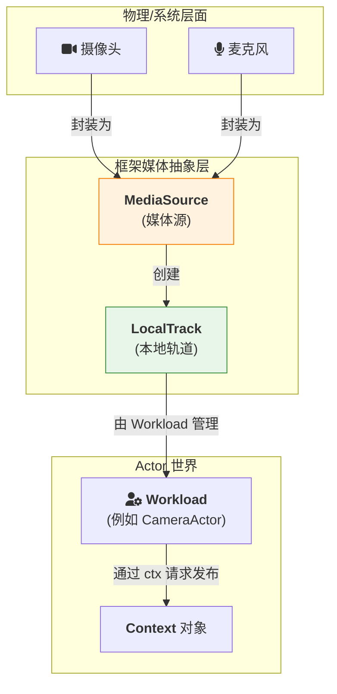

# 媒体处理：从设备到网络

> **⚠️ 文档说明**：
> - **第 1 节**：MediaSource/LocalTrack 是**设计概念**，框架当前**未提供**设备采集能力
> - **第 2 节**：MediaTrack API 是**已实现**的 WebRTC 传输层 API
>
> 如需设备采集功能，请使用外部库（如 `webrtc.rs`、`cpal` 等）获取媒体数据，然后通过第 2 节的 API 进行传输。

对于一个 WebRTC 应用框架而言，完整的媒体处理包含两个层面：

1. **设备层**：如何获取物理设备（摄像头、麦克风）的媒体流
2. **网络层**：如何通过 WebRTC 高效传输媒体数据

本文内容：
- **第 1 节**：MediaSource 与 LocalTrack（**设计概念**，尚未实现）
- **第 2 节**：MediaTrack API（**已实现**，可直接使用）

---

## 第 1 节：客户端物理设备处理（设计概念）

> **⚠️ 本节描述的 API 尚未实现**
>
> `MediaSource`、`LocalTrack`、`ctx.publish_track()` 等 API 当前**不存在于框架代码中**。这是未来可能实现的设计方向。
>
> **当前方案**：使用外部库获取媒体数据，通过第 2 节的 `register_media_track()` 和 `send_media_sample()` API 进行传输。

### 1.1 核心抽象：`MediaSource` 与 `LocalTrack`

直接操作硬件并将其原始数据流编码、打包成 RTP 包是一个极其复杂的过程。本框架通过提供 **`MediaSource`** 和 **`LocalTrack`** 这两个高级抽象，来弥合硬件与网络之间的鸿沟。


*   **`MediaSource`**: 代表一个可以产生媒体流的物理或虚拟设备（摄像头、麦克风、屏幕）。它的职责是发现和选择设备。
*   **`LocalTrack`**: 代表一个具体的、可被发布到网络上的本地媒体轨道。它是进行发布前所有操作的核心对象。

### 1.2 集成到 Actor 模型中

根据我们统一的架构，一个处理媒体的客户端应用，其自身也是一个标准的 `ActrNode`。它拥有一个 `Workload`（我们称之为 `CameraActor`），负责管理媒体设备和与远端服务通信。

发布一个媒体轨道的流程，完全遵循 Actor 的“请求-响应”模式。

#### **工作流程**

1.  **应用外壳初始化**: 在 `main` 函数中，应用外壳使用 `MediaSource` API 枚举设备，并创建一个 `LocalTrack`。
2.  **注入 Workload**: `LocalTrack` 作为资源，在创建 `CameraActor` 时被注入。
3.  **UI 触发发布**: 用户点击“开始直播”按钮，UI 向 `CameraActor` 发送一条命令式消息（例如，通过“系统句柄”）。
4.  **Workload 请求发布**: `CameraActor` 在收到消息后，调用 `ctx.publish_track(self.local_track)`，向 `ActrSystem` **请求**发布这个轨道。
5.  **框架处理**: `ActrSystem` 在后台处理所有复杂的 WebRTC 协商（`addTrack`, `createOffer`, 信令交换等），最终将媒体流发送到远端。

#### **代码示例**

```rust
// --- 在 CameraActr 的业务逻辑中 ---

pub struct CameraActor {
    video_track: Arc<LocalVideoTrack>,
    // ... 其他状态
}

#[async_trait]
impl ICameraService for CameraActor {
    // 此方法由应用外壳通过“系统句柄”调用
    async fn start_streaming(&self, request: StartStreamingRequest, ctx: Arc<Context>) -> Result<Empty, ActorError> {
        ctx.log_info("收到开启直播请求...");

        // 1. 获取要连接的远端服务 Actor
        //    这通常通过依赖注入或服务发现完成
        let remote_sfu = self.get_sfu_actor().await?;

        // 2. 通过 Context 请求发布本地轨道
        //    这是一个“请求”，而非直接的命令
        match ctx.publish_track(remote_sfu, self.video_track.clone()).await {
            Ok(publication) => {
                ctx.log_info(format!("轨道发布成功，ID: {}", publication.id()));
                // 可以在 Actor 状态中保存 publication，用于后续控制
                self.active_publication.set(Some(publication));
                Ok(Empty {})
            }
            Err(e) => {
                ctx.log_error(format!("轨道发布失败: {}", e));
                Err(e)
            }
        }
    }

    async fn stop_streaming(&self, request: StopStreamingRequest, ctx: Arc<Context>) -> Result<Empty, ActorError> {
        if let Some(publication) = self.active_publication.take() {
            // 请求停止发布
            publication.unpublish().await?;
            ctx.log_info("已停止发布轨道。");
        }
        Ok(Empty {})
    }
}
```

### 1.3 总结

通过将 `LocalTrack` 视为一种可被注入的"资源"，并将轨道的发布/停止操作转化为 Actor 通过 `Context` 发出的"请求"，我们成功地将媒体处理无缝地整合进了标准的 Actor 模型中。

这种方式保持了 Actor 逻辑的纯粹性和可测试性，同时将所有与 WebRTC 相关的复杂性都隐藏在了框架的 `Context` 实现背后，为开发者提供了简洁、一致的 API。

---

## 第 2 节：MediaTrack API - WebRTC 原生 RTP 通道

### 2.1 Overview

Actor-RTC 支持 WebRTC 原生 MediaTrack 进行低延迟、高吞吐量的媒体流传输。MediaTrack 使用 WebRTC 的原生 RTP 通道而非 DataChannel，提供：

- **零 protobuf 开销**：直接 RTP 包传输
- **无大小限制**：不同于 DataChannel 的 16KB 限制
- **更低延迟**：比 DataChannel 低约 1-2ms
- **原生编解码器支持**：H264、VP8（视频）和 OPUS（音频）

### 2.2 架构

```
┌─────────────────────────────────────────────────────────┐
│ 发送端 Actor (actr-a)                                    │
├─────────────────────────────────────────────────────────┤
│ ctx.send_media_sample(&target, "video-track-1", sample) │
│          ↓                                               │
│ OutGate → OutprocOutGate → WebRtcCoordinator            │
│          ↓                                               │
│ Track.write_rtp(RtpPacket)                              │
└─────────────────────────────────────────────────────────┘
                       ↓ WebRTC P2P
┌─────────────────────────────────────────────────────────┐
│ 接收端 Actor (actr-b)                                    │
├─────────────────────────────────────────────────────────┤
│ PeerConnection.on_track callback                        │
│          ↓                                               │
│ Track.read_rtp() loop                                   │
│          ↓                                               │
│ MediaFrameRegistry::dispatch(track_id, sample, sender)  │
│          ↓                                               │
│ User callback: Box::pin(async move { ... })             │
└─────────────────────────────────────────────────────────┘
```

### 2.3 API 使用示例

#### 接收端

```rust
use actr_framework::{Context, Workload, MediaSample, MediaType};
use actr_protocol::ActorResult;

struct MediaReceiver;

#[async_trait]
impl Workload for MediaReceiver {
    type Dispatcher = MediaReceiverDispatcher;

    fn actor_type(&self) -> &str {
        "media-receiver"
    }

    async fn on_start<C: Context>(&self, ctx: &C) -> ActorResult<()> {
        // Register callback for receiving video frames
        ctx.register_media_track("video-track-1", |sample, sender_id| {
            Box::pin(async move {
                tracing::info!(
                    "📹 Received video frame: size={} bytes, timestamp={}, from={}",
                    sample.data.len(),
                    sample.timestamp,
                    sender_id.serial_number
                );

                // Process video frame (decode, render, save, etc.)
                // ...

                Ok(())
            })
        }).await?;

        tracing::info!("✅ MediaTrack receiver registered");
        Ok(())
    }

    async fn on_stop<C: Context>(&self, ctx: &C) -> ActorResult<()> {
        // Cleanup: unregister track
        ctx.unregister_media_track("video-track-1").await?;
        Ok(())
    }
}
```

#### 发送端

```rust
use actr_framework::{Context, Workload, MediaSample, MediaType, Dest};
use actr_protocol::ActorResult;
use bytes::Bytes;

struct MediaSender {
    target_id: ActrId,
}

impl MediaSender {
    async fn send_video_frame<C: Context>(
        &self,
        ctx: &C,
        frame_data: Vec<u8>,
        timestamp: u32,
    ) -> ActorResult<()> {
        let sample = MediaSample {
            data: Bytes::from(frame_data),
            timestamp,
            codec: "VP8".to_string(),
            media_type: MediaType::Video,
        };

        let target = Dest::Actor(self.target_id.clone());

        ctx.send_media_sample(&target, "video-track-1", sample).await?;

        tracing::debug!("📤 Sent video frame: timestamp={}", timestamp);
        Ok(())
    }
}
```

### 2.4 已实现功能

#### 动态 Track 创建

支持在连接建立后热添加 MediaTrack，无需断开重连：

```rust
// Add new track dynamically with SDP renegotiation
coordinator.add_dynamic_track(target, "audio-1", "OPUS", "audio").await?;
```

**特性**：
- 完整 SDP 重新协商支持
- 现有连接保持活跃
- 自动 Track ID 同步（通过 SDP）
- 无需 ICE 重启

#### 生产级 RTP Header 管理

- **Sequence Number**：每个 track 独立的原子计数器（在 65535 处回绕）
- **SSRC**：每个 track 唯一的随机 u32（符合 RFC 3550）
- **自动管理**：零用户干预

#### 编解码器支持

- **视频**：VP8, H264
- **音频**：OPUS
- 可在 `WebRtcConnection::add_media_track()` 中添加更多编解码器

### 2.5 性能特性

| 指标 | DataChannel (RPC) | MediaTrack (原生 RTP) |
|------|-------------------|----------------------|
| 最大帧大小 | 16 KB | 无限制（已测试 >1MB） |
| 序列化 | Protobuf | 零开销 |
| 延迟 | 基准 | -1~2ms 改进 |
| 吞吐量 | 受分块限制 | 原生 RTP 带宽 |

### 2.6 从 RPC 迁移到 MediaTrack

**旧方法（通过 DataChannel）**：
```rust
// ❌ 限制 16KB，需要 protobuf 序列化
let request = SendVideoFrameRequest {
    frame_data: truncated_frame, // Must truncate!
    timestamp,
};
ctx.call(&target, request).await?;
```

**新方法（通过 MediaTrack）**：
```rust
// ✅ 无大小限制，零序列化
let sample = MediaSample {
    data: full_frame,  // Can be megabytes!
    timestamp,
    codec: "VP8".to_string(),
    media_type: MediaType::Video,
};
ctx.send_media_sample(&target, "video-track-1", sample).await?;
```

### 2.7 已知限制

1. **Payload Type**：当前所有编解码器固定为 96（小问题 - VP8 可正常工作）
   - 增强：编解码器特定映射（例如 H264→102, OPUS→111）

2. **编解码器检测**：接收的 track 使用 "unknown" 占位符
   - 增强：从 RTCTrackRemote 元数据提取编解码器

3. **媒体类型检测**：当前硬编码为 Video
   - 增强：从 track.kind() 检测（audio vs video）

### 2.8 未来增强

- [x] 动态 track 创建（SDP 重新协商）✅
- [x] 正确的 RTP sequence number 管理 ✅
- [x] 每个 track 唯一 SSRC ✅
- [ ] 编解码器特定的 payload type 映射
- [ ] 从 track 元数据自动检测编解码器
- [ ] 多流支持（多个同时 track）
- [ ] 带宽估计和拥塞控制
- [ ] Track 元数据（分辨率、帧率等）
- [ ] 音视频同步辅助工具

### 2.9 参考

- Framework API：`actr-framework/src/context.rs`
- Runtime 实现：`actr-runtime/src/context.rs`
- WebRTC 集成：`actr-runtime/src/wire/webrtc/coordinator.rs`
- 架构详情：[4.6 actr-runtime：运行时架构](4.6-actr-runtime.zh.md)

---

**总结**：本文涵盖了媒体处理的两个层面 - 从客户端物理设备获取（MediaSource/LocalTrack）到通过 WebRTC 高效传输（MediaTrack API）。这两个层面共同构成了完整的端到端媒体处理解决方案。
