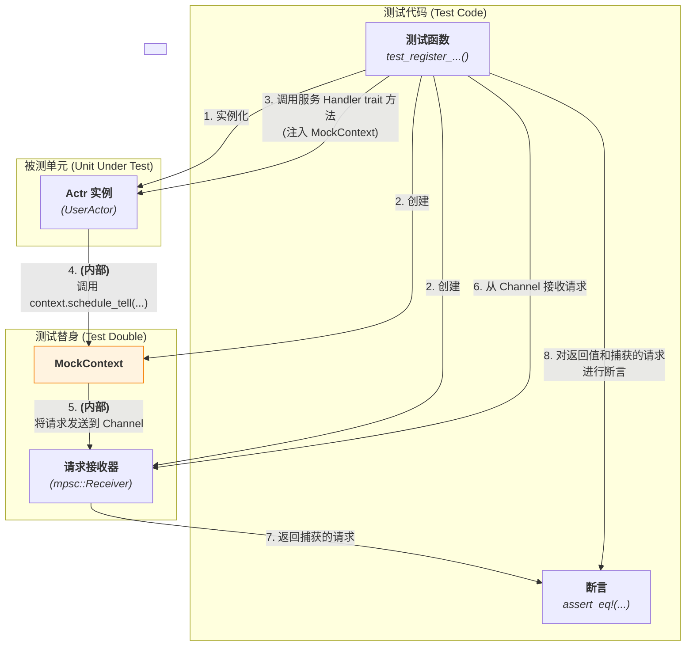

# **专题解析之：测试的艺术 — 编写可信赖的 Actor**

在本框架中，一个设计良好的 `Actor` 通常具有良好的可测试性。这得益于框架的核心设计：`Actor` 的业务逻辑（你实现的服务 Handler trait 方法）与框架的运行时（`ActrSystem`）通过 `Context` 实现了彻底的解耦。

这意味着，我们可以**在不启动任何网络服务、不涉及任何真实 I/O 的情况下，对 `Actor` 的核心逻辑进行快速、稳定、精确的单元测试**。

本篇文章将为你提供一套完整的测试“食谱”，展示如何为你的 `Actor` 编写高质量的单元测试和集成测试。

### **1. 单元测试：专注于业务逻辑**

单元测试的目标是验证**在给定输入的情况下，`Actor` 的行为是否符合预期**。这里的"行为"包括两个方面：
1.  **返回值**: 服务 Handler trait 的方法是否返回了正确的结果？
2.  **副作用**: `Actor` 是否通过 `Context` 发出了正确的"请求"？

#### **核心配料 (The Key Ingredient)**

**`MockContext`**

为了隔离测试，我们不能使用真实的 `Context`。我们需要创建一个 `MockContext`，它实现了与真实 `Context` 相同的接口，但其内部并不执行 I/O。相反，它会**记录**所有通过它发出的“请求”，以便我们在测试的最后进行断言。

#### **烹饪步骤 (The Method)**

假设我们要测试一个 `UserActor` 的 `register_user` 方法。这个方法的逻辑是：
1.  检查用户名是否已存在。
2.  如果不存在，则保存新用户。
3.  安排一个 24 小时后的任务，发送欢迎邮件。
4.  返回成功响应。

**Step 1: 创建 `MockContext`**

```rust
// tests/common/mock_context.rs

use actor_framework::{Context, SystemRequest};
use tokio::sync::mpsc;

// MockContext 会捕获所有系统请求
pub struct MockContext {
    // 发送端，用于将 Actor 发出的请求发送到测试代码中
    pub request_sender: mpsc::Sender<SystemRequest>,
}

impl MockContext {
    // 创建 MockContext 和一个用于接收请求的 Receiver
    pub fn new() -> (Self, mpsc::Receiver<SystemRequest>) {
        let (tx, rx) = mpsc::channel(128);
        (Self { request_sender: tx }, rx)
    }
}

// 在这里，为 MockContext 实现与真实 Context 相同的 trait，
// 例如 IContext，使其可以将方法调用转换为 SystemRequest 消息。
// impl IContext for MockContext { ... }
```

**Step 2: 编写单元测试**

```rust
// tests/test_user_actor.rs

use super::common::mock_context::MockContext;
use my_app::user_actor::{UserActor, IUserService}; // 引入 Actor 和 trait
use std::sync::Arc;
use std::time::Duration;

#[tokio::test]
async fn test_register_new_user_schedules_welcome_email() {
    // --- 1. 准备 (Arrange) ---

    // 实例化我们要测试的 Actor
    let actor = Arc::new(UserActor::default());

    // 创建 MockContext 和它的接收端
    let (mock_context, mut request_rx) = MockContext::new();

    // 准备输入请求
    let request = RegisterRequest { username: "alice".into() };
    
    // --- 2. 执行 (Act) ---

    // 调用服务 Handler trait 方法，传入 mock context
    let response = actor.register(request, &mock_context).await;

    // --- 3. 断言 (Assert) ---

    // a. 断言返回值是否正确
    assert!(response.is_ok());
    assert_eq!(response.unwrap().user_id, "some-generated-id");

    // b. 断言 Actor 的内部状态是否被正确修改
    assert!(actor.has_user("alice").await);

    // c. 断言 Actor 是否通过 Context 发出了正确的副作用“请求”
    //    从 receiver 中取出被捕获的请求
    let system_request = request_rx.recv().await.unwrap();

    //    验证它是否是一个 ScheduleTell 请求
    match system_request {
        SystemRequest::Schedule(schedule_req) => {
            // 验证延迟时间是否正确 (24 小时)
            assert_eq!(schedule_req.delay, Duration::from_secs(24 * 3600));
            // 验证消息内容是否是发送欢迎邮件的命令
            assert!(matches!(schedule_req.message, Tell::SendWelcomeEmail(_)));
        },
        _ => panic!("预期的请求是 ScheduleTell，但收到了其他请求!"),
    }
}
```

<br>


*图 1: 单元测试中 MockContext 的工作流程*

---

### **2. 集成测试：端到端验证**

单元测试保证了业务逻辑的正确性，而集成测试则确保了 Actor 与框架其他部分（如代码生成、调度、网络层）能够正确地协同工作。

#### **核心配料 (The Key Ingredient)**

**`InMemorySignaling`**

为了在不依赖真实网络和信令服务器的情况下进行测试，我们创建了一个 `InMemorySignaling` 实现。它使用 `mpsc::channel` 来模拟客户端与 `ActrSystem` 之间的信令交换。

#### **烹饪步骤 (The Method)**

1.  **创建 `InMemorySignaling`**
    它实现了 `Signaling` trait，但其 `start` 方法不建立网络连接，而是返回连接到内部 `channel` 的 `Sender` 和 `Receiver`。

2.  **编写集成测试**
    ```rust
    // tests/integration_test.rs
    
    #[tokio::test]
    async fn test_echo_service_end_to_end() {
        // --- 1. 准备 (Arrange) ---

        // a. 创建内存信令通道，模拟网络
        let (client_signaling, server_signaling) = InMemorySignaling::new_pair();

        // b. 在后台任务中启动 ActrSystem (服务的提供方)
        tokio::spawn(async move {
            let actor = MyEchoActor::default();
            ActrSystem::new(actor_id)
                .with_signaling(Box::new(server_signaling))
                .attach(workload)
                .start()
                .await
                .unwrap();
        });

        // c. 创建一个模拟的远程调用方，它也使用内存信令
        let mut remote_caller = MockRemoteActor::new(Box::new(client_signaling));
        
        // d. 建立“连接”
        //    这会在后台通过内存 channel 交换 SDP 和 ICE，
        //    并建立一个在本机环回接口上的真实 WebRTC 连接。
        remote_caller.connect().await.unwrap();

        // --- 2. 执行 (Act) ---
        
        // 调用方通过其 WebRTC 数据通道发送一个真实的请求
        let response = remote_caller.send_rpc(
            "echo.EchoService/SendEcho",
            EchoRequest { message: "集成测试".into() }
        ).await.unwrap();

        // --- 3. 断言 (Assert) ---
        
        // 验证收到的响应是否符合预期
        assert_eq!(response.reply, "回声: 集成测试");
    }
    ```

### **3. 总结**

本框架的可测试性根植于其**依赖倒置**和**接口分离**的核心原则。

*   **单元测试**是一个强大的工具。通过 `MockContext`，你可以快速、稳定地验证 `Actor` 的所有业务逻辑和副作用“意图”。你应该为所有复杂的业务逻辑编写单元测试。
*   **集成测试**作为一层安全网，确保你的 `Actor` 在真实的（尽管是模拟的网络）`ActrSystem` 环境中能够正确运行。为每个服务的关键路径编写一到两个集成测试用例，是保证系统可靠性的良好实践。

通过结合这两种测试策略，有助于你更放心地构建、重构和演进你的 `Actor`。