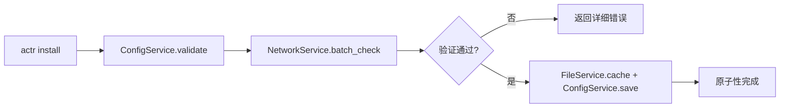
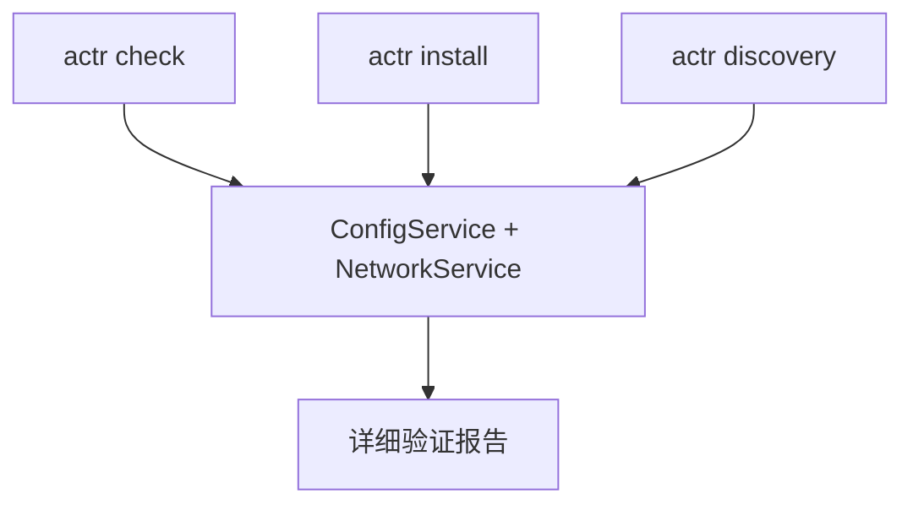
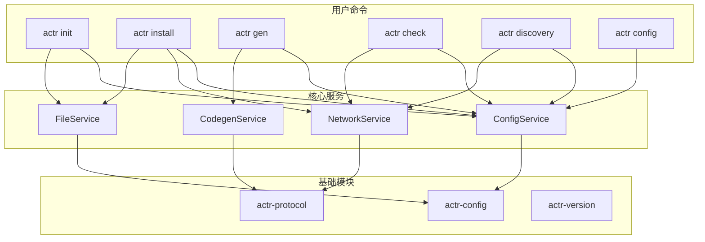

# 项目清单 (Actr.toml) 与命令行工具 (actr)

`actr` 生态系统提供了一套以项目清单文件 `Actr.toml` 和命令行工具 `actr` 为核心的自动化工具链。其设计目标是通过管理服务间的协议契约，将项目构建、运行、依赖管理等操作进行封装，以提供一个统一、便捷的开发工作流。术语约定：单个进程节点称 **ActrNode**，用户实现称 **Workload/Load**。

---

## 1. 项目清单文件 (`Actr.toml`)

`Actr.toml` 是开发者声明其 Actor **意图**的唯一来源。默认入口文件名为 `Actr.toml`；CLI 工具与默认生成的可执行程序均支持通过参数指定配置文件路径（例如 `--file`/`--config`）。它为 `actr` 工具链和 Actr SDK 运行时提供了构建、运行和管理项目所需的所有信息。

该文件主要包含以下部分：

1.  **`[actr]`**: 项目的基础元信息。
2.  **`exports`**: 此 Actor 向网络导出的服务接口集合。
3.  **`[dependencies]`**: 此 Actor 依赖（消费）的网络服务接口。
4.  **`[scripts]`**: 用于 `actr run` 的可执行脚本。
5.  **`[acl]`**: (可选) 服务提供方定义的访问控制规则。
6.  **`[discovery]`**: (可选) 控制服务在发现工具中的可见性。
7.  **`[deployment]`**: (可选) 定义 Actor 的部署相关信息，如所属的 `Realm`。
8.  **`[system]`**: (可选) 定义运行时所需的系统级配置，如信令服务器地址。

#### **完整示例**

```toml
# --- Actor 定义 (Actor Definition) ---
[package]
name = "order-service"
description = "Order processing service"

[package.actr_type]
manufacturer = "acme"
name = "order-service"  # Actor 在网络中的服务类型，用于服务发现

# --- 协议契约 (Protocol Contracts) ---

# exports: 声明此 Actor 实现的 .proto 契约文件集合
exports = [
  "proto/order.v1.proto",
]

# [dependencies]: 声明此 Actor 依赖的外部服务
[dependencies]
# 'user_api' 是我们为 'acme+user-service' 这个 ActrType 定义的本地别名
user_api = { actr_type = "acme+user-service" }

# 也可以依赖一个不带别名的服务，此时别名为 key
notification-service = {}

# --- 脚本 (Scripts) ---
[scripts]
run = "cargo run --release"
test = "cargo test"

# --- 访问控制 (可选) ---
[acl]
# 规则按顺序匹配，第一个匹配的规则生效
[[acl.rule]]
permission = "allow"
actr_types = [{ name = "frontend-client" }]

[[acl.rule]]
permission = "deny" # 默认拒绝所有其他来源

# --- 运行时配置 (可选) ---
[system.signaling]
url = "ws://localhost:8081"

[deployment]
realm = 1001
```

### **1.1. `exports` — 能力声明**

`exports` 字段声明了此 Actor **实现了哪些 `.proto` 契约**。

- **作用**: 定义此 Actor **向网络提供**哪些服务接口。
- **机制**: 一个**字符串数组**，直接列出所有由该 Actor 实现的、位于本地的 `.proto` 文件路径。
- **效果**:
    1.  **生成服务端代码**: `actr gen` 命令会读取这个列表，为你生成需要实现的 Rust `trait`。
    2.  **计算服务指纹**: 框架会根据这个列表中的所有文件，计算出唯一的“服务指纹”，用于服务注册和兼容性检查。

### **1.2. `[dependencies]` — 依赖声明**

`[dependencies]` 声明了此 Actor 为了完成自己的工作，需要**消费或调用哪一类（`ActrType`）** 的服务。其设计风格与 Rust 的 `Cargo.toml` 非常相似。

- **作用**: 声明对外部 `ActrType` 的依赖。
- **机制**:
    - `[dependencies]` 下的**键**（Key）是您为这个依赖指定的**本地别名**。
    - **值**（Value）是一个包含具体依赖信息的表，其中 `actr_type` 是必需的（如果键不是 `ActrType` 的话）。
- **效果**:
    1.  **获取外部契约**: `actr install` 命令会根据 `actr_type` 查询可用服务，通过交互式选择或 fingerprint 获取依赖的 `.proto` 文件并锁定。
    2.  **生成带命名空间的客户端**: `actr gen` 会为**每一个依赖别名**，在 `Context` 上生成一个对应的、带命名空间的客户端，供开发者在代码中显式调用。

#### **1.2.1. 跨 Realm 依赖**

在多租户环境中，不同 Realm 下可能存在同名的 `ActrType`，这会导致服务发现的歧义。为此，框架提供了跨 Realm 依赖的解决方案。

**基本原理**：
- 默认情况下，依赖查找仅在**当前 Actor 所属的 Realm** 中进行
- 如果需要依赖其他 Realm 中的服务，必须在依赖声明中**显式指定 `realm` 字段**
- 跨 Realm 访问必须配合服务端的 **ACL 规则**授权

**配置示例**：

```toml
[deployment]
realm = 1001  # 当前 Actor 所属的 Realm

[dependencies]
# 同 Realm 依赖（默认行为，realm 字段为 None）
user_service = { actr_type = "acme+user-service" }

# 跨 Realm 依赖：显式指定目标服务所在的 Realm
shared_logger = {
    actr_type = "common+logging",
    realm = 9999,  # 指向共享基础服务所在的 Realm
}
```

**ACL 配置（服务端）**：
- 运行时“行动型发现”（信令推送的 UpEvent）仅包含通过 can_access 预检的实例；收到即代表可尝试连接（仍有本地二次 ACL）。
- “目录可见性”（actr discovery/黄页）由 can_discover 控制，不代表可直连。

共享服务需要在其 ACL 中允许来自其他 Realm 的访问：

```toml
# shared-logger 服务的 Actr.toml
[deployment]
realm = 9999  # 共享基础服务 Realm

[acl]
# 允许来自特定 Realm 的访问
[[acl.rule]]
permission = "allow"

[[acl.rule.from]]
realms = [1001, 1002, 1003]  # 白名单：允许的 Realm 列表
actr_types = ["*"]  # 接受这些 Realm 中的任何服务类型

# 或者：完全开放的公共服务
[[acl.rule]]
permission = "allow"

[[acl.rule.from]]
realms = ["*"]  # 接受任意 Realm
actr_types = ["*"]  # 接受任意服务类型

# 默认拒绝
[[acl.rule]]
permission = "deny"
```

**典型使用场景**：
- 共享日志、监控、追踪等基础设施服务
- 跨租户的数据访问服务
- 通用的工具和实用服务

**安全注意事项**：
- 跨 Realm 访问必须在**双方**配置：消费方声明 `realm` 字段，提供方配置 ACL 规则
- 使用 `realms = ["*"]` 时需谨慎评估安全风险，仅用于真正的公共服务
- 建议使用白名单（明确列出允许的 Realm）而非通配符

### **1.3. 服务调用：在代码中显式选择**

本框架将服务调用的选择权完全交给了开发者，在代码中进行显式选择。

- **机制**: `actr gen` 在处理 `[dependencies]` 时，会生成以**依赖别名**为名的、独立的客户端方法。

- **代码生成示例**:
  基于上文 `Actr.toml` 示例中的 `[dependencies]` 配置，`actr gen` 会生成：
  - `ctx.user_api().get_profile(...)`
  - `ctx.notification_service().send_email(...)`

- **开发者在代码中选择**:
  现在，开发者可以在业务逻辑中，根据需要显式地选择使用哪个客户端。

  ```rust
  // 在 order-service 的业务逻辑中
  async fn handle_create_order(&self, order: Order, ctx: &Context) {
      let user_req = GetUserProfileRequest { id: order.user_id };
      
      // 开发者可以根据业务逻辑，显式地选择调用哪个依赖
      let user_profile = ctx.user_api().get_profile(user_req).await?;
      
      // ...
  }
  ```

这种设计的优势在于，它将路由决策的权力完全交给了开发者，你可以轻松实现基于**运行时**信息的复杂路由逻辑（如功能开关、A/B 测试），让代码的意图更加清晰。

---

## 2. 锁文件系统：版本管理与兼容性

`actr` 框架通过两个锁文件来管理服务依赖的版本固定和运行时兼容性：

### **2.1. actr.lock.toml - 依赖锁定文件**

VCS 策略：
- 应当提交到版本库（MUST）。
- 跨环境一致、可重现构建的基石。

`actr.lock.toml` 由 `actr install` 命令自动生成，用于锁定项目的精确依赖版本。这确保了构建的可重现性和团队协作的一致性。

#### **文件格式**
```toml
# This file is auto-generated by `actr install`. DO NOT EDIT.

[[dependency]]
name = "user-service"
actr_type = "acme+user-service"
description = "User management service"
fingerprint = "service_semantic:a1b2c3d4e5f6789..."
published_at = 1705315800
tags = ["latest", "stable"]
cached_at = "2025-09-16T10:30:00Z"

  [[dependency.files]]
  path = "user-service/user.v1.proto"
  fingerprint = "semantic:abc123..."

  [[dependency.files]]
  path = "user-service/common.v1.proto"
  fingerprint = "semantic:def456..."

[[dependency]]
name = "notification-service"
actr_type = "acme+notification-service"
description = "Notification service"
fingerprint = "service_semantic:b7c8d9e0f1a2345..."
published_at = 1705315815
tags = ["latest"]
cached_at = "2025-09-16T10:30:15Z"

  [[dependency.files]]
  path = "notification-service/notification.v2.proto"
  fingerprint = "semantic:ghi789..."
```

#### **生命周期**
- ✅ **应该** 提交到版本控制
- 🔨 **自动生成**：`actr install` 时更新
- 🏗️ **构建时使用**：`actr gen` 读取此文件确定依赖 fingerprint

### **3.2. compat.lock.toml - 兼容性协商缓存**

VCS 策略：
- 不应提交到版本库（SHOULD NOT）。
- 反映运行时状态，随环境和时间变化；应被 .gitignore 忽略。

`compat.lock.toml` 是运行时兼容性协商的结果缓存，记录了实际使用的兼容版本与期望版本的映射关系。

#### **文件格式**
```toml
# This file is auto-generated at runtime when compatible,
# non-exact service versions are found. DO NOT EDIT.

[[negotiation]]
service_name = "user-service"
requested_fingerprint = "sha256:a1b2c3d4e5f6789..."  # 来自 actr.lock.toml
resolved_fingerprint = "sha256:x9y8z7w6v5u4321..."   # 实际连接的版本
compatibility_check = "backward_compatible"
negotiated_at = "2025-09-16T15:45:30Z"
expires_at = "2025-09-17T15:45:30Z"  # 24小时后重新协商

[[negotiation]]  
service_name = "notification-service"
requested_fingerprint = "sha256:b7c8d9e0f1a2345..."
resolved_fingerprint = "sha256:c8d9e0f1a2b3456..."
compatibility_check = "backward_compatible"
negotiated_at = "2025-09-16T16:20:10Z"
expires_at = "2025-09-17T16:20:10Z"
```

#### **生命周期和健康状态**
- ❌ **不应该** 提交到版本控制（添加到 `.gitignore`）
- 🔄 **运行时生成**：当精确版本匹配失败时自动创建
- ⚠️ **亚健康指示器**：此文件存在表示系统处于亚健康状态
- 🧹 **建议操作**：定期运行 `actr install` 更新到最新版本

#### **系统健康状态机**
```
启动阶段 → 健康运行 (精确匹配) → 正常结束
          ↘
           亚健康运行 (兼容匹配) → 正常结束
          ↗              ↓
启动阶段 → 失败退出    健康运行 (依赖更新后)
```

- **健康状态**：所有依赖都有精确的指纹匹配，无 `compat.lock.toml` 文件
- **亚健康状态**：存在兼容匹配的依赖，`compat.lock.toml` 文件存在
- **失败状态**：无法找到兼容的依赖版本，启动终止

---

## 3. 命令行工具参考 (`actr`)

`actr` 是与 `Actr.toml` 配套的命令行工具，旨在提供类似 `cargo` 或 `npm` 的开发体验。专注于项目管理、构建和开发辅助功能。

### **3.0. 精炼复用架构**

`actr` 采用**服务组合架构**，通过4个核心服务实现命令间的逻辑复用，确保一致的用户体验和高代码质量。

#### **四个核心服务**
- **ConfigService** (100%复用): 统一的 Actr.toml 读写、验证和依赖管理
- **NetworkService** (43%复用): 服务发现、连通性检查和Proto文件下载
- **CodegenService** (29%复用): Protocol Buffers 代码生成和服务指纹计算
- **FileService** (57%复用): 缓存管理、模板处理和文件操作

#### **组合架构优势**
- **实用优先**: 只抽象真正需要的复用功能
- **渐进式扩展**: 新命令通过组合现有服务快速实现
- **测试友好**: 每个服务可以独立测试和验证

#### **Check-First 原则**
所有修改性操作（如 `install`）都遵循**验证优先**原则：
1. 🔍 **验证阶段**: 组合 ConfigService 和 NetworkService 完整验证
2. 📝 **执行阶段**: 仅在验证完全通过后才修改配置，支持原子性回滚



### **3.1. 项目管理**

#### **`actr init`**
创建新的 actr 项目

```bash
# 创建新项目
actr init my-actor-service

# 指定模板
actr init my-service --template echo

# 在当前目录初始化
actr init . --name my-service
```

此命令用于交互式地创建一个结构良好的新 Actor 项目。它会引导用户完成基础配置，并生成一个包含 `Actr.toml`、示例 `.proto` 文件、`src` 目录和 `.gitignore` 的项目骨架。

#### **`actr gen`**
生成 Actor 代码（编译 proto，生成代码）

```bash
# 标准代码生成
actr gen --input proto --output src/generated

# 清理后重新生成
actr gen --input proto --output src/generated --clean

# 生成并创建用户代码脚手架
actr gen --input proto --output src/generated --generate-scaffold

# 详细输出
actr gen --input proto --output src/generated --verbose
```

此命令是连接开发时与运行时的桥梁，负责代码生成和项目编译。

*   **核心职责**:
    1.  **解析依赖关系** 并从缓存获取必要的 `.proto` 文件。
    2.  **读取 `Actr.toml` 的 `exports`** 来生成服务端代码，并计算和嵌入该 Actor 的**服务指纹**。
    3.  **生成proto代码** 包括基础protobuf类型和actor服务trait。
    4.  它只负责代码生成。编译步骤由开发者后续自行调用（例如，通过 `actr run` 执行 `cargo build`）。

*   **高级选项**:
    - `--clean`: 清理target目录后重新构建
    - `--release`: 优化构建（映射到`cargo build --release`）
    - `--target <ARCH>`: 指定目标架构交叉编译
    - `--features <FEATURES>`: 启用指定的Cargo特性
    - `--verbose`: 显示详细的构建过程和错误信息
    - `--output-dir <DIR>`: 自定义生成代码输出目录

*   **错误处理**:
    - 自动检查必需工具（`protoc`, `cargo`）是否安装
    - 验证依赖完整性，提示缺失的proto文件
    - 流式输出构建日志，实时显示进度和错误

**注意**: 构建前请确保已运行 `actr install` 安装所有依赖。

#### **`actr run`**
运行配置文件中定义的脚本

```bash
# 运行默认脚本
actr run

# 运行指定脚本
actr run dev
actr run test
actr run deploy
```

此命令的角色是一个纯粹的**脚本执行器**。

*   **核心职责**:
    1.  读取 `Actr.toml` 文件中的 `[scripts]` 表。
    2.  找到 `<script_name>` 对应的命令（如果未提供，则默认为 `run`）。
    3.  在一个新的 shell 环境中执行该命令。

#### **`actr config test`**
测试配置文件语法和有效性

```bash
# 测试项目配置
actr config test

# 测试特定配置文件
actr config test --file prod.toml
```

此命令验证项目配置的正确性，包括：
- 配置文件语法验证
- 配置结构完整性检查  
- 依赖声明有效性验证

### **3.3. 依赖管理**

#### **`actr install`**
npm风格的服务级依赖管理 (check-first 架构)

此命令采用**验证优先**的两阶段安装流程，确保配置完整性和原子性操作：

**模式1：添加新依赖 (npm install <package>)**
```bash
# 添加服务依赖（交互式选择 fingerprint）
actr install user-service
actr install notification-service

# 直接指定 fingerprint
actr install payment-service --fingerprint "service_semantic:abc123..."

# 指定别名
actr install my_user_api --actr-type acme+user-service
```

**模式2：安装配置的依赖 (npm install)**
```bash
# 安装Actr.toml中配置的所有服务依赖（优先使用lock文件中的已安装版本）
actr install

# 强制重新安装（忽略缓存）
actr install --force

# 强制更新所有依赖（忽略lock文件，重新解析和安装所有依赖）
actr install --force-update

# 跳过指纹验证（开发模式）
actr install --skip-verification
```

#### **安装格式支持**

命令支持以下依赖声明格式：

1. **空声明 + 交互式选择**：`actr install order-service`
   - 查询信令服务器可用的 fingerprints
   - 显示列表（按发布时间排序，显示 tags 和描述）
   - 用户选择或默认选择 `latest` 标签
   - Actr.toml中记录为：`order-service = {}`

2. **直接指定 fingerprint**：`actr install user-service --fingerprint service_semantic:abc123...`
   - 安装指定 fingerprint 的服务
   - 用于精确锁定特定版本
   - Actr.toml中记录为：`user-service = { fingerprint = "service_semantic:abc123..." }`

3. **使用别名**：`actr install my_api --actr-type acme+user-service`
   - 为服务指定本地别名
   - Actr.toml中记录为：`my_api = { actr_type = "acme+user-service" }`

#### **Check-First 工作流程**

采用**验证优先**的两阶段流程，确保配置完整性：

##### **🔍 阶段1: 完整验证**
```bash
actr install user-service
  ├─ 📋 解析依赖规范
  ├─ 🔍 服务发现 (DiscoveryRequest)
  ├─ 🎯 fingerprint 选择（交互式或自动）
  ├─ 🌐 网络连通性测试 (NetworkValidator)
  ├─ 🔐 指纹完整性验证 (FingerprintValidator)
  ├─ ⚖️ 依赖冲突分析（fingerprint 一致性检查）
  └─ ✅ 生成安装计划

# 如果验证失败，命令在此退出，不修改任何文件
```

##### **📝 阶段2: 原子性安装**
```bash
# 仅在验证完全通过后执行
  ├─ 💾 备份当前配置
  ├─ 📝 更新 Actr.toml 配置
  ├─ 📦 缓存 proto 文件
  ├─ 🔒 更新 actr.lock.toml
  └─ ✅ 清理备份文件 (成功) 或 🔄 恢复备份 (失败)
```

##### **核心优势**
- ✅ **配置保护**: 失败时不会污染配置文件
- ✅ **错误提前**: 在修改前发现所有问题
- ✅ **原子操作**: 要么完全成功，要么完全回滚
- ✅ **复用验证**: install 复用 check 命令的验证逻辑

#### **指纹记录行为**

命令会根据用户指定的内容自动决定在 Actr.toml 中的记录方式：

- **空声明** (`{}`): 交互式选择 fingerprint，自动记录到 Actr.toml
- **指定 actr_type**: 交互式选择该类型的 fingerprint
- **指定 fingerprint**: 直接使用指定的 fingerprint，确保完全一致性

#### **更新行为**

- **普通安装** (`actr install`): 优先使用 lock 文件中已安装的 fingerprint，不主动更新
- **强制更新** (`actr install --force-update`): 忽略 lock 文件，重新发现所有依赖并更新到最新 fingerprint

这种设计确保了构建的稳定性和依赖管理的可预测性。

#### **核心职责**

`install` 命令的核心是解析 `Actr.toml` 中的 `[dependencies]`，从网络中发现并获取匹配的**服务级依赖**，最终将选择的依赖 fingerprint 精确地锁定在 `actr.lock.toml` 文件中。

#### **服务级依赖Install工作流**

当 `actr install` 运行时，它会为每个服务级依赖执行以下流程：

1.  **服务发现**: 通过向信令服务器发送 `actr.DiscoveryRequest` 获取服务目录。
    ```rust
    // 请求可用服务列表
    DiscoveryRequest {
        manufacturer: Some("my-org".to_string()),
        limit: Some(64),
    }
    ```

2.  **选择策略**: 收到 `DiscoveryResponse` 后，根据返回的 `TypeEntries` 执行智能选择。
    *   **精确匹配**: 首先匹配 `ActrType` 与锁文件中的服务类型。
    *   **指纹验证**: 如果 `actr.lock.toml` 中指定了指纹，必须精确匹配 `service_fingerprint` 字段。
    *   **版本权重**: 在满足上述条件的实例中，优先选择最新的兼容版本。

3.  **路由候选获取（可选）**: 如果需要进一步确定目标实例，可发送 `RouteCandidatesRequest`。
    ```rust
    // 请求特定服务类型的最优实例列表
    RouteCandidatesRequest {
        target_type: ActrType {
            manufacturer: "my-org".into(),
            name: "user-service".into(),
        },
        criteria: Some(NodeSelectionCriteria {
            candidate_count: 3,
            ranking_factors: vec![NodeRankingFactor::      BEST_DEPENDENCY_HEALTH = 2;],
            minimal_dependency_requirement: None,
            minimal_health_requirement: None,
        }),
    }
    ```

4.  **锁文件更新**: 将最终选定的服务指纹和元数据写入 `actr.lock.toml`，确保构建可重现性。

#### **`actr discovery`**
发现网络中可用的 Actor 服务 (复用架构 + check-first)

```bash
# 列出发现的服务
actr discovery

# 带过滤的服务发现
actr discovery --filter "user-*"

# 显示详细服务信息
actr discovery --verbose
```

**交互式界面：**
```
🔍 发现的 Actor 服务：

┌─────────────────┬─────────┬─────────────────────────────────┐
│ 服务名称        │ 版本    │ 简介                            │
├─────────────────┼─────────┼─────────────────────────────────┤
│ echo-service    │ v1.2.0  │ 简单的回声服务，用于测试连通性  │
│ chat-room       │ v2.1.0  │ 多人聊天室服务                  │
│ file-storage    │ v1.0.0  │ 分布式文件存储服务              │
└─────────────────┴─────────┴─────────────────────────────────┘

→ 使用 ↑↓ 选择服务，回车查看选项，q 退出

选择 echo-service 后的选项：
[1] 查看服务详情
[2] 导出 proto 文件
[3] 添加到配置文件
```

##### **复用架构工作流**

选择 "添加到配置文件" 后的完整流程：

1. **📝 配置更新**: 将选择的服务添加到 Actr.toml
2. **🔍 自动验证**: 复用 ConfigService.validate 和 NetworkService 验证逻辑
   - 服务可用性检查
   - 网络连通性测试
   - 指纹完整性验证
3. **⚖️ 失败处理**: 如果验证失败，自动回滚配置修改
4. **🤔 用户确认**: 询问是否立即安装验证通过的依赖
5. **📦 可选安装**: 组合 FileService 和 ConfigService 执行原子性安装

**示例交互流程：**
```bash
✅ 已添加 echo-service 到配置文件

🔍 正在验证新依赖...
  ├─ 📋 服务存在性检查 ✅
  ├─ 🌐 网络连通性测试 ✅
  └─ 🔐 指纹完整性验证 ✅

🤔 是否立即安装此依赖？ [y/N] y

📦 正在安装 echo-service...
  ├─ 📦 缓存 proto 文件 ✅
  ├─ 🔒 更新锁文件 ✅
  └─ ✅ 安装完成

💡 建议: 运行 'actr gen' 生成最新代码
```

##### **复用组件优势**
- **✅ 一致验证**: 与 `actr check` 使用相同的验证逻辑
- **✅ 原子操作**: 与 `actr install` 使用相同的安装流程
- **✅ 配置保护**: 验证失败时自动回滚，避免配置污染
- **✅ 用户友好**: 统一的错误处理和进度提示

此功能集成了服务发现、验证和安装的完整工作流，为开发者提供一站式的服务依赖管理体验。

### **3.4. 配置管理**

#### **`actr config`**
项目配置管理

```bash
# 设置配置
actr config set build.output-dir "./generated"
actr config set signaling.url "wss://signal.company.com"

# 查看配置
actr config get signaling.url
actr config list

# 查看所有配置
actr config show

# 删除配置
actr config unset build.output-dir
```

此命令用于管理项目级配置，支持设置构建选项、信令服务器地址等开发配置。针对依赖安装与服务发现等 CLI 工作流（如 `actr install`/`actr discovery`），当需要认证时，CLI 会提示在 `Actr.toml` 的 `[system.signaling]`（或 `[signaling]` 兼容段）配置认证与地址等信息。注意：SDK 作为库不直接读取配置文件，应用应在启动时自行解析并通过构建器注入凭证与连接参数。

### **3.5. 开发工具**

#### **`actr check`**
配置和依赖验证工具

```bash
# 检查所有配置的依赖项
actr check

# 检查特定依赖项
actr check user-service notification-service

# 使用特定配置文件
actr check --file prod.toml

# 显示详细连接信息
actr check --verbose

# 设置连接超时（秒）
actr check --timeout 30

# 并行检查（加速验证）
actr check --parallel 5
```

`actr check` 通过组合 ConfigService 和 NetworkService 提供完整的项目验证：

##### **验证维度**
- 📋 **配置完整性**: Actr.toml 语法和结构验证
- 🔍 **服务发现**: 验证依赖服务在网络中的存在性
- 🌐 **网络连通性**: 测试与依赖服务的网络连接状态
- 🔐 **指纹验证**: 确认服务完整性和版本一致性
- ⚖️ **依赖冲突**: 分析依赖间的版本冲突和兼容性
- 🔑 **权限验证**: 确认对依赖服务的访问权限

##### **复用架构**


##### **与其他命令的关系**
- `actr install`: **复用**相同的配置和网络验证服务，在安装前进行验证
- `actr discovery`: **扩展**网络服务，添加交互式服务选择
- `config test`: **子集**，仅验证配置文件语法，不涉及网络验证

**使用场景**：
- 部署前环境验证
- 网络连接问题诊断  
- 权限配置验证
- CI/CD管道中的依赖检查

#### **`actr doc`**
生成项目文档

```bash
# 生成文档
actr doc

# 指定输出目录
actr doc --output ./docs
```

此命令针对 actr 项目结构生成文档，生成固定的 HTML 文件：
- `index.html` - 项目概览
- `api.html` - API 接口文档
- `config.html` - 配置说明


### **3.6. 高级工具**

#### **`actr fingerprint`**
计算项目和服务指纹

```bash
# 计算当前项目指纹
actr fingerprint

# 计算特定proto文件指纹
actr fingerprint --proto path/to/service.proto

# 输出JSON格式
actr fingerprint --format json

# 计算服务级指纹
actr fingerprint --service-level
```

此命令用于计算和验证项目的加密指纹，支持：
- **Proto 级指纹**: 基于 proto-sign 语义解析的内容指纹（格式: `semantic:hash`）
- **服务级指纹**: 基于语义指纹的确定性组合哈希（格式: `service_semantic:hash`）
- **多种输出格式**: text, json, yaml
- **指纹验证**: 与缓存指纹对比验证一致性


---

## 3. 核心机制与相关文件

`actr` 的工作流围绕着几个核心机制和文件展开。

### **3.1. 服务指纹 (Service Fingerprint)**

为了让服务网络中的每一个 Actor 都有一个可验证的身份标识，`actr gen` 命令会引入"服务指纹"机制。

*   **定义**: 一个 Actor 的"服务指纹"是一个**基于语义指纹的确定性组合哈希**，它根据 `Actr.toml` 中 `exports` 字段的所有 proto 文件内容来计算。
*   **作用**: 用于服务注册、精确发现和兼容性协商。
*   **计算方式**:
    1. 对每个 proto 文件使用 `proto-sign` 计算语义指纹（忽略格式差异）
    2. 将所有文件的语义指纹按文件名排序组合
    3. 对组合结果计算 SHA256，得到服务级指纹
    4. 格式: `service_semantic:{sha256-hash}`

### **3.2. 依赖锁定 (`actr.lock.toml`)**

`actr install` 命令的产物，确保了依赖的一致性和构建的可重现性。它记录了所有**服务级依赖**的精确 fingerprint。该文件**应提交到版本控制**。

```toml
# actr.lock.toml (服务级依赖锁定)
# This file is auto-generated by `actr install`. DO NOT EDIT.

[metadata]
version = 1
generated_at = "2024-01-15T10:30:00Z"

[[dependency]]
name = "user-service"
actr_type = "acme+user-service"
description = "User management service"
fingerprint = "service_semantic:a1b2c3d4e5f6..."  # 主要标识符
published_at = 1705315800
tags = ["latest", "stable"]
cached_at = "2024-01-15T10:30:00Z"

  [[dependency.files]]
  path = "user-service/user.v1.proto"
  fingerprint = "semantic:abc123..."

  [[dependency.files]]
  path = "user-service/common.v1.proto"
  fingerprint = "semantic:def456..."

[[dependency]]
name = "notification-service"
actr_type = "acme+notification-service"
description = "Notification service"
fingerprint = "service_semantic:b7c8d9e0f1a2..."
published_at = 1705315860
tags = ["latest"]
cached_at = "2024-01-15T10:31:00Z"

  [[dependency.files]]
  path = "notification-service/notification.v1.proto"
  fingerprint = "semantic:ghi789..."
```

### **3.3. 运行时协商缓存 (`compat.lock.toml`)**

这是一个特殊的文件，用于记录和反映系统的运行时状态，它的设计哲学与 `actr.lock.toml` 完全不同。

*   **性质**: 一个临时的**运行时状态缓存**与**审计日志**。
*   **位置与命名**: 由 SDK 在运行时动态创建于**操作系统的临时目录**中。为了防止在同一台机器上运行多个 Actor 时产生冲突，SDK 会根据项目根目录的绝对路径生成一个唯一的哈希值 (`project_hash`)，并以此创建一个专用的子目录来存放该文件。
    *   **示例路径 (Linux)**: `/tmp/actr/<project_hash>/compat.lock`
    *   这种设计确保了每个 Actor 实例都有其独立的运行时缓存，同时避免了污染项目目录或需要特殊文件权限。
*   **生命周期**:
    *   **创建**: 当 SDK 在运行时无法找到指纹完全匹配的服务，但成功协商并连接到一个向后兼容的版本时，会自动创建此文件。
    *   读取: 应用可选择读取此文件（位于用户缓存目录），并通过注入型缓存提供器将内容交给 SDK，用于加速下一次连接。SDK 作为库默认不做任何文件 I/O。
    *   **清理**: 此文件是短暂的 (ephemeral)，可能会在系统重启时被操作系统清理。SDK 必须能优雅处理文件不存在的情况（只需重新协商即可）。
*   **核心用途**:
    1.  **作为告警信号**: 它的**存在**本身就是一个明确的**“亚健康”或“技术债”**信号。运维监控系统应该配置告警，一旦发现此文件，就应通知开发团队进行干预。
    2.  **作为审计日志**: 文件内容记录了请求的指纹和实际连接的指纹，为问题排查提供了线索。
    3.  **作为重启缓存**: 在一个“亚健康”的系统被修复（例如，通过 `actr install --update` 并重新部署）之前，它可以帮助不稳定的服务在重启后更快地恢复连接。
*   **版本控制**: **绝对不应该**被提交到版本控制。

总而言之，`compat.lock.toml` 是一个应急和监控机制。它通过牺牲版本的精确匹配来保证服务的可用性，同时留下清晰的痕迹，督促开发者尽快修复底层的版本不一致问题。

### **3.4. 配置读取摘要**

为了清晰地展示 CLI 与 SDK 的职责，下表总结了不同组件在不同阶段对配置文件的读取情况：

| 配置文件 | TOML 部分 | 构建时 (CLI) | 启动时 (SDK) |
| :--- | :--- | :--- | :--- |
| `Actr.toml` | `[actr]` | ✅ 读取 `name` 用于产物命名 | ❌ |
| | `exports` | ✅ 读取以计算服务指纹 | ❌ |
| | `[dependencies]`| ✅ 读取以执行 `install` | ❌ |
| | `[scripts]` | ✅ 读取以执行 `build`/`run` | ❌ |
| | `[signaling]` | ❌ | ❌ |
| `actr.lock.toml` | (全部) | ✅ 读取以获取依赖的精确指纹 | ❌ |
| `compat.lock.toml` | (全部) | ❌ | ✅ 读/写以缓存协商结果 |

> 注：SDK 作为库不直接读/写任何配置或锁文件。在“库模式”下，应用在 `main.rs` 自行解析 `Actr.toml` 与 `actr.lock.toml`，并通过构建器将参数与依赖（包括 `ServiceSpec`）注入 `ActrSystem`。在由 `actr-cli` 管理的“自动运行器模式”下，则由 `actr-cli` 负责加载配置与锁并启动进程。

---

## 4. 信令协议与服务发现机制

### **4.1. DiscoveryRequest 与服务目录**

服务发现与依赖管理完全基于 `actr-protocol/proto/signaling.proto` 中定义的消息。`actr-cli` 通过向信令服务器发送 `actr.DiscoveryRequest` 和 `actr.RouteCandidatesRequest` 等消息，获取所需的服务目录和路由候选。

#### **DiscoveryRequest 消息结构**

```protobuf
message DiscoveryRequest {
  optional string manufacturer = 1;
  optional uint32 limit = 2 [default = 64];
}

message DiscoveryResponse {
  message DiscoveryOk {
    message TypeEntry {
      required ActrType actr_type = 1;
      optional string description = 2;
      required string service_fingerprint = 3;
      optional int64 published_at = 4;
      repeated string tags = 5;
    }
    repeated TypeEntry entries = 1;
  }

  oneof result {
    DiscoveryOk success = 1;
    ErrorResponse error = 2;
  }
}
```

> **注意**：信令服务器返回的 `DiscoveryOk` 消息中包含了 `entries` 列表，其中有服务类型、fingerprint、发布时间和标签信息。`actr-cli` 使用这些信息进行依赖解析，支持交互式选择或自动选择 `latest` 标签的服务。

#### **RouteCandidatesRequest 消息结构**

在执行路由选择时，CLI 会在确认目标服务类型后，再向信令服务器发送 `RouteCandidatesRequest`，以获取最优的服务实例候选列表。

```protobuf
message RouteCandidatesRequest {
  message NodeSelectionCriteria {
    enum ServiceDependencyState {
      HEALTHY = 0;
      WARNING = 1;
      BROKEN = 2;
    }

    required uint32 candidate_count = 1;
    repeated NodeRankingFactor ranking_factors = 2;
    optional ServiceDependencyState minimal_dependency_requirement = 3;
    optional ServiceAvailabilityState minimal_health_requirement = 4;
  }
  required ActrType target_type = 1;
  optional NodeSelectionCriteria criteria = 2;
}
```

通过这组消息的组合，CLI 可以先发现所有可用的服务类型，再在必要时进一步筛选、选择最合适的具体实例，完成服务依赖管理的全流程。

### **4.2. 服务级语义指纹计算**

服务指纹基于所有 proto 文件的**语义指纹**计算组合哈希（严格遵循 [actr-version](https://github.com/actor-rtc/actr-version) 定义）：

```rust
// 基于语义指纹计算服务级指纹（使用 actr-version）
use actr_version::Fingerprint;

pub fn calculate_service_fingerprint(proto_files: &[ProtoFile]) -> Result<String> {
    // 直接使用 actr-version 提供的标准实现
    Fingerprint::calculate_service_semantic_fingerprint(proto_files)
}

// 以下是 actr-version 的实现逻辑（供参考）：
fn calculate_service_semantic_fingerprint_impl(proto_files: &[ProtoFile]) -> Result<String> {
    // 1. 按文件名排序确保确定性
    let mut sorted_files = proto_files.to_vec();
    sorted_files.sort_by(|a, b| a.name.cmp(&b.name));

    // 2. 为每个文件计算语义指纹（使用 proto-sign）
    let mut semantic_fingerprints = Vec::new();
    for file in &sorted_files {
        let spec = proto_sign::Spec::try_from(file.content.as_str())?;
        // 格式: filename:semantic-fingerprint
        semantic_fingerprints.push(format!("{}:{}", file.name, spec.fingerprint));
    }

    // 3. 组合所有语义指纹并计算 SHA256
    let combined = semantic_fingerprints.join("\n");
    let hash = sha2::Sha256::digest(combined.as_bytes());
    Ok(format!("service_semantic:{:x}", hash))
}

// 注：这是基于语义指纹的确定性组合哈希，非传统 Merkle Tree
fn deprecated_build_merkle_tree(file_hashes: &[(String, String)]) -> String {
    if file_hashes.len() == 1 {
        return file_hashes[0].1.clone();
    }
    
    let mut level_hashes = file_hashes.iter()
        .map(|(name, hash)| format!("{}:{}", name, hash))
        .collect::<Vec<_>>();
    
    while level_hashes.len() > 1 {
        let mut next_level = Vec::new();
        for chunk in level_hashes.chunks(2) {
            let combined = if chunk.len() == 2 {
                format!("{}|{}", chunk[0], chunk[1])
            } else {
                chunk[0].clone()
            };
            let hash = sha2::Sha256::digest(combined.as_bytes());
            next_level.push(hex::encode(hash));
        }
        level_hashes = next_level;
    }
    
    level_hashes[0].clone()
}
```

---

## 5. 完整工作流程示例

### **5.1. 创建新项目**
```bash
actr init payment-service
cd payment-service
```

### **5.2. 添加服务级依赖**
使用npm风格的命令添加依赖：
```bash
# 添加新的服务依赖（自动更新Actr.toml，交互式选择 fingerprint）
actr install user-service
actr install notification-service

# 或手动编辑 Actr.toml 添加依赖：
```
```toml
[dependencies]
user-service = {}
notification-service = { actr_type = "acme+notification-service" }
```

### **5.3. 安装依赖**
```bash
# 安装所有配置的服务级依赖
actr install

# 或仅安装特定服务
actr install --only user-service
```

### **5.4. 配置项目**
```bash
actr config set signaling.url "wss://dev-signal.company.com"
```

### **5.5. 开发和测试**
```bash
actr gen  # 生成代码，计算服务指纹
actr check  # 验证配置和依赖
actr run dev
actr test
```

### **5.6. 发现和集成新服务**
```bash
actr discovery
# 交互式选择需要的服务，可选择添加到配置文件
```

这个完整的工作流展示了 `actr-cli` 如何简化 actr 项目的开发、构建和部署过程，提供了统一、便捷的开发体验。

---

## 6. 复用架构总结

### **6.1. 架构优势**

通过统一的复用架构设计，`actr-cli` 实现了以下关键优势：

#### **高代码复用率**
- **配置管理**: 100% 复用 (7/7 命令使用 ConfigService)
- **代码生成**: 29% 复用 (CodegenService 用于 gen/build)
- **网络服务**: 43% 复用 (NetworkService 用于 install/check/discovery)
- **文件服务**: 57% 复用 (FileService 用于 install/init/gen/build)

#### **一致的用户体验**
- **错误处理**: 统一的错误类型和处理模式
- **输出格式**: 一致的进度指示和结果展示
- **交互模式**: 标准化的用户交互界面

#### **原子性保证**
- **check-first 原则**: 修改前完整验证，避免部分失败状态
- **配置保护**: 失败时自动恢复，确保配置文件完整性
- **事务性操作**: 要么完全成功，要么完全回滚

### **6.2. 命令关系图**



### **6.3. 关键设计原则**

1. **组合优于抽象**: 命令通过组合服务实现功能，避免过度抽象
2. **实用优先**: 只抽象真正需要的复用功能
3. **单一职责**: 每个服务专注于一个明确的功能领域
4. **渐进式演进**: 从简单开始，按需扩展
5. **验证优先**: 所有修改性操作都先验证后执行

### **6.4. 可扩展性**

新增命令只需：
1. 选择合适的现有组件组合
2. 实现特定的业务逻辑
3. 遵循统一的错误处理模式

例如，新增 `actr deploy` 命令可以复用：
- ConfigService (读取部署配置)
- NetworkService (部署前验证和目标环境连通性)
- FileService (部署文件管理)

这种设计确保了框架的可维护性和扩展性。🚀