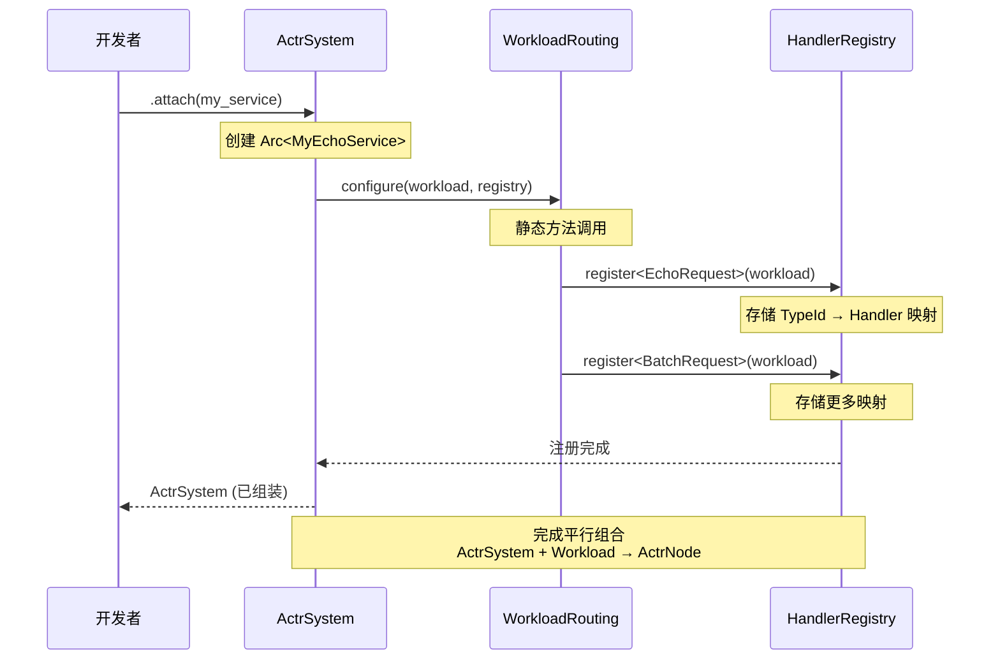

# **专题解析：从 .proto 到运行时 — 代码生成与 attach 机制详解**

开发者使用 actr 框架的核心体验浓缩于一行代码：

```rust
// main.rs
let my_service = MyEchoService::default();

ActrSystem::new(config)?
    .attach(my_service)  // 🎯 平行组合
    .start()
    .await?;
```

这行简单的 `.attach(workload)` 调用背后，隐藏着整个框架最精妙的设计：**基于 Protobuf 契约的角色驱动代码生成，以及平行组合的运行时架构**。

---

## 1. 核心理念：平行组合而非包含

### 1.1 架构等式

```
ActrNode = ActrSystem + Workload
```

这不是"容器包含内容"的关系，而是**两个平行组件的组合**：

```
┌──────────────────┐          ┌──────────────────┐
│  ActrSystem     │          │    Workload      │
│  ━━━━━━━━━━━━━   │          │  ━━━━━━━━━━━━━   │
│  运行时基础设施   │          │  业务逻辑单元     │
│                  │          │                  │
│  • Scheduler     │          │  • Handler 方法  │
│  • Mailbox       │          │  • 业务状态      │
│  • Registry      │          │  • 处理逻辑      │
│  • Network       │          │                  │
└──────────────────┘          └──────────────────┘
         │                            │
         └────────── attach ──────────┘
                      │
         ┌────────────▼────────────┐
         │      ActrNode           │
         │  完整的运行时节点        │
         └─────────────────────────┘
```

**关键特性**：
- **ActrSystem** 不直接存储 Workload；attach 之后由 **ActrNode<W>** 以 `Arc<W>` 持有
- **HandlerRegistry** 存储指向 Workload 的 Arc 引用
- **attach** 操作建立连接，完成组装

---

## 2. 角色驱动的代码生成

`actr gen` 命令根据 `exports` 中的 `.proto` 定义生成代码。构建时首先使用 `proto-regulate` 按 package 合并与规范化，然后以 package 为单位生成语义指纹与代码产物，文件拆分方式不影响结果。

### 2.1 为 `exports` 生成服务端代码

**配置示例：**
```toml
# Actr.toml
[package]
name = "echo-service"

[package.actr_type]
manufacturer = "acme"
name = "EchoService"

exports = ["proto/echo.v1.proto"]
```

**proto 定义：**
```protobuf
// proto/echo.v1.proto
syntax = "proto3";
package echo.v1;

message EchoRequest {
  string text = 1;
}

message EchoResponse {
  string text = 1;
  int64 timestamp = 2;
}

service EchoService {
  rpc SendEcho(EchoRequest) returns (EchoResponse);
  rpc BatchEcho(BatchRequest) returns (BatchResponse);
}
```

**生成的代码（5 个核心组件）：**

```rust
// src/generated/echo.v1.rs

// ━━━━━━━━━━━━━━━━━━━━━━━━━━━━━━━━━━━━━━━━━━━
// 1️⃣ RpcRequest trait 实现（类型关联）
// ━━━━━━━━━━━━━━━━━━━━━━━━━━━━━━━━━━━━━━━━━━━
impl RpcRequest for EchoRequest {
    type Response = EchoResponse;
    fn route_key() -> &'static str {
        "echo.v1.EchoService.SendEcho"
    }
}

impl RpcRequest for BatchRequest {
    type Response = BatchResponse;
    fn route_key() -> &'static str {
        "echo.v1.EchoService.BatchEcho"
    }
}

// ━━━━━━━━━━━━━━━━━━━━━━━━━━━━━━━━━━━━━━━━━━━
// 2️⃣ 服务端 Handler trait（用户实现）
// ━━━━━━━━━━━━━━━━━━━━━━━━━━━━━━━━━━━━━━━━━━━
pub trait EchoServiceHandler: Send + Sync + 'static {
    async fn send_echo(
        &self,
        request: EchoRequest,
        ctx: &Context,
    ) -> ActorResult<EchoResponse>;

    async fn batch_echo(
        &self,
        request: BatchRequest,
        ctx: &Context,
    ) -> ActorResult<BatchResponse>;
}

// ━━━━━━━━━━━━━━━━━━━━━━━━━━━━━━━━━━━━━━━━━━━
// 3️⃣ MessageDispatcher 实现（消息分发器）
// ━━━━━━━━━━━━━━━━━━━━━━━━━━━━━━━━━━━━━━━━━━━
pub struct EchoServiceDispatcher<T: EchoServiceHandler>(PhantomData<T>);

#[async_trait]
impl<T: EchoServiceHandler> MessageDispatcher for EchoServiceDispatcher<T> {
    type Workload = EchoServiceWorkload<T>;

    async fn dispatch<C: Context>(
        workload: &Self::Workload,
        envelope: RpcEnvelope,
        ctx: &C,
    ) -> ActorResult<Bytes> {
        match envelope.route_key.as_str() {
            "echo.v1.EchoService.SendEcho" => {
                let req = EchoRequest::decode(&*envelope.payload)?;
                let resp = workload.0.send_echo(req, ctx).await?;
                Ok(resp.encode_to_vec().into())
            }
            "echo.v1.EchoService.BatchEcho" => {
                let req = BatchRequest::decode(&*envelope.payload)?;
                let resp = workload.0.batch_echo(req, ctx).await?;
                Ok(resp.encode_to_vec().into())
            }
            _ => Err(ActrError::UnknownRoute {
                route_key: envelope.route_key.to_string()
            }.into())
        }
    }
}

// ━━━━━━━━━━━━━━━━━━━━━━━━━━━━━━━━━━━━━━━━━━━
// 4️⃣ Workload 包装类型
// ━━━━━━━━━━━━━━━━━━━━━━━━━━━━━━━━━━━━━━━━━━━
pub struct EchoServiceWorkload<T: EchoServiceHandler>(pub T);

impl<T: EchoServiceHandler> EchoServiceWorkload<T> {
    pub fn new(handler: T) -> Self {
        Self(handler)
    }
}

// ━━━━━━━━━━━━━━━━━━━━━━━━━━━━━━━━━━━━━━━━━━━
// 5️⃣ Workload trait 实现
// ━━━━━━━━━━━━━━━━━━━━━━━━━━━━━━━━━━━━━━━━━━━
impl<T: EchoServiceHandler> Workload for EchoServiceWorkload<T> {
    type Dispatcher = EchoServiceDispatcher<T>;
}
```

### 2.2 为 `dependencies` 生成客户端代码

**配置示例：**
```toml
[dependencies]
user_api = { actr_type = "acme+user-service" }
payment_api = { actr_type = "acme+payment-service" }
```

**生成的 Context 扩展：**
```rust
// src/generated/user_api_client.rs

pub struct UserApiClient {
    context: Context,
}

impl UserApiClient {
    pub async fn get_profile(
        &self,
        request: GetProfileRequest,
    ) -> ActorResult<GetProfileResponse> {
        self.context.call_service::<GetProfileRequest>(
            "acme+user-service",
            request,
        ).await
    }
}

// Context 扩展方法
impl Context {
    pub fn user_api(&self) -> UserApiClient {
        UserApiClient {
            context: self.clone(),
        }
    }
}
```

---

## 3. attach 机制：平行组合的实现

### 3.1 attach 的语义

```rust
impl ActrSystem {
    pub fn attach<W: Workload>(mut self, workload: W) -> Self {
        // 1. 包装为 Workload
        let workload = workload;

        // 2. 存储 Workload 实例和关联的 Dispatcher 类型
        // ActrSystem 内部维护 Workload 实例
        // Dispatcher 通过关联类型 W::Dispatcher 确定

        // 3. 返回已组装的 ActrSystem
        self
    }
}
```

**关键设计点**：
- ✅ **静态派发** - `W::Dispatcher` 是关联类型，编译时确定
- ✅ **零大小类型** - `MessageDispatcher` 是 ZST，不占用内存
- ✅ **平行组合** - Workload 由 ActrSystem 持有（Arc<W>）
- ✅ **泛型特化** - 编译时确定所有类型，零运行时开销

### 3.2 组装流程图



### 3.3 HandlerRegistry 的工作原理

```rust
pub struct HandlerRegistry {
    handlers: DashMap<TypeId, Box<dyn HandlerWrapper>>,
}

impl HandlerRegistry {
    pub fn register<M, T>(&mut self, workload: Arc<T>)
    where
        M: Message,
        T: MessageHandler<M>,
    {
        let type_id = TypeId::of::<M>();

        // 存储类型安全的处理器
        self.handlers.insert(
            type_id,
            Box::new(TypedHandler::<M, T> {
                workload,
                _phantom: PhantomData,
            }),
        );
    }
}

// 类型安全的包装器
struct TypedHandler<M: Message, T: MessageHandler<M>> {
    workload: Arc<T>,
    _phantom: PhantomData<M>,
}

impl<M: Message, T: MessageHandler<M>> HandlerWrapper for TypedHandler<M, T> {
    async fn handle(&self, bytes: Vec<u8>, ctx: &Context)
        -> ActorResult<Vec<u8>>
    {
        // 1. 反序列化（编译时确定类型）
        let msg = M::decode(&bytes[..])?;

        // 2. 调用统一的 handle 方法（MessageHandler<M> trait）
        let response = self.workload.handle(msg, ctx).await?;

        // 3. 序列化（编译时确定类型）
        Ok(response.encode_to_vec())
    }
}
```

---

## 4. 四个 Trait 的协作关系

### 4.1 为什么需要 4 个 Trait？

| Trait | 作用 | 不可替代的理由 |
|-------|------|----------------|
| **RpcRequest** | 建立"请求-响应"的类型关联 | 编译时确定返回类型和路由键，零运行时开销 |
| **MessageDispatcher** | 统一的消息分发接口 | 根据 route_key 分发到对应的 handler 方法 |
| **Workload** | 工作单元身份 + 关联 Dispatcher | 绑定 Dispatcher，并提供生命周期钩子 |
| **{Service}Handler** | 服务端业务逻辑接口（用户实现） | 定义具体的业务处理方法，清晰的职责分离 |

### 4.2 协作流程

```
编译时：
  .proto 文件
    ↓ (代码生成)
  生成 RpcRequest 实现 + Handler trait + Dispatcher + Workload
    ↓
  用户实现 EchoServiceHandler
    ↓ (包装)
  EchoServiceWorkload<T> 自动获得 Workload trait

运行时：
  ActrSystem.attach(EchoServiceWorkload::new(handler))
    ↓
  存储 Workload 实例和关联的 Dispatcher
    ↓
  消息到达（RpcEnvelope）
    ↓
  Dispatcher::dispatch() 根据 route_key 匹配
    ↓
  反序列化 → 调用 handler 方法 → 序列化返回
```

---

## 5. 开发者实现示例

### 5.1 实现业务逻辑

```rust
// src/main.rs
use crate::generated::*;

pub struct MyEchoService {
    counter: AtomicU64,
}

// 用户只需实现这个 trait
impl EchoServiceHandler for MyEchoService {
    async fn send_echo(
        &self,
        request: EchoRequest,
        ctx: &Context,
    ) -> ActorResult<EchoResponse> {
        // 业务逻辑
        let count = self.counter.fetch_add(1, Ordering::SeqCst);

        // 可以调用其他服务
        if request.text.contains("user") {
            let profile = ctx.user_api()
                .get_profile(GetProfileRequest { ... })
                .await?;
        }

        Ok(EchoResponse {
            text: format!("Echo #{}: {}", count, request.text),
            timestamp: chrono::Utc::now().timestamp(),
        })
    }

    async fn batch_echo(
        &self,
        request: BatchRequest,
        ctx: &Context,
    ) -> ActorResult<BatchResponse> {
        // 批量处理逻辑
        let responses = request.items
            .into_iter()
            .map(|text| format!("Echo: {}", text))
            .collect();

        Ok(BatchResponse { items: responses })
    }
}
```

**自动获得的能力**：

实现 `EchoServiceHandler` 后，`MyEchoService` 通过 `EchoServiceWorkload` 包装自动获得：
- ✅ `Workload` trait 实现（通过 `EchoServiceWorkload<T>`）
- ✅ 关联的 `EchoServiceDispatcher` 分发器
- ✅ 完整的消息路由和分发能力
- ✅ 类型安全的 RPC 调用支持

### 5.2 启动系统

```rust
#[tokio::main]
async fn main() -> ActorResult<()> {
    // 1. 创建基础设施
    let actor_system = ActrSystem::new(config)?;

    // 2. 创建业务逻辑
    let my_service = MyEchoService {
        counter: AtomicU64::new(0),
    };

    // 3. 平行组合：ActrSystem + Workload = ActrNode
    let running_system = actor_system
        .attach(EchoServiceWorkload::new(my_service))  // 🎯 组装
        .start()
        .await?;

    running_system.wait_for_shutdown().await
}
```

---

## 6. 服务调用模式：代码中显式选择

### 6.1 新模式的优势

开发者在代码中完全控制服务调用的决策。

**配置示例：**
```toml
[dependencies]
user_v2 = { actr_type = "acme+user-service" }
user_v1_legacy = { actr_type = "acme+user-service", fingerprint = "service_semantic:abc123..." }
```

**代码中选择：**
```rust
async fn some_logic(&self, ctx: &Context) -> ActorResult<()> {
    if feature_flags::is_v2_enabled() {
        // 调用 v2 版本
        let profile = ctx.user_v2()
            .get_profile(req)
            .await?;
    } else {
        // 回退到 v1
        let profile = ctx.user_v1_legacy()
            .get_profile(req)
            .await?;
    }

    Ok(())
}
```

**优势**：
- ✅ **路由逻辑显式化** - 调用目标在代码中一目了然
- ✅ **灵活性高** - 可结合功能开关、A/B 测试等
- ✅ **易于测试** - 可以针对不同路由分支编写单元测试
- ✅ **类型安全** - 编译时验证所有调用

---

## 7. 设计原则总结

### 7.1 平行组合原则

```
不是包含关系：                  而是组合关系：
┌────────────────┐             ┌──────────────┐
│ ActrSystem    │             │ ActrSystem  │
│ ┌────────────┐ │             │ (基础设施)   │
│ │  Workload  │ │             └──────────────┘
│ └────────────┘ │                    +
└────────────────┘             ┌──────────────┐
     ❌ 错误                    │  Workload    │
                               │ (业务逻辑)   │
                               └──────────────┘
                                      ║
                                      ▼
                               ┌──────────────┐
                               │  ActrNode    │
                               └──────────────┘
                                  ✅ 正确
```

### 7.2 零成本抽象原则

| 对比项 | 传统 RPC | actr |
|--------|---------|------|
| 消息类型查找 | HashMap (~50ns) | 编译时确定 (0ns) |
| 类型检查 | `Any::downcast` | 编译时泛型 |
| 内存分配 | `Box<dyn Any>` | 栈上分配 |
| 函数调用 | 虚函数表 | 直接调用 |

### 7.3 职责清晰原则

- **exports** → 生成服务端 trait（等待开发者实现）
- **dependencies** → 生成客户端代码（直接使用）
- **ActrSystem** → 提供基础设施（运行时）
- **Workload** → 实现业务逻辑（开发者代码）
- **attach** → 完成平行组合（组装操作）

---

## 8. 完整调用链路

```
1. 客户端发起调用
   ctx.user_api().get_profile(req).await

2. Context 处理
   - 服务发现（根据 actr_type）
   - 连接管理（WebRTC）
   - 序列化（Protobuf）

3. 网络传输
   - WebRTC Data Channel
   - 可靠有序传输

4. 服务端接收
   ActrSystem.handle_incoming_message(bytes)

5. 查找处理器
   registry.get(TypeId::of::<GetProfileRequest>())
   → TypedHandler<GetProfileRequest, UserService>

6. 反序列化 + 调用
   handler.handle(bytes, ctx)
   → GetProfileRequest::decode(bytes)
   → workload.get_profile(msg, ctx)

7. 业务处理
   UserService.get_profile(msg, ctx)

8. 序列化 + 返回
   response.encode_to_vec()
   → 网络返回给客户端
```

---

## 9. 总结

actr 的 attach 机制体现了现代 Rust 框架设计的最高水准：

1. **平行组合** - ActrNode = ActrSystem + Workload，清晰的架构等式
2. **零成本抽象** - 编译时确定所有类型，运行时零开销
3. **职责清晰** - 4 个 trait 各司其职，语义明确
4. **代码生成** - 自动化繁琐工作，保证类型安全
5. **开发体验** - 极简 API，强大功能

通过"角色驱动的代码生成"和"平行组合的运行时架构"，框架在保持简洁性的同时，实现了性能、安全性和易用性的完美平衡。
