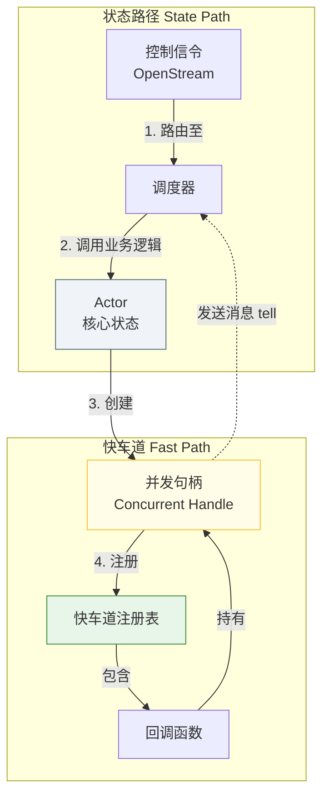

# **专题解析：快车道底层机制 — 生命周期与并发句柄**

在 `3.8 快车道内核` 中，我们了解了“快车道”是为高吞吐量数据流提供的性能路径。而在 `3.9 自动流绑定` 中，我们看到了框架如何将快车道的使用封装成优雅、对开发者透明的高级API。

本篇文档将**再次返回底层**，深入揭示支撑起所有上层抽象的**核心机制**：快车道流的底层生命周期是如何被管理的，以及框架是如何通过“并发句柄”模式来确保其并发安全的。

理解本章内容，能帮助你洞悉框架“自动挡”API之下的“手动挡”精密构造。

### 1. 核心问题与答案

要理解快车道的底层机制，需要回答两个核心问题：
1.  **生命周期管理**：一个独立的快车道流，是如何被创建、执行、并最终被销毁的？
2.  **并发安全**：一个在 I/O 线程上并发执行的回调，是如何安全地与由“状态路径”串行保护的 Actor 核心状态交互的？

答案是统一的：**快车道的整个生命周期和状态交互，都由“状态路径”来精确指挥和编排。**

> 强警告：除非你完全理解并设计了充分的防护（线程安全、死锁规避、幂等与一致性、恢复与重放、监控告警），否则不要在 Fast Path 中修改核心状态；如需变更，需通过 tell 回到 State Path 执行。

### 2. 核心协作模式：并发句柄 (Concurrent Handle)

为了在并发的快车道回调中安全地与单线程的 Actor 状态交互，框架采用了一种“并发句柄”模式。Actor 并不直接将自身的状态暴露给快车道，而是创建一个线程安全的**句柄**，并由回调函数捕获这个句柄。


*图 1: 通过并发句柄实现路径协作*

#### **一个完整的示例**

以下伪代码将“注册逻辑”和“并发句柄的实现”整合在一起，完整地展示了框架底层是如何为一个文件上传请求，创建一个快车道流的。

```rust
// --- Actr 的业务逻辑实现 ---

// 在 Actor 的 OpenStream 方法中
async fn handle_open_stream(&self, req: OpenStreamRequest, ctx: Arc<Context>) -> Result<OpenStreamResponse, Status> {
    let stream_id = StreamId::new();

    // 1. 【状态路径】安全地修改核心状态，创建会话
    self.state.create_upload_session(stream_id, req.file_name);

    // 2. 【关键】创建一个“并发句柄”，它将作为 Actor 在并发环境中的线程安全代理
    let concurrent_handle = self.create_concurrent_handle(ctx.clone(), stream_id);

    // 3. 创建快车道回调，它捕获的是“并发句柄”，而不是 Actor 自身
    let callback = Box::new(move |chunk: Vec<u8>| {
        let handle = concurrent_handle.clone();
        // 在回调中，我们只是简单地调用句柄的方法
        // 所有复杂的线程安全问题都被封装在句柄内部
        Box::pin(handle.handle_file_chunk(chunk))
    });

    // 4. 通过 Context 请求 ActrSystem，注册这个回调
    ctx.register_fastpath_callback(stream_id, callback);

    Ok(OpenStreamResponse { stream_id })
}


// --- 并发句柄的定义与实现 ---

// 句柄通常持有与特定流相关的不变数据，以及与 ActrSystem 通信的能力
struct ConcurrentHandle {
    actor_id: ActrId,
    stream_id: StreamId,
    context: Arc<Context>,
}

impl ConcurrentHandle {
    // 这个方法在快车道上被并发调用
    pub async fn handle_file_chunk(&self, chunk: Vec<u8>) {
        // a. 执行可以在当前线程完成的、无状态的纯计算
        let result = process_chunk(chunk); 

        // b. 将需要改变核心状态的操作，封装成一个消息
        let msg = MyMessages::ChunkProcessed { 
            stream_id: self.stream_id, 
            result 
        };

        // c. 通过 tell 将消息发送回 Actor 的“状态路径”，进行安全的最终状态更新
        //    这里的 .await 只是等待消息入队，而不是等待状态更新完成
        self.context.tell(self.actor_id, msg).await;
    }
}
```

### 3. 生命周期管理：控制平面与数据平面

快车道回调的生命周期，完全由状态路径通过信令来控制，这是一种典型的“控制平面指挥数据平面”的模式：

*   **创建 (控制平面)**: 由一个状态路径的 `OpenStream` 请求，通过 `ctx.register_fastpath_callback` 来创建和注册。
*   **执行 (数据平面)**: `Input Handler` 直接在 I/O 线程调用已注册的回调，数据在快车道上传输。
*   **销毁 (控制平面)**: 由一个状态路径的 `CloseStream` 请求，通过 `ctx.unregister_fastpath_callback` 来注销和销毁。

这种分离是框架得以兼顾**状态管理的安全性**与**数据处理的高性能**的根本原因。
