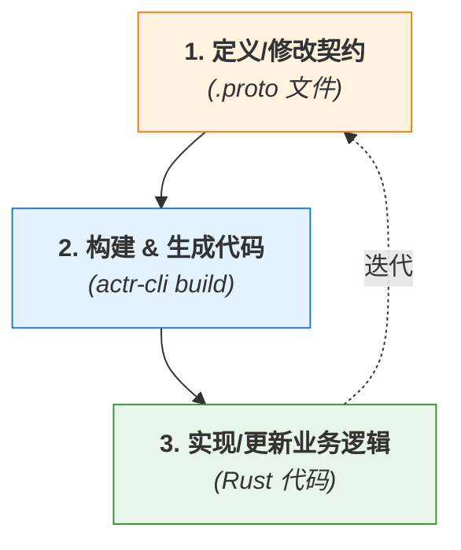

# 专题解析：应用 Protobuf 契约 (Application Proto Contract)

> [!NOTE]
> 本文档讲解了如何为 **您的应用业务** 定义 `service` 和 `message`，这是使用本框架进行开发的第一步。
>
> 如果您想了解 **框架自身** 使用的底层协议（如信令、身份定义），请参阅《[1.2 框架内部协议](./1.2-framework-internal-protocols.zh.md)》。

在开始使用本框架编写任何一行 Rust 代码之前，你的旅程始于一个看似普通但至关重要的文件：`.proto` 文件。

**在我们的架构中，`.proto` 文件不是一个可选项，也不是一个事后生成的文档——它是整个系统的基石、是万物的源头、是服务器与客户端之间神圣不可侵犯的“契约 (Contract)”。**

本篇文章将阐述“契约优先”的设计哲学，以及这份契约是如何驱动整个开发流程，并成为框架实现类型安全和优雅 API 的保障。

### **1. 什么是“契约优先”？**

“契约优先”(Contract-First)是一种软件设计方法，它要求我们在编写任何具体实现代码之前，首先使用一种独立于任何编程语言的**接口定义语言 (IDL)** 来精确地定义数据结构和服务的行为。

在本框架中，我们选择 Google 的 **Protocol Buffers (Protobuf)** 作为我们的 IDL。

这意味着，你的开发工作将围绕一个以契约为中心的迭代循环展开：


*图 1: 契约优先的迭代开发流程*

这种方法的巨大优势在于：
*   **清晰的边界**: `.proto` 文件成为了前端、后端、甚至不同后端服务之间唯一的“真相来源 (Single Source of Truth)”。
*   **并行开发**: 一旦契约确定，不同团队就可以基于生成的代码并行开发，因为他们交互的接口已经被精确地固定下来了。
*   **语言无关**: 你的 `Actor` 可以用 Rust 实现，而调用它的客户端可以是 Web (JavaScript)、移动端 (Kotlin/Swift) 或另一个后端服务 (Go/Python)，它们都共享同一份 `.proto` 契约。

### **2. 契约的核心要素: `message` 与 `service`**

在 `.proto` 文件中，你只关心两件事：**数据 (`message`)** 和 **能力 (`service`)**。

#### **要素一：`message` — 定义数据**

`message` 用于定义你的应用中所有需要交换的数据的结构。它就像 Rust 中的 `struct`，但拥有跨语言的能力。

```protobuf
// proto/user_service.proto

// 定义一个用户的核心数据结构
message UserProfile {
  optional string user_id = 1;
  optional string display_name = 2;
  optional string avatar_url = 3;
}

// 定义获取用户信息的请求
message GetUserProfileRequest {
  optional string user_id = 1;
}
```
Protobuf 提供了丰富的数据类型（`string`, `int32`, `bool`, `bytes`, `repeated`, `map` 等），足以描述任何复杂的数据结构。

#### **要素二：`service` — 定义能力**

`service` 用于定义你的 `Actor` 能够执行的操作。它就像 Rust 中的 `trait`，声明了一系列可被远程调用的方法。

```protobuf
// proto/user_service.proto (续)

import "google/protobuf/empty.proto";

// 定义一个名为 UserService 的服务
service UserService {
  // 定义一个 Call (请求-响应) 方法
  // 它接收 GetUserProfileRequest，返回 UserProfile
  rpc GetUserProfile(GetUserProfileRequest) returns (UserProfile);

  // 定义一个 Tell (单向) 方法
  // 它接收 UserProfile，不返回任何有意义的数据
  rpc UpdateUserProfile(UserProfile) returns (google.protobuf.Empty);
}
```
`service` 中的每一个 `rpc` 方法都精确地定义了其**方法名**、**输入参数 (`message`)** 和**输出 (`message`)**。这种精确性是框架实现类型安全自动化的基础。

### **3. 从契约到代码：代码生成与角色约定**

`.proto` 契约本身只是一份文本文件。要让它在 Rust 代码中变得“鲜活”，就需要**代码生成**这一关键步骤。当你运行 `cargo build` 时，框架的插件 (`protoc-gen-actorframework`) 会将这份契约转化为具体的、类型安全的 Rust 代码。

#### **核心规则：文件决定角色 (File Decides Role)**

为了在易用性和灵活性之间取得平衡，框架建立了一条默认规则：一个 `.proto` 文件在编译时所扮演的角色，由它“**是否是本次编译的主要目标**”来决定。

这个信息由构建工具（如 `actr-cli`）在调用 `protoc` 编译器时提供。凡是直接传递给编译命令的文件，就是“主要目标”；通过 `import` 间接引入的，就是“依赖项”。

代码生成器根据这个角色差异，执行不同的操作：

*   **对于“主要目标”文件 (`.proto` in my project)**:
    *   **意图**: 定义**此 Actor 对外提供的能力**。
    *   **生成物**: 只生成供开发者实现的**服务端 `trait`** (例如 `trait IMyService { ... }`) 和相关的 `Adapter`。

*   **对于“依赖项”文件 (`import` a `.proto`)**:
    *   **意图**: 声明**此 Actor 需要依赖的外部能力**。
    *   **生成物**: 只生成供开发者调用的**客户端 `Context` 辅助方法** (例如 `ctx.call_other_service(...)`)。

这个默认规则旨在覆盖大部分使用场景，帮助开发者自然地分离“服务实现”和“服务调用”。

#### **补充规则：使用选项覆盖默认行为**

在某些特定场景下（例如 Actor 需要给自己发送消息，即“自调用”），开发者可能需要覆盖上述默认规则。为此，框架提供了一个 Protobuf 自定义选项，允许为“主要目标”文件**也生成客户端辅助方法**。

**用法示例**:
```protobuf
// 在你自己的 my_actor.proto 中
import "google/protobuf/descriptor.proto";

// 1. 引入框架定义的选项
extend google.protobuf.ServiceOptions {
  optional bool force_generate_client_helpers = 50004;
}

// 2. 在你的服务上使用它
service MyActorService {
  // 默认只生成 trait，但这个选项会强制它“也”生成
  // ctx.call_do_something_later(...) 等辅助方法
  option (force_generate_client_helpers) = true;
  
  rpc DoSomethingLater(MyRequest) returns (MyResponse);
}
```

通过这个 `option`，框架提供了一个完备的模型：**默认行为清晰简单，高级用法有明确的、自描述的覆盖机制。**

### **4. 设计最佳实践：一个 RPC，一个消息**

在设计 `.proto` 契约时，一个重要的原则是：**始终为每个 `rpc` 方法定义独立的请求和响应 `message`**。

**不推荐的做法**:
```protobuf
// ❌ 多个 rpc 复用同一个 message，或使用基本类型
rpc UpdateUser(UserProfile) returns (google.protobuf.Empty);
rpc GetUser(string) returns (UserProfile);
```

**推荐的做法**:
```protobuf
// ✅ 每个 rpc 都有自己专属的“信封”
message UpdateUserRequest { optional UserProfile profile = 1; }
message UpdateUserResponse { optional bool success = 1; }
rpc UpdateUser(UpdateUserRequest) returns (UpdateUserResponse);

message GetUserRequest { optional string user_id = 1; }
message GetUserResponse { optional UserProfile profile = 1; }
rpc GetUser(GetUserRequest) returns (GetUserResponse);
```

这种做法保证了 API 的**向后兼容性**和**可扩展性**。如果未来 `UpdateUser` 操作需要增加一个额外的参数（比如 `update_mask`），只需在 `UpdateUserRequest` 中增加一个新字段即可，所有现有的调用方都不会被破坏。

> [!TIP]
> **保持契约演进的向后兼容性**
>
> 在分布式系统中，服务契约的演进至关重要。为了确保服务升级不破坏现有客户端，强烈建议遵循 Protobuf 的向-后兼容性最佳实践，核心原则包括：
> - **不要更改**现有字段的**字段编号**。
> - **不要删除**已有的 `optional` 或 `required` 字段。如果字段确实废弃，应使用 `reserved` 关键字进行标记。
> - 向 `message` **添加新字段**时，应使用 `optional` 或 `repeated`，以便旧的客户端可以安全地忽略它们。
>
> 更多详细信息，请参阅 [Google Cloud 关于 API 兼容性设计的官方指南](https://cloud.google.com/apis/design/compatibility)。

### **5. Actor 的三种交互模式**

基于上述代码生成规则，开发者在实现 Actor 业务逻辑时，会遇到三种不同的交互模式：

**模式一：外部通信 (Inter-Actor Communication)**
*   **场景**: 当前 Actor 需要调用一个**不同**的、在网络中其他进程运行的 Actor。
**做法**: 在 `Actr.toml` 的 `[dependencies]` 中声明依赖，并为其提供一个别名。`actr-cli gen` 会为该别名生成一个专属的客户端，然后在代码中通过它来调用。
    ```rust
    // 假设在 Actr.toml 中定义了依赖:
    // [dependencies]
    // other = { actr_type = "other-service", ... }

    // 通过别名客户端来调用
    let response = ctx.other().get_user_data(GetUserRequest { ... }).await?;
    ```

**模式二：内部逻辑 (Intra-Actor Logic)**
*   **场景**: Actor 的一个方法需要调用**同一个 Actor** 的另一段业务逻辑。
*   **原则**: **不应**为此使用消息传递。直接的方法调用效率更高，也更符合框架的设计意图。
*   **做法**: 直接调用 `self` 上的普通内部方法。
    ```rust
    // 在 Actor 的 trait 实现中
    async fn handle_request(&self, req: Request) {
        // ...
        // 直接调用同一个 struct 上的另一个方法
        let result = self.calculate_internal_state(req.data).await;
        // ...
    }

    // Actor 自己的内部方法
    impl MyActor {
        async fn calculate_internal_state(&self, data: i32) -> i32 {
            // ...
        }
    }
    ```

**模式三：与自身通信 (Self-Messaging)**
*   **场景**: Actor 需要给自己发送一个消息，以便在未来的某个时间点，通过“状态路径”的串行化保障来安全地处理它（例如，一个定时任务的回调）。
*   **做法**: 这正是 `force_generate_client_helpers = true` 选项的使用场景。通过它为自己的服务生成 `Context` 辅助方法，然后进行调用。
    ```rust
    // 在 Actor 的 trait 实现中
    async fn setup_timer(&self, ..., ctx: Arc<Context>) {
        let msg = DoSomethingLater { ... };
        // 假设 MyActorService 上打开了 force_generate_client_helpers
        ctx.schedule_tell(Duration::from_secs(5), msg).await?;
    }
    ```

### **6. 总结**

在本框架中，Protobuf 契约扮演了架构师、设计师和外交官的角色。它是驱动一切开发活动的“第一推动力”。通过强制开发者首先在 `.proto` 文件中进行清晰、严谨的思考和定义，框架得以在后续的流程中自动处理掉所有繁琐的细节，最终为你呈现一个简单、安全、高效的开发体验。

**记住：你的下一个伟大功能，始于 `message` 和 `service`。**
