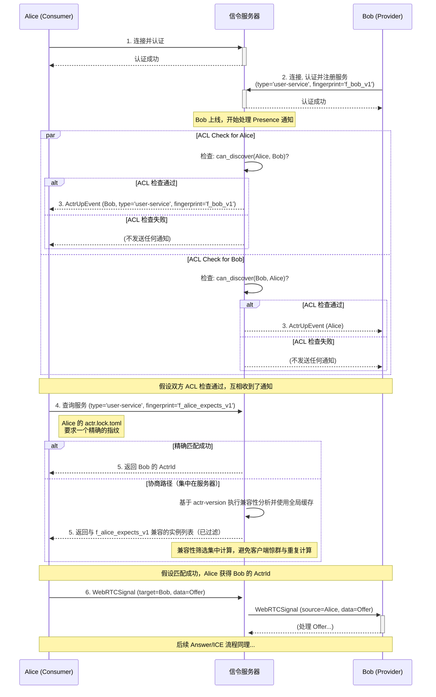

# 专题解析：信令机制 (Signaling)

在 Outproc 传输中（WebRTC/WebSocket），需要一个“发现与协商/授权”的前置过程来确定目标、完成握手或路由以及权限校验，这个过程就是信令（Signaling）。对于 WebRTC，信令包括 SDP/ICE 的交换；对于 WebSocket，则无需 Offer/Answer，仅需目录查询/授权与路由决策。

本框架不提供内置的信令服务器，而是定义了一套清晰的信令协议。开发者需要提供一个实现了该协议的信令服务器，以“引导”框架完成连接。

## 1. 框架对信令服务器的核心期望

框架期望信令服务器扮演一个“智能路由与授权中心”的角色。其核心职责是：

1.  **管理连接**: 接受并管理来自各个 Actor (客户端) 的 WebSocket 连接。
2.  **身份与路由**: 维护一个 `ActrId` 到 WebSocket 连接的映射表，以便能根据 `ActrId` 将消息路由到正确的客户端。
3.  **服务注册与发现**: 维护一个服务目录，记录每个在线 Actor 的 `type` 和**服务指纹**。
4.  **执行连接级访问控制 (ACL)**: 作为 ACL 的第一道防线，在进行 Outproc 握手/路由之前必须执行 `can_access` 检查：当选择 WebRTC 时，转发 Offer/Answer/ICE 前执行；当选择 WebSocket 时，建立/路由连接前执行。这包括验证服务提供方的 `[acl]` 规则、消费方的 `[dependencies]` 意图以及双方的租户/认证信息。
5.  **消息转发**: 可靠地转发遵循框架[信令层契约](./1.2-framework-internal-protocols.zh.md#3-信令层契约-signalingproto)的消息。

> [!IMPORTANT]
> 框架的信令协议定义在 `signaling.proto` 中。任何自定义的信令服务器都必须能正确地处理该文件中定义的 `SignalingEnvelope`。
> 详情请参阅《[1.2 框架内部协议](./1.2-framework-internal-protocols.zh.md)》。

## 2. 核心信令交互流程 (含服务指纹)

“发现即授权”是指：在信令服务器的“在线实例通知流”（如 `ActrUpEvent`/`NewActor`）中出现的目标实例，已通过服务端的 can_access 预检，客户端“可以尝试建立连接”。注意这与“黄页式的目录发现（can_discover 控制可见性）”不同，后者仅影响工具输出与被动可见性，不代表可以直连。服务指纹在此基础上提供契约兼容性的保证。



**流程解析**:
1.  **连接与认证**: Alice 和 Bob 各自连接到信令服务器。
2.  **服务注册**: Bob (服务提供方) 在连接时，会额外注册自己提供的服务类型 (`type`) 和**服务指纹** (`fingerprint`)。
3.  **ACL 感知发现**: 当 Bob 上线时，信令服务器进行 ACL 检查。如果通过，向 Alice 发送的 `ActrUpEvent` 消息中会包含 Bob 的服务类型和指纹信息。
4.  **精确查询**: 当 Alice 需要连接 `user-service` 时，它的 SDK 会从 `actr.lock.toml` 中读取期望的**服务指纹**，并向信令服务器发起一个**带指纹的查询**。
5.  **匹配与响应**: 信令服务器查找是否有 `type` 和 `fingerprint` 都匹配的服务实例。
    *   如果找到，直接返回对应的 ActrId。
    *   如果找不到，则进入“运行时兼容性协商”流程（如果客户端发起请求），返回所有同 `type` 的可用实例列表，由客户端 SDK 自行检查兼容性。
一旦 Alice 的 SDK 确认了要连接的目标 (Bob)：
- 当选择 WebRTC 路径时，通过标准的 WebRTC 信令（Offer/Answer/ICE）发起连接；
- 当选择 WebSocket 路径时，由信令/路由层完成目标路由与授权，直接建立/复用到服务端的 WebSocket 通道，无需 Offer/Answer/ICE。

## 3. 实现自定义信令服务器的简要指南


实现一个满足框架要求的信令服务器，核心是管理 **已认证的会话**。认证应该在 WebSocket 连接建立之初完成一次，后续所有消息都通过这个已认证的会话进行路由。


以下是一个简化的 Node.js 示例，演示了这种基于会话的管理方式：


```javascript

import { WebSocketServer } from 'ws';


// 用于存储 ActrId -> WebSocket 连接实例的映射

const connected_actors = new Map();

// 用于存储 WebSocket 连接实例 -> ActrId 的反向映射，便于在断开连接时清理

const ws_to_actor = new Map();


const wss = new WebSocketServer({ port: 8080 });


wss.on('connection', ws => {

  // 每个连接在认证成功前都是临时的


  ws.on('message', message => {

    // 1. 解析 Protobuf 消息

    // const envelope = SignalingEnvelope.decode(message);


    // 2. 处理认证与服务注册 (来自 PeerToSignaling 消息)

    // if (signalingMessage.unauthenticated_to_server?.register_request) {

    //   const { actr_type, realm, service_spec } = signalingMessage.unauthenticated_to_server.register_request;

    //

    //   // 执行认证逻辑，成功后分配一个唯一的 ActrId

    //   const newActorId = allocateNewActorId(actr_type, realm);

    //   

    //   // 建立会话：将 ActrId 和 WebSocket 连接双向绑定

    //   connected_actors.set(newActorId.toString(), { ws, type: actr_type, spec: service_spec });

    //   ws_to_actor.set(ws, newActorId.toString());

    //   

    //   // 向客户端返回 RegisterResponse，并向其他相关 Actor 广播 ActrUpEvent

    //   // ...

    //   return;

    // }


    // 3. 处理来自已认证 Actor 的消息

    const sourceActorId = ws_to_actor.get(ws);

    if (!sourceActorId) {

      // 如果连接尚未认证，则忽略或断开

      return;

    }


    // 填充信封的 source 字段

    // signalingMessage.source = sourceActorId;


    // 4. 处理 ActrRelay 转发 (例如 WebRTC 信号)

    // if (signalingMessage.actr_relay) {

    //   const targetClient = connected_actors.get(signalingMessage.actr_relay.target.toString());

    //   if (targetClient) {

    //     // 直接转发，因为源身份已经由会话保证

    //     targetClient.ws.send(message);

    //   }

    // }


    // ... 处理其他 ActrToSignaling 消息 ...

  });


  ws.on('close', () => {

    const actorId = ws_to_actor.get(ws);

    if (actorId) {

      connected_actors.delete(actorId);

      ws_to_actor.delete(ws);

      // 广播 ActorLeftEvent...

    }

  });

});

```


**核心要点**:

*   **会话管理**: 使用 `Map` 来维护 `ActrId` 和 `WebSocket` 实例之间的双向绑定，这就是会话的实质。

*   **一次性认证**: `RegisterRequest` 只在连接初期处理一次，用于建立会话。

*   **隐式身份**: 对于已建立会话的连接，其发送的任何消息，其来源 `ActrId` 都由服务器根据 `ws_to_actor` 的映射关系确定，而无需在消息体中重复携带。

*   **安全转发**: `ActrRelay` 消息的转发，其安全性由信令服务器保证，因为它只转发来自已认证会话的消息。


## 4. 高可用性与客户端韧性


> [!WARNING]

> **生产环境要求**

>

> 单实例的信令服务器是系统的单点故障（SPOF）。在任何生产环境中，**都必须**部署高可用的信令服务器集群。


### 4.1. 信令服务器高可用 (HA)

为实现高可用，信令服务器需要满足两个条件：

1.  **无状态化**：服务器实例本身不存储关键状态（如 Actor 在线列表）。

2.  **共享后端**：所有实例都连接到一个共享的、高可用的后端服务（如 Redis, Nats, Etcd）来同步状态。


**典型架构**：

*   多个信令服务器实例部署在负载均衡器之后。

*   当一个 Actor 连接时，负载均衡器将其路由到任意一个实例。

*   该实例在处理 `RegisterRequest` 后，将 `ActrId` 与其自身标识（如 IP 地址）的映射关系发布到共享后端。

*   当需要中继消息时，实例从共享后端查询目标 `ActrId` 所在的实例地址，然后进行实例间的直接转发或通过消息队列转发。


### 4.2. 客户端韧性 (Client Resilience)

`ActrSystem` 作为信令服务器的客户端，**必须**实现一套健壮的断线重连和灾难恢复机制。


*   **自动重连**：当与信令服务器的 WebSocket 连接意外断开时，`ActrSystem` 必须自动尝试重新连接。（此为网络层连接保活，不会自动重放应用层请求）

*   **指数退避**：重连尝试应遵循“指数退避” (Exponential Backoff) 策略。例如，第一次在 1 秒后重试，然后是 2 秒、4 秒、8 秒……直到一个最大上限（如 60 秒）。这可以防止在信令服务器恢复的瞬间，被海量的客户端重连请求压垮。

*   **状态恢复**：成功重连后，`ActrSystem` 需要向信令服务器重新注册其服务，以恢复其在网络中的可见性。
