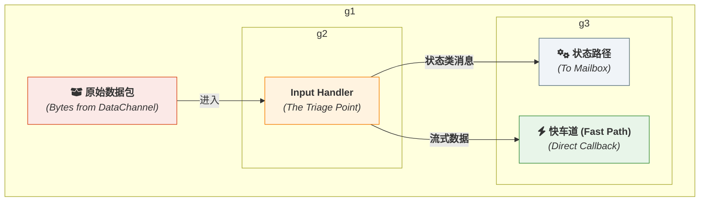
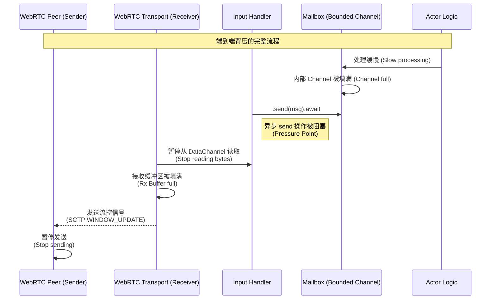

# **专题解析之二：`Input Handler` 的艺术 — 流量分诊与压力传导**

> **⚠️ 实现状态**：
> - ✅ **已实现**：WebRtcGate 消息路由（基于 PayloadType）
> - ⚠️ **概念映射**：文档中的 "Input Handler" 概念在代码中由 `WebRtcGate`（跨进程）与 `ActrNode` 中的 Inproc 接收循环共同完成
> - 📋 **规划中**：统一的背压机制
>
> 本文档描述入站消息处理的设计理念，具体实现细节请参考 `WebRtcGate` 源码。

> [!WARNING]
> **专家特性：请谨慎修改**
>
> 本文档阐述的入站处理机制是保障框架核心功能（如 Actor 的单线程执行模型、消息路由正确性）的基石。自定义入站处理逻辑是一个极其高级且危险的操作。
>
> **在 99% 的情况下，您都<u>不应该</u>尝试替换或修改此组件。**
>
> 只有在您需要实现一个全新的底层传输协议，或者需要对流量分诊机制进行根本性重构时，才应考虑此操作。任何不正确的修改都可能轻易地破坏 Actor 的并发安全保证，或导致系统出现消息路由错误。
>
> 在尝试自定义前，请确保您已完全理解本文档描述的所有机制，并参考实际代码实现。

`Input Handler` 是 `ActrSystem` 的“前门”，所有来自外部世界的网络流量都必须先经过它的处理。它看似只是一个简单的数据包转发器，但实际上，它是框架实现**高性能**与**稳定性**两大基石的关键所在。

`Input Handler` 的艺术主要体现在两个方面：
1.  **高效的流量分诊 (Triage)**: 它必须以最低的开销，快速区分出需要严格顺序保证的**状态类消息**和需要极致性能的**流式数据**，并将它们送往正确的内部处理路径。
2.  **灵敏的压力传导 (Pressure Propagation)**: 它必须能够感知到框架内部（应用层）的处理压力，并将其正确地“翻译”和传导给外部网络（传输层），形成一套完整的端到端**背压 (Backpressure)** 机制。

本篇文章将深入这两个主题，揭示 `Input Handler` 的内部工作原理。

### **1. 流量分诊：系统的智能路由器**

当一个数据包从 WebRTC `DataChannel` 到达时，`Input Handler` 的首要职责就是回答一个问题：“这个包要去哪里？”


*图 1: Input Handler 作为流量分诊点*

为了做出这个决定，`Handler` 依赖于在通信建立时就约定好的策略。

*   **策略 A: 基于 `DataChannel` 标签**
    这是一种物理隔离的策略。框架可以约定：
    *   所有**状态类消息**都通过一个名为 `"control"` 的可靠、有序 `DataChannel` 传输。
    *   每个**流式数据**（如文件传输）则会动态创建一个独立的、不可靠、无序的 `DataChannel`，其标签就是流的 `stream_id`。

*   **策略 B: 基于消息信封**
    这是一种逻辑隔离的策略。所有流量都通过同一个 `DataChannel`，但每个消息都被一个统一的信封包裹。
    ```
    // 消息信封结构 (伪代码)
    [ 1 byte: Type ] [ N bytes: Destination ID ] [ ... Payload ... ]
    - Type: 0x01 表示状态类消息, 0x02 表示流式数据
    - Destination ID: 如果是状态类消息，这里是方法名；如果是流式数据，这里是 stream_id
    ```

无论采用哪种策略，`Input Handler` 的分诊逻辑都必须极其轻量。

#### **分诊逻辑伪代码**

```rust
// Input Handler 的主处理循环 (伪代码)
async fn handle_incoming_datachannel(
    channel: Arc<DataChannel>,
    state_path_tx: mpsc::Sender<StateMessage>,
    fast_path_registry: Arc<DashMap<StreamId, Callback>>,
) {
    // 监听数据通道的消息事件
    channel.on_message(|msg: Message| {
        // --- 分诊逻辑开始 ---

        // 策略 A: 检查 DataChannel 标签
        let label = channel.label();
        if label == "control" {
            // 这是一个状态类消息
            let state_msg = StateMessage::decode(msg.data); // 解析
            // 发送到状态路径的有界 channel
            state_path_tx.send(state_msg).await; // <-- 背压点 1
        } else {
            // 这是一个流式数据消息，标签即 stream_id
            let stream_id = StreamId::from(label);
            
            // 在快车道注册表中查找回调
            if let Some(callback) = fast_path_registry.get(&stream_id) {
                // 直接调用回调，不经过任何 channel
                callback(msg.data);
            }
        }
    });
}
```

### **2. 压力传导：做 WebRTC 背压机制的“好队友”**

你对背压的理解是完全正确的：框架的责任是**将 `ActrSystem` 内部的压力准确地向“更后方”的 WebRTC 系统传递，集合 WebRTC 自己的背压逻辑，最终完成整个系统的压力反馈。**

WebRTC `DataChannel` 自身已经实现了一套基于 `bufferedAmount` 和 `bufferedAmountLowThreshold` 的、非常成熟的背压机制。如果接收方处理不过来，它的接收缓冲区会被填满，协议栈会自动通知发送方降低发送速率或暂停发送。

我们框架的**唯一任务**，就是**不要破坏**这个链条。

#### **压力传导链条详解**


*图 2: 背压从 Actor 逻辑反向传播到网络发送方的过程*

这个链条得以成立的关键在于两点：

1.  **有界通道 (Bounded Channels)**: `Input Handler` 与 `Mailbox` 之间通信的 `mpsc::channel` **必须**是有固定容量的（例如 `mpsc::channel(128)`）。一个无界的 channel 会无限缓冲消息，直到耗尽系统内存，从而切断了压力传导链。

2.  **异步 `send` 操作**: `Input Handler` 在调用 `state_path_tx.send(msg).await` 时，如果 channel 已满，`.await` 会异步地暂停当前任务的执行，直到 channel 中有空间为止。

#### **伪代码中的关键**

让我们再次审视 `Input Handler` 的伪代码，并聚焦于背压的关键点。

```rust
async fn handle_incoming_datachannel(
    channel: Arc<DataChannel>,
    // 这是一个 **有界** channel 的发送端
    state_path_tx: mpsc::Sender<StateMessage>,
    // ...
) {
    channel.on_message(|msg: Message| {
        // ...
        if is_state_message {
            // ...
            
            // --- 这是整个背压机制的“扳机” ---
            // 如果状态路径繁忙，导致 state_path_tx 的 channel 满了，
            // 这里的 .await 操作将会暂停，不会立即返回。
            //
            // 因为这个 on_message 回调被暂停了，所以它不会去从
            // 底层的 DataChannel 读取下一个数据包。
            // 这就让 DataChannel 的接收缓冲区有机会被填满，
            // 从而触发 WebRTC 协议自身的背压机制。
            // 压力被成功传导了！
            state_path_tx.send(state_msg).await;
            
        } else {
            // ... 快车道逻辑 ...
            // 注意：快车道逻辑是直接调用，如果它本身是同步阻塞的，
            // 同样会阻塞 on_message 回调，也能传导压力。
        }
    });
}
```

### **3. 总结**

`Input Handler` 是框架中一个看似简单却至关重要的组件。它通过轻量级的分诊逻辑，将流量高效地导入状态路径和流式数据路径。更重要的是，它通过**有界内部通道**和**异步发送操作**，构建了一个灵敏的“压力阀门”。这个阀门不会自己处理压力，而是巧妙地利用异步运行时的暂停机制，将内部拥堵的“信号”反向传播给 WebRTC 传输层，让专业（且在协议层实现，效率极高）的流量控制机制来完成真正的工作。

正是这种对底层机制的尊重和巧妙利用，使得框架在提供高级抽象的同时，依然能保持系统的稳定性和高性能。
