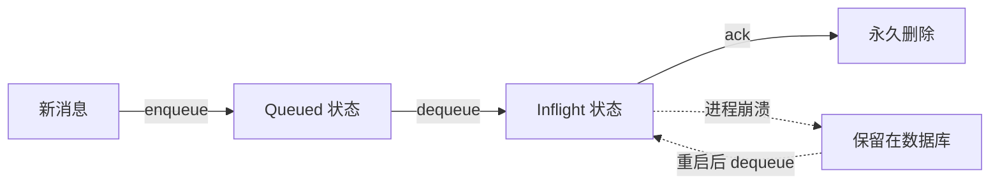

# 专题解析：Mailbox — 抽象、持久化与恢复

如“理念与架构”篇所述，Mailbox 是 Actor 状态路径的逻辑入口。本篇文档将深入其核心设计：**将 Mailbox 设计为 `trait` 抽象，并提供一个基于 SQLite 的、生产级的默认实现**。

这种“接口与实现分离”的设计，是框架实现**可测试性**和**可扩展性**的基石。

## 1. Mailbox Trait：定义核心能力

`Mailbox` trait 定义了一个持久化、支持优先级的消息队列所需的核心能力，它对具体的存储后端一无所知。

**`Mailbox` Trait (简化定义)**
```rust
#[async_trait]
pub trait Mailbox: Send + Sync {
    /// 将消息加入队列
    ///
    /// # 参数
    /// - `from`: 发送方 ActrId (Protobuf bytes，由 Gateway 直接提供，不解包)
    /// - `payload`: 消息内容（raw bytes，不解包）
    /// - `priority`: 消息优先级
    ///
    /// # 返回
    /// - 消息的唯一 ID (UUID)
    async fn enqueue(
        &self,
        from: Vec<u8>,
        payload: Vec<u8>,
        priority: MessagePriority,
    ) -> StorageResult<Uuid>;

    /// 从队列中取出一批消息
    ///
    /// 此方法将自动处理优先级：只要有高优先级消息，就会优先返回它们。
    /// 取出的消息会被原子性地标记为 `Inflight` (处理中)，但不会被删除。
    /// 必须在处理完成后调用 `ack()` 来将其永久删除。
    ///
    /// # 返回
    /// - 消息列表（按优先级排序，批量大小由实现决定）
    async fn dequeue(&self) -> StorageResult<Vec<MessageRecord>>;

    /// 确认一条消息已成功处理，将其从队列中永久删除
    ///
    /// # 参数
    /// - `message_id`: 消息的唯一 ID
    async fn ack(&self, message_id: Uuid) -> StorageResult<()>;

    /// 获取当前邮箱的统计信息
    async fn status(&self) -> StorageResult<MailboxStats>;
}
```

**方法签名变更说明**：

1. **`enqueue` 签名变更**：
   - 旧版本：`enqueue(message: RpcEnvelope, priority: Priority)`
   - 新版本：`enqueue(from: Vec<u8>, payload: Vec<u8>, priority: MessagePriority)`
   - **理由**：零拷贝优化，避免 ActrId 反序列化/序列化循环

2. **`dequeue` 签名变更**：
   - 旧版本：`dequeue(priority: Priority) -> Option<RpcEnvelope>`（单条消息，需要指定优先级）
   - 新版本：`dequeue() -> Vec<MessageRecord>`（批量消息，自动按优先级排序）
   - **理由**：批量处理提升吞吐量，内部自动优先级排序简化调用

3. **`ack` 替代 `cleanup`**：
   - 旧版本：`cleanup(message_id: &str)`
   - 新版本：`ack(message_id: Uuid)`
   - **理由**：术语更精确（confirm vs cleanup），使用 Uuid 类型更安全

4. **新增 `status` 方法**：
   - 返回 `MailboxStats`（队列统计信息）
   - **理由**：监控和可观测性

5. **删除 `recover` 方法**：
   - **理由**：故障恢复通过 `dequeue()` 自动处理（返回 Inflight 消息）
这个抽象使得框架的核心逻辑（如 `Scheduler`）可以依赖于 `Arc<dyn Mailbox>`，而无需关心其底层是 SQLite、内存队列（用于测试），还是未来的分布式日志（如 Kafka）。

## 2. `SqliteMailbox`：生产级的默认实现

框架提供了一个名为 `SqliteMailbox` 的默认实现，它基于 **SQLite 数据库**构建了一个支持 ACID 事务的**可靠队列系统**。这个设计是框架在单节点上实现极高可靠性、支持进程故障后状态自动恢复的基石。

### 2.1. 数据库结构设计

#### 单表 + Status 字段设计

实际实现使用**单表设计**，通过 `priority` 和 `status` 字段管理消息状态：

```sql
CREATE TABLE IF NOT EXISTS messages (
    id TEXT PRIMARY KEY,                -- UUID（消息唯一标识）
    from_actr_id BLOB NOT NULL,         -- 发送方 ActrId (Protobuf bytes)
    payload BLOB NOT NULL,              -- 消息内容（raw bytes）
    priority INTEGER NOT NULL,          -- 优先级（1=High, 0=Normal）
    status INTEGER NOT NULL DEFAULT 0,  -- 状态（0=Queued, 1=Inflight）
    created_at TEXT NOT NULL            -- 创建时间（RFC3339）
);

CREATE INDEX IF NOT EXISTS idx_messages_priority_status
    ON messages(priority DESC, status, created_at ASC);
```

**关键字段说明**：

1. **`from_actr_id BLOB NOT NULL`**：
   - 存储发送方 ActrId 的 **Protobuf bytes**（零拷贝设计）
   - 避免 decode → ActrId → encode 循环
   - Gateway 直接传递 bytes，只在需要时才反序列化

2. **`status INTEGER`**（可靠队列核心）：
   - **`0 = Queued`**：消息在队列中等待处理
   - **`1 = Inflight`**：消息已被 `dequeue()` 取出，正在处理中

   **状态机转换**：
   ```
   Queued ──(dequeue)──> Inflight ──(ack)──> [删除]
                           │
                           └──(进程崩溃)──> [保留在数据库，等待重启后重新处理]
   ```

3. **`priority INTEGER`**：
   - `1` = High（高优先级）
   - `0` = Normal（普通优先级）
   - 通过索引 `idx_messages_priority_status` 确保高优先级优先处理

**单表设计优势**：
- **简化查询**：一次 SQL 查询即可按优先级排序获取消息
- **高效索引**：复合索引 `(priority DESC, status, created_at ASC)` 优化查询性能
- **原子性保证**：单表事务更简单，ACID 保证更直接

### 2.2. 可靠队列语义：Queued → Inflight → Ack

这是一个经典的**可靠队列 (Reliable Queue)** 模式，防止消息丢失：



**关键流程**：

1. **`enqueue(from, payload, priority)`**：
   ```sql
   INSERT INTO messages (id, from_actr_id, payload, priority, status, created_at)
   VALUES (?, ?, ?, ?, 0, ?);  -- status=0 (Queued)
   ```

2. **`dequeue()`**：原子性取出并标记为 Inflight
   ```sql
   UPDATE messages
   SET status = 1  -- Inflight
   WHERE id IN (
       SELECT id FROM messages
       WHERE status = 0  -- Queued
       ORDER BY priority DESC, created_at ASC
       LIMIT 32
   )
   RETURNING *;
   ```

3. **`ack(message_id)`**：永久删除
   ```sql
   DELETE FROM messages WHERE id = ?;
   ```

**容错场景**：
- ✅ **进程在 dequeue 后崩溃**：Inflight 消息保留在数据库，重启后可以重新 dequeue
- ✅ **进程在 ack 前崩溃**：消息未删除，重启后重新处理（需要业务逻辑幂等）
- ✅ **数据库文件损坏**：SQLite 自动完整性检查（PRAGMA integrity_check）

### 2.3. 故障恢复：自动处理 Inflight 消息

**无需显式 `recover()` 方法**，故障恢复通过常规 `dequeue()` 自动处理：

```rust
// 启动时，dequeue() 会自动返回所有 Inflight 和 Queued 消息
impl Mailbox for SqliteMailbox {
    async fn dequeue(&self) -> StorageResult<Vec<MessageRecord>> {
        // SQL 查询不区分 Queued (0) 还是 Inflight (1)
        // 只要 status != 已删除，都会被取出
        // 实现可以选择性地优先处理 Inflight 消息
        // ...
    }
}
```

**恢复流程（自动）**：
1. 进程重启
2. 调用 `dequeue()`
3. SQL 返回所有 `status IN (0, 1)` 的消息（按优先级排序）
4. 业务逻辑重新处理（幂等性保证正确性）
5. 处理完成后 `ack()`，永久删除

## 3. 设计的权衡与扩展性

### 3.1. `SqliteMailbox` 的权衡

*   **优点**：为单节点提供了极高的可靠性和进程内故障恢复能力，且无需任何外部依赖，部署简单。
*   **缺点**：状态被绑定在本地磁盘，无法实现跨节点的故障转移和高可用（HA）。

### 3.2. `Mailbox` Trait 带来的扩展性

将 Mailbox 设计为 trait，为解决 `SqliteMailbox` 的局限性提供了清晰的路径：

*   **可测试性**：在测试中，可以轻易地注入一个基于内存的 `InMemoryMailbox` 实现，使测试无需文件 I/O，速度更快、更稳定。
*   **未来高可用方案**：当需要构建高可用的有状态 Actor 时，可以开发 `Mailbox` trait 的新实现，例如：
    *   `KafkaMailbox`: 基于 Kafka 分布式日志实现。
    *   `NatsMailbox`: 基于 Nats JetStream 实现。
    *   `DistributedDbMailbox`: 基于 TiKV 或 Etcd 实现。

开发者只需在 `ActrSystem` 构建时注入不同的 Mailbox 实现，即可在不改变任何上层业务逻辑的情况下，切换 Actor 的持久化和容错模型。

## 4. 交付语义与幂等性要求

- 投递保障：Mailbox 提供持久化队列与崩溃恢复，保证消息不会因为进程崩溃而丢失。
- 至少一次（At-least-once）：由于 ack 之前的崩溃会导致消息在重启后再次交付，整体交付语义为“至少一次”。框架不提供“恰好一次（Exactly-once）”保证。
- 有序性：
  - 单优先级队列内按创建时间 FIFO；不同优先级之间无跨队列顺序保证（高优先级抢占）。
  - 需要严格先后顺序的业务操作必须发往同一优先级队列，或在应用层做序列约束。
- 业务幂等：
  - 所有会变更状态的消息处理应当具备幂等性；常用手段包括使用 request_id/去重键、幂等表、状态机版本检查（CAS）。
  - 对外部副作用（发邮件/扣费等），建议在应用层实现防重（如事务外幂等表），并在重放时安全跳过。
- 重试策略：
  - Mailbox 不会自动重试“业务失败”；仅在进程崩溃或 Actor 重启后“未 ack 的消息”会被再次投递。
  - 应用可按需实现显式重试队列或 dead-letter 队列，并在状态路径中进行再投递决策。

## 5. 总结

将 Mailbox 设计为 `trait` 和一个默认的 `SqliteMailbox` 实现，是一个兼顾了**开箱即用的可靠性**与**未来架构扩展性**的优雅方案。

它为开发者提供了：
1.  一个无需配置、即可获得进程级故障恢复能力的强大默认选项。
2.  一个清晰的、用于实现自定义持久化逻辑和高可用方案的扩展点。

理解这一设计，是掌握 `actr` 框架如何在不同场景下（从单点高可靠到分布式高可用）进行状态管理的关键。
