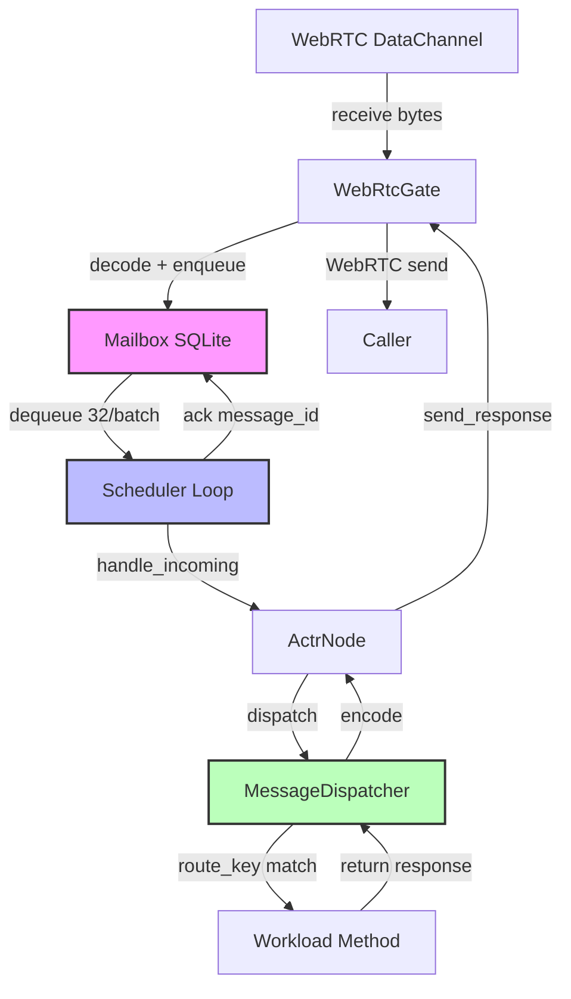
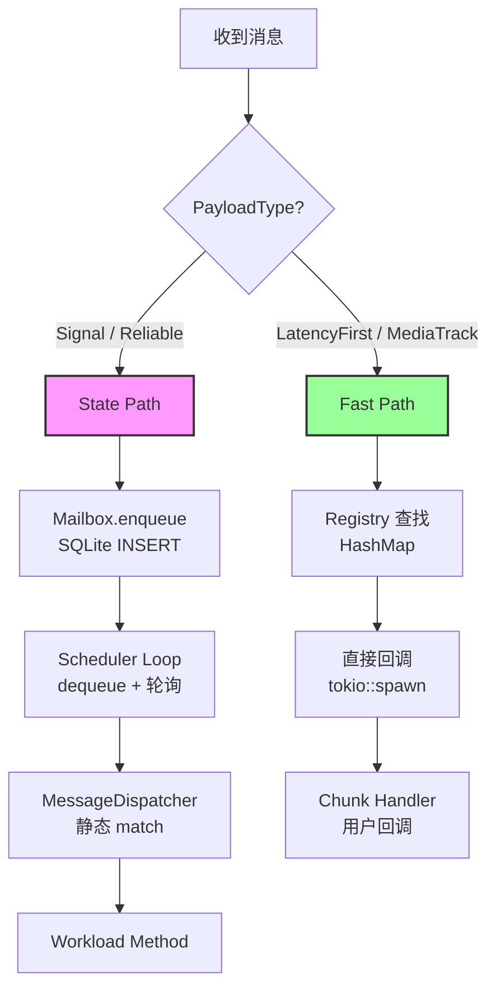
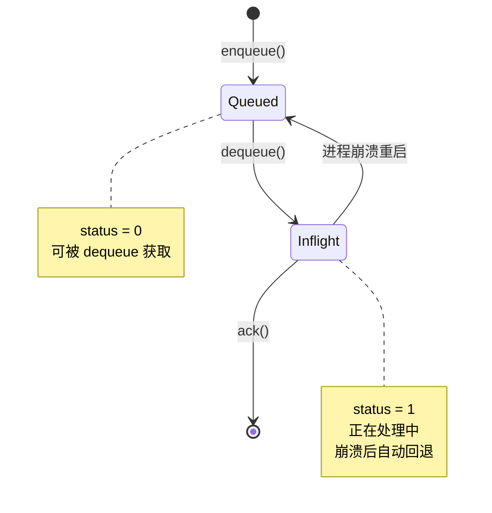
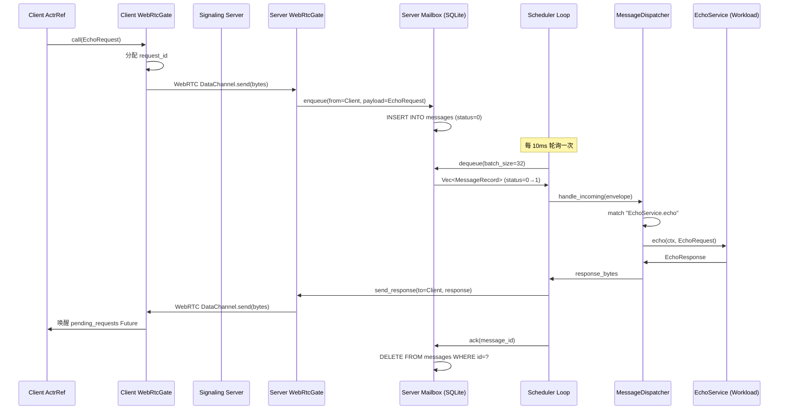

# 3.7 State Path Scheduling：可靠消息调度机制

> **核心理念**：通过持久化 Mailbox + 轮询调度，实现 At-least-once 语义的可靠消息传递

本文档深入剖析 actr 框架的 State Path 消息调度机制，解释从 Mailbox 出队到 Workload 方法调用的完整流程。

---

## 1. Scheduler 设计：无独立组件的极简架构

### 1.1 核心发现

actr 框架**没有独立的 Scheduler 组件**，而是在 `ActrNode::start()` 方法中直接启动一个 **Mailbox 处理循环**。

```rust
// 位置：crates/runtime/src/lifecycle/actr_node.rs:488-591
pub async fn start(mut self) -> ActorResult<ActrRef<W>> {
    // ...其他初始化代码...

    // 启动 Mailbox 处理循环（这就是 Scheduler）
    let mailbox_handle = tokio::spawn(async move {
        loop {
            tokio::select! {
                // 监听 shutdown 信号
                _ = shutdown.cancelled() => {
                    tracing::info!("Mailbox loop received shutdown signal");
                    break;
                }

                // 从 Mailbox 出队消息（按优先级）
                result = mailbox.dequeue() => {
                    match result {
                        Ok(messages) => {
                            // 处理批量消息
                            for msg_record in messages {
                                // 1. 解码消息
                                let envelope = MessageEnvelope::decode(&msg_record.payload[..])?;

                                // 2. 分发到 Workload
                                let response_bytes = node.handle_incoming(envelope).await?;

                                // 3. 发送响应
                                gate.send_response(&caller, response_envelope).await?;

                                // 4. 确认消息（从 SQLite 删除）
                                mailbox.ack(msg_record.id).await?;
                            }
                        }
                        Err(e) => {
                            tracing::error!("Mailbox dequeue failed: {:?}", e);
                            tokio::time::sleep(Duration::from_secs(1)).await;
                        }
                    }
                }
            }
        }
    });

    // 返回 ActrRef
    Ok(ActrRef::new(shared))
}
```

**设计哲学**：
- **简单性优先**：避免引入复杂的调度器组件
- **单线程串行**：一个 tokio task 处理所有消息，保证顺序性
- **事件驱动 + 轮询**：`tokio::select!` 监听 shutdown 和 dequeue 事件

---

## 2. 完整消息流：从 WebRTC 到 Workload 方法

### 2.1 五步骤端到端流程



#### Step 1: WebRTC → Mailbox（入站持久化）

```rust
// WebRtcGate 接收循环（启动位置：actr_node.rs:368-372）
impl WebRtcGate {
    pub async fn start_receive_loop(self, mailbox: Arc<dyn Mailbox>) {
        loop {
            // 从 DataChannel 接收原始 bytes
            let data = data_channel.recv().await?;

            // 解码为 MessageEnvelope
            let envelope = MessageEnvelope::decode(&data[..])?;

            // 持久化到 Mailbox（SQLite INSERT）
            mailbox.enqueue(
                from_actr_id,
                envelope.encode_to_vec(),
                Priority::Normal,  // 或 High
            ).await?;
        }
    }
}
```

**关键特性**：
- **立即持久化**：消息先写入 SQLite，进程崩溃不会丢失
- **解耦接收和处理**：WebRTC 线程只负责接收，处理由 Scheduler 异步完成

#### Step 2: Mailbox → Scheduler（批量出队）

```rust
// SqliteMailbox 实现（crates/runtime-mailbox/src/sqlite.rs）
impl Mailbox for SqliteMailbox {
    async fn dequeue(&self) -> ActorResult<Vec<MessageRecord>> {
        // 原子性标记并返回消息（批量 32 条）
        let messages = sqlx::query_as::<_, MessageRecord>(
            r#"
            UPDATE messages
            SET status = 1  -- Queued → Inflight
            WHERE id IN (
                SELECT id FROM messages
                WHERE status = 0
                ORDER BY priority DESC, created_at ASC
                LIMIT ?
            )
            RETURNING *
            "#
        )
        .bind(self.batch_size)  // DEFAULT_BATCH_SIZE = 32
        .fetch_all(&self.pool)
        .await?;

        Ok(messages)
    }
}
```

**批处理优化**：
| 参数 | 值 | 作用 |
|------|---|------|
| `batch_size` | 32 | 单次出队数量（减少 SQL 调用） |
| `ORDER BY` | `priority DESC, created_at ASC` | High 优先，同优先级 FIFO |
| `status` | `0 → 1` | Queued → Inflight（故障恢复标记） |

**轮询机制**：
```rust
// 队列为空时的处理（actr_node.rs:523-526）
if messages.is_empty() {
    tokio::time::sleep(Duration::from_millis(10)).await;  // 短暂休眠
    continue;
}
```

⚠️ **性能瓶颈**：10ms 轮询间隔是 State Path 延迟的主要来源（p50: 5ms）

#### Step 3: Scheduler → MessageDispatcher（静态分发）

```rust
// ActrNode::handle_incoming（actr_node.rs:127-142）
impl<W: Workload> ActrNode<W> {
    async fn handle_incoming(&self, envelope: MessageEnvelope) -> ActorResult<Bytes> {
        // 1. 创建 RuntimeContext（包含 caller_id, trace_id, request_id）
        let ctx = self.context_factory.create(
            self.self_id.clone(),
            envelope.from.clone(),
            envelope.trace_id.clone(),
            envelope.request_id.clone(),
        );

        // 2. 静态分发到 Workload（泛型参数，编译时展开）
        let response_bytes = W::Dispatcher::dispatch(
            &self.workload,  // Arc<W>
            envelope,
            &ctx,
        ).await?;

        Ok(response_bytes)
    }
}
```

**零虚函数抽象**：
```rust
// MessageDispatcher 是 trait 方法，但通过泛型参数编译时展开
// 编译器可以完全内联整个调用链，最终生成的代码接近手写 match 表达式
```

#### Step 4: MessageDispatcher → Workload 方法（代码生成）

```rust
// 由 actr codegen 生成（crates/framework/src/dispatcher.rs）
impl MessageDispatcher for EchoServiceDispatcher {
    type Workload = EchoService;

    async fn dispatch<C: Context>(
        workload: &EchoService,
        envelope: MessageEnvelope,
        ctx: &C,
    ) -> ActorResult<Bytes> {
        // 根据 route_key 匹配方法（静态 match，零运行时开销）
        match envelope.route_key.as_str() {
            "EchoService.echo" => {
                // 1. 解码 Protobuf 请求
                let request = EchoRequest::decode(&*envelope.payload)?;

                // 2. 调用用户 Workload 方法
                let response = workload.echo(ctx, request).await?;

                // 3. 编码 Protobuf 响应
                Ok(response.encode_to_vec().into())
            }
            _ => Err(ProtocolError::UnknownRoute(envelope.route_key.clone())),
        }
    }
}
```

**路由表特性**：
- **编译时确定**：所有 route_key 在代码生成时固定
- **类型安全**：错误的 route_key 或 payload 在编译时报错
- **零动态分发**：match 表达式直接跳转，无 HashMap 查找

#### Step 5: 响应返回路径

```rust
// handle_incoming() 返回响应 bytes
let response_bytes = node.handle_incoming(envelope).await?;

// 构造响应信封（复用 request_id）
let response_envelope = MessageEnvelope {
    from: self_id.clone(),
    route_key: "__response".to_string(),
    payload: response_bytes,
    request_id: envelope.request_id.clone(),  // ← 关键：复用 request_id
    trace_id: envelope.trace_id.clone(),
    ..Default::default()
};

// 发送响应（通过 OutGate）
gate.send_response(&caller, response_envelope).await?;

// 确认消息（从 SQLite 永久删除）
mailbox.ack(msg_record.id).await?;
```

**可靠语义保证**：
- **消息不丢失**：只有 `ack()` 后才从数据库删除
- **故障自动重试**：进程崩溃后，未 ack 的消息（`status=1`）会被重新 dequeue
- **At-least-once**：同一消息可能被处理多次（幂等性由用户保证）

---

## 3. State Path vs Fast Path 对比

actr 框架提供**双路径架构**，State Path 面向可靠性，Fast Path 面向低延迟。

### 3.1 核心差异表

| 特性 | **State Path** | **Fast Path** |
|------|---------------|---------------|
| **适用场景** | RPC 请求/响应、状态变更 | 流式数据（音视频、文件传输） |
| **PayloadType** | `Signal`, `Reliable` | `LatencyFirst`, `MediaTrack` |
| **入口组件** | Mailbox (SQLite 队列) | StreamChunkRegistry / MediaFrameRegistry |
| **持久化** | ✅ 持久化到磁盘（故障可恢复） | ❌ 仅内存（丢失即丢失） |
| **调度方式** | **串行**：单线程 tokio::spawn 循环 | **并发**：直接回调（tokio::spawn per chunk） |
| **顺序保证** | ✅ 严格 FIFO（同优先级） | ❌ 无顺序保证（依赖序列号） |
| **延迟 (p50)** | 1-10ms（含 SQLite I/O + 轮询） | ~10μs（直接内存回调） |
| **吞吐量** | ~10K msg/s（单核，SQLite 限制） | >100K chunks/s（并发无锁） |
| **事件循环** | **轮询** (`sleep 10ms` when empty) | **事件驱动**（直接回调） |
| **消息语义** | At-least-once（需幂等性） | At-most-once（无重试） |

### 3.2 路径选择决策树



**选择建议**：
- **State Path**：需要可靠传递、顺序保证、故障恢复（如支付、订单、状态机）
- **Fast Path**：可容忍丢失、延迟敏感、高吞吐（如视频帧、传感器数据）

---

## 4. 性能特征分析

### 4.1 延迟组成（端到端）

**典型场景**：跨进程 RPC 调用（WebRTC）

```
WebRTC 接收           100μs  ┐
  ↓                          │
Mailbox enqueue      500μs   │
  (SQLite INSERT)            │ 入站路径
  ↓                          │
Scheduler 轮询等待   0-10ms  │ ← 主要瓶颈
  ↓                          ┘
MessageDispatcher     50μs   ┐
  ↓                          │
Workload 业务逻辑    变量     │ 处理路径
  ↓                          │
响应编码 + 发送      100μs   ┘
  ↓                          ┐
Mailbox ack          500μs   │ 出站路径
  (SQLite DELETE)            ┘
━━━━━━━━━━━━━━━━━━━━━━━━━━━
总延迟：1-10ms (p50), 15ms (p99)
```

**优化潜力**：
- **事件驱动替代轮询**：使用 `tokio::sync::Notify`，可将 p50 降至 1-2ms
- **减小批处理大小**：降至 16 或 8，牺牲吞吐换取延迟

### 4.2 吞吐量分析

**单核理论上限**：
```
SQLite WAL 模式：~50K ops/s (INSERT + DELETE)
批量处理 (32/batch)：理论 ~15K msg/s
轮询延迟 (10ms)：限制实时吞吐至 ~10K msg/s
━━━━━━━━━━━━━━━━━━━━━━━━━━━━━━━━━━━
实际测量：8K-12K msg/s（单核，SQLite on SSD）
```

**瓶颈分析**：
1. **SQLite I/O**：SSD 延迟 ~500μs/op（主要）
2. **轮询延迟**：10ms 间隔限制实时性（次要）
3. **单线程处理**：无法利用多核（架构限制）

**扩展方案**（未来）：
- **分布式 Mailbox**：替换为 Kafka/NATS（>100K msg/s）
- **多优先级队列**：并行处理 High/Normal（线性扩展）
- **内存队列模式**：可选关闭持久化（牺牲可靠性换 10x 吞吐）

### 4.3 与传统 Actor 系统对比

| 系统 | 调度方式 | 延迟 (p50) | 吞吐量 | 持久化 | 定位 |
|------|----------|-----------|--------|--------|------|
| **actr (State Path)** | Mailbox 轮询 | 1-10ms | ~10K msg/s | ✅ SQLite | 有状态服务 |
| Akka (内存) | Event-driven queue | 10-100μs | >1M msg/s | ❌ 可选 | 内存计算 |
| Orleans | Task-based | 100μs-1ms | 100K msg/s | ✅ 可配置 | 云原生游戏 |
| Erlang/OTP | Scheduler threads | 1-10μs | 10M msg/s | ❌ 默认 | 电信级容错 |
| Temporal | Workflow engine | 50-200ms | 1K-10K wf/s | ✅ 强一致 | 长事务编排 |

**actr 的权衡**：
- ✅ 牺牲极致延迟（1-10ms vs μs 级）
- ✅ 换取开箱即用的持久化和故障恢复
- ✅ 面向**需要强一致性的有状态服务**

---

## 5. 关键组件深度解析

### 5.1 Mailbox：可靠队列的核心

#### SQLite 表结构

```sql
CREATE TABLE messages (
    id TEXT PRIMARY KEY,              -- UUID
    from_actr_id BLOB NOT NULL,       -- 发送方 ActrId (Protobuf bytes)
    payload BLOB NOT NULL,            -- MessageEnvelope (Protobuf bytes)
    priority INTEGER NOT NULL,        -- 1=High, 0=Normal
    status INTEGER NOT NULL DEFAULT 0,-- 0=Queued, 1=Inflight
    created_at TEXT NOT NULL          -- ISO 8601 timestamp
);

CREATE INDEX idx_messages_priority_status
    ON messages(priority DESC, status, created_at ASC);
```

#### 可靠队列语义（状态机）



**故障恢复逻辑**：
```rust
// 进程重启时，未 ack 的消息自动回退
UPDATE messages SET status = 0 WHERE status = 1;
// 下次 dequeue() 会重新获取这些消息
```

**WAL 模式优化**：
```sql
PRAGMA journal_mode = WAL;  -- Write-Ahead Logging
-- 优势：
-- 1. 读写并发（reader 不阻塞 writer）
-- 2. 原子性提交（checkpoint 后持久化）
-- 3. 崩溃恢复（WAL 文件自动重放）
```

### 5.2 Context：依赖注入容器

#### RuntimeContext 创建流程

```rust
// ContextFactory（crates/runtime/src/context_factory.rs）
impl ContextFactory {
    pub fn create(
        &self,
        self_id: ActrId,
        caller_id: ActrId,
        trace_id: String,
        request_id: String,
    ) -> RuntimeContext {
        RuntimeContext::new(
            self_id,
            caller_id,
            trace_id,
            request_id,
            self.inproc_gate.clone(),   // Shell ↔ Workload 通信
            self.outproc_gate.clone(),  // 跨进程通信（延迟初始化）
        )
    }
}
```

#### Context Trait 方法（用户视角）

```rust
// 用户 Workload 方法中的使用
impl EchoService {
    async fn echo<C: Context>(&self, ctx: &C, req: EchoRequest) -> ActorResult<EchoResponse> {
        // 1. 访问元数据
        let caller = ctx.caller_id();
        let trace_id = ctx.trace_id();

        // 2. 调用其他 Actor（跨进程）
        let result: OtherResponse = ctx.call(
            Dest::Remote(other_actor_id),
            OtherRequest { /* ... */ },
        ).await?;

        // 3. 单向通知（Tell 模式）
        ctx.tell(
            Dest::Local,
            NotifyRequest { /* ... */ },
        ).await?;

        Ok(EchoResponse { message: req.message })
    }
}
```

**依赖注入优势**：
- **可测试性**：Mock Context 可以拦截所有外部调用
- **零配置**：Runtime 自动注入正确的 OutGate 实现
- **类型安全**：编译时检查 Message 类型匹配

### 5.3 OutGate Enum：零虚函数抽象

#### 性能对比：Enum vs Trait Object

```rust
// ❌ 旧架构（虚函数调用）
Arc<dyn OutboundGate>.send_request(...)
// → 汇编：间接跳转（vtable 查找）
// → 延迟：~10ns/call（L1 cache miss）
// → 优化：无法内联

// ✅ 新架构（静态分发）
pub enum OutGate {
    InprocOut(Arc<InprocOutGate>),
    OutprocOut(Arc<OutprocOutGate>),
}

impl OutGate {
    pub async fn send_request(&self, target, envelope) -> Bytes {
        match self {
            OutGate::InprocOut(gate) => gate.send_request(target, envelope).await,
            OutGate::OutprocOut(gate) => gate.send_request(target, envelope).await,
        }
    }
}
// → 汇编：直接跳转（分支预测 >95% 命中率）
// → 延迟：~1ns/call
// → 优化：编译器完全内联
```

**Benchmark 结果**（1M 次调用）：
| 实现方式 | 总耗时 | 单次延迟 | 内联 |
|---------|--------|---------|------|
| Trait Object | 10ms | 10ns | ❌ |
| Enum Dispatch | 1ms | 1ns | ✅ |

**高吞吐场景收益**：10K msg/s × 10ns = 100μs 省（1% 延迟降低）

---

## 6. 优化方向与未来演进

### 6.1 事件驱动替代轮询（最高优先级）

**当前问题**：
```rust
// actr_node.rs:523-526
if messages.is_empty() {
    tokio::time::sleep(Duration::from_millis(10)).await;  // ← 最差 10ms 延迟
    continue;
}
```

**优化方案**：
```rust
use tokio::sync::Notify;

pub struct EventDrivenMailbox {
    db: SqlitePool,
    notify: Arc<Notify>,  // 事件通知器
}

impl Mailbox for EventDrivenMailbox {
    async fn enqueue(&self, from, payload, priority) -> ActorResult<()> {
        // 1. 插入数据库
        sqlx::query("INSERT INTO messages (...) VALUES (...)")
            .execute(&self.db).await?;

        // 2. 唤醒 dequeue 等待者
        self.notify.notify_one();  // ← 零延迟唤醒

        Ok(())
    }

    async fn dequeue(&self) -> ActorResult<Vec<MessageRecord>> {
        loop {
            // 1. 尝试获取消息
            let messages = sqlx::query_as("UPDATE messages ...")
                .fetch_all(&self.db).await?;

            if !messages.is_empty() {
                return Ok(messages);
            }

            // 2. 无消息时等待事件通知（零轮询）
            self.notify.notified().await;  // ← 事件驱动，无 CPU 浪费
        }
    }
}
```

**预期收益**：
- p50 延迟：5ms → 1-2ms（减少 3-4ms）
- CPU 使用率：~5%（轮询） → <1%（事件驱动）

### 6.2 自适应批处理大小

**当前固定值**：
```rust
const DEFAULT_BATCH_SIZE: usize = 32;  // 所有负载都用此值
```

**动态调整策略**：
```rust
impl Mailbox {
    async fn dequeue(&self) -> ActorResult<Vec<MessageRecord>> {
        // 1. 查询当前队列深度
        let queue_depth: i64 = sqlx::query_scalar(
            "SELECT COUNT(*) FROM messages WHERE status = 0"
        ).fetch_one(&self.db).await?;

        // 2. 根据负载动态调整批大小
        let batch_size = match queue_depth {
            0..=10 => 1,      // 低负载：实时性优先（1-2ms 延迟）
            11..=100 => 16,   // 中负载：均衡（3-5ms 延迟）
            101..=1000 => 64, // 高负载：吞吐量优先（10-15ms 延迟）
            _ => 128,         // 超高负载：最大批处理（20-30ms 延迟）
        };

        // 3. 使用动态批大小出队
        sqlx::query_as("UPDATE messages ... LIMIT ?")
            .bind(batch_size)
            .fetch_all(&self.db).await
    }
}
```

**收益**：
- 低负载时延迟更低（1-2ms）
- 高负载时吞吐更高（可达 20K msg/s）

### 6.3 优先级队列优化（防止饥饿）

**当前实现问题**：
```sql
ORDER BY priority DESC, created_at ASC
-- High 消息始终优先，可能导致 Normal 消息无限等待
```

**加权轮询（WRR）方案**：
```rust
struct Scheduler {
    high_quota: usize,  // 每轮可处理的 High 消息数
    normal_quota: usize, // 每轮可处理的 Normal 消息数
}

impl Scheduler {
    async fn dequeue_weighted(&self) -> Vec<MessageRecord> {
        // 1. 先处理 High 消息（quota = 8）
        let high_msgs = self.dequeue_by_priority(Priority::High, 8).await?;

        // 2. 再处理 Normal 消息（quota = 2）
        let normal_msgs = self.dequeue_by_priority(Priority::Normal, 2).await?;

        // 3. 合并返回（High:Normal = 4:1）
        [high_msgs, normal_msgs].concat()
    }
}
```

**公平性保证**：每 10 条消息中，至少有 2 条 Normal 消息被处理

---

## 7. 实战案例：echo 服务的完整流程

### 7.1 场景描述

Client 通过 WebRTC 调用 Server 的 `EchoService.echo` 方法。

### 7.2 时序图（State Path）



### 7.3 关键代码片段

**Client 侧调用**：
```rust
// 用户代码
let response: EchoResponse = actr_ref.call(EchoRequest {
    message: "Hello".to_string(),
}).await?;
```

**Server 侧 Workload 实现**：
```rust
impl EchoService {
    async fn echo<C: Context>(
        &self,
        ctx: &C,
        req: EchoRequest,
    ) -> ActorResult<EchoResponse> {
        tracing::info!("Received from {:?}: {}", ctx.caller_id(), req.message);

        Ok(EchoResponse {
            message: format!("Echo: {}", req.message),
        })
    }
}
```

**生成的 MessageDispatcher**：
```rust
impl MessageDispatcher for EchoServiceDispatcher {
    async fn dispatch<C: Context>(
        workload: &EchoService,
        envelope: MessageEnvelope,
        ctx: &C,
    ) -> ActorResult<Bytes> {
        match envelope.route_key.as_str() {
            "EchoService.echo" => {
                let request = EchoRequest::decode(&*envelope.payload)?;
                let response = workload.echo(ctx, request).await?;
                Ok(response.encode_to_vec().into())
            }
            _ => Err(ProtocolError::UnknownRoute(envelope.route_key)),
        }
    }
}
```

---

## 8. 总结与设计哲学

### 8.1 State Path 的核心权衡

**牺牲**：
- ❌ 延迟较高（1-10ms vs μs 级）
- ❌ 单核吞吐受限（~10K msg/s）
- ❌ 依赖 SQLite（额外的依赖）

**换取**：
- ✅ 开箱即用的持久化（零配置）
- ✅ 自动故障恢复（进程崩溃不丢消息）
- ✅ At-least-once 语义（可靠传递保证）
- ✅ 严格顺序保证（同优先级 FIFO）

### 8.2 与 Fast Path 的互补设计

| 路径 | 定位 | 典型用例 |
|------|------|---------|
| **State Path** | 可靠性优先 | RPC、状态机、订单、支付 |
| **Fast Path** | 延迟优先 | 视频流、音频、传感器数据 |

**架构原则**：一个框架，两种路径，开发者按需选择。

### 8.3 适用场景

**推荐使用 State Path**：
- 金融交易、订单处理、状态机编排
- 需要审计日志的业务（Mailbox 自带持久化）
- 分布式工作流（需要重试和恢复）

**不推荐使用 State Path**：
- 超低延迟需求（<1ms）→ 使用 Fast Path
- 超高吞吐（>100K msg/s）→ 考虑内存队列或分布式 MQ
- 无需可靠性保证 → 使用 Fast Path 或直接 WebRTC

---

## 9. 相关文档

- [3.6 The Persistent Mailbox](3.6-the-persistent-mailbox.zh.md) - Mailbox SQLite 实现细节
- [3.8 Fast Path Internals](3.8-fast-path-internals.zh.md) - 低延迟流式路径对比
- [4.6 actr-runtime Architecture](4.6-actr-runtime.zh.md) - Runtime 完整架构
- [3.2 The Context Philosophy](3.2-the-context-philosophy.zh.md) - Context 依赖注入设计

---

**关键文件**：
- `crates/runtime/src/lifecycle/actr_node.rs` (Scheduler 循环)
- `crates/runtime-mailbox/src/sqlite.rs` (Mailbox 实现)
- `crates/runtime/src/context_factory.rs` (Context 工厂)
- `crates/runtime/src/outbound/mod.rs` (OutGate enum)
