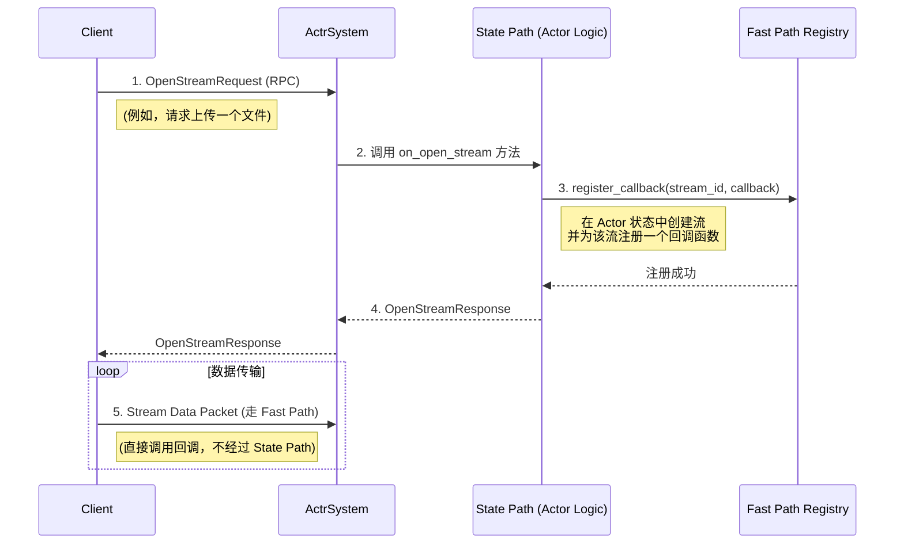

# 专题解析：快车道 (Fast Path) 内核

> **⚠️ 实现状态**：
> - ✅ **已实现**：DataStream 路由、WebRtcCoordinator 多 PayloadType 接收、DataStreamRegistry 回调机制
> - ⚠️ **开发中**：StreamRegistry/TrackRegistry（统一注册表）
> - 📋 **规划中**：高级 Fast Path 特性
>
> 本文档描述 Fast Path 的设计理念，部分实现细节可能与当前代码存在差异。

为了在处理海量数据（如音视频、文件传输）时达到最高的性能，仅仅依赖于 Actor 的邮箱模型是不够的。每一次消息的入队和出队都伴随着上下文切换和同步开销。

为此，框架设计了 **`Fast Path` (快车道)**，它是一条并行的执行路径，允许数据块绕过核心调度逻辑，被直接派发给预先注册好的处理回调，以实现极致性能。

本篇文档将彻底揭示 `Fast Path` 的工作内幕，解答以下核心问题：

1.  回调函数是如何被动态注册和注销的？
2.  `Fast Path` 与 `State Path` 之间是如何安全地协作的？
3.  在 `Fast Path` 中与 `Actor` 状态交互的几种模式及其权衡。

### 1. 快车道的基石：并发安全的回调注册表

`Fast Path` 的核心是一个全局的、并发安全的回调注册表 (`Fast Path Registry`)。它本质上是一个哈希表，`key` 是流的唯一ID (`stream_id`)，`value` 则是对应的处理回调函数。

```rust
// 注册表的简化定义
struct FastPathRegistry {
    // 使用 DashMap 提供细粒度锁，实现高并发读写
    callbacks: DashMap<StreamId, Box<dyn Fn(Bytes) + Send + Sync>>,
}
```

*   **并发安全**: 选用 `DashMap` 或类似的并发哈希表是至关重要的，因为它允许多个 `Input Handler` 线程在不产生锁竞争的情况下，同时查找和调用不同的回调。
*   **动态性**: 注册表的内容是动态变化的。当一个新的媒体流或数据流建立时，一个回调会被注册；当流结束时，它必须被注销以防内存泄漏。

### 2. 回调的注册：`State Path` 与 `Fast Path` 的握手

回调的注册和注销操作，本身是需要严格保证原子性和顺序性的**状态变更**。因此，这些操作**必须**在 `State Path` 上完成。

这清晰地展示了两条路径的协作关系：**`State Path` 负责建立和拆除 `Fast Path` 的“轨道”，而 `Fast Path` 则负责在建好的轨道上高速“行车”**。


*图 1: 回调函数的注册流程*

1.  客户端通过一次标准的 RPC 调用（走 `State Path`）请求开启一个新的数据流。
2.  `Actor` 的业务逻辑被调用。它负责生成一个唯一的 `stream_id`，创建一个处理该流的回调函数（通常是一个闭包），并将 `(stream_id, callback)` 键值对注册到 `Fast Path Registry` 中。
3.  一旦注册完成，任何后续到达的、标记为此 `stream_id` 的数据包，都将由 `Input Handler` 直接派发给这个回调函数，全程在 `Fast Path` 上执行。

### 3. Fast Path 与 State Path 的状态交互模式

`Fast Path` 的回调是在 I/O 线程上**并发执行**的，而 `Actor` 的核心状态由 `State Path` **串行化**保护。如何让这两者安全、高效地交互，是 `Fast Path` 设计的核心问题。

框架允许开发者根据场景的复杂性、性能要求和安全考量来选择最合适的方案。

#### **模式 A：直接状态访问与手动锁 (适用于简单、低竞争场景)**

最直接的方式，是在 `Fast Path` 回调中捕获一个 `Arc<Mutex<ActorState>>`，并手动进行加锁。

```rust
// 【强警告】以下模式仅供理解原理，非推荐实践。除非你完全理解并设计了充分的防护（线程安全、死锁规避、幂等与一致性、恢复与重放、监控告警），否则不要在 Fast Path 中修改核心状态。
let state_clone = Arc::clone(&self.actor_state);
let callback = move |data: Bytes| {
    // 在并发回调中获取锁
    let mut state = state_clone.lock().unwrap();
    // 直接修改状态
    state.process_chunk(data);
};
```

*   **优点**:
    *   **直接**: 对于非常简单的、几乎没有竞争的场景，代码路径最短。
*   **缺点**:
    *   **高风险**: 开发者必须自行处理锁的粒度、死锁风险、以及锁竞争带来的性能问题。这非常容易出错。
    *   **性能瓶颈**: 如果锁的竞争变得激烈，`Fast Path` 的性能优势将因锁等待而丧失殆尽。
    *   **违反直觉**: 这破坏了“所有状态变更都由 State Path 发起”的核心心智模型。

**使用原则**: 仅当且仅当，你确信某个状态的访问冲突概率极低，且其逻辑极其简单时，可以考虑此模式。

#### **模式 B：并发句柄与消息返回 (推荐的最佳实践)**

这是一种更安全、更高级、也更符合框架设计哲学的模式。它通过一个“并发句柄”将线程安全的复杂性封装起来。

这个模式的详细实现和生命周期管理，请参阅其权威文档：
> **核心参考：[《3.10 快车道揭秘 — 生命周期与并发安全》](./3.10-fast-path-lifecycle.zh.md)**

**核心思想**:
1.  **注册时**: `State Path` 在注册回调时，不传递 `Actor` 自身，而是创建一个包含了 `ActrId` 和 `Context` 的轻量级**并发句柄 (`ConcurrentHandle`)**。
2.  **回调中**: `Fast Path` 的回调函数捕获的是这个句柄。
3.  **执行时**: 回调调用句柄的方法。句柄的方法内部，将所有需要修改核心状态的操作，都封装成一个向 `State Path` **发送消息 (`tell`)** 的动作。

```rust
// 【推荐】的回调实现方式
let handle = self.create_concurrent_handle(ctx); // 创建句柄
let callback = move |data: Bytes| {
    let handle = handle.clone();
    tokio::spawn(async move {
        // 调用句柄的方法，句柄内部会通过 tell 发送消息回 State Path
        handle.on_chunk_processed(data).await;
    });
};
```

*   **优点**:
    *   **绝对安全**: 所有的状态变更都被重新路由回了 `State Path`，由 `Scheduler` 进行串行化处理，完全杜绝了数据竞争。
    *   **逻辑清晰**: `Fast Path` 只负责无状态的数据处理，`State Path` 只负责状态变更，职责单一。
    *   **高性能**: 避免了在 `Fast Path` 中引入重量级的锁。
*   **缺点**:
    *   **微小开销**: 存在一次消息的创建和入队开销。但在绝大多数场景下，这点开销远小于锁竞争带来的损失。

**使用原则**: 对于任何有状态交互的 `Fast Path` 场景，这都应该是你的**首选和默认模式**。

### 4. 总结

`Fast Path` 是框架实现极致性能的关键。它与 `State Path` 形成了一套权责清晰、高效协作的“双路径”处理模型。

*   `State Path` 负责流的**建立、拆除和状态管理**。
*   `Fast Path` 负责流建立后的**高性能数据传输**。

通过将这两者清晰地分离，框架既保证了核心状态的并发安全，又为海量数据的处理提供了不打折扣的性能。理解并遵循 `Fast Path` 的设计原则，是构建高性能 `Actor` 应用的必要条件。