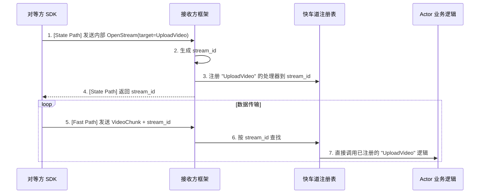

# **专题解析：自动流绑定 — 优雅的快车道API**

> **⚠️ 实现状态说明**：当前版本中，**接收方流 (Server Streaming)** 功能已完全实现。**对等方流**和**双向流**功能尚在开发中。
> 
> **📝 术语说明**：WebRTC 本质上是对等网络，不严格区分"接收方"/"对等方"。这里的术语是从具体业务角色角度描述的：流的**发起者**vs**接收者**，但底层都是建立在 ActrNode/Peer 基础上的对等连接。

### **设计权衡：透明性 vs. 便利性**

在核心架构中，我们强调了“状态路径”与“快车道”的明确分离。然而，在许多流式场景下，开发者总是需要重复编写“发送一个 `OpenStream` 控制信令 -> 注册回调 -> 开始传输数据”的样板代码。

为了提升开发者体验，框架在严格的底层机制之上，提供了一套更高级、更便捷的“自动流绑定”功能。

需要强调的是，此功能并非对双路径核心原则的破坏，而是其上层的一个便利封装。它将 `3.8 快车道内核` 中描述的手动模式自动化，旨在为最常见的用例提供零配置的、符合直觉的默认行为，让开发者能更专注于业务逻辑本身。

重要约束：
- 自动流绑定不会创建新的 Lane 实例。根据统一约束，Signal/Reliable/Latency-First 为 0 或 1 条（Option），MediaTrack 可多条（Vec）。自动绑定在既有 Lane 上进行多路复用（logical stream_id），不改变 Lane 条数。
- 首次调用触发的内部握手经由“状态路径”，并在信令/ACL 约束内执行；不会在 DataChannel 建立前走数据面。
- 资源/会话由框架分配 stream_id 并管理生命周期，应用可通过注解微调默认行为（QoS/优先级/限速等）。

本篇文档将深入探讨这一高级特性。

### 1. 设计哲学：“约定优于配置”

本特性的核心设计哲学是“**约定优于配置 (Convention over Configuration)**”。我们旨在为最常见的用例提供零配置的、符合直觉的默认行为，同时为罕见的例外情况提供明确的配置选项。

*   **约定 (Convention)**：默认情况下，任何在 `.proto` 文件中使用了 `stream` 关键字的 RPC 方法，都将被框架**自动视为一个快车道流**，并为其自动化生命周期管理。
*   **配置 (Configuration)**：如果开发者确实需要一个流式 RPC 保证严格的顺序（即通过“状态路径”处理），他们可以通过一个 Protobuf 自定义选项来**显式地覆盖**这个默认行为。

### 2. 机制详解

#### 2.1. 约定：`stream` 关键字作为默认触发器

在最常见的情况下，开发者只需像定义普通 gRPC 流式服务一样定义 `.proto` 文件即可。

**`proto/media_service.proto`**
```protobuf
syntax = "proto2";
package media;

message VideoChunk { optional bytes data = 1; }
message StreamingStatus { optional bool success = 1; }

service MediaStreamer {
  // 约定：因为入参是 stream 类型，框架将自动将其绑定到快车道。
  rpc UploadVideo(stream VideoChunk) returns (StreamingStatus);
}
```
当对等方调用 `UploadVideo` 时，开发者无需再手动编写 `OpenStream` 之类的 RPC。框架会自动识别这是一个需要自动绑定的快车道流。

#### 2.2. 配置：`force_state_path` 选项作为例外

对于需要走状态路径的特殊流（例如，一个需要与核心状态进行原子性交互的命令流），我们可以使用自定义选项来覆盖默认约定。

**第一步：定义选项 (`proto/framework_options.proto`)**
```protobuf
syntax = "proto2";
package actor_framework.options;
import "google/protobuf/descriptor.proto";

extend google.protobuf.MethodOptions {
  // 当设为 true 时，即使是 stream RPC 也强制其走 State Path
  optional bool force_state_path = 50001;
}
```

**第二步：在业务 proto 中使用**
```protobuf
syntax = "proto2";
package admin;
import "framework_options.proto";

message AdminCommand { optional string command = 1; }
message CommandResult { optional string result = 1; }

service AdminService {
  // 配置：这是一个流，但我们强制它走状态路径以保证严格顺序
  rpc ExecuteCommandStream(stream AdminCommand) returns (CommandResult) {
    option (actor_framework.options.force_state_path) = true;
  }
}
```

#### 2.3. 框架的自动化工作流

当一个被约定为自动绑定的流（如 `UploadVideo`）第一次被调用时，框架在幕后会自动执行以下流程：



1.  **拦截与握手**: 对等方 SDK 拦截第一次调用，自动通过“状态路径”发送一个内部的、对用户透明的 `OpenStream` 信令。此信令中包含了它真正想要调用的目标方法名。
2.  **自动注册**: 接收方框架接收到这个内部信令后，自动生成一个 `stream_id`，并从处理器注册表中找到目标方法的处理器，然后将 `stream_id` 和该处理器注册到"快车道注册表"中。
3.  **开始传输**: 接收方将 `stream_id` 返回给对等方。之后，对等方SDK 就开始通过“快车道”发送所有实际的数据块，每个数据块都携带着这个 `stream_id`，从而被正确地直接派发到业务逻辑。

### 3. 开发者体验与收益

通过“自动流绑定”，开发者的心智负担被极大减轻：

*   **之前 (手动模式)**: 开发者需要思考并实现 `OpenStream` -> `SendData` -> `CloseStream` 的完整状态机。
*   **现在 (自动模式)**: 开发者只需在 `Actor` 中实现 `UploadVideo` 的流处理逻辑即可，仿佛在写一个普通的 RPC 方法。流的创建、管理和销毁完全由框架负责。

这个机制是实现 `2.1 媒体源与轨道` 中 `client.publish(track)` 这种高级声明式 API 的关键基石。

### 4. 应用实例：三种流模式的实现剖析

“自动流绑定”机制可以极大地简化所有 gRPC 流模式的开发。下面我们分别探讨三种典型流模式的实现，由简到繁。

#### 4.1. 模式一：对等方流 (Client Streaming)

这是最简单的流模式，典型场景是**文件上传**。对等方持续发送数据流，接收方接收处理，并在流结束后返回一个**单一的响应**。

*   **.proto 定义**:
    ```protobuf
    service FileService {
      rpc UploadFile(stream FileChunk) returns (UploadStatus);
    }
    ```
*   **接收方 Actor 实现**:
    **注意：对等方流功能当前尚未实现**。代码生成器为此类方法生成占位符实现：
    # 专题解析：自动流绑定

### 1. 设计哲学：“约定优于配置”

本特性的核心设计哲学是“**约定优于配置 (Convention over Configuration)**”。

*   **约定 (Convention)**：默认情况下，任何在 `.proto` 文件中使用了 `stream` 关键字的 RPC 方法，都将被框架**自动视为一个快车道流**，并为其自动化生命周期管理。
*   **配置 (Configuration)**：如果开发者需要一个流式 RPC 保证严格的顺序（即通过“状态路径”处理），他们可以通过一个 Protobuf 自定义选项来**显式地覆盖**这个默认行为。

### 2. 机制详解

#### 2.1. 约定：`stream` 关键字作为默认触发器

开发者只需像定义普通 gRPC 流式服务一样定义 `.proto` 文件即可。

**`proto/media_service.proto`**
```protobuf
syntax = "proto2";
package media;

message VideoChunk { optional bytes data = 1; }
message StreamingStatus { optional bool success = 1; }

service MediaStreamer {
  // 约定：因为入参是 stream 类型，框架将自动将其绑定到快车道。
  rpc UploadVideo(stream VideoChunk) returns (StreamingStatus);
}
```
当对等方调用 `UploadVideo` 时，开发者无需再手动编写 `OpenStream` 之类的 RPC。框架会自动识别这是一个需要自动绑定的快车道流。

#### 2.2. 框架的自动化工作流

当一个被约定为自动绑定的流（如 `UploadVideo`）第一次被调用时，框架在幕后会自动执行以下流程：


1.  **拦截与握手**: 对等方 SDK 拦截第一次调用，自动通过“状态路径”发送一个内部的、对用户透明的 `OpenStream` 信令。
2.  **自动注册**: 接收方框架接收到这个内部信令后，自动生成一个 `stream_id`，并从处理器注册表中找到目标方法的处理器，然后将 `stream_id` 和该处理器注册到"快车道注册表"中。
3.  **开始传输**: 接收方将 `stream_id` 返回给对等方。之后，对等方 SDK 就开始通过“快车道”发送所有实际的数据块，每个数据块都携带着这个 `stream_id`，从而被正确地直接派发到业务逻辑。

### 3. 应用实例：流数据发送方 (Data Producer Streaming)

目前，**流数据发送方 (Data Producer Streaming)** 功能已完全实现。典型场景是**视频播放**或**日志订阅**：接收方发送请求，发送方返回数据流。

*   **.proto 定义**:
    ```protobuf
    service VideoService {
      rpc PlayVideo(PlayRequest) returns (stream VideoChunk);
    }
    ```
*   **发送方 Actor 实现**：
    这种实现需要创建一个内存通道 (`mpsc::channel`)。Actor 在一个独立的异步任务中将数据写入通道，然后将通道的“接收端”作为流返回给对等方。
    ```rust
    use tokio::sync::mpsc;
    use tokio_stream::wrappers::ReceiverStream;
    use std::time::Duration;

    #[async_trait]
    impl IVideoService for MyVideoActor {
        // 这里的 Self::PlayVideoStream 是由框架代码生成器自动生成的关联类型
        type PlayVideoStream = std::pin::Pin<Box<dyn futures_util::Stream<Item = actr_rtc_framework::error::ActorResult<VideoChunk>> + Send>>;

        async fn play_video(
            &self,
            request: PlayRequest,
            context: std::sync::Arc<actor_rtc_framework::context::Context>,
        ) -> actr_rtc_framework::error::ActorResult<Self::PlayVideoStream> {
            
            let (tx, rx) = mpsc::channel(128); // 1. 创建一个内存通道

            tokio::spawn(async move {
                // 2. 在一个新任务中，准备要发送的数据
                for i in 0..10 {
                    let chunk = VideoChunk { data: format!("chunk-{}", i).into_bytes() };
                    // 3. 将数据块发送到通道
                    if tx.send(Ok(chunk)).await.is_err() {
                        // 发送失败，说明对等方已经断开连接
                        break;
                    }
                    tokio::time::sleep(Duration::from_millis(100)).await; // 模拟耗时
                }
            });

            // 4. 将通道的接收端包装成流并返回
            let output_stream = ReceiverStream::new(rx);
            Ok(Box::pin(output_stream) as Self::PlayVideoStream)
        }
    }
    ```

### 4. 已规划的功能

对**对等方流 (Client Streaming)** 和**双向流 (Bi-directional Streaming)** 的支持已在规划中，将在未来的版本中提供。

### 5. 总结

“自动流绑定”是框架“开发者体验优先”设计哲学的重要体现。它通过“约定优于配置”的原则，将底层的快车道机制进行了自动化封装，使得开发者可以从繁琐的流生命周期管理中解放出来，更专注于业务功能的实现。

    
    **未来实现时的预期接口**：
    ```rust
    // TODO: 对等方流功能当前尚未实现。此为预期的 API 设计，将在未来版本中提供。
    async fn upload_file(
        &self,
        stream: impl futures_util::Stream<Item = FileChunk>,
        context: std::sync::Arc<actor_rtc_framework::context::Context>,
    ) -> actor_rtc_framework::error::ActorResult<UploadStatus> {
        // 处理流数据的逻辑
    }
    ```

#### 4.2. 模式二：接收方流 (Server Streaming)

典型场景是**视频播放**或**日志订阅**。对等方发送一个请求，接收方返回一个数据流。

*   **.proto 定义**:
    ```protobuf
    service VideoService {
      rpc PlayVideo(PlayRequest) returns (stream VideoChunk);
    }
    ```
*   **接收方 Actor 实现**:
    这种实现需要创建一个内存通道 (`mpsc::channel`)。Actor 在一个独立的异步任务中将数据写入通道，然后将通道的“接收端”作为流返回给对等方。
    ```rust
    use tokio::sync::mpsc;
    use tokio_stream::wrappers::ReceiverStream;
    use std::time::Duration;

    #[async_trait]
    impl IVideoService for MyVideoActor {
        // 这里的 Self::PlayVideoStream 是由框架代码生成器自动生成的关联类型
        type PlayVideoStream = std::pin::Pin<Box<dyn futures_util::Stream<Item = actor_rtc_framework::error::ActorResult<VideoChunk>> + Send>>;

        async fn play_video(
            &self,
            request: PlayRequest,
            context: std::sync::Arc<actor_rtc_framework::context::Context>,
        ) -> actor_rtc_framework::error::ActorResult<Self::PlayVideoStream> {
            
            let (tx, rx) = mpsc::channel(128); // 1. 创建一个内存通道

            tokio::spawn(async move {
                // 2. 在一个新任务中，准备要发送的数据
                for i in 0..10 {
                    let chunk = VideoChunk { data: format!("chunk-{}", i).into_bytes() };
                    // 3. 将数据块发送到通道
                    if tx.send(Ok(chunk)).await.is_err() {
                        // 发送失败，说明对等方已经断开连接
                        break;
                    }
                    tokio::time::sleep(Duration::from_millis(100)).await; // 模拟耗时
                }
            });

            // 4. 将通道的接收端包装成流并返回
            let output_stream = ReceiverStream::new(rx);
            Ok(Box::pin(output_stream) as Self::PlayVideoStream)
        }
    }
    ```

#### 4.3. 模式三：双向流 (Bi-directional Streaming)

这是最复杂的模式，对等方和接收方可以同时、独立地向对方发送数据流。这在需要实时交互的场景中很常见，比如一个需要接收 RTP 包、同时发送 RTCP 控制包的媒体服务。

*   **.proto 定义**:
    ```protobuf
    service MediaPlane {
      rpc HandleTrack(stream RtpPacket) returns (stream RtcpPacket);
    }
    ```
*   **接收方 Actor 实现**:
    它的实现是模式一和模式二的结合：既要处理一个输入流，又要创建一个输出流。
    ```rust
    use tokio::sync::mpsc;
    use tokio_stream::wrappers::ReceiverStream;

    #[async_trait]
    impl IMediaPlane for MyMediaActor {
        async fn handle_track(
            &self, 
            _request: RtpPacket,
            _context: std::sync::Arc<actor_rtc_framework::context::Context>,
        ) -> actor_rtc_framework::error::ActorResult<RtcpPacket> {
            // 双向流功能尚未实现
            Err(actor_rtc_framework::error::ActorError::Protocol(
                "Streaming method not yet implemented".to_string()
            ))
        }
    }
    ```

### 5. 总结

“自动流绑定”是框架“开发者体验优先”设计哲学的重要体现。它并没有发明新的底层技术，而是巧妙地运用“约定优于配置”的原则，将 `3.8` 和 `3.10` 中描述的底层快车道机制进行了自动化封装。

这使得开发者可以从繁琐的流生命周期管理中解放出来，更专注于业务功能的实现，从而在不损失性能的前提下，获得更优雅、更简洁的编程模型。
