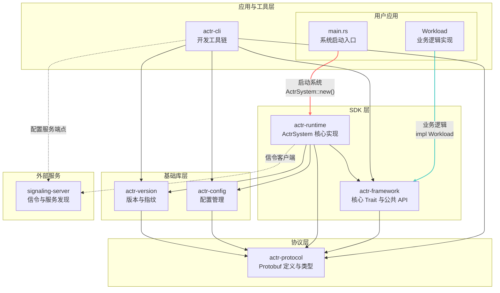
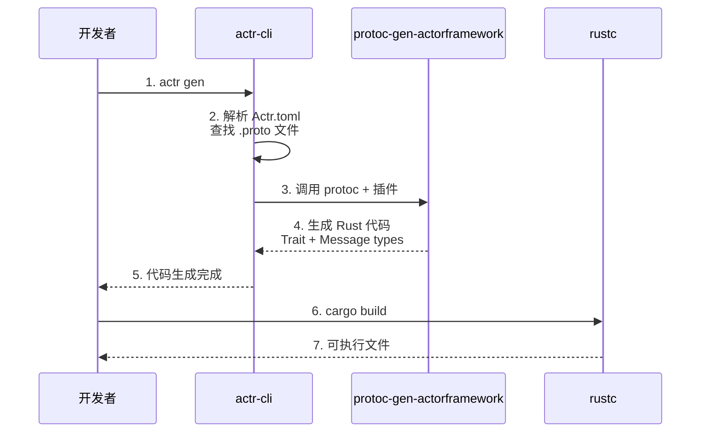
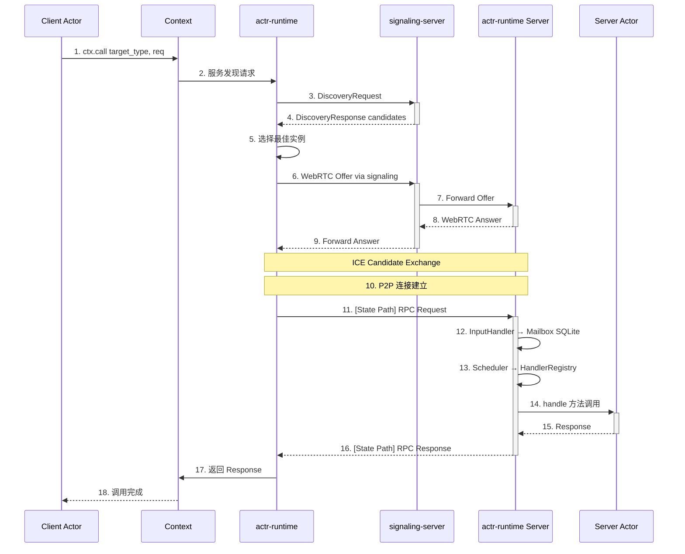
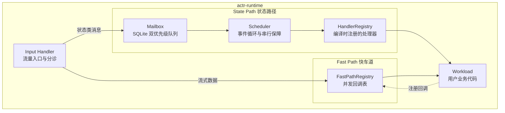
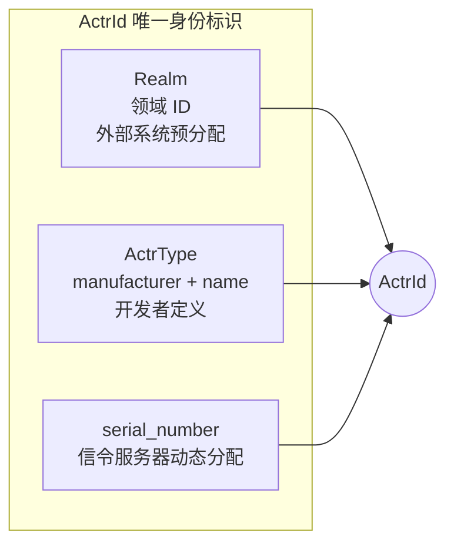

# 系统架构总览

## 1. 架构分层

actr 系统架构划分为四个清晰的层次，每个层次由职责单一的 Crate 组成。



### 依赖关系说明

**应用层的依赖分离**（关键设计）：

用户应用在逻辑上分为两部分，它们的依赖关系截然不同：

1. **main.rs（系统启动代码）**
   - 依赖 `actr-runtime`（红色线）
   - 职责：创建和启动 `ActrSystem`
   - 示例代码：
     ```rust
     use actr_runtime::ActrSystem;  // ← 依赖 runtime

     #[tokio::main]
     async fn main() {
         ActrSystem::new(config)?
             .attach(my_service)
             .start()
             .await
     }
     ```

2. **Workload（业务逻辑代码）**
   - 只依赖 `actr-framework`（青色线）
   - 职责：实现业务处理逻辑
   - 示例代码：
     ```rust
     use actr_framework::{Workload, Context};  // ← 只依赖 framework

     impl EchoServiceHandler for MyService {
         async fn echo(&self, req: EchoRequest, ctx: &Context)
             -> ActorResult<EchoResponse> {
             // 业务逻辑：完全基于 framework 的抽象
             Ok(EchoResponse { text: format!("Echo: {}", req.text) })
         }
     }
     ```

**这种设计的优势**：
- ✅ **业务逻辑完全解耦**：Workload 不需要知道 `ActrSystem` 的存在
- ✅ **可测试性强**：可以 mock `Context` 来测试 Workload，无需启动完整 runtime
- ✅ **符合依赖倒置原则**：runtime 实现 framework 的接口，业务逻辑只依赖接口
- ✅ **清晰的职责边界**：启动代码和业务逻辑分离

## 2. Crate 职责边界

### 2.1 协议层

| Crate             | 职责                                                                                                       | 依赖 |
| ----------------- | ---------------------------------------------------------------------------------------------------------- | ---- |
| **actr-protocol** | 定义所有 Protobuf 消息（`.proto`）和生成的 Rust 类型<br/>提供协议相关的基础工具（ActrId 解析、URI 处理等） | 无   |

### 2.2 基础库层

| Crate            | 职责                                             | 依赖          |
| ---------------- | ------------------------------------------------ | ------------- |
| **actr-version** | 服务指纹计算<br/>协议兼容性检查<br/>版本管理工具 | actr-protocol |
| **actr-config**  | 解析、验证和管理 `Actr.toml` 及 `actr.lock.toml` | actr-protocol |

### 2.3 SDK 层

| Crate              | 职责                                                                                                                                              | 依赖                                                              |
| ------------------ | ------------------------------------------------------------------------------------------------------------------------------------------------- | ----------------------------------------------------------------- |
| **actr-framework** | 定义核心接口：`Message`, `MessageHandler<M>`, `Workload`, `WorkloadRouting`, `Context`, `Lifecycle`<br/>不包含具体实现                            | actr-protocol                                                     |
| **actr-runtime**   | 实现 `ActrSystem` 核心逻辑<br/>包含 `Scheduler`, `Mailbox`, `HandlerRegistry`<br/>包含 `transport` 和 `mailbox` 子模块<br/>实现服务发现客户端逻辑 | actr-framework<br/>actr-protocol<br/>actr-config<br/>actr-version |

### 2.4 工具链

| Crate    | 职责                                                                                                                         | 依赖                                                              |
| -------- | ---------------------------------------------------------------------------------------------------------------------------- | ----------------------------------------------------------------- |
| **actr** | 项目管理：`init`, `install`, `gen`, `run`<br/>代码生成：调用 `protoc-gen-actorframework`<br/>依赖管理：生成 `actr.lock.toml` | actr-config<br/>actr-version<br/>actr-protocol<br/>actr-framework |

### 2.5 外部服务

| 服务                 | 职责                                                | 协议                          |
| -------------------- | --------------------------------------------------- | ----------------------------- |
| **signaling-server** | 服务注册与发现<br/>WebRTC 信令中继<br/>路由候选查询 | actr-protocol<br/>(WebSocket) |

## 3. 代码组织结构

- SystemBridge（系统能力桥，挂载于 Context）
  - 定义：标准通信接口，无平台实现绑定；应用注册驱动对接系统能力。
  - 约束：仅定义 ask/notify/subscribe/session/handle/monitor 通用通信模型；不直接暴露 OS 句柄。
  - 职责：为 Actor 提供通过 ctx.sys() 访问系统能力的统一入口。

当前 Cargo Workspace 的目录布局：

```
actr/
├── actr-protocol/          # 协议层
├── actr-version/           # 版本管理
├── actr-config/            # 配置管理
├── actr-framework/         # SDK 接口层
├── actr-runtime/           # SDK 运行时
│   ├── src/
│   │   ├── lib.rs
│   │   ├── actor_system.rs
│   │   ├── scheduler.rs
│   │   └── ...
│   ├── transport/          # 子模块：WebRTC 传输层
│   └── mailbox/            # 子模块：SQLite 邮箱
│   └── protoc-gen-actorframework/  # 代码生成插件
├── signaling-server/       # 信令服务
├── examples/               # 示例项目
└── docs/                   # 文档
```

## 4. 核心数据流

### 4.1 编译时：从契约到可执行代码



### 4.2 运行时：RPC 调用的完整生命周期



## 5. 双路径处理架构

框架在运行时将数据流明确划分为两条路径：



### State Path（状态路径）
- **用途**：处理需要可靠性、顺序性和原子性的控制类消息
- **实现**：基于 SQLite 的持久化双优先级队列
- **保证**：ACID 事务保障与故障恢复，整体为“至少一次”投递语义（需业务幂等）
- **调度**：串行执行，避免状态竞争

### Fast Path（快车道）
- **用途**：处理高吞吐量、低延迟的流式数据
- **实现**：并发安全的回调注册表（DashMap）
- Lane 实例约束：Signal/Reliable/Latency-First 采用 Option（0 或 1 条），MediaTrack 采用 Vec（可多条）
- **特点**：绕过 Mailbox，直接派发到预注册的回调
- **管理**：生命周期由 State Path 的控制信令管理

## 6. 容错边界

actr 采用明确的容错职责划分：

| 层次       | 职责方       | 处理内容                                                                   |
| ---------- | ------------ | -------------------------------------------------------------------------- |
| **网络层** | actr-runtime | WebRTC 连接断线重连<br/>信令服务器重连<br/>通过 `Lifecycle` 钩子通知 Actor |
| **业务层** | 开发者       | Actor 业务逻辑错误<br/>返回 `ActorError` 而非 panic<br/>状态恢复与补偿     |

**设计决策**：
- **不提供**内置的监督树（Supervisor）
- **不提供**自动重启策略（OneForOne/OneForAll）
- **由开发者**完全控制业务容错逻辑

## 7. 身份模型

框架的身份系统由三个核心概念组成：



**分配流程**：
1. **Realm**：开发者预先向外部系统申请，写入 `Actr.toml` 的 `[deployment]` 部分。
2. **ActrType**：开发者在 `Actr.toml` 和代码中定义（`manufacturer` + `name`）。
3. **serial_number**：Actor 启动时向 signaling-server 注册，由服务器动态分配。

**字符串表示**：`<manufacturer>:<name>@<serial_number>:<realm_id>`

示例：`acme:echo-service@1a2b3c:1001`

## 7. Lane QoS 概览（默认值）

- 以下为框架默认 QoS，满足大多数常规场景；如需特殊优化，可在未来版本开放可配置参数。
- Signal 与 Reliable 的关键区别除重传与超时外，还包括消息大小限制：Signal 严格限制单消息尺寸，Reliable 更宽松。

| Lane          | 有序 | 重传     | 包生命周期    | 单消息上限（Signal: 强制；其他: 建议） | 语义/用途                                            |
| ------------- | ---- | -------- | ------------- | -------------------------------------- | ---------------------------------------------------- |
| Signal        | 是   | 无限重传 | 无上限        | ≤ 256 B                                | 紧急/控制类消息，需严格可靠与快速到达                |
| Reliable      | 是   | 8 次     | 30 秒         | ≤ 64 KiB                               | 常规 RPC、业务事件、状态同步（有界可靠，控制尾延迟） |
| Latency-First | 否   | 4 次     | 100 ms        | ≤ 128 KiB（建议帧化/小块）             | 实时流式数据，低延迟优先，可少量丢包                 |
| MediaTrack    | 否   | 0 次     | 50 ms（示例） | N/A（由编解码器/帧决定）               | 原生音视频轨道，不经由 DataChannel                   |

说明：
- 推荐单消息上限是经验值，旨在减少分片与拥塞造成的尾延迟；并非硬性协议限制。
- Signal 的“小而急”特性要求应用将控制面消息保持精简；过大的消息请走 Reliable 或 Streaming。

## 8. 关键设计原则

### 8.1 契约驱动开发
- 以 `.proto` 文件为单一事实来源
- 通过代码生成保证类型安全
- 服务接口即文档

### 8.2 编译时优化
- 使用泛型 `<T: MessageHandler<M>>` 而非动态分发
- 编译时注册处理器到 `HandlerRegistry`
- 零成本抽象：消息分发无运行时查找开销

### 8.3 宏观 Actor 模型
- 每个进程是一个独立的 Actor（ActrNode）
- 进程内部并发由开发者自由组织
- 网络中可以有任意多个 Actor 进程

### 8.4 请求而非命令
- Actor 通过 `Context` 发出请求而非执行命令
- 所有副作用（I/O、定时器）由系统处理
- 业务逻辑保持纯粹，易于测试
