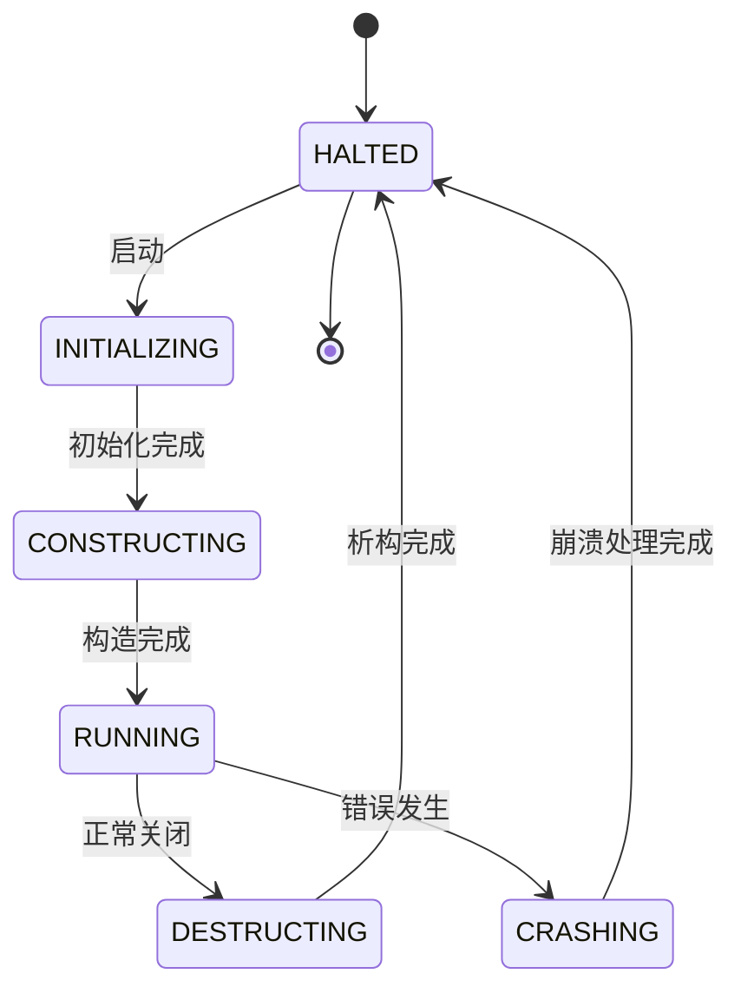

# actr-protocol：协议层

## 1. 职责定位

`actr-protocol` 是框架的协议基础层，定义了框架运行所需的标准化通信契约，并提供与这些协议紧密相关的无状态工具（AID 解析、URI 处理、错误类型）。

边界：
- 不包含任何业务逻辑
- 不包含运行时实现（调度器、异步模型等）
- 不定义上层框架的 Trait

约定：系统架构与基础设施层统一采用 Protobuf proto2 语法。

## 2. 协议文件结构

```
actr-protocol/proto/
├── webrtc.proto      # WebRTC 标准兼容的基础协商消息（package: webrtc）
├── actr.proto        # 框架核心业务对象（身份、ACL、服务规范、发现、路由、心跳）
└── signaling.proto   # 信令服务器交互协议（信封 + 多种消息流）
```

### 2.1 webrtc.proto（proto2，package: webrtc）

定义对 WebRTC SDP/ICE 的基本封装。

```protobuf
syntax = "proto2";
package webrtc;

message IceCandidate {
  required string candidate = 1;
  optional string sdp_mid = 2;
  optional uint32 sdp_mline_index = 3;
  optional string username_fragment = 4;
}

message SessionDescription {
  enum Type { OFFER = 0; ANSWER = 1; RENEGOTIATION_OFFER = 2; }
  required Type type = 1;
  required string sdp = 2;
}
```

### 2.2 actr.proto（proto2，package: actr）

核心业务对象与交互。

身份模型：
```protobuf
message Realm { required uint32 realm_id = 1; }
message ActrType { required string manufacturer = 1; required string name = 2; }
message ActrId { required Realm realm = 1; required uint64 serial_number = 2; required ActrType type = 3; }
```

服务规范：
```protobuf
message ServiceSpec {
  optional string description = 1;
  required string fingerprint = 2; // 所有 proto 语义指纹的确定性组合哈希（类似 Merkle root）
  repeated Protobuf protobufs = 3;
  optional int64 published_at = 4;  // 发布时间戳
  repeated string tags = 5;         // 标签（如 "latest", "stable"）
  message Protobuf {
    required string uri = 1;
    required string content = 2;
    required string fingerprint = 3; // 使用 proto-sign 计算的语义指纹
  }
}
```

**服务指纹计算层次**（严格遵循 [actr-version](https://github.com/actor-rtc/actr-version) 和 [proto-sign](https://github.com/actor-rtc/proto-sign) 定义）：

- **Level 1 - 单文件语义指纹** (`Protobuf.fingerprint`):
  - 使用 `proto-sign` 库计算，忽略格式、注释、字段顺序等非语义差异
  - 格式: `semantic:{proto-sign-hash}`
  - 示例: `semantic:a1b2c3d4...`

- **Level 2 - 服务级组合指纹** (`ServiceSpec.fingerprint`):
  - **计算步骤**：
    1. 对每个 proto 文件计算语义指纹（使用 proto-sign）
    2. 将所有文件的语义指纹按文件名排序后组合（格式：`filename:fingerprint\n...`）
    3. 对组合结果计算 SHA256 哈希
  - **实现方式**：基于语义指纹的确定性组合哈希
  - **概念类比**：类似 Merkle Tree 的思想（按路径排序、递归组合、最终哈希），但并非使用实际的 Merkle Tree 数据结构
  - 格式: `service_semantic:{sha256-hash}`
  - 示例: `service_semantic:ef567890...`

Actor 状态枚举：
```protobuf
// Actor 生命周期状态
enum LifecycleState {
  HALTED = 0;        // 已停止
  INITIALIZING = 1;  // 初始化中
  CONSTRUCTING = 2;  // 构造中
  RUNNING = 3;       // 运行中
  DESTRUCTING = 4;   // 析构中
  CRASHING = 5;      // 崩溃中
}

// 服务可用性状态
enum ServiceAvailabilityState {
  FULL = 0;         // 满载能力
  DEGRADED = 1;     // 降级服务
  OVERLOADED = 2;   // 过载
  UNAVAILABLE = 3;  // 不可用
}

// 服务依赖健康状态
enum ServiceDependencyState {
  HEALTHY = 0;  // 健康
  WARNING = 1;  // 警告
  BROKEN = 2;   // 损坏
}
```

**生命周期状态转移图**：


访问控制（按序匹配，先命中先用）：
```protobuf
message AclRule {
  message Principal { optional Realm realm = 1; optional ActrType actr_type = 2; }
  repeated Principal principals = 1;
  enum Permission { DENY = 0; ALLOW = 1; }
  required Permission permission = 2;
}
message Acl { repeated AclRule rules = 1; }
```

注册与凭证：
```protobuf
message RegisterRequest { required ActrType actr_type = 1; required Realm realm = 2; optional ServiceSpec service_spec = 3; optional Acl acl = 4; }
message AIdCredential { required bytes encrypted_token = 1; required uint32 token_key_id = 2; }
message RegisterResponse {
  message RegisterOk {
    required ActrId actr_id = 1;
    required AIdCredential credential = 2;
    optional bytes psk = 3;
    optional google.protobuf.Timestamp credential_expires_at = 4;
    required uint32 heartbeat_interval_secs = 5; // 连接保活；心跳可带轻量指标（如 backlog/reserve），缺省则复用上次/默认值
  }
  oneof result { RegisterOk success = 1; ErrorResponse error = 2; }
}
```

心跳、发现与路由（节选）：
```protobuf
message Ping {
  required ServiceAvailabilityState availability = 1; // 运行态：Healthy/Degraded/Unavailable
  required float power_reserve = 2; // 0.0–1.0，可用算力/资源预留度（1.0=空闲充足，0.0=无余量）
  required float mailbox_backlog = 3; // 0.0–1.0，标准化堆积度（backlog/capacity）；未知时可缺省或用 -1.0 作为 sentinel
}
message RouteCandidatesRequest {
  message NodeSelectionCriteria {
    enum NodeRankingFactor { MAXIMUM_POWER_RESERVE = 0; MINIMUM_MAILBOX_BACKLOG = 1; BEST_COMPATIBILITY = 2; LOWEST_LATENCY = 3; NEAREST = 4; CLIENT_AFFINITY = 5; }
    required uint32 candidate_count = 1;
    repeated NodeRankingFactor ranking_factors = 2;
    optional ServiceDependencyState minimal_dependency_requirement = 3;
    optional ServiceAvailabilityState minimal_health_requirement = 4;
  }
  required ActrType target_type = 1; optional NodeSelectionCriteria criteria = 2;
}
message RouteCandidatesResponse { message RouteCandidatesOk { repeated ActrId candidates = 1; } oneof result { RouteCandidatesOk success = 1; ErrorResponse error = 2; } }
message DiscoveryRequest { optional string manufacturer = 1; optional uint32 limit = 2 [default = 64]; }
message DiscoveryResponse {
  message TypeEntry { required ActrType actr_type = 1; optional string description = 2; required string service_fingerprint = 3; optional int64 published_at = 4; repeated string tags = 5; }
  message DiscoveryOk { repeated TypeEntry entries = 1; }
  oneof result { DiscoveryOk success = 1; ErrorResponse error = 2; }
}
```

### 2.3 signaling.proto（proto2，package: signaling）

统一的信令信封和四类消息流：

```protobuf
message SignalingEnvelope {
  required uint32 envelope_version = 1;
  required string envelope_id = 2;
  optional string reply_for = 3;
  required google.protobuf.Timestamp timestamp = 4;
  oneof flow {
    PeerToSignaling peer_to_server = 10;       // 未认证：注册
    ActrToSignaling actr_to_server = 11;       // 已认证：注销/心跳/更新凭证/发现/路由/订阅
    SignalingToActr server_to_actr = 12;       // 响应/推送
    ActrRelay actr_relay = 13;                 // 中继（WebRTC 信令）
    actr.ErrorResponse envelope_error = 14;    // 信封级错误
  }
}

message PeerToSignaling { oneof payload { actr.RegisterRequest register_request = 1; } }
message ActrToSignaling {
  required actr.ActrId source = 1; required actr.AIdCredential credential = 2;
  oneof payload {
    actr.UnregisterRequest unregister_request = 3;
    actr.Ping ping = 4;
    actr.CredentialUpdateRequest credential_update_request = 5;
    actr.DiscoveryRequest discovery_request = 10;
    actr.RouteCandidatesRequest route_candidates_request = 11;
    actr.SubscribeActrUpRequest subscribe_actr_up_request = 20;
    actr.UnsubscribeActrUpRequest unsubscribe_actr_up_request = 21;
    actr.ErrorResponse error = 30;
  }
}
message SignalingToActr {
  required actr.ActrId target = 1;
  oneof payload {
    actr.RegisterResponse register_response = 2;
    actr.UnregisterResponse unregister_response = 3;
    actr.Pong pong = 4;
    actr.DiscoveryResponse discovery_response = 10;
    actr.RouteCandidatesResponse route_candidates_response = 11;
    actr.SubscribeActrUpResponse subscribe_actr_up_response = 20;
    actr.UnsubscribeActrUpResponse unsubscribe_actr_up_response = 21;
    actr.ActrUpEvent actr_up_event = 22;
    actr.ErrorResponse error = 30;
  }
}
message ActrRelay {
  required actr.ActrId source = 1; required actr.AIdCredential credential = 2; required actr.ActrId target = 3;
  oneof payload { webrtc.IceCandidate ice_candidate = 10; webrtc.SessionDescription session_description = 11; }
}
```

## 3. 核心工具与扩展

- ActrId 字符串表示（`actor_ext.rs`）
  - 格式：`<manufacturer>:<name>@<serial_number (16 进制)>:<realm_id>`
  - 例如：`acme:echo-service@1a2b3c:1001`

- URI 解析（`uri.rs`）
  - 地址抽象：以 ActrType 为主，必要时结合 realm、fingerprint。

- 错误类型（`error.rs`）
  - `ProtocolError::Aid(AidError)`、`ProtocolError::Uri(ActrUriError)`、`Serialization(String)`、`Deserialization(String)`

注意：`prost-build` 以 proto2 生成代码，核心身份类型（`ActrId`、`ActrType`、`Realm`）带有 serde 派生，方便序列化。

## 4. 模块结构

```
actr-protocol/
├── proto/
│   ├── webrtc.proto
│   ├── actr.proto
│   └── signaling.proto
├── src/
│   ├── lib.rs          # 生成代码统一导出（generated::{actr,signaling,webrtc}::*）
│   ├── actor_ext.rs    # ActrId 扩展（字符串格式/解析）
│   ├── uri.rs          # URI 解析与构建
│   └── error.rs        # 协议层错误
├── build.rs            # 使用 prost-build (proto2)
└── Cargo.toml
```

## 5. 示例代码

ActrId 构造（Rust）：
```rust
use actr_protocol::{ActrId, ActrType, Realm};
let id = ActrId { realm: Some(Realm { realm_id: 1001 }), serial_number: 0x1a2b3c, r#type: Some(ActrType { manufacturer: "acme".into(), name: "echo-service".into() }) };
assert_eq!(id.to_string_repr(), "acme:echo-service@1a2b3c:1001");
```

服务发现（按 manufacturer 聚合类型）：
```protobuf
message DiscoveryRequest { optional string manufacturer = 1; optional uint32 limit = 2 [default = 64]; }
message DiscoveryResponse { oneof result { message DiscoveryOk { repeated TypeEntry entries = 1; } success = 1; ErrorResponse error = 2; } }
```

## 6. 设计原则

- 单一职责：仅定义协议与基础工具
- 协议稳定性：以 `.proto` 为契约，版本与指纹管理由上层配合完成
- 向后兼容：使用 proto2 的 required/optional 及字段编号保证演进的可控性
