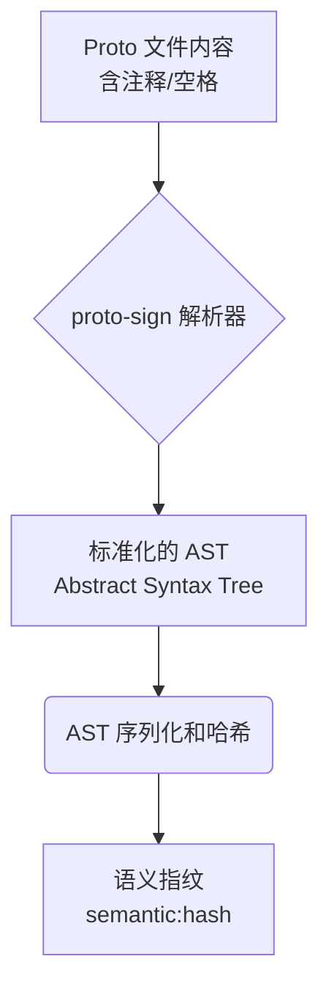
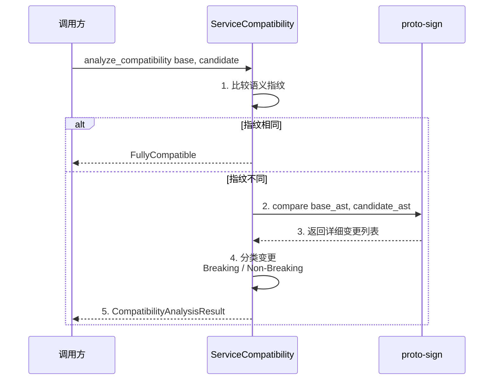

# actr-version：版本与兼容性管理

## 1. 职责定位

`actr-version` 是基于语义分析的协议兼容性检查库，通过深度比较 Protobuf 契约的语义变更来判断服务间的兼容性。

**核心职责**：
- 计算基于协议语义的服务指纹
- 提供服务契约的深度兼容性分析
- 生成详细的变更报告

**边界**：
- 无状态、无网络依赖的纯计算库
- 不处理运行时协商逻辑
- 不管理锁文件（由 `actr-config` 负责）

## 2. 语义指纹系统

### 2.1 为什么需要语义指纹

传统的文件哈希（如 SHA256）会因为格式化、注释、空格等非语义变更而产生不同的指纹，导致不必要的版本冲突。

**语义指纹**只关注协议的实际语义（消息结构、字段编号、类型等），忽略格式化细节。

### 2.2 计算流程



**步骤**：
1. **解析**：使用 `proto-sign` 将 `.proto` 文件解析为抽象语法树（AST）
2. **标准化**：移除所有与语义无关的信息（注释、空行、空格）
3. **哈希**：对标准化的 AST 进行确定性序列化和哈希计算

**示例**：
```rust
use actr_version::fingerprint::calculate_service_fingerprint;

let proto_content = r#"
    syntax = "proto2";

    // 这是一个注释，不影响语义
    message EchoRequest {
        string text = 1;
    }
"#;

let fingerprint = calculate_service_fingerprint(proto_content)?;
// fingerprint: "semantic:a1b2c3d4..."
```

### 2.3 语义指纹的优势

| 场景         | 文件哈希   | 语义指纹   |
| ------------ | ---------- | ---------- |
| 添加注释     | ❌ 指纹改变 | ✅ 指纹不变 |
| 格式化代码   | ❌ 指纹改变 | ✅ 指纹不变 |
| 调整空行     | ❌ 指纹改变 | ✅ 指纹不变 |
| 添加字段     | ✅ 指纹改变 | ✅ 指纹改变 |
| 修改字段类型 | ✅ 指纹改变 | ✅ 指纹改变 |

## 3. 兼容性检查引擎

### 3.1 检查流程



### 3.2 兼容性级别

| 级别                 | 含义                   | 示例                        |
| -------------------- | ---------------------- | --------------------------- |
| `FullyCompatible`    | 完全兼容，语义指纹相同 | 仅修改注释                  |
| `BackwardCompatible` | 向后兼容，可安全升级   | 添加新字段（使用 optional） |
| `Breaking`           | 破坏性变更，不兼容     | 删除字段、修改字段类型      |

### 3.3 变更分类

**破坏性变更**（导致 `Breaking`）：
- 删除字段
- 修改字段类型（如 `string` → `int32`）
- 修改字段编号
- 删除 RPC 方法
- 修改方法签名

**向后兼容变更**（导致 `BackwardCompatible`）：
- 添加 `optional` 字段
- 添加新的 RPC 方法
- 添加新的消息类型

### 3.4 使用示例

```rust
use actr_version::compatibility::ServiceCompatibility;
use actr_protocol::ServiceSpec;

let base_spec = ServiceSpec {
    description: Some("EchoService".to_string()),
    fingerprint: "service_semantic:abc123...".to_string(),
    published_at: Some(1704384000),
    tags: vec!["stable".to_string()],
    protobufs: vec![],
};

let candidate_spec = ServiceSpec {
    description: Some("EchoService v2".to_string()),
    fingerprint: "service_semantic:def456...".to_string(),
    published_at: Some(1704470400),
    tags: vec!["latest".to_string()],
    protobufs: vec![],
};

let result = ServiceCompatibility::analyze_compatibility(
    &base_spec,
    &candidate_spec
)?;

match result.level {
    CompatibilityLevel::FullyCompatible => {
        println!("完全兼容");
    }
    CompatibilityLevel::BackwardCompatible => {
        println!("向后兼容，变更如下：");
        for change in &result.changes {
            println!("  - {}", change.description);
        }
    }
    CompatibilityLevel::Breaking => {
        println!("破坏性变更，不可兼容：");
        for change in &result.breaking_changes {
            println!("  - {}", change.description);
        }
    }
}
```

### 3.3 语义化版本（SemVer）与兼容性映射

组合服务版本（service_version）
- 目的：提供一个对外展示与 Fast Path 直觉化的字符串表示。
- 生成：按 package 名称排序，将 {name, version} 进行规范化编码后派生出稳定字符串（可为 SemVer 风格的汇总或固定算法摘要）。
- 使用：
  - 完全一致 => 直接判定兼容（跳过逐包检查）。
  - 不一致 => 必须逐包分析，按 BackwardCompatible/Breaking 判定。
- 注意：兼容性与协商的最终依据仍然是 package 级别的版本/指纹，service_version 只是优化路径与展示字段。

- 版本单位：以 package 为最小单位维护版本号，服务版本为各 package 版本的聚合视图。
- 兼容性级别与版本策略：
  - ExactMatch（指纹完全一致）：可不变更版本；实现细节变更（非协议）可做 patch。
  - BackwardCompatible（向后兼容）：minor 版本递增（添加可选字段/新方法，旧客户端可忽略）。
  - Breaking（破坏性）：major 版本递增（删除/重命名/改类型/改编号/签名变更）。
- 运行时策略建议：
  - 客户端优先 ExactMatch；若失败按策略接受 BackwardCompatible；拒绝 Breaking。
  - 服务器侧集中缓存兼容性分析结果，配合策略标志（allow_backward=true/false）。

## 4. 与其他模块的协作

### 4.1 与 actr-cli 的协作

`actr install` 命令使用 `actr-version` 进行依赖兼容性检查：

```rust

use actr_version::compatibility::ServiceCompatibility;

// 1. 从信令服务器获取候选服务
let candidates = signaling_client.discover(target_type).await?;

// 2. 检查每个候选的兼容性
for candidate in candidates {
    let compatibility = ServiceCompatibility::analyze_compatibility(
        &required_spec,
        &candidate.service_spec
    )?;

    if compatibility.is_compatible() {
        // 3. 选择兼容的候选
        selected_candidates.push(candidate);
    }
}
```

### 4.2 与 actr-runtime 的协作

运行时的兼容性协商应当集中在信令服务器侧进行，`actr-runtime` 只做快速的“指纹精确匹配”尝试，找不到时委托服务器执行向后兼容性筛选与缓存。

推荐流程：

```rust
// actr-runtime/src/service_discovery.rs

// 1. 首先尝试精确指纹匹配（快速路径）
if let Some(exact) = signaling_client
   .discover_exact(target_type, required_fingerprint)
   .await? {
   return Ok(select_best_instance(&exact)?);
}

// 2. 无精确匹配则请求信令服务器执行“向后兼容”协商（集中计算 + 全局缓存）
let compatible = signaling_client
   .discover_compatible(target_type, required_fingerprint)
   .await?; // 服务器已基于 actr-version 进行检查并缓存

// 3. 在客户端仅进行版本/负载/可用性排序与选择
let target = select_best_instance(&compatible)?;
Ok(target)
```

说明：
- 客户端不再对候选逐一调用 `ServiceCompatibility::analyze_compatibility`；避免在大规模重启/部署时引起“惊群效应”。
- 服务器端集中计算可结合全局缓存与请求合并（coalescing），并复用相同组合的历史结论。

## 4.3 与 proto-regulate/CLI 的协作与约束

- 语义指纹的计算单位是 package 而非单个文件。必须先通过 `proto-regulate::merge_by_package` 将同一 package 的多文件合并并规范化；再对合并结果计算 package 指纹。
- 服务级指纹的推荐组合规则：
  - 令 P 为所有 package 指纹集合；对 P 按 package 名称字母序排序，串联后做 Hash，得到 service_fingerprint。
  - 可选：在组合中加入 `MERGE_ALGORITHM_VERSION` 作为域分隔符以提升可追溯性。
- 兼容性判断以 package 粒度进行；文件拆分/重命名不应产生任何兼容性变化或服务指纹变化。

## 5. 模块结构

```
actr-version/
├── src/
│   ├── lib.rs              # Crate 入口
│   ├── fingerprint.rs      # 语义指纹计算
│   ├── compatibility.rs    # 兼容性分析引擎
│   └── types.rs            # 核心类型定义
├── Cargo.toml
└── README.md
```

## 6. 核心类型定义

```rust
// types.rs

/// 兼容性分析结果
pub struct CompatibilityAnalysisResult {
    /// 兼容性级别
    pub level: CompatibilityLevel,
    /// 所有变更列表
    pub changes: Vec<ProtocolChange>,
    /// 破坏性变更列表
    pub breaking_changes: Vec<ProtocolChange>,
}

/// 兼容性级别
pub enum CompatibilityLevel {
    FullyCompatible,      // 完全兼容
    BackwardCompatible,   // 向后兼容
    Breaking,             // 破坏性变更
}

/// 协议变更
pub struct ProtocolChange {
    /// 变更类型
    pub change_type: ChangeType,
    /// 变更描述
    pub description: String,
    /// 受影响的字段/方法路径
    pub affected_path: String,
}

/// 变更类型
pub enum ChangeType {
    FieldAdded,           // 添加字段
    FieldRemoved,         // 删除字段（破坏性）
    FieldTypeChanged,     // 修改字段类型（破坏性）
    FieldNumberChanged,   // 修改字段编号（破坏性）
    MethodAdded,          // 添加方法
    MethodRemoved,        // 删除方法（破坏性）
    MethodSignatureChanged, // 修改方法签名（破坏性）
}
```

## 7. 依赖关系

```toml
[dependencies]
actr-protocol = { path = "crates/protocol" }
proto-sign = "0.1"      # AST 解析和比较
sha2 = "0.10"           # 哈希计算
serde = "1.0"           # 序列化支持
```

## 8. 设计原则

### 8.1 基于语义而非文本
通过 AST 分析而非简单的文本比较，避免格式化导致的伪变更。

### 8.2 快速路径优化
首先比较指纹，只有不同时才进行昂贵的深度分析。

### 8.3 详细的变更报告
不仅给出兼容性结论，还提供每一个变更的详细信息，帮助开发者理解影响。

### 8.4 CI/CD 友好
提供可自动执行的兼容性检查，支撑自动化测试和部署流程。
