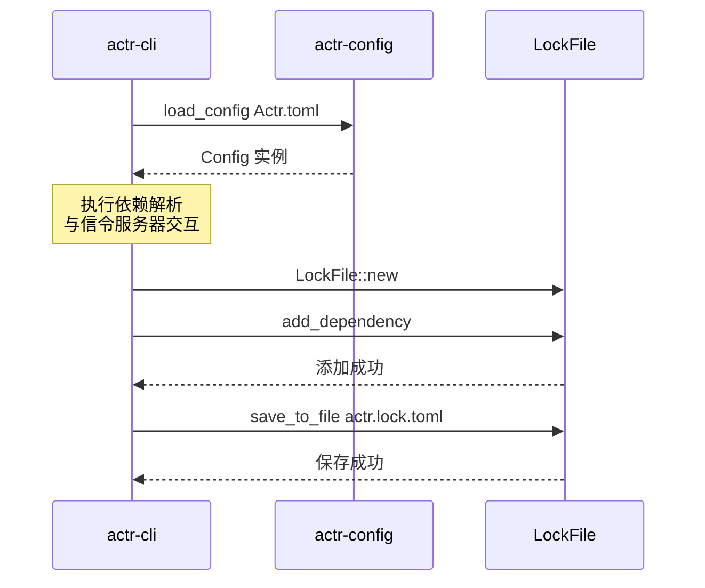

# actr-config：配置管理

## 1. 职责定位

`actr-config` 是框架的配置管理核心，负责 `Actr.toml` 项目清单文件及其关联锁文件的定义、解析和验证。

**核心职责**：
- 定义配置文件的 Rust 结构体表示
- 提供配置文件的加载和验证能力
- 管理锁文件的读写

**边界**：
- 只负责配置的"形状"和"有效性"验证
- 不关心配置值的运行时语义
- 不执行依赖下载或网络操作

## 2. 核心数据结构

### 2.1 双层配置架构

`actr-config` 采用双层架构进行配置解析：

**第一层：RawConfig（原始配置）**
- 直接映射 TOML 文件结构
- 无任何处理和验证
- 支持配置继承（`inherit` 字段）
- 支持 edition 机制以实现格式演进

**第二层：Config（最终配置）**
- 经过解析、验证、类型转换后的配置
- 所有路径已转换为绝对路径
- 所有 proto 文件内容已读取
- ActrType 已从字符串解析为结构体

```rust
// actr-config/src/raw.rs - 原始配置（TOML 直接映射）

#[derive(Debug, Clone, Serialize, Deserialize)]
pub struct RawConfig {
    #[serde(default = "default_edition")]
    pub edition: u32,                  // 配置格式版本

    #[serde(default)]
    pub inherit: Option<PathBuf>,      // 继承父配置

        #[serde(rename = "actr")]
    pub package: RawPackageConfig,

    #[serde(default)]
    pub exports: Vec<PathBuf>,         // 导出的 proto 文件

    #[serde(default)]
    pub dependencies: HashMap<String, RawDependency>,

    #[serde(default)]
    pub system: RawSystemConfig,

    #[serde(default)]
    pub acl: Option<toml::Value>,

    #[serde(default)]
    pub scripts: HashMap<String, String>,
}

#[derive(Debug, Clone, Serialize, Deserialize)]
pub struct RawPackageConfig {
    pub name: String,
    pub manufacturer: String,          // ActrType manufacturer
    pub type_name: String,                // ActrType name

    #[serde(default)]
    pub description: Option<String>,
    #[serde(default)]
    pub authors: Option<Vec<String>>,
    #[serde(default)]
    pub license: Option<String>,
}

#[derive(Debug, Clone, Serialize, Deserialize)]
#[serde(untagged)]
pub enum RawDependency {
    Empty,              // 空依赖声明：{} 或未指定，由 actr install 填充
    WithFingerprint {
        #[serde(default)]
        realm: Option<u32>,            // 跨 Realm 依赖的目标 Realm ID
        #[serde(default)]
        actr_type: Option<String>,     // ActrType（格式："manufacturer:name"）
        fingerprint: String,            // 服务指纹（必需）
    },
}
```

```rust
// actr-config/src/config.rs - 最终配置（已解析验证）

use actr_protocol::{Realm, ActrType, Acl};

#[derive(Debug, Clone)]
pub struct Config {
    pub package: PackageInfo,
    pub exports: Vec<ProtoFile>,           // 已读取内容的 proto 文件
    pub dependencies: Vec<Dependency>,     // 已展开的依赖列表
    pub signaling_url: Url,                // 已验证的 URL
    pub realm: Realm,                      // 所属 Realm
    pub visible_in_discovery: bool,
    pub acl: Option<Acl>,
    pub scripts: HashMap<String, String>,
}

#[derive(Debug, Clone)]
pub struct PackageInfo {
    pub name: String,
    pub actr_type: ActrType,               // 已解析的 ActrType 结构体
    pub description: Option<String>,
    pub authors: Vec<String>,
    pub license: Option<String>,
}

#[derive(Debug, Clone)]
pub struct ProtoFile {
    pub path: PathBuf,                     // 绝对路径
    pub content: String,                   // 文件内容
}

#[derive(Debug, Clone)]
pub struct Dependency {
    pub alias: String,                     // 依赖别名
    pub realm: Realm,                      // 目标 Realm
    pub actr_type: ActrType,               // 目标 ActrType
    pub fingerprint: Option<String>,       // 服务指纹（Actr.toml 中可选，lock 文件中必需）
}
```

### 2.2 LockFile（actr.lock.toml）

`LockFile` 定义服务依赖的精确锁定版本，确保构建的可重现性。与 cargo/npm 等包管理器不同，actr 的 lock 文件**直接嵌入 proto 内容**，而不使用独立的 cache 目录。这样设计是因为：
- Proto 文件很小（单个通常 2–10 KiB）
- 总量可控（即使 50 个文件也仅约 250 KiB）
- 简化架构（单一数据源，无需 cache 管理）
- 版本控制友好（git diff 可直接显示 proto 变化）

```rust
// actr-config/src/lock.rs

#[derive(Debug, Clone, Serialize, Deserialize)]
pub struct LockFile {
    pub metadata: Option<LockMetadata>,
    #[serde(rename = "dependency")]  // TOML 中使用 [[dependency]] 数组表
    pub dependencies: Vec<LockedDependency>,
}

#[derive(Debug, Clone, Serialize, Deserialize)]
pub struct LockMetadata {
    pub version: u32,           // 锁文件格式版本
    pub generated_at: String,   // 生成时间戳
}

#[derive(Debug, Clone, Serialize, Deserialize)]
pub struct LockedDependency {
    pub name: String,               // 依赖别名（Actr.toml 中的 key）
    pub actr_type: String,          // 服务类型（actr_type）
    #[serde(flatten)]
    pub spec: ServiceSpecMeta,      // 服务规范元数据（展平到此结构）
    pub cached_at: String,          // 缓存时间戳
}

/// ServiceSpec 元数据（包含完整 proto 内容）
#[derive(Debug, Clone, Serialize, Deserialize)]
pub struct ServiceSpecMeta {
    pub description: Option<String>,
    pub fingerprint: String,        // 服务级语义指纹（SHA256 组合哈希）
    pub published_at: Option<i64>,  // 发布时间戳
    pub tags: Vec<String>,          // 标签（如 "latest", "stable"）
    #[serde(rename = "files")]
    pub protobufs: Vec<ProtoFileWithContent>,
}

/// Proto 文件及其嵌入内容
#[derive(Debug, Clone, Serialize, Deserialize)]
pub struct ProtoFileWithContent {
    pub name: String,                // Proto 文件名: URI (actr://...) 或路径（如 "actr://acme:user-service/user.v1.proto"）
    pub fingerprint: String,        // 文件级语义指纹（proto-sign）
    pub content: String,            // Proto 文件内容（直接嵌入）
}
```

**双向转换机制**：

`ServiceSpec` 和 `ServiceSpecMeta` 可以无损双向转换，无需额外的 cache 层：

```rust
// 方向 1: ServiceSpec → ServiceSpecMeta (直接转换)
impl From<ServiceSpec> for ServiceSpecMeta {
    fn from(spec: ServiceSpec) -> Self {
        Self {
            description: spec.description,
            fingerprint: spec.fingerprint,
            protobufs: spec.protobufs.into_iter().map(|proto| {
                ProtoFileWithContent {
                    name: proto.name,
                    fingerprint: proto.fingerprint,
                    content: proto.content,  // 直接复制内容
                }
            }).collect(),
            published_at: spec.published_at,
            tags: spec.tags,
        }
    }
}

// 方向 2: ServiceSpecMeta → ServiceSpec (直接转换)
impl From<ServiceSpecMeta> for ServiceSpec {
    fn from(meta: ServiceSpecMeta) -> Self {
        Self {
            description: meta.description,
            fingerprint: meta.fingerprint,
            protobufs: meta.protobufs.into_iter().map(|proto| {
                service_spec::Protobuf {
                    name: proto.name,
                    content: proto.content,  // 直接使用内容
                    fingerprint: proto.fingerprint,
                }
            }).collect(),
            published_at: meta.published_at,
            tags: meta.tags,
        }
    }
}
```

**转换时机**：
- **安装时**：`actr install` 从信令服务器获取 `ServiceSpec`，直接转换为 `ServiceSpecMeta` 并写入 lock 文件
- **构建时**：`actr gen` 从 lock 文件读取 `ServiceSpecMeta`，直接转换为 `ServiceSpec` 用于代码生成
- **运行时协商**：动态兼容性检查时，从 lock 文件读取并直接转换为 `ServiceSpec` 进行比较

## 3. 配置文件示例

### 3.1 完整的 Actr.toml

```toml
edition = 1

exports = [
  "proto/order.v1.proto"
]

[actr]
name = "order-service"
manufacturer = "acme"
type = "order-service"
description = "Order processing service"

[dependencies]
# 空依赖声明：由 actr install 自动填充 fingerprint
user-service = {}

# 显式 fingerprint：直接锁定特定服务版本
payment = { actr_type = "acme:payment-service", fingerprint = "service_semantic:abc123..." }

# 跨 Realm 依赖：依赖 realm 9999 中的共享日志服务
shared_logger = { actr_type = "common:logging", realm = 9999, fingerprint = "service_semantic:xyz789..." }

[scripts]
run = "cargo run --release"
test = "cargo test"

[system.signaling]
url = "ws://localhost:8081"

[system.deployment]
realm = 1001

[system.discovery]
visible = true

[[acl.rules]]
permission = "allow"
types = ["admin-service", "audit-service"]

[[acl.rules]]
permission = "deny"
types = ["guest-service"]
```

### 3.2 actr.lock.toml 示例

```toml
# This file is auto-generated by `actr install`. DO NOT EDIT.

[metadata]
version = 1
generated_at = "2025-01-04T18:30:00Z"

[[dependency]]
name = "user-service"
actr_type = "acme:user-service"                      # ActrType 格式：manufacturer:name
description = "User management service"
fingerprint = "service_semantic:abcd1234ef567890..."  # 服务级组合哈希
published_at = 1704384000                             # 发布时间戳
tags = ["latest", "stable"]                           # 标签
cached_at = "2025-01-04T18:30:00Z"                    # 缓存时间

[[dependency.files]]
name = "actr://acme:user-service/user.v1.proto"       # Proto 文件名
fingerprint = "semantic:xyz789..."                    # proto-sign 语义指纹
content = '''
syntax = "proto3";

package user.v1;

message User {
  uint64 id = 1;
  string name = 2;
  string email = 3;
}

service UserService {
  rpc GetUser(GetUserRequest) returns (GetUserResponse);
  rpc CreateUser(CreateUserRequest) returns (CreateUserResponse);
}
'''

[[dependency.files]]
name = "actr://acme:user-service/common.v1.proto"
fingerprint = "semantic:mno456..."
content = '''
syntax = "proto3";

package common.v1;

message Empty {}
'''

[[dependency]]
name = "payment"
actr_type = "acme:payment-service"
description = "Payment processing service"
fingerprint = "service_semantic:fed5cba987654321..."
published_at = 1704470400
tags = ["stable"]
cached_at = "2025-01-04T18:31:00Z"

[[dependency.files]]
name = "actr://acme:payment-service/payment.v2.proto"
fingerprint = "semantic:abc123..."
content = '''
syntax = "proto3";

package payment.v2;

message Payment {
  uint64 id = 1;
  uint64 amount = 2;
  string currency = 3;
}
'''
```

**关键特性**：
- 使用 `[[dependency]]` 数组表（符合 Cargo.lock 风格）
- 通过 `#[serde(flatten)]` 展平 `ServiceSpecMeta` 字段
- `files` 重命名为 `[[dependency.files]]`（更符合 TOML 惯例）
- `actr_type` 使用完整格式 `"manufacturer:name"`
- `uri` 使用 actr URI 格式（`actr://manufacturer:name/path.proto`）
- **Proto 内容直接嵌入**：使用 TOML 多行字符串（`'''`）嵌入完整 proto 内容
- 单一数据源：所有信息都在一个文件中，无需外部 cache 目录

## 4. 核心流程

### 4.1 配置加载与验证

```mermaid
graph TD
    A[actr-cli] --> B(Config::from_file Actr.toml)
note right of B: 示例为 CLI 工作流；在“库模式”中应由应用解析并注入 SDK
    B --> C{读取文件}
    C --> D{TOML 解析}
    D --> E{结构体反序列化}
    E --> F{Config::validate}
    F --> G{检查包名格式}
    G --> H{检查 ActrType 格式}
    H --> I{验证依赖 fingerprint}
    I --> J{检查信令服务器 URL}
    J --> K[返回 Config 实例]
```

**验证项**：
- 包名符合命名规范
- ActrType 格式正确（manufacturer:name）
- 依赖 fingerprint 格式正确
- 信令服务器 URL 合法
- Realm ID 值在有效范围内

**示例**：
```rust
use actr_config::ConfigParser;

// 加载配置
let config = ConfigParser::from_file("Actr.toml")?;

// 访问配置项
println!("Package: {}", config.package.name);
println!("ActrType: {}:{}",
    config.package.actr_type.manufacturer,
    config.package.actr_type.name);
println!("Signaling URL: {}", config.signaling_url);
// 注：本示例用于 CLI；SDK 作为库不直接读写文件，由应用注入

// 遍历依赖
for dep in &config.dependencies {
    println!("Dependency {} -> {}:{}",
        dep.alias,
        dep.actr_type.manufacturer,
        dep.actr_type.name);
}
```

### 4.2 锁文件管理

VCS 策略：
- actr.lock.toml：应当提交到版本库（MUST），保证团队构建一致性。
- compat.lock.toml：不应提交到版本库（SHOULD NOT），为运行时缓存，应列入 .gitignore。



**示例**：
```rust
use actr_config::{LockFile, LockedDependency, ServiceSpecMeta, ProtoFileWithContent};

// 创建锁文件
let mut lock_file = LockFile::new();

// 添加锁定的依赖（包含嵌入的 proto 内容）
lock_file.dependencies.push(LockedDependency {
    name: "user-service".to_string(),
    actr_type: "acme:user-service".to_string(),
    spec: ServiceSpecMeta {
        description: Some("User management service".to_string()),
        fingerprint: "service_semantic:a1b2c3d4...".to_string(),
        published_at: Some(1704384000),
        tags: vec!["latest".to_string(), "stable".to_string()],
        protobufs: vec![
            ProtoFileWithContent {
                name: "actr://acme:user-service/user.v1.proto".to_string(),
                fingerprint: "semantic:e5f6g7h8...".to_string(),
                content: r#"syntax = "proto3";

package user.v1;

message User {
  uint64 id = 1;
  string name = 2;
}
"#.to_string(),
            }
        ],
    },
    cached_at: "2025-01-04T18:30:00Z".to_string(),
});

// 保存到文件（proto 内容将被嵌入到 TOML 中）
lock_file.save_to_file("actr.lock.toml")?;

// 加载锁文件（proto 内容直接从 TOML 中读取）
let loaded = LockFile::from_file("actr.lock.toml")?;

// 直接访问 proto 内容（无需外部 cache）
let user_proto_content = &loaded.dependencies[0].spec.protobufs[0].content;
```

## 5. 配置验证规则

### 5.1 PackageConfig 验证

```rust
impl RawPackageConfig {
    pub fn validate(&self) -> Result<(), ConfigError> {
        // 1. 包名验证
        if !is_valid_package_name(&self.name) {
            return Err(ConfigError::InvalidPackageName(self.name.clone()));
        }

        // 2. Manufacturer 验证
        if self.manufacturer.is_empty() {
            return Err(ConfigError::MissingManufacturer);
        }

        // 3. ActrType name 验证
        if self.type_name.is_empty() {
            return Err(ConfigError::MissingActorType);
        }

        Ok(())
    }
}
```

### 5.2 依赖验证

```rust
impl RawDependency {
    pub fn validate(&self) -> Result<(), ConfigError> {
        match self {
            RawDependency::Empty => {
                // 空依赖声明，等待 actr install 填充
                Ok(())
            }
            RawDependency::WithFingerprint { actr_type, fingerprint, .. } => {
                // 验证 ActrType 格式
                if let Some(ref type_str) = actr_type {
                    if !type_str.contains(':') {
                        return Err(ConfigError::InvalidActorType(type_str.clone()));
                    }
                }

                // 验证 fingerprint 格式
                if !fingerprint.starts_with("service_semantic:") &&
                   !fingerprint.starts_with("semantic:") {
                    return Err(ConfigError::InvalidFingerprint(fingerprint.clone()));
                }

                Ok(())
            }
        }
    }
}
```

## 6. 模块结构

```
actr-config/
├── src/
│   ├── lib.rs          # Crate 入口
│   ├── config.rs       # Config 结构体定义
│   ├── lock.rs         # LockFile 结构体定义
│   ├── validation.rs   # 验证逻辑
│   └── error.rs        # 错误类型定义
├── Cargo.toml
└── README.md
```

## 7. 错误处理

```rust
// error.rs

#[derive(Debug, Error)]
pub enum ConfigError {
    #[error("Invalid package name: {0}")]
    InvalidPackageName(String),

    #[error("Missing manufacturer")]
    MissingManufacturer,

    #[error("Missing actor type")]
    MissingActorType,

    #[error("Invalid ActrType format: {0}")]
    InvalidActorType(String),

    #[error("Invalid fingerprint format: {0}")]
    InvalidFingerprint(String),

    #[error("File I/O error: {0}")]
    IoError(#[from] std::io::Error),

    #[error("TOML parse error: {0}")]
    TomlError(#[from] toml::de::Error),
}
```

## 8. 依赖关系

```toml
[dependencies]
actr-protocol = { path = "crates/protocol" }
serde = { version = "1.0", features = ["derive"] }
toml = "0.8"
thiserror = "1.0"
url = "2.5"         # URL 解析和验证
```

## 9. 与其他模块的协作

### 9.1 与 actr-cli 的协作

`actr` 的所有命令都依赖 `actr-config` 来读取配置：

```rust

let config = Config::from_file("Actr.toml")?;

// 获取依赖列表
let dependencies = config.dependencies.ok_or(/* ... */)?;

// 执行依赖安装
for (name, dep) in dependencies {
    install_dependency(name, dep).await?;
}
```

### 9.2 与 actr-runtime 的协作

`actr-runtime` 使用 `actr-config` 读取运行时配置：

```rust
// actr-runtime/src/actor_system.rs

let config = Config::from_file("Actr.toml")?;

// 获取信令服务器地址
let signaling_url = config.system
    .ok_or(/* ... */)?
    .signaling
    .url;

// 连接信令服务器
// SDK 作为库不直接读取配置；由应用传入 signaling_url：
self.connect_signaling(&signaling_url).await?
```

## 10. 设计原则

### 10.1 职责单一
只负责配置的定义、解析和验证，不执行业务逻辑。

### 10.2 类型安全
通过强类型的 Rust 结构体确保配置的正确性，编译时捕获错误。

### 10.3 验证优先
在解析配置后立即进行验证，尽早发现问题。

### 10.4 可扩展性
使用 `Option` 包装可选配置项，便于未来添加新的配置字段。
