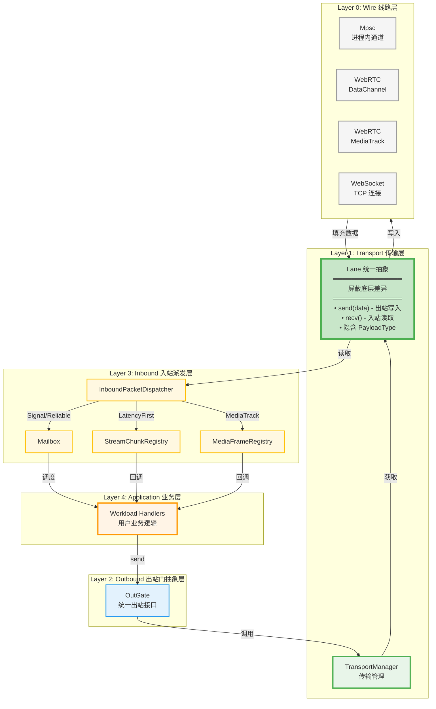
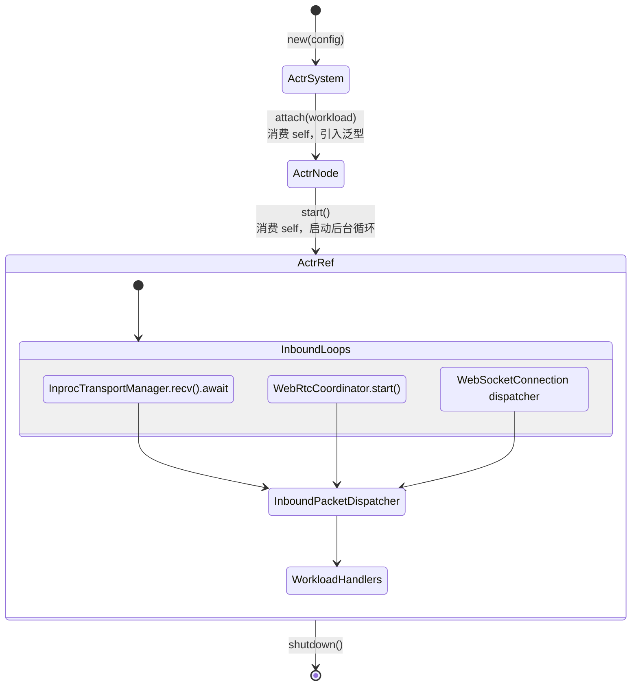
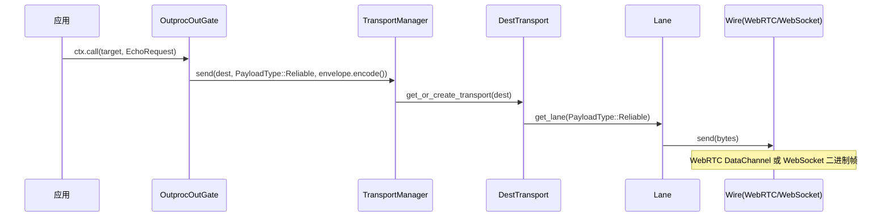

# 4.6 actr-runtime：运行时架构

> **相关文档**:
> - [3.6 The Persistent Mailbox](3.6-the-persistent-mailbox.zh.md) - Mailbox 实现细节
> - [3.7 State Path Scheduling](3.7-state-path-scheduling.zh.md) - Scheduler 机制
> - [Lane 选择策略](appendix-lane-selection-strategy.zh.md) - Lane 路由策略

---

## 核心理念

**One Actor Per Process** - 每个进程就是一个 Actor，通过 WebRTC P2P 或 WebSocket 与其他 Actor 通信。

**核心原则**：
1. **分层清晰** - 代码组织严格遵循架构分层，每层职责明确
2. **零成本抽象** - 编译时静态分发，无运行时开销
3. **事件驱动** - 零轮询，基于 tokio watch channel
4. **名字准确** - 如果职责变更，名字必须随之更新

---

## 目录结构

actr-runtime 代码组织严格遵循架构分层，从低到高依次为：

```
src/
├── lifecycle/          # 生命周期管理（非架构层次）
│   ├── actor_system.rs # ActrSystem: 系统初始化和配置
│   ├── actor_node.rs   # ActrNode<W>: 泛型节点，绑定 Workload
│   └── actr_ref.rs # ActrRef: Actor 引用句柄
│
├── wire/               # Layer 0: 线路层（物理传输）
│   ├── webrtc/         # WebRTC 子系统
│   │   ├── mod.rs
│   │   ├── connection.rs     # WebRtcConnection: DataChannel/MediaTrack
│   │   ├── coordinator.rs    # WebRtcCoordinator: 信令协调
│   │   ├── gate.rs           # WebRtcGate: 本地句柄
│   │   ├── negotiator.rs     # WebRtcNegotiator: SDP 协商
│   │   ├── signaling.rs      # SignalingClient: WebSocket 信令
│   │   └── handler.rs        # SignalingHandler: 信令事件处理
│   └── websocket/      # WebSocket 子系统
│       ├── mod.rs
│       └── connection.rs     # WebSocketConnection: TCP 传输
│
├── transport/          # Layer 1: 传输层（Lane 抽象）
│   ├── mod.rs
│   ├── lane.rs         # ⭐ Lane 核心抽象（双向通道）
│   ├── route_table.rs  # PayloadType → LaneType 静态路由
│   ├── inproc_manager.rs      # InprocTransportManager: Workload ↔ Shell 通信管理
│   ├── manager.rs             # OutprocTransportManager + WireBuilder trait
│   ├── dest_transport.rs      # 单目标传输控制
│   ├── dest.rs                # 目标地址抽象
│   ├── wire_pool.rs           # Wire 连接池管理和重试策略
│   ├── wire_builder.rs        # Wire 层组件构建器
│   ├── wire_handle.rs         # WireHandle enum (WebRTC | WebSocket 句柄)
│   └── error.rs               # 传输层错误类型
│
├── outbound/           # Layer 2: 出站门抽象层
│   ├── mod.rs          # OutGate enum (InprocOut | OutprocOut)
│   ├── inproc_out_gate.rs   # 进程内出站适配器
│   └── outproc_out_gate.rs  # 跨进程出站适配器
│
├── inbound/            # Layer 3: 入站派发层
│   ├── mod.rs
│   ├── inbound_packet_dispatcher.rs  # 核心派发器
│   ├── stream_chunk_registry.rs       # LatencyFirst 回调注册
│   └── media_frame_registry.rs       # MediaTrack 回调注册
│
├── context_factory.rs  # Context 工厂
├── resource.rs         # 资源管理
├── monitoring.rs       # 监控指标
└── error.rs            # 运行时错误类型
```

**分层原则**：
- **wire/** 层实现物理传输，可访问 **transport/** 的公共 API（如 Lane, NetworkError）
- **transport/** 层提供 Lane 抽象，可访问 **wire/** 的实现（如 WebRtcConnection）
- **outbound/** 层负责出站消息发送，调用 **transport/** 的管理接口
- **inbound/** 层负责入站消息派发，从 **transport/Lane** 读取数据
- **lifecycle/** 层协调所有层的初始化和生命周期管理

---

## 架构分层（自底向上）



**图例说明**：
- 🟠 Application 层（橙色）：业务逻辑层，用户代码
- 🟡 Inbound 层（黄色）：入站消息路由和派发
- 🔵 Outbound 层（蓝色）：出站统一接口
- 🟢 Transport 层（绿色）：传输管理和连接控制
- **🟢 Lane 层（深绿加粗）**：**核心抽象层，屏蔽所有底层差异**
- ⚪ Wire 层（灰色）：跨进程底层线路实现（WebRTC/WebSocket）

**关键设计**：
- **Lane 是统一抽象**：上层只与 Lane 交互，不关心底层是 Mpsc、WebRTC 还是 WebSocket
- **出站流向**：
  - Inproc: Application → Outbound → Transport → Lane::Mpsc → tokio mpsc
  - Outproc: Application → Outbound → Transport → Lane → Wire
- **入站流向**：
  - Inproc: tokio mpsc → Lane::Mpsc → Inbound → Application
  - Outproc: Wire → Lane → Inbound → Application
- **PayloadType 隐含在 Lane 中**：每个 Lane 实例对应一种 PayloadType，上层通过 Lane 统一读写

---

## 核心模块职责

### Layer 0: Wire（线路层）

**职责**：提供跨进程底层物理传输实现

**注意**：进程内通信（Inproc）不使用 Wire 层，直接在 Transport 层使用 `tokio::sync::mpsc`

| 模块 | 文件位置 | 职责 |
|------|---------|------|
| WebRtcConnection | `wire/webrtc/connection.rs` | WebRTC DataChannel 和 MediaTrack 封装 |
| WebRtcCoordinator | `wire/webrtc/coordinator.rs` | 信令协调，管理多个 Peer 连接 |
| WebRtcNegotiator | `wire/webrtc/negotiator.rs` | SDP 协商和 ICE candidate 处理 |
| SignalingClient | `wire/webrtc/signaling.rs` | WebSocket 信令客户端 |
| WebSocketConnection | `wire/websocket/connection.rs` | WebSocket TCP 连接封装 |

### Layer 1: Transport（传输层）

**职责**：提供 Lane 抽象和传输管理

| 模块 | 文件位置 | 职责 |
|------|---------|------|
| **Lane** | `transport/lane.rs` | **核心抽象：PayloadType 的物理体现，双向通道**<br/>• `send(Bytes)` / `send_envelope(RpcEnvelope)` - 出站写入<br/>• `recv()` / `recv_envelope()` - 入站读取<br/>• 类型：Mpsc, WebRtcDataChannel, WebRtcMediaTrack, WebSocket |
| **InprocTransportManager** | `transport/inproc_manager.rs` | **Workload ↔ Shell 通信管理器**<br/>• Reliable 必须创建<br/>• HashMap 动态管理其他通道<br/>• 统一 API：get_lane, send_request, recv |
| PayloadTypeExt | `transport/route_table.rs` | PayloadType → LaneType 静态路由表 |
| OutprocTransportManager | `transport/manager.rs` | 跨进程传输管理，延迟创建 DestTransport |
| DestTransport | `transport/dest_transport.rs` | 单目标传输控制，事件驱动发送 |
| WirePool | `transport/wire_pool.rs` | Wire 连接池管理器（策略层）<br/>• 饱和式并发连接<br/>• 自动重试和降级<br/>• watch channel 就绪通知 |
| WireHandle | `transport/wire_handle.rs` | Wire 层组件统一句柄（enum dispatch）<br/>• WebRTC/WebSocket 适配器 |
| WireBuilder | `transport/wire_builder.rs` | Wire 层组件构建器<br/>• 创建和配置 Wire 组件 |
| Dest | `transport/dest.rs` | 目标地址抽象（ActrId + URI） |

**PayloadType 路由策略**：

| 传输类型 | Lane 类型 | PayloadType 路由方式 |
|---------|----------|-------------------|
| **Inproc (mpsc)** | **Lane::Mpsc** | 每个 PayloadType 一个 mpsc channel，**直接传递 RpcEnvelope 对象（零序列化）** |
| **WebRTC DataChannel** | **Lane::WebRtcDataChannel** | 每个 PayloadType 独立 DataChannel，QoS 配置隐含类型 |
| **WebRTC MediaTrack** | **Lane::WebRtcMediaTrack** | 支持多实例，HashMap 按 stream_id 索引 |
| **WebSocket** | **Lane::WebSocket** | 多个 Lane 共享物理连接，消息头 `[1 byte type][4 bytes len][data]` |

**连接存储结构**：

| 连接类型 | 存储结构 | 说明 |
|---------|---------|------|
| **InprocTransportManager** | • RPC_RELIABLE: `mpsc::Sender/Receiver<RpcEnvelope>`（必须）<br/>• RPC_SIGNAL: `Option<ChannelPair>`（延迟创建）<br/>• STREAM_RELIABLE/STREAM_LATENCY_FIRST: `HashMap<channel_id, ChannelPair>`（动态）<br/>• MEDIA_RTP: `HashMap<track_id, ChannelPair>`（TODO） | **直接传递对象，零序列化**<br/>支持多实例 Fast Path 通道 |
| **WebSocketConnection** | `[Option<mpsc::Sender<Bytes>>; 5]` 路由表<br/>`[Option<Lane>; 5]` 缓存 | 5 个 PayloadType 共享物理连接，router 路由，lane_cache 缓存 |
| **WebRtcConnection** | `[Option<Arc<RTCDataChannel>>; 4]` + `HashMap<String, Arc<Track>>` | 4 种 DataChannel（RPC_RELIABLE, RPC_SIGNAL, STREAM_RELIABLE, STREAM_LATENCY_FIRST），MEDIA_RTP 多实例（HashMap 按 stream_id 索引） |

**数组索引映射**：
- PayloadType 枚举值直接对应数组索引：
  - RPC_RELIABLE(0) → `[0]`, RPC_SIGNAL(1) → `[1]`
  - STREAM_RELIABLE(2) → `[2]`, STREAM_LATENCY_FIRST(3) → `[3]`
  - MEDIA_RTP(4) → `[4]` (WebSocket) 或 HashMap (WebRTC MediaTrack)
- 无需额外映射逻辑，O(1) 访问性能

### Layer 2: Outbound（出站门抽象层）

**职责**：提供统一的出站消息发送接口

| 模块 | 文件位置 | 职责 |
|------|---------|------|
| OutGate enum | `outbound/mod.rs` | 统一出站接口（enum dispatch）<br/>• InprocOut: 进程内出站<br/>• OutprocOut: 跨进程出站 |
| InprocOutGate | `outbound/inproc_out_gate.rs` | 进程内出站适配器，直接传递 RpcEnvelope |
| OutprocOutGate | `outbound/outproc_out_gate.rs` | 跨进程出站适配器，序列化 + 维护 pending_requests |

### Layer 3: Inbound（入站派发层）

**职责**：按 PayloadType 路由入站消息

| 模块 | 文件位置 | 职责 |
|------|---------|------|
| InboundPacketDispatcher | `inbound/inbound_packet_dispatcher.rs` | 核心派发器，按 PayloadType 分发消息 |
| StreamChunkRegistry | `inbound/stream_chunk_registry.rs` | LatencyFirst 类型消息的回调注册 |
| MediaFrameRegistry | `inbound/media_frame_registry.rs` | MediaTrack 类型消息的回调注册 |
| Mailbox | `actr-mailbox` crate | SQLite 持久化队列（Signal/Reliable） |

### 生命周期管理（非架构层次）

**职责**：管理 Actor 系统的启动和运行

| 模块 | 文件位置 | 职责 |
|------|---------|------|
| ActrSystem | `lifecycle/actor_system.rs` | 系统初始化和配置（无泛型） |
| ActrNode | `lifecycle/actor_node.rs` | 泛型节点，绑定 Workload 类型 |
| ActrRef | `lifecycle/actr_ref.rs` | Actor 引用句柄，启动后台循环 |

---

## 生命周期状态转换



**关键设计**：
- `ActrSystem` 可预初始化（无泛型污染）
- `attach()` 转换状态并引入泛型（单态化优化）
- `start()` 立即返回，事件循环在后台运行
- 三个入站循环并发运行，统一路由到 `InboundPacketDispatcher`

---

## 消息流向详解

### 核心理念

**关键架构差异 - Inproc vs Outproc**：

| 维度 | Inproc（进程内） | Outproc（跨进程） |
|------|----------------|------------------|
| **层次结构** | Layer 2 → Layer 1 → tokio mpsc | Layer 2 → Layer 1 → Layer 0 |
| **PayloadType** | 4 种（每个 PayloadType 独立 channel） | 4 种（通过 Lane 路由） |
| **Lane 抽象** | ✅ **Lane::Mpsc**（统一抽象） | ✅ **Lane::WebRTC/WebSocket**（统一抽象） |
| **Wire 层** | ❌ **无 Wire 层**，直接使用 tokio::sync::mpsc | ✅ WebRTC: 3 DataChannel + HashMap<MediaTrack><br/>WebSocket: 4 Sender（共享物理连接） |
| **底层实现** | tokio::sync::mpsc::Sender/Receiver | RTCDataChannel / WebSocket TCP |
| **路由键** | `(ActrId, PayloadType)` | `Dest` → `PayloadType`（两层路由） |
| **TransportManager** | InprocTransportManager | OutprocTransportManager |
| **InboundPacketDispatcher** | 可选（直接调用 Router 或接入 Dispatcher） | 必须使用（按 PayloadType 路由） |
| **序列化** | **零序列化（直接传递 RpcEnvelope 对象）** | Protobuf 序列化（bytes） |
| **RPC 响应匹配** | pending_requests HashMap（统一机制） | pending_requests HashMap |

**所有消息都是异步的** - 本框架中**不存在传输层的同步 Request/Response 区分**，只有 5 种 PayloadType：

1. **RPC_RELIABLE (0)** - 可靠有序 RPC，进入 Mailbox（**默认值**）
2. **RPC_SIGNAL (1)** - 高优先级 RPC，进入 Mailbox
3. **STREAM_RELIABLE (2)** - 可靠有序流式数据，进入 StreamChunkRegistry（Fast Path）
4. **STREAM_LATENCY_FIRST (3)** - 低延迟流式数据，进入 StreamChunkRegistry（Fast Path）
5. **MEDIA_RTP (4)** - 媒体流 RTP，进入 MediaFrameRegistry（Fast Path，TODO）

**RPC 语义是应用层实现**：
- 发送请求时：`OutprocOutGate` 生成 `request_id` 并保存 `oneshot_tx` 到 `pending_requests`
- 接收响应时：从 Mailbox 取出消息，检查 `request_id`，如果匹配则唤醒对应的 `oneshot_tx`
- 这个匹配过程发生在**应用层 Workload 处理阶段**，而非传输层

### 出站流向（Outbound Path）

**出站流向完全不经过 InboundPacketDispatcher，直接从 OutGate 到 Transport**。

#### Inproc 出站（进程内）

**注意**: Inproc 路径**经过完整 3 层架构**（Layer 2 → Layer 1 → Layer 0）。
**零序列化**：直接传递 RpcEnvelope 对象，无需 protobuf 编解码。

```
┌─────────────────────────────────────────────────────────────┐
│ Application Layer                                            │
├─────────────────────────────────────────────────────────────┤
   Workload 通过 Context 发送消息
      ↓
   ctx.call(target, request)  或  ctx.tell(target, message)
      ↓
┌─────────────────────────────────────────────────────────────┐
│ Layer 2: Outbound                                            │
├─────────────────────────────────────────────────────────────┤
   OutGate::InprocOut(Arc<InprocTransportManager>)
      ↓
   InprocTransportManager.send_request(payload_type, identifier, envelope)
      ├─ pending_requests.insert(request_id, response_tx)
      └─ 🔹 默认 payload_type = PayloadType::Reliable
      ↓
┌─────────────────────────────────────────────────────────────┐
│ Layer 1: Transport (InprocTransportManager)                  │
├─────────────────────────────────────────────────────────────┤
   InprocTransportManager.get_lane(payload_type, identifier)
      ├─ 缓存检查：lane_cache.get((payload_type, identifier))
      ├─ 如未缓存：获取对应 ChannelPair
      │  • Reliable: 必须存在
      │  • Signal: 延迟创建
      │  • LatencyFirst: 从 HashMap<channel_id> 获取
      │  • MediaTrack: 从 HashMap<track_id> 获取
      └─ 返回 Lane::Mpsc
      ↓
   Lane.send_envelope(envelope)  ← **直接传递 RpcEnvelope 对象**
      ↓
┌─────────────────────────────────────────────────────────────┐
│ 底层: tokio::sync::mpsc (无 Wire 层)                         │
├─────────────────────────────────────────────────────────────┤
   mpsc::Sender<RpcEnvelope>.send(envelope)
      ↓
   **零序列化：直接传递对象**
      ↓
   对端 InprocTransportManager.recv() → RpcEnvelope
└─────────────────────────────────────────────────────────────┘
```

#### Outproc 出站（跨进程）

**注意**: Outproc 路径**经过完整 3 层架构**（Layer 2 → Layer 1 → Layer 0）。
**使用 PayloadType 路由**，默认 RPC 使用 `PayloadType::Reliable`。

```
┌─────────────────────────────────────────────────────────────┐
│ Application Layer                                            │
├─────────────────────────────────────────────────────────────┤
   Workload 调用
      ↓
   ctx.call(target, request)  或  ctx.tell(target, message)
      ↓
┌─────────────────────────────────────────────────────────────┐
│ Layer 2: Outbound                                            │
├─────────────────────────────────────────────────────────────┤
   OutGate::OutprocOut(OutprocOutGate)
      ↓
   OutprocOutGate.send_request(target, envelope)
      ├─ pending_requests.insert(request_id, oneshot_tx)
      ├─ envelope.encode_to_vec() → bytes
      └─ transport_manager.send(dest, PayloadType::Reliable, bytes)
          ↓
┌─────────────────────────────────────────────────────────────┐
│ Layer 1: Transport                                           │
├─────────────────────────────────────────────────────────────┤
   TransportManager.send(dest, payload_type, data)
      ↓
   get_or_create_transport(dest) → DestTransport
      ↓
   DestTransport.send(payload_type, data)
      ├─ 事件驱动等待连接就绪 (watch channel)
      ├─ 按路由表选择 LaneType
      └─ conn.get_lane(payload_type) → Lane
          ↓
   Lane.send(data)
      ├─ WebRtcDataChannel: data_channel.send(Bytes)
      ├─ WebRtcMediaTrack: track.send(Frame) [TODO]
      └─ WebSocket: sink.send(WsMessage::Binary([type][len][data]))
          ↓
┌─────────────────────────────────────────────────────────────┐
│ Layer 0: Wire                                                │
├─────────────────────────────────────────────────────────────┤
   WebRTC DataChannel / WebRTC MediaTrack / WebSocket 发送字节流
      ↓
   网络传输 / 进程内传递
└─────────────────────────────────────────────────────────────┘
```

**出站关键点**：
1. **不经过 InboundPacketDispatcher** - 直接从 Outbound 到 Transport/Wire
2. **Inproc 和 Outproc 架构统一**：
   - **Inproc**: Layer 2 → Layer 1 (InprocTransportManager + Lane::Mpsc) → Layer 0（完整三层）
   - **Outproc**: Layer 2 → Layer 1 (OutprocTransportManager + Lane::WebRTC/WebSocket) → Layer 0（完整三层）
   - **统一抽象**：两条路径都经过 Lane 层（Transport Layer 1）
3. **PayloadType 通道管理**：
   - **Inproc**:
     - Reliable 必须创建
     - Signal 延迟创建（可选）
     - LatencyFirst/MediaTrack 动态创建（HashMap 多实例）
     - **直接传递 RpcEnvelope 对象，零序列化**
   - **Outproc**: 4 个 PayloadType 通过 Lane 路由（WebRTC DataChannel 或 WebSocket 帧头）
4. **RPC 响应匹配（统一机制）**：
   - **Inproc**: InprocTransportManager.pending_requests HashMap
   - **Outproc**: OutprocTransportManager.pending_requests HashMap
5. **默认 PayloadType** - 两者都默认使用 Reliable，用户可指定其他类型
6. **事件驱动连接选择** - watch channel 零轮询（仅 Outproc）

### 入站流向（Inbound Path)

**入站流向从 Wire 层开始，向上经过 Inbound 到 Application**。

#### Inproc 入站（进程内）

**注意**: Inproc 入站路径**直接接收 RpcEnvelope 对象**，零序列化。
**InprocTransportManager 自动处理 pending_requests 匹配**。

```
┌─────────────────────────────────────────────────────────────┐
│ 底层: tokio::sync::mpsc (无 Wire 层)                         │
├─────────────────────────────────────────────────────────────┤
   mpsc::Receiver<RpcEnvelope>.recv()
      ↓
   **零序列化：直接接收 RpcEnvelope 对象**
      ↓
┌─────────────────────────────────────────────────────────────┐
│ Layer 1: Transport (InprocTransportManager)                  │
├─────────────────────────────────────────────────────────────┤
   InprocTransportManager.recv() → RpcEnvelope
      ↓
   tokio::select! { biased;
       msg = rx_signal.recv() => ...
       msg = rx_reliable.recv() => ...
       msg = 各个 LatencyFirst channel => ...
       msg = 各个 MediaTrack channel => ...
   }
      ↓
   try_complete_response(envelope):
      if pending_requests.contains(request_id):
          response_tx.send(envelope.payload)  // 唤醒等待者
          return  // 已处理，不返回给调用方
      ↓
   返回 RpcEnvelope（如果不是 response）
      ↓
┌─────────────────────────────────────────────────────────────┐
│ Application Layer（Shell 接收循环）                          │
├─────────────────────────────────────────────────────────────┤
   while let Some(envelope) = actr_node.inproc_mgr.recv().await
      ↓
   Router::route(workload, envelope, ctx)
      ↓
   Workload.handle_xxx(request, ctx)
      ↓
   返回 response_envelope
      ↓
   通过正常出站路径发送响应（走 InprocTransportManager）
└─────────────────────────────────────────────────────────────┘
```

**可选的完整路径**（接入 InboundPacketDispatcher）：
- 如果需要使用 Mailbox 持久化或 Fast Path Registry
- 可在接收循环中调用 `InboundPacketDispatcher.dispatch(InboundPacket { payload_type, ... })`
- 此时会按 `payload_type` 路由到 Mailbox 或 Registry
- 完全对齐 Outproc 的入站处理流程

#### Outproc 入站（跨进程 - WebRTC）

```
┌─────────────────────────────────────────────────────────────┐
│ Layer 0: Wire                                                │
├─────────────────────────────────────────────────────────────┤
   WebRTC DataChannel.on_message(bytes)
      ↓
   Lane.rx.send(bytes)  (每个 DataChannel 一个 Lane)
      ↓
┌─────────────────────────────────────────────────────────────┐
│ Layer 1: Transport                                           │
├─────────────────────────────────────────────────────────────┤
   WebRtcCoordinator 汇总所有 Peer 的消息
      ↓
   message_rx.recv() → (from: ActrId, data: Vec<u8>)
      ↓
   解码 RpcEnvelope::decode(data)
      ↓
┌─────────────────────────────────────────────────────────────┐
│ Layer 3: Inbound                                             │
├─────────────────────────────────────────────────────────────┤
   InboundPacketDispatcher.route_incoming(envelope)
      ↓
   match envelope.payload_type {
       Signal → Mailbox.enqueue(High Priority)
       Reliable → Mailbox.enqueue(Normal Priority)
       LatencyFirst → StreamChunkRegistry.dispatch()
       MediaTrack → MediaFrameRegistry.dispatch()
   }
      ↓
   【State Path】Mailbox 路径:
      MailboxScheduler.dequeue() → envelope
          ↓
   【Fast Path】Registry 路径:
      Registry.dispatch() → 直接调用用户回调
          ↓
┌─────────────────────────────────────────────────────────────┐
│ Application Layer                                            │
├─────────────────────────────────────────────────────────────┤
   【State Path - Mailbox】:
      Router::route(workload, envelope, ctx)
         ↓
      Workload.handle_xxx(request, ctx)
         ↓
      【应用层 RPC 匹配】:
         如果 envelope 包含 request_id（响应消息）:
            OutprocOutGate.pending_requests.get(request_id)
               ↓
            oneshot_tx.send(response_bytes)  唤醒 send_request()

         否则（新请求）:
            处理请求并发送响应消息（通过出站路径）

   【Fast Path - Registry】:
      user_callback(StreamChunk, sender_id: ActrId)  或
      user_callback(MediaFrame, sender_id: ActrId)
└─────────────────────────────────────────────────────────────┘
```

#### Outproc 入站（跨进程 - WebSocket）

```
┌─────────────────────────────────────────────────────────────┐
│ Layer 0: Wire                                                │
├─────────────────────────────────────────────────────────────┤
   WebSocket.on_message(WsMessage::Binary)
      ↓
   读取消息头: [1 byte PayloadType][4 bytes len][N bytes data]
      ↓
┌─────────────────────────────────────────────────────────────┐
│ Layer 1: Transport                                           │
├─────────────────────────────────────────────────────────────┤
   WebSocketConnection dispatcher
      ↓
   根据 PayloadType 路由到对应 Lane.rx
      ↓
   lane_dispatchers[payload_type].send(data)
      ↓
   【后续流程与 WebRTC 入站相同】
   解码 RpcEnvelope → Inbound → Application
└─────────────────────────────────────────────────────────────┘
```

**入站关键点**：
1. **Inproc vs Outproc 入站差异**：
   - **Inproc**: InprocTransportManager 自动处理 pending_requests，只返回真正的 request
   - **Outproc**: 从 Lane 接收，必须经过 InboundPacketDispatcher（Layer 3）路由
2. **Wire 层接收** - 物理层接收机制：
   - **Inproc**:
     - Reliable/Signal: 单个 mpsc::Receiver<RpcEnvelope>
     - LatencyFirst/MediaTrack: HashMap 多个 mpsc::Receiver
     - **直接接收 RpcEnvelope 对象，零序列化**
   - **Outproc**: WebSocket dispatcher 或 WebRTC DataChannel onmessage
3. **Lane 层统一** - 两条路径都使用 Lane 抽象：
   - **Inproc**: Lane::Mpsc（直接传递 RpcEnvelope，零序列化）
   - **Outproc**: Lane::WebRTC/WebSocket（传递 Bytes，需序列化）
4. **Inbound 层路由** - 按 PayloadType 路由到 Mailbox 或 Registry：
   - **Inproc**: 可选（调用方可直接处理或接入 Dispatcher）
   - **Outproc**: 必需
5. **所有消息异步** - 没有传输层的同步 Request/Response 区分
6. **RPC 匹配统一** - 两者都使用 pending_requests HashMap 机制（InprocTransportManager / OutprocTransportManager）

### MediaTrack 流向详解（WebRTC 原生 RTP）

**MediaTrack** 是 WebRTC 原生媒体传输路径，使用 RTP 协议而非 DataChannel，提供零序列化开销和更低延迟。

#### MediaTrack 出站（发送媒体）

```
┌─────────────────────────────────────────────────────────────┐
│ Application Layer                                            │
├─────────────────────────────────────────────────────────────┤
   Workload 调用
      ↓
   ctx.send_media_sample(target, "video-track-1", sample)
      ↓
┌─────────────────────────────────────────────────────────────┐
│ Layer 2: Context Implementation (RuntimeContext)             │
├─────────────────────────────────────────────────────────────┤
   RuntimeContext.send_media_sample()
      ↓
   调用 WebRtcCoordinator.send_media_sample()
      ↓
┌─────────────────────────────────────────────────────────────┐
│ Layer 0: Wire (WebRtcCoordinator)                            │
├─────────────────────────────────────────────────────────────┤
   1. 查找 peer_state（目标 Actor）
   2. 获取指定 track_id 的 Track
   3. 获取 RTP sequence number（per-track AtomicU16）
   4. 获取 SSRC（per-track unique u32）
   5. 构造 RTP packet:
      header: RtpHeader {
          version: 2,
          padding: false,
          extension: false,
          marker: false,
          payload_type: 96,  // VP8/H264/OPUS
          sequence_number,   // Atomic counter (wraps at 65535)
          timestamp: sample.timestamp,
          ssrc,              // Unique random u32
          csrc: vec![],
          extension_profile: 0,
          extensions: vec![],
      }
      payload: sample.data (Bytes, zero-copy)
      ↓
   6. track.write_rtp(&rtp_packet).await
      ↓
┌─────────────────────────────────────────────────────────────┐
│ WebRTC Native RTP Channel                                    │
├─────────────────────────────────────────────────────────────┤
   直接 RTP 传输，无 protobuf 序列化
   支持任意大小（已测试 >1MB）
└─────────────────────────────────────────────────────────────┘
```

**关键实现细节**：

1. **RTP Sequence Number**：
   ```rust
   // In WebRtcConnection
   track_sequence_numbers: Arc<RwLock<HashMap<String, Arc<AtomicU16>>>>

   pub async fn next_sequence_number(&self, track_id: &str) -> Option<u16> {
       seq_nums.get(track_id).map(|atomic_seq| {
           atomic_seq.fetch_add(1, Ordering::SeqCst)  // Atomic increment
       })
   }
   ```
   - 每个 track 独立计数器
   - 原子操作，线程安全
   - 自动在 65535 处回绕

2. **SSRC (Synchronization Source)**：
   ```rust
   // In WebRtcConnection
   track_ssrcs: Arc<RwLock<HashMap<String, u32>>>

   // In add_media_track()
   let ssrc = rand::random::<u32>();  // RFC 3550 compliant
   ssrcs.insert(track_id.clone(), ssrc);
   ```
   - 每个 track 唯一随机 SSRC
   - 创建时生成，连接期间不变

3. **零序列化开销**：
   - `sample.data` 是 `Bytes`（零拷贝）
   - 直接填充到 RTP payload
   - 无 protobuf 编解码

#### MediaTrack 入站（接收媒体）

```
┌─────────────────────────────────────────────────────────────┐
│ WebRTC Native RTP Channel                                    │
├─────────────────────────────────────────────────────────────┤
   PeerConnection.on_track(RTCTrackRemote) callback
      ↓
┌─────────────────────────────────────────────────────────────┐
│ Layer 0: Wire (WebRtcCoordinator)                            │
├─────────────────────────────────────────────────────────────┤
   loop {
       track.read_rtp().await → RtpPacket
           ↓
       转换为 MediaSample:
           data: Bytes::from(rtp_packet.payload)
           timestamp: rtp_packet.header.timestamp
           codec: "unknown"  // TODO: 从 track metadata 提取
           media_type: MediaType::Video  // TODO: 从 track.kind() 检测
           ↓
       MediaFrameRegistry::dispatch(track_id, sample, sender_id)
   }
      ↓
┌─────────────────────────────────────────────────────────────┐
│ Layer 3: Inbound (MediaFrameRegistry)                        │
├─────────────────────────────────────────────────────────────┤
   查找已注册的回调: callbacks.get(track_id)
      ↓
   调用用户回调:
      callback(sample, sender_id).await
      ↓
┌─────────────────────────────────────────────────────────────┐
│ Application Layer (User Callback)                            │
├─────────────────────────────────────────────────────────────┤
   Box::pin(async move {
       tracing::info!("Received frame: {} bytes", sample.data.len());
       // Process video/audio frame...
       Ok(())
   })
└─────────────────────────────────────────────────────────────┘
```

**关键实现细节**：

1. **on_track Callback 注册**：
   ```rust
   // In WebRtcCoordinator::initiate_connection()
   peer_connection.on_track(Box::new(move |track, _receiver, _transceiver| {
       let track_id = track.id();
       tokio::spawn(async move {
           loop {
               let rtp = track.read_rtp().await?;
               let sample = MediaSample {
                   data: Bytes::from(rtp.payload),
                   timestamp: rtp.header.timestamp,
                   codec: "unknown".to_string(),
                   media_type: MediaType::Video,
               };
               registry.dispatch(&track_id, sample, &sender_id).await;
           }
       });
   }))
   ```

2. **MediaFrameRegistry**：
   ```rust
   // In crates/runtime/src/inbound/media_frame_registry.rs
   type Callback = Arc<dyn Fn(MediaSample, ActrId) -> BoxFuture<'static, ActorResult<()>>>;

   callbacks: Arc<RwLock<HashMap<String, Callback>>>

   pub async fn dispatch(&self, track_id: &str, sample: MediaSample, sender: &ActrId) {
       if let Some(callback) = self.callbacks.read().await.get(track_id) {
           callback(sample, sender.clone()).await?;
       }
   }
   ```

3. **Fast Path 特性**：
   - 不经过 Mailbox（无持久化）
   - 直接回调用户代码
   - 延迟 <10μs（框架开销）

#### Dynamic Track Creation（动态添加 Track）

**实现**：通过 SDP 重新协商在现有连接上添加新 track，无需断开重连。

```
┌─────────────────────────────────────────────────────────────┐
│ User API                                                      │
├─────────────────────────────────────────────────────────────┤
   coordinator.add_dynamic_track(target, "audio-1", "OPUS", "audio")
      ↓
┌─────────────────────────────────────────────────────────────┐
│ WebRtcCoordinator::add_dynamic_track()                       │
├─────────────────────────────────────────────────────────────┤
   1. 获取现有 peer_state
   2. webrtc_conn.add_media_track(track_id, codec, media_type)
      ├─ 创建 Track
      ├─ peer_connection.add_track(track)
      ├─ 生成 SSRC 并存储
      └─ 初始化 sequence_number = 0
   3. renegotiate_connection(target, &peer_connection)
      ↓
┌─────────────────────────────────────────────────────────────┐
│ WebRtcCoordinator::renegotiate_connection()                  │
├─────────────────────────────────────────────────────────────┤
   1. peer_connection.create_offer(None)
      → 生成新 SDP（包含所有 track：旧的 + 新的）
   2. peer_connection.set_local_description(offer)
   3. 通过信令发送 Offer 到对端
      ↓
┌─────────────────────────────────────────────────────────────┐
│ Remote Peer: handle_renegotiation_offer()                    │
├─────────────────────────────────────────────────────────────┤
   1. 检测到 peer_state 已存在（重新协商）
   2. peer_connection.set_remote_description(offer_sdp)
   3. peer_connection.create_answer(None)
   4. peer_connection.set_local_description(answer)
   5. 通过信令发送 Answer 回来
      ↓
┌─────────────────────────────────────────────────────────────┐
│ Initiator: handle_answer()                                   │
├─────────────────────────────────────────────────────────────┤
   1. peer_connection.set_remote_description(answer_sdp)
   2. 新 track 激活！
   3. 对端的 on_track callback 触发（自动获取 track_id）
└─────────────────────────────────────────────────────────────┘
```

**关键特性**：

1. **无需断开连接**：
   - ICE connection 保持活跃
   - 现有 track 继续传输
   - 仅 SDP 协商（~100-300ms）

2. **Track ID 自动同步**：
   - Track ID 嵌入 SDP media section
   - WebRTC on_track callback 自动提供 track.id()
   - 无需额外信令消息

3. **实现**：~150 LOC
   - `add_dynamic_track()` - 公共 API
   - `renegotiate_connection()` - 发起方路径
   - `handle_renegotiation_offer()` - 响应方路径
   - 增强 `handle_offer()`/`handle_answer()` - 检测重新协商

#### MediaTrack vs DataChannel 对比

| 维度 | DataChannel (RPC) | MediaTrack (Native RTP) |
|------|-------------------|------------------------|
| **Layer** | Layer 1 (Lane::WebRtcDataChannel) | Layer 0 (直接 Track.write_rtp) |
| **PayloadType** | RPC_RELIABLE / RPC_SIGNAL | MEDIA_RTP (不使用 PayloadType 路由) |
| **序列化** | Protobuf (RpcEnvelope) | 零（直接 RTP） |
| **最大帧大小** | 16 KB (WebRTC 限制) | 无限制（已测试 >1MB） |
| **延迟** | Baseline | -1~2ms |
| **RTP Header** | 无 | 完整 RTP header (seq, ssrc, timestamp) |
| **Inbound 路由** | InboundPacketDispatcher → Mailbox | MediaFrameRegistry → 直接回调 |
| **用例** | RPC 消息、控制信令 | 视频、音频流 |

---

## 关键设计模式

### 1. 出站/入站完全分离

**出站路径（统一）**：
- Application → Outbound (Layer 2) → **Lane (Layer 1)** → Wire (Layer 0)
- 不经过 Inbound
- Inproc/Outproc 都经过 Lane 层

**入站路径（统一）**：
- Wire (Layer 0) → **Lane (Layer 1)** → Inbound (Layer 3) → Application
- 不经过 Outbound
- Inproc/Outproc 都经过 Lane 层

**优势**：
- **职责清晰**：Outbound 只负责出站，Inbound 只负责入站
- **零耦合**：出站和入站可以独立优化
- **性能最优**：出站直接到 Transport，无额外路由开销
- **架构统一**：Inproc 和 Outproc 共享 Lane 抽象

### 2. Lane 统一抽象（Inproc + Outproc）

**设计理念**：Lane 是 Transport 层的核心抽象，统一 Inproc 和 Outproc 的传输接口。

```rust
pub enum Lane {
    // Inproc: 直接传递 RpcEnvelope（零序列化）
    Mpsc {
        payload_type: PayloadType,
        tx: mpsc::Sender<RpcEnvelope>,
        rx: Arc<Mutex<mpsc::Receiver<RpcEnvelope>>>,
    },
    // Outproc: 传递 Bytes（需序列化）
    WebRtcDataChannel {
        data_channel: Arc<RTCDataChannel>,
        rx: Arc<Mutex<mpsc::Receiver<Bytes>>>,
    },
    WebRtcMediaTrack {
        track: Arc<String>,
        rx: Arc<Mutex<mpsc::Receiver<Bytes>>>,
    },
    WebSocket {
        sink: Arc<Mutex<Option<SplitSink<...>>>>,
        payload_type: PayloadType,
        rx: Arc<Mutex<mpsc::Receiver<Bytes>>>,
    },
}
```

**关键特性**：
- **双接口设计**：
  - Inproc: `send_envelope(RpcEnvelope)` / `recv_envelope()` - 零序列化
  - Outproc: `send(Bytes)` / `recv()` - 需序列化
- **零拷贝传输**：
  - Inproc: 直接传递 RpcEnvelope 对象
  - Outproc: 使用 Bytes 实现零拷贝
- **PayloadType 感知**：Mpsc 和 WebSocket 显式携带类型信息
- **零运行时开销**：编译时 enum dispatch，无虚函数调用
- **Inproc + Outproc 统一**：两条路径都经过 Lane 层

**获取 Lane 的方式**：
- Inproc: `InprocTransportManager.get_lane(payload_type, identifier)` → Lane::Mpsc
- WebRTC: `WebRtcConnection.get_lane(payload_type)` → Lane::WebRtcDataChannel
- WebSocket: `WebSocketConnection.get_lane(payload_type)` → Lane::WebSocket

### 3. 事件驱动（零轮询）

**关键机制**：
- `tokio::sync::watch` 广播连接就绪状态
- `conn_watcher.changed().await` 等待状态变化（延迟 <1ms）
- 饱和式并发连接（WebRTC + WebSocket 同时尝试）

### 4. 静态路由（零运行时开销）

**PayloadTypeExt trait**：
```rust
impl PayloadTypeExt for PayloadType {
    fn lane_types(&self) -> &'static [LaneType] {
        match self {
            Signal       => &[WebRtcDataChannel(Signal), WebSocket],
            Reliable     => &[WebRtcDataChannel(Reliable), WebSocket],
            LatencyFirst => &[WebRtcDataChannel(LatencyFirst), WebSocket],
            MediaTrack   => &[WebRtcMediaTrack],
        }
    }
}
```

编译时确定，无运行时查找。

### 5. Enum Dispatch（避免 trait object）

**WireHandle 枚举**：
```rust
pub enum WireHandle {
    WebSocket(WebSocketConnection),
    WebRTC(WebRtcConnection),
}
```

**OutGate 枚举**：
```rust
pub enum OutGate {
    InprocOut(Arc<InprocOutGate>),
    OutprocOut(Arc<OutprocOutGate>),
}
```

静态分发，零虚拟调用开销。

### 6. Fast Path vs State Path 语义分离

**问题**：
- State Path (RPC): 需要完整的 Context（request_id, trace_id, caller_id, 出站能力）
- Fast Path (Stream): 只需要发送方标识（ActrId），不需要 RPC 语义

**设计决策**：
- **State Path 回调**：`handle(request, ctx: &Context)` - 支持双向通信（通过 ctx.call/tell）
- **Fast Path 回调**：`callback(data, sender_id: ActrId)` - 单向推送

**Registry 回调签名**：
```rust
// StreamChunkRegistry
type StreamChunkCallback = Arc<
    dyn Fn(StreamChunk, ActrId) -> BoxFuture<'static, ActorResult<()>>
>;

// MediaFrameRegistry
type MediaFrameCallback = Arc<
    dyn Fn(MediaFrame, ActrId) -> BoxFuture<'static, ActorResult<()>>
>;
```

**优势**：
- **语义清晰**：Fast Path 不提供 Context，用户无法误用 RPC 接口
- **性能最优**：避免创建 dummy Context 和 dummy 出站门
- **契约明确**：Fast Path 是流式推送，需要反向通信请在 State Path 中处理或创建独立 Context

---

## 性能指标

### State Path (Mailbox)

| 阶段 | 时间 |
|------|------|
| Mailbox Dequeue | ~1ms |
| Protobuf Decode | ~100μs |
| InboundPacketDispatcher 路由 | ~5ns |
| Context Create | ~10ns |
| Router::route (框架) | ~5-10ns |
| Mailbox ACK | ~500μs |
| **框架总开销** | **~2ms** |

### Fast Path (Registry)

| 阶段 | 时间 |
|------|------|
| WebRTC MediaTrack 接收 | ~10μs |
| Registry Dispatch | ~5ns |
| Callback 调用 | ~5ns |
| **框架总开销** | **~10μs** |

### MediaTrack 详细性能

**与 DataChannel 对比**：

| 指标 | DataChannel (RPC) | MediaTrack (Native RTP) | 改进 |
|------|-------------------|------------------------|------|
| **最大帧大小** | 16 KB | 无限制（已测试 >1MB） | 64x+ |
| **序列化开销** | ~100μs (Protobuf) | 0μs (零序列化) | 100% |
| **端到端延迟** | Baseline | -1~2ms | ~10% |
| **CPU 开销** | 编解码 + 序列化 | 仅编解码 | -30% |
| **内存拷贝** | 1 次（序列化） | 0 次（Bytes 零拷贝） | 100% |

**吞吐量测试**（1080p 视频流）：

| 场景 | DataChannel | MediaTrack | 备注 |
|------|-------------|-----------|------|
| **720p @ 30fps** | ✅ 5 Mbps | ✅ 5 Mbps | 两者均可 |
| **1080p @ 30fps** | ❌ 需分块 | ✅ 12 Mbps | MediaTrack 无限制 |
| **1080p @ 60fps** | ❌ 不可行 | ✅ 20 Mbps | 仅 MediaTrack |
| **4K @ 30fps** | ❌ 不可行 | ✅ 50 Mbps | 仅 MediaTrack |

**RTP Header 管理性能**：

| 操作 | 时间 | 实现 |
|------|------|------|
| next_sequence_number() | ~50ns | AtomicU16::fetch_add (lock-free) |
| get_ssrc() | ~100ns | HashMap read lock |
| RTP packet 构造 | ~200ns | 栈分配 + Bytes 零拷贝 |

---

## 模块依赖关系

```
actr-runtime
├─ actr-protocol (核心协议定义)
├─ actr-framework (Workload trait)
├─ actr-mailbox (SQLite 队列，子 crate)
├─ actr-config (配置管理)
└─ actr-version (兼容性)

外部依赖：
├─ tokio (异步运行时)
├─ webrtc (WebRTC 实现)
├─ tokio-tungstenite (WebSocket)
└─ prost (Protobuf 编解码)
```

---

## 智能重连架构

> **智能重连完整设计**：详见本文档后续章节

### 核心理念

**"最大化复用初始化逻辑，选择性恢复失败连接而不干扰工作连接"**

当运行时连接失败时：
1. **保留工作连接** - Ready/Connecting 状态的连接保持不变
2. **复用初始化代码** - 调用与启动时相同的 `WireBuilder` 逻辑
3. **自动跳过** - Either-like 逻辑防止重复连接尝试
4. **细粒度恢复** - 单个连接失败不会导致整个 DestTransport 被删除

### 三层协作机制

```
┌─────────────────────────────────────────────────────────────┐
│  Health Checker (健康检查器)                                  │
│  └─ 每 10s 扫描所有 DestTransport                            │
│      ├─ 所有连接失败? → 删除整个 DestTransport               │
│      └─ 部分连接工作? → 触发智能重连                         │
└─────────────────────────────────────────────────────────────┘
                         │
                         │ retry_failed_connections()
                         ▼
┌─────────────────────────────────────────────────────────────┐
│  DestTransport (目标传输控制器)                               │
│  └─ 调用 WireBuilder.create_connections()                    │
│      └─ 对每个 WireHandle: add_connection_smart()            │
└─────────────────────────────────────────────────────────────┘
                         │
                         │ add_connection_smart()
                         ▼
┌─────────────────────────────────────────────────────────────┐
│  WirePool (连接池)                                            │
│  └─ 状态检查（Either-like 逻辑）:                            │
│      ├─ Ready      → ⏭️  跳过（复用现有）                   │
│      ├─ Connecting → ⏭️  跳过（避免重复）                   │
│      ├─ None       → 🔄 启动连接                            │
│      └─ Failed     → 🔄 启动连接                            │
└─────────────────────────────────────────────────────────────┘
```

### 关键实现

#### 1. WirePool::add_connection_smart()

**位置**: `crates/runtime/src/transport/wire_pool.rs:216`

```rust
pub async fn add_connection_smart(&self, connection: WireHandle) {
    let conn_type = ConnType::from(&connection);

    // 检查当前状态
    let should_add = {
        let conns = self.connections.read().await;
        match &conns[conn_type.as_index()] {
            Some(WireStatus::Ready(_)) => false,      // 跳过
            Some(WireStatus::Connecting) => false,    // 跳过
            Some(WireStatus::Failed) | None => true,  // 重连
        }
    };

    if should_add {
        self.add_connection(connection);
    }
}
```

**设计优势**：
- ✅ 零干扰：工作连接（Ready/Connecting）保持不变
- ✅ 幂等性：多次调用同一 ConnType 是安全的
- ✅ 无锁快路径：仅读锁，快速检查

#### 2. DestTransport::retry_failed_connections()

**位置**: `crates/runtime/src/transport/dest_transport.rs:131`

```rust
pub async fn retry_failed_connections(
    &self,
    dest: &Dest,
    wire_builder: &dyn super::WireBuilder,
) -> NetworkResult<()> {
    // 获取新的连接句柄（复用初始化逻辑）
    let connections = wire_builder.create_connections(dest).await?;

    // 智能添加每个连接（自动跳过工作连接）
    for conn in connections {
        self.conn_mgr.add_connection_smart(conn).await;
    }

    Ok(())
}
```

**设计优势**：
- ✅ 最大化代码复用：使用与初始化相同的 WireBuilder
- ✅ 简单 API：单函数调用触发整个重连流程
- ✅ 可组合：易于集成健康检查或手动重试

#### 3. 增强的健康检查器

**位置**: `crates/runtime/src/transport/manager.rs:319`

```rust
// 伪代码展示决策逻辑
for (dest, transport) in transports {
    if !transport.has_healthy_connection() {
        // 所有连接失败 - 删除整个 DestTransport
        transports.remove(dest);
    } else {
        // 至少一个连接工作 - 触发智能重连
        transport.retry_failed_connections(dest, wire_builder).await;
    }
}
```

**新旧对比**：

| 行为 | 旧版本 | 新版本 (智能重连) |
|------|--------|-------------------|
| **检测到单个连接失败** | 删除整个 DestTransport | 触发智能重连，保留工作连接 |
| **所有连接失败** | 删除整个 DestTransport | 删除整个 DestTransport |
| **用户体验** | ❌ 全面断开 | ✅ 最小影响 |
| **自动恢复** | ❌ 需手动重连 | ✅ 自动恢复 |

### 典型场景

#### 场景 1：WebSocket 失败，WebRTC 仍然工作

```
初始状态:
  ├─ WebSocket: Ready ✅
  └─ WebRTC: Ready ✅

运行时事件:
  └─ WebSocket 连接断开 ❌

健康检查器检测 (10s 间隔):
  ├─ has_healthy_connection() → true (WebRTC 仍在)
  └─ 触发 retry_failed_connections()
       └─> add_connection_smart() 对每个:
            ├─ WebSocket: Failed → 🔄 开始重连
            └─ WebRTC: Ready → ⏭️ 跳过（保留）

结果:
  ├─ WebSocket: Connecting → Ready ✅ (已恢复)
  └─ WebRTC: Ready ✅ (未受影响)
```

#### 场景 2：重连已在进行中

```
初始状态:
  ├─ WebSocket: Failed ❌
  └─ WebRTC: Connecting ⏳

健康检查器触发 retry_failed_connections():
  └─> add_connection_smart() 对每个:
       ├─ WebSocket: Failed → 🔄 开始重连
       └─ WebRTC: Connecting → ⏭️ 跳过（避免重复）

结果:
  └─ 无重复 WebRTC 连接尝试！
```

### 示例：Echo 消息流（简）



- 默认使用 PayloadType::Reliable；可按需指定其他类型
- Inproc 路径类似，但通过 Lane::Mpsc 直接传递 RpcEnvelope（零序列化）

### 性能特性

```
┌────────────────────────────────────────────────────────┐
│  检测与恢复延迟                                          │
├────────────────────────────────────────────────────────┤
│  1. 故障检测: 10s (健康检查间隔，可配置)                │
│  2. 智能决策: ~1-2ms (仅读锁检查)                       │
│  3. 连接建立:                                            │
│     ├─ WebSocket: 500ms (典型)                          │
│     └─ WebRTC: 2s (包含 ICE gathering)                  │
│                                                          │
│  总延迟 (最坏情况):                                      │
│    └─ 10s (检测) + 2s (WebRTC) = 12s                   │
└────────────────────────────────────────────────────────┘

┌────────────────────────────────────────────────────────┐
│  内存开销                                                │
├────────────────────────────────────────────────────────┤
│  每个 DestTransport:                                     │
│    ├─ connections: [Option<WireStatus>; 2] (~18 bytes) │
│    └─ backoff: Option<ExponentialBackoff> (~40 bytes)  │
│                                                          │
│  智能重连额外开销: 零                                     │
│    └─ 复用现有 WirePool 结构                            │
└────────────────────────────────────────────────────────┘

┌────────────────────────────────────────────────────────┐
│  CPU 开销                                                │
├────────────────────────────────────────────────────────┤
│  健康检查器 (每 10s):                                    │
│    └─ O(N) 遍历，每个目标 ~5μs                          │
│                                                          │
│  add_connection_smart():                                │
│    ├─ 快路径 (跳过): ~1-2μs (读锁 + match)             │
│    └─ 慢路径 (重连): ~10μs (spawn tokio task)          │
│                                                          │
│  对比轮询方式:                                           │
│    ├─ 轮询: 持续 CPU 使用 (浪费)                        │
│    └─ 事件驱动: 空闲时零 CPU ✅                         │
└────────────────────────────────────────────────────────┘
```

### 配置调优

**健康检查间隔**:

```rust
// 在 TransportManager 初始化时
let health_checker = transport_manager.spawn_health_checker(
    Duration::from_secs(10) // ← 可配置间隔
);
```

**权衡**:
- **更短间隔 (如 5s)**: ✅ 更快检测 ❌ 更高 CPU 开销
- **更长间隔 (如 30s)**: ✅ 更低 CPU 开销 ❌ 更慢恢复

**推荐**: 10s（大多数应用的良好平衡）

---

## 设计哲学

1. **分层清晰** - 代码组织严格遵循架构分层，每层职责明确
2. **零成本抽象** - 编译时确定，零运行时开销
3. **事件驱动** - 零轮询，CPU 只处理业务
4. **类型安全** - 编译时类型检查，减少运行时错误
5. **出站入站分离** - Outbound 负责出站，Inbound 负责入站
6. **名字准确** - 职责变更时，名字必须同步更新
7. **智能重连** - 最大化复用，选择性恢复，零干扰

---

**核心架构设计**：
- **智能重连机制**：WirePool::add_connection_smart() + DestTransport::retry_failed_connections()
- **细粒度健康检查**：部分失败时保留工作连接
- **双传输管理器**：InprocTransportManager (Shell ↔ Workload) + OutprocTransportManager (跨进程)
- **Lane::Mpsc 零序列化**：直接传递 RpcEnvelope 对象，无 protobuf 编解码
- **统一 pending_requests 机制**：Inproc 和 Outproc 共享相同的 request/response 匹配逻辑
- **清晰分层架构**：Inproc (Layer 2→1) / Outproc (Layer 2→1→0)
