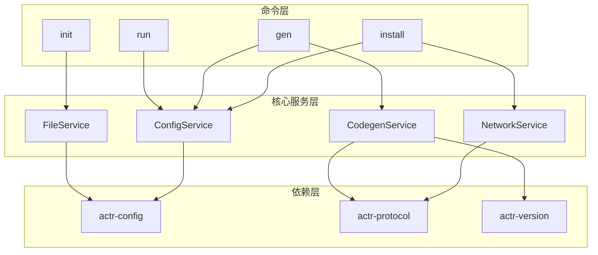
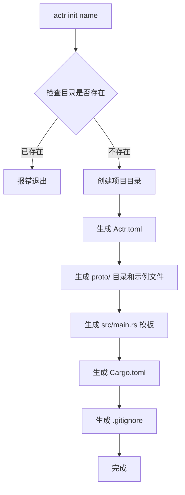
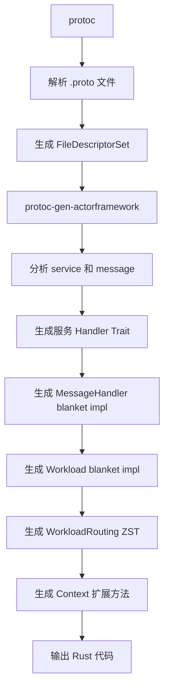

# actr：开发工具链

## 1. 职责定位

`actr` 是 actr 生态系统的核心开发工具链，负责将开发者的意图（`Actr.toml`）转化为可构建、可运行的 Actor 项目。

**核心职责**：
- 项目管理：`init`, `install`, `gen`, `run`
- 代码生成：调用 `protoc-gen-actorframework` 插件
- 依赖管理：生成和维护 `actr.lock.toml`
- 脚本执行：运行用户定义的命令

**边界**：
- 是开发者工具，不是框架运行时的一部分
- 不执行业务逻辑
- 不直接参与 Actor 通信

## 2. 命令总览

| 命令 | 功能 | 依赖的核心服务 |
|------|------|----------------|
| `actr init <name>` | 创建新项目脚手架 | FileService |
| `actr install` | 解析依赖，生成锁文件 | ConfigService<br/>NetworkService |
| `actr gen` | 生成 Rust 代码 | ConfigService<br/>CodegenService |
| `actr run [script]` | 执行自定义脚本 | ConfigService |

## 3. 架构设计

### 3.1 服务组合架构

`actr` 采用服务组合模式，每个命令通过组合核心服务来完成功能。



### 3.2 核心服务

#### ConfigService（配置管理）
- 读取和验证 `Actr.toml`
- 管理锁文件的读写
- 提供配置项访问接口

#### NetworkService（网络操作）
- 与信令服务器通信
- 执行 `DiscoveryRequest`, `RouteCandidatesRequest`
- 处理网络连接性检查

#### CodegenService（代码生成）
- 调用 `protoc` 和 `protoc-gen-actorframework`
- 使用 `actr-version` 计算服务指纹
- 管理生成的代码文件

#### FileService（文件操作）
- 生成项目模板
- 管理本地缓存
- 文件复制和目录操作

## 4. 命令详解

### 4.1 actr init

创建新项目脚手架。

**执行流程**：


**生成的项目结构**：
```
<name>/
├── Actr.toml           # 项目配置
├── Cargo.toml          # Rust 项目配置
├── proto/
│   └── echo.v1.proto   # 示例 Proto 文件
├── src/
│   └── main.rs         # 入口文件模板
└── .gitignore
```

**示例**：
```bash
$ actr init my-service
Creating project: my-service
  ✓ Generated Actr.toml
  ✓ Generated proto/echo.v1.proto
  ✓ Generated src/main.rs
  ✓ Generated Cargo.toml
Project created successfully!

$ cd my-service
$ tree
.
├── Actr.toml
├── Cargo.toml
├── proto
│   └── echo.v1.proto
└── src
    └── main.rs
```

### 3.3. 依赖管理

#### **`actr install`**
npm风格的服务级依赖管理 (check-first 架构)

此命令采用**验证优先**的两阶段安装流程，确保配置完整性和原子性操作：

**模式1：添加新依赖 (npm install <package>)**
```bash
# 添加服务依赖（交互式选择 fingerprint）
actr install acme+user-service

# 添加依赖并指定别名
actr install my_api --actr-type acme+user-service

# 直接指定 fingerprint
actr install user-service --fingerprint service_semantic:abc123...
```

**模式2：安装配置的依赖 (npm install)**
```bash
# 安装Actr.toml中配置的所有服务依赖（优先使用lock文件中的已安装版本）
actr install

# 强制更新所有依赖（忽略lock文件，重新解析和安装所有依赖）
actr install --force-update
```

#### **依赖格式支持**

`actr install` 命令及 `[dependencies]` 部分支持的依赖声明格式：

1.  **空声明 + 交互式选择**（推荐）:
    ```bash
    actr install user-service
    ```
    安装最新的 acme:user-service

    这会在 `Actr.toml` 中添加：
    ```toml
    [dependencies]
    user-service = {}  # 空声明，fingerprint 写入 lock 文件
    ```

2.  **使用别名并指定 `actr_type`**:
    ```bash
    actr install my_user_api --actr-type acme+user-service
    ```
    这会生成：
    ```toml
    [dependencies]
    my_user_api = { actr_type = "acme+user-service" }
    ```

3.  **直接指定 fingerprint**（用于精确锁定）:
    ```bash
    actr install user-service --fingerprint service_semantic:abc123...
    ```
    这会生成：
    ```toml
    [dependencies]
    user-service = { fingerprint = "service_semantic:abc123..." }
    ```
这种设计确保了依赖的可重现性和安全性。

#### **Check-First 工作流程**

采用**验证优先**的两阶段流程，确保配置完整性：

##### **🔍 阶段1: 完整验证**
```bash
actr install user-service
  ├─ 📋 解析依赖规范
  ├─ 🔍 服务发现 (DiscoveryRequest)
  ├─ 🎯 fingerprint 选择（交互式或自动）
  ├─ 🌐 网络连通性测试 (NetworkValidator)
  ├─ 🔐 指纹完整性验证 (FingerprintValidator)
  ├─ ⚖️ 依赖冲突分析（fingerprint 一致性检查）
  └─ ✅ 生成安装计划

# 如果验证失败，命令在此退出，不修改任何文件
```

##### **📝 阶段2: 原子性安装**
```bash
# 仅在验证完全通过后执行
  ├─ 💾 备份当前配置
  ├─ 📝 更新 Actr.toml 配置
  ├─ 📦 缓存 proto 文件
  ├─ 🔒 更新 actr.lock.toml
  └─ ✅ 清理备份文件 (成功) 或 🔄 恢复备份 (失败)
```

##### **核心优势**
- ✅ **配置保护**: 失败时不会污染配置文件
- ✅ **错误提前**: 在修改前发现所有问题
- ✅ **原子操作**: 要么完全成功，要么完全回滚
- ✅ **复用验证**: install 复用 check 命令的验证逻辑

#### **核心职责**

`install` 命令的核心是解析 `Actr.toml` 中的 `[dependencies]`，从网络中发现并获取匹配的**服务级依赖**，最终将选择的依赖版本精确地锁定在 `actr.lock.toml` 文件中。

#### **服务级依赖Install工作流**

当 `actr install` 运行时，它会为每个服务级依赖执行以下流程：

1.  **服务发现**: 通过向信令服务器发送 `actr.DiscoveryRequest` 获取服务目录。
    ```rust
    // 请求可用服务列表
    DiscoveryRequest {
        manufacturer: Some("my-org".to_string()),
        limit: Some(64),
    }
    ```

2.  **选择策略**: 收到 `DiscoveryResponse` 后，根据返回的 `TypeEntries` 执行智能选择。
    *   **精确匹配**: 首先匹配 `ActrType` 与锁文件中的服务类型。
    *   **指纹验证**: 如果 `actr.lock.toml` 中指定了指纹，必须精确匹配 `service_fingerprint` 字段。
    *   **版本权重**: 在满足上述条件的实例中，优先选择最新的兼容版本。

3.  **路由候选获取（可选）**: 如果需要进一步确定目标实例，可发送 `RouteCandidatesRequest`。
    ```rust
    // 请求特定服务类型的最优实例列表
    RouteCandidatesRequest {
        target_type: ActrType {
            manufacturer: "my-org".into(),
            name: "user-service".into(),
        },
        criteria: Some(NodeSelectionCriteria {
            candidate_count: 3,
            ranking_factors: vec![NodeRankingFactor::      BEST_DEPENDENCY_HEALTH = 2;],
            minimal_dependency_requirement: None,
            minimal_health_requirement: None,
        }),
    }
    ```

4.  **锁文件更新**: 将最终选定的服务指纹和元数据写入 `actr.lock.toml`，确保构建可重现性。

#### **`actr discovery`**
发现网络中可用的 Actor 服务 (复用架构 + check-first)

```bash
# 列出发现的服务
actr discovery

# 带过滤的服务发现
actr discovery --filter "user-*"

# 显示详细服务信息
actr discovery --verbose
```

**交互式界面：**
```
🔍 发现的 Actor 服务：

┌─────────────────┬──────────────────┬─────────────────────────────────┐
│ 服务名称        │ Tags             │ 简介                            │
├─────────────────┼──────────────────┼─────────────────────────────────┤
│ echo-service    │ latest, stable   │ 简单的回声服务，用于测试连通性  │
│ chat-room       │ latest           │ 多人聊天室服务                  │
│ file-storage    │ stable           │ 分布式文件存储服务              │
└─────────────────┴──────────────────┴─────────────────────────────────┘

→ 使用 ↑↓ 选择服务，回车查看选项，q 退出

选择 echo-service 后的选项：
[1] 查看服务详情（fingerprint、发布时间）
[2] 导出 proto 文件
[3] 添加到配置文件
```

##### **复用架构工作流**

选择 "添加到配置文件" 后的完整流程：

1. **📝 配置更新**: 将选择的服务添加到 Actr.toml
2. **🔍 自动验证**: 复用 ConfigService.validate 和 NetworkService 验证逻辑
   - 服务可用性检查
   - 网络连通性测试
   - 指纹完整性验证
3. **⚖️ 失败处理**: 如果验证失败，自动回滚配置修改
4. **🤔 用户确认**: 询问是否立即安装验证通过的依赖
5. **📦 可选安装**: 组合 FileService 和 ConfigService 执行原子性安装

**示例交互流程：**
```bash
✅ 已添加 echo-service 到配置文件

🔍 正在验证新依赖...
  ├─ 📋 服务存在性检查 ✅
  ├─ 🌐 网络连通性测试 ✅
  └─ 🔐 指纹完整性验证 ✅

🤔 是否立即安装此依赖？ [y/N] y

📦 正在安装 echo-service...
  ├─ 📦 缓存 proto 文件 ✅
  ├─ 🔒 更新锁文件 ✅
  └─ ✅ 安装完成

💡 建议: 运行 'actr gen' 生成最新代码
```

##### **复用组件优势**
- ✅ **一致验证**: 与 `actr check` 使用相同的验证逻辑
- ✅ **原子操作**: 与 `actr install` 使用相同的安装流程
- ✅ **配置保护**: 验证失败时自动回滚，避免配置污染
- ✅ **用户友好**: 统一的错误处理和进度提示

此功能集成了服务发现、验证和安装的完整工作流，为开发者提供一站式的服务依赖管理体验。

### 3.4. 配置管理

#### **`actr config`**
项目配置管理

```bash
# 设置配置
actr config set build.output-dir "./generated"
actr config set signaling.url "wss://signal.company.com"

# 查看配置
actr config get signaling.url
actr config list

# 查看所有配置
actr config show

# 删除配置
actr config unset build.output-dir
```

此命令用于管理项目级配置，支持设置构建选项、信令服务器地址等开发配置。针对依赖安装与服务发现等 CLI 工作流（如 `actr install`/`actr discovery`），当需要认证时，CLI 会提示在 `Actr.toml` 的 `[system.signaling]`（或 `[signaling]` 兼容段）配置认证与地址等信息。注意：SDK 作为库不直接读取配置文件，应用应在启动时自行解析并通过构建器注入凭证与连接参数。

### 3.5. 开发工具

#### **`actr check`**
配置和依赖验证工具

```bash
# 检查所有配置的依赖项
actr check

# 检查特定依赖项
actr check user-service notification-service

# 使用特定配置文件
actr check --file prod.toml

# 显示详细验证过程
actr check --verbose

# 验证 Actr.lock.toml 锁定一致性
actr check --lock

# 设置连接超时（秒）
actr check --timeout 10

# TODO: 支持并行检查参数 --parallel 5
```

`actr check` 通过统一的服务容器提供多维度的项目验证：

##### **验证维度**
1.  **环境预检**：验证 `Actr.toml` 配置语法及信令服务器（Signaling Server）的全局可达性。
2.  **锁定验证**（可选）：通过 `--lock` 参数确保本地配置与 `Actr.lock.toml` 记录的指纹完全一致，防止非预期的依赖漂移。
3.  **服务发现与网络验证**：
    - **存在性确认**：验证依赖服务是否已在信令网络中注册。
    - **连通性测试**：执行端到端的网络链路质量探测。
4.  **指纹深度校验**：通过 `FingerprintValidator` 验证远程服务的语义指纹是否符合本地 proto 定义的契约。

##### **核心组件架构**
`actr check` 深度集成以下复用组件：
- `ConfigManager`: 处理配置文件加载与语法验证。
- `DependencyResolver`: 解析复杂的版本与指纹依赖关系。
- `ServiceDiscovery`: 负责在信令网络中定位目标服务。
- `NetworkValidator`: 执行低延迟的网络连通性测试。
- `FingerprintValidator`: 进行基于语义的加密指纹比对。

##### **与其他命令的关系**
- `actr install`: **复用**相同的配置和网络验证服务，在安装前进行验证
- `actr discovery`: **扩展**网络服务，添加交互式服务选择
- `config test`: **子集**，仅验证配置文件语法，不涉及网络验证

**使用场景**：
- 部署前环境验证
- 网络连接问题诊断  
- 权限配置验证
- CI/CD管道中的依赖检查

#### **`actr doc`**
生成项目文档

```bash
# 生成文档
actr doc

# 指定输出目录
actr doc --output ./docs
```

此命令针对 actr 项目结构生成文档，生成固定的 HTML 文件：
- `index.html` - 项目概览（包含自动生成的项目结构树）
- `api.html` - API 接口文档（基于 proto 定义）
- `config.html` - 配置说明（展示当前 Actr.toml 状态）

**智能特性：**
- **多语言结构识别**：自动感知 Rust, Swift, Kotlin, Python 环境，并展示对应的工程目录规范。
- **元数据提取**：自动从 `Cargo.toml`, `project.yml`, `build.gradle` 或 `pyproject.toml` 中提取项目版本号，确保文档信息与代码同步。


### 3.6. 高级工具

#### **`actr fingerprint`**
计算项目和服务指纹

```bash
# 计算当前项目指纹
actr fingerprint

# 计算特定proto文件指纹
actr fingerprint --proto path/to/service.proto

# 输出JSON格式
actr fingerprint --format json

# 计算服务级指纹
actr fingerprint --service-level
```

此命令用于计算和验证项目的加密指纹，支持：
- **Proto 级指纹**: 基于 proto-sign 语义解析的内容指纹（格式: `semantic:hash`）
- **服务级指纹**: 基于语义指纹的确定性组合哈希（格式: `service_semantic:hash`）
- **多种输出格式**: text, json, yaml
- **指纹验证**: 与缓存指纹对比验证一致性


---

## 2.x 别名命名规范与冲突处理

为确保代码生成在 Context 上的客户端方法具备稳定、可预测的命名，actr 对依赖别名 alias 采用强约束：

- 必须显式指定别名：每个依赖都需要在 Actr.toml 的 [dependencies] 下以“键”为别名进行声明。
- 别名唯一：同一项目内别名全局唯一，如重复将直接在配置阶段报错并中止。
- 方法名即别名：Context 上生成的客户端方法名严格等于别名，不做额外规范化/重命名（例如别名 user_api -> ctx.user_api()）。

别名合法性校验
- 语法约束（正则）：^[a-zA-Z_][a-zA-Z0-9_]*$
- 不允许包含不可见字符（零宽、控制字符等）
- 长度建议：<= 64 个字符（超出将给出警告）

保留名与框架 API 冲突
- 不允许与框架/上下文已有方法名或保留名冲突，例如：call, tell, start, stop, run, logger, config, runtime, attach, claim, echo_client 等
- 不允许与 Rust 关键字/保留名冲突，例如：fn, mod, type, async, await, match, self, super, crate 等
- 一旦冲突，CLI 直接报错并给出修改建议（请更换别名）

大小写与平台提示
- 别名比对区分大小写；但在大小写不敏感平台（如部分文件系统）上会附加警告：仅大小写不同的别名可能造成后续工具/模块名冲突，请调整为显式不同的名称

错误与提示示例
- Duplicate alias: 'user_api' already exists. Please choose a unique alias.
- Illegal alias: 'user-api' does not match ^[a-zA-Z_][a-zA-Z0-9_]*$.
- Reserved name: alias 'call' conflicts with framework API. Please choose a different alias.

生成物稳定性
- 因为“方法名即别名”，一旦修改别名将导致调用端代码同步更新；建议在团队内约定命名规范（snake_case，明确语义）并尽量保持稳定

特别说明：不再需要处理的冲突类型
- 由于别名是强制唯一且不做规范化，以下历史常见冲突不再出现：
  - 多服务名规范化后同名（例如 UserService 与 user-service）
  - 别名与服务名规范化冲突
  - 由自动消歧（追加厂商后缀/编号）导致的不稳定命名

---

## 3. 核心机制与相关文件

`actr` 的工作流围绕着几个核心机制和文件展开。

### 3.1. 服务指纹 (Service Fingerprint)

为了让服务网络中的每一个 Actor 都有一个可验证的身份标识，`actr gen` 命令会引入"服务指纹"机制。

*   **定义**: 一个 Actor 的"服务指纹"是一个**基于语义指纹的确定性组合哈希**，它根据 `Actr.toml` 中 `exports` 字段的所有 proto 文件内容来计算。
*   **作用**: 用于服务注册、精确发现和兼容性协商。
*   **计算方式**:
    1. 对每个 proto 文件使用 `proto-sign` 计算语义指纹（忽略格式差异）
    2. 将所有文件的语义指纹按文件名排序组合
    3. 对组合结果计算 SHA256，得到服务级指纹
    4. 格式: `service_semantic:{sha256-hash}`

### 3.2. 依赖锁定 (`actr.lock.toml`)

`actr install` 命令的产物，确保了依赖的一致性和构建的可重现性。它记录了所有**服务级依赖**的精确来源、版本和指纹。该文件**应提交到版本控制**。

```toml
# actr.lock.toml (服务级依赖锁定)
# This file is auto-generated by `actr install`. DO NOT EDIT.

[metadata]
version = 1
generated_at = "2024-01-15T10:30:00Z"

[[dependency]]
name = "user-service"
actr_type = "acme+user-service"
description = "User management service"
fingerprint = "service_semantic:a1b2c3d4e5f6..."  # 基于语义指纹的组合哈希（主要标识符）
published_at = 1705315800  # 发布时间戳
tags = ["latest", "stable"]
cached_at = "2024-01-15T10:30:00Z"

  [[dependency.files]]
  path = "user-service/user.v1.proto"
  fingerprint = "semantic:abc123..."

  [[dependency.files]]
  path = "user-service/common.v1.proto"
  fingerprint = "semantic:def456..."

[[dependency]]
name = "notification-service"
actr_type = "acme+notification-service"
description = "Notification service"
fingerprint = "service_semantic:b7c8d9e0f1a2..."
published_at = 1705315860
tags = ["latest"]
cached_at = "2024-01-15T10:31:00Z"

  [[dependency.files]]
  path = "notification-service/notification.v1.proto"
  fingerprint = "semantic:ghi789..."
```

### 3.3. 运行时协商缓存 (`compat.lock.toml`)

VCS 策略：不应提交到版本库（SHOULD NOT），请在项目模板的 .gitignore 中包含 `compat.lock.toml`。

这是一个特殊的文件，用于记录和反映系统的运行时状态，它的设计哲学与 `actr.lock.toml` 完全不同。

*   **性质**: 一个临时的**运行时状态缓存**与**审计日志**。
*   **位置与命名**: 由 SDK 在运行时动态创建于**操作系统的临时目录**中。为了防止在同一台机器上运行多个 Actor 时产生冲突，SDK 会根据项目根目录的绝对路径生成一个唯一的哈希值 (`project_hash`)，并以此创建一个专用的子目录来存放该文件。
    *   **示例路径 (Linux)**: `/tmp/actr/<project_hash>/compat.lock`
    *   这种设计确保了每个 Actor 实例都有其独立的运行时缓存，同时避免了污染项目目录或需要特殊文件权限。
*   **生命周期**:
    *   **创建**: 当 SDK 在运行时无法找到指纹完全匹配的服务，但成功协商并连接到一个向后兼容的版本时，会自动创建此文件。
    *   **读取**: 当 Actor 进程重启时，SDK 会尝试读取此文件以加速下一次连接，避免重新进行完整的服务发现和协商流程。
    *   **清理**: 此文件是短暂的 (ephemeral)，可能会在系统重启时被操作系统清理。SDK 必须能优雅处理文件不存在的情况（只需重新协商即可）。
*   **核心用途**:
    1.  **作为告警信号**: 它的**存在**本身就是一个明确的**“亚健康”或“技术债”**信号。运维监控系统应该配置告警，一旦发现此文件，就应通知开发团队进行干预。
    2.  **作为审计日志**: 文件内容记录了请求的指纹和实际连接的指纹，为问题排查提供了线索。
    3.  **作为重启缓存**: 在一个“亚健康”的系统被修复（例如，通过 `actr install --update` 并重新部署）之前，它可以帮助不稳定的服务在重启后更快地恢复连接。
*   **版本控制**: **绝对不应该**被提交到版本控制。

总而言之，`compat.lock.toml` 是一个应急和监控机制。它通过牺牲版本的精确匹配来保证服务的可用性，同时留下清晰的痕迹，督促开发者尽快修复底层的版本不一致问题。

### 3.4. 配置读取摘要

为了清晰地展示 CLI 与 SDK 的职责，下表总结了不同组件在不同阶段对配置文件的读取情况：

| 配置文件 | TOML 部分 | 构建时 (CLI) | 启动时 (SDK) |
| :--- | :--- | :--- | :--- |
| `Actr.toml` | `[package]` | ✅ 读取 `name` 用于产物命名 | ❌ |
| | `exports` | ✅ 读取以计算服务指纹 | ❌ |
| | `[dependencies]`| ✅ 读取以执行 `install` | ❌ |
| | `[scripts]` | ✅ 读取以执行 `build`/`run` | ❌ |
| | `[system.signaling]` | ❌ | ✅ 读取以连接信令服务 |
| `actr.lock.toml` | (全部) | ✅ 读取以获取依赖的精确指纹 | ❌ |
| `compat.lock.toml` | (全部) | ❌ | ✅ 读/写以缓存协商结果 |

> **注**：在“库模式”下，SDK 运行时本身不直接从文件系统读取 `Actr.toml`。开发者需要在 `main.rs` 中自行解析配置文件，并通过构建器模式将配置注入 `ActrSystem`。

---

## 4. 信令协议与服务发现机制

### 4.1. DiscoveryRequest 与服务目录

服务发现与依赖管理完全基于 `actr-protocol/proto/signaling.proto` 中定义的消息。`actr` 通过向信令服务器发送 `actr.DiscoveryRequest` 和 `actr.RouteCandidatesRequest` 等消息，获取所需的服务目录和路由候选。

#### **DiscoveryRequest 消息结构**

```protobuf
message DiscoveryRequest {
  optional string manufacturer = 1;
  optional uint32 limit = 2 [default = 64];
}

message DiscoveryResponse {
  message DiscoveryOk {
    message TypeEntry {
      required ActrType actr_type = 1;
      optional string description = 2;
      required string service_fingerprint = 3;
      optional int64 published_at = 4;
      repeated string tags = 5;
    }
    repeated TypeEntry entries = 1;
  }

  oneof result {
    DiscoveryOk success = 1;
    ErrorResponse error = 2;
  }
}
```

> **注意**：信令服务器返回的 `DiscoveryOk` 消息中包含了 `entries` 列表，其中有服务类型、指纹、发布时间和标签信息。`actr` 使用这些信息进行依赖解析，支持交互式选择或自动选择 `latest` 标签的服务。

#### **RouteCandidatesRequest 消息结构**

在执行路由选择时，CLI 会在确认目标服务类型后，再向信令服务器发送 `RouteCandidatesRequest`，以获取最优的服务实例候选列表。

```protobuf
message RouteCandidatesRequest {
  message NodeSelectionCriteria {
    enum ServiceDependencyState {
      HEALTHY = 0;
      WARNING = 1;
      BROKEN = 2;
    }

    required uint32 candidate_count = 1;
    repeated NodeRankingFactor ranking_factors = 2;
    optional ServiceDependencyState minimal_dependency_requirement = 3;
    optional ServiceAvailabilityState minimal_health_requirement = 4;
  }
  required ActrType target_type = 1;
  optional NodeSelectionCriteria criteria = 2;
}
```

通过这组消息的组合，CLI 可以先发现所有可用的服务类型，再在必要时进一步筛选、选择最合适的具体实例，完成服务依赖管理的全流程。

### 4.2. 服务级语义指纹计算

服务指纹基于所有 proto 文件的**语义指纹**计算组合哈希（严格遵循 [actr-version](https://github.com/actor-rtc/actr-version) 定义）：

```rust
// 基于语义指纹计算服务级指纹（使用 actr-version）
use actr_version::Fingerprint;

pub fn calculate_service_fingerprint(proto_files: &[ProtoFile]) -> Result<String> {
    // 直接使用 actr-version 提供的标准实现
    Fingerprint::calculate_service_semantic_fingerprint(proto_files)
}

// 以下是 actr-version 的实现逻辑（供参考）：
fn calculate_service_semantic_fingerprint_impl(proto_files: &[ProtoFile]) -> Result<String> {
    // 1. 按文件名排序确保确定性
    let mut sorted_files = proto_files.to_vec();
    sorted_files.sort_by(|a, b| a.name.cmp(&b.name));

    // 2. 为每个文件计算语义指纹（使用 proto-sign）
    let mut semantic_fingerprints = Vec::new();
    for file in &sorted_files {
        let spec = proto_sign::Spec::try_from(file.content.as_str())?;
        // 格式: filename:semantic-fingerprint
        semantic_fingerprints.push(format!("{}:{}", file.name, spec.fingerprint));
    }

    // 3. 组合所有语义指纹并计算 SHA256
    let combined = semantic_fingerprints.join("\n");
    let hash = sha2::Sha256::digest(combined.as_bytes());
    Ok(format!("service_semantic:{:x}", hash))
}
```

---

## 5. 代码生成器插件

### 5.1 protoc-gen-actorframework

位于 `actr/protoc-gen-actorframework/`，是 protoc 的插件。

**工作原理**：


**生成的代码示例**：

输入 Proto：
```protobuf
service EchoService {
    rpc Echo(EchoRequest) returns (EchoResponse);
}
```

生成的 Rust 代码：
```rust
// 1. Message Trait 实现（请求-响应类型关联）
impl Message for EchoRequest {
    type Response = EchoResponse;
}

// 2. 服务 Handler Trait 定义（用户实现的接口）
#[async_trait]
pub trait EchoServiceHandler: Send + Sync + 'static {
    async fn echo(
        &self,
        req: EchoRequest,
        ctx: &Context
    ) -> ActorResult<EchoResponse>;
}

// 3. MessageHandler<M> blanket impl（桥接层）
#[async_trait]
impl<T: EchoServiceHandler> MessageHandler<EchoRequest> for T {
    async fn handle(&self, msg: EchoRequest, ctx: &Context) -> ActorResult<EchoResponse> {
        self.echo(msg, ctx).await
    }
}

// 4. Workload blanket impl（标识工作单元）
impl<T: EchoServiceHandler> Workload for T {
    type Routing = EchoServiceRouting;

    fn claim(&self) -> ActrType {
        // 从 Actr.toml 读取
        ActrType::from_config()
    }
}

// 5. WorkloadRouting ZST 实现（路由配置器）
pub struct EchoServiceRouting;

impl<T: EchoServiceHandler> WorkloadRouting<T> for EchoServiceRouting {
    fn configure(workload: Arc<T>, registry: &mut HandlerRegistry) {
        // 注册所有 RPC 方法的 MessageHandler
        registry.register::<EchoRequest, T>(workload.clone());
        // 如果有更多 RPC 方法，继续注册...
    }
}

// 6. Context 扩展方法（客户端调用）
impl Context {
    pub fn echo_client(&self) -> echo_client::EchoServiceClient {
        // 返回类型安全的客户端实例
        echo_client::EchoServiceClient::new(self.clone())
    }
}
```
