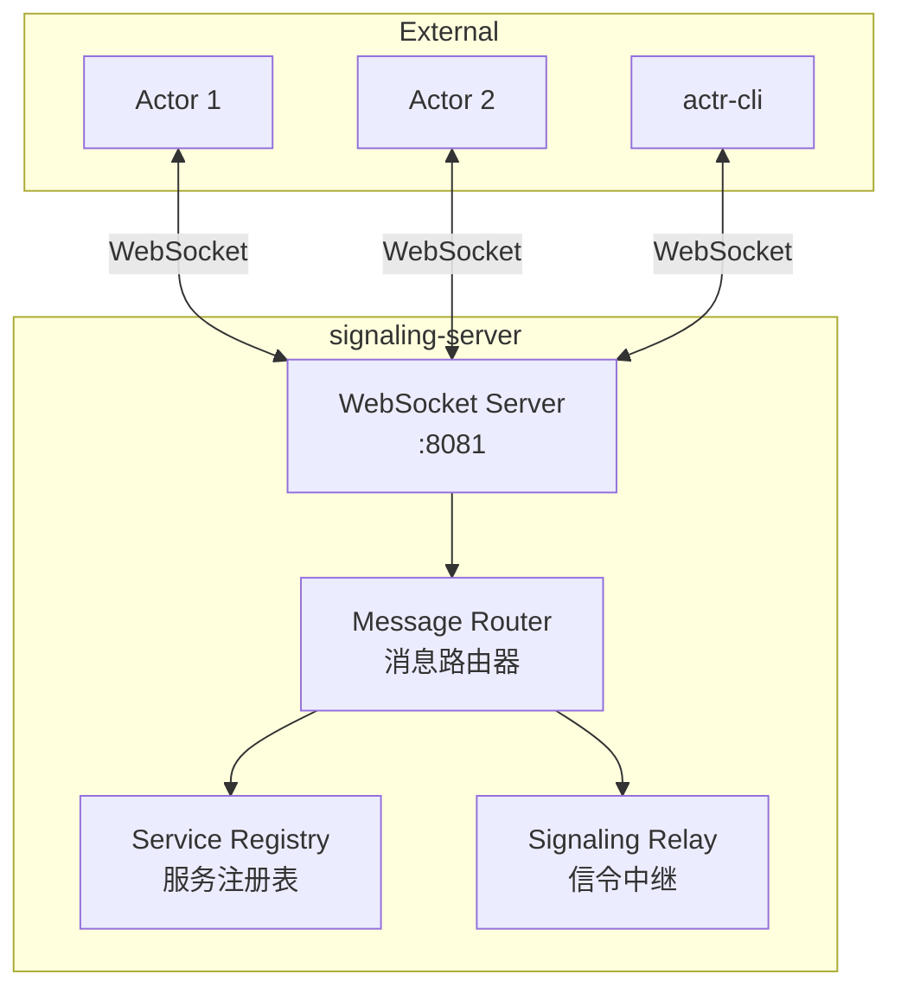
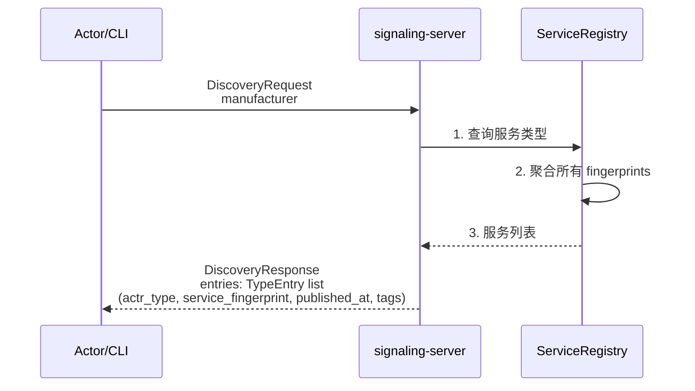
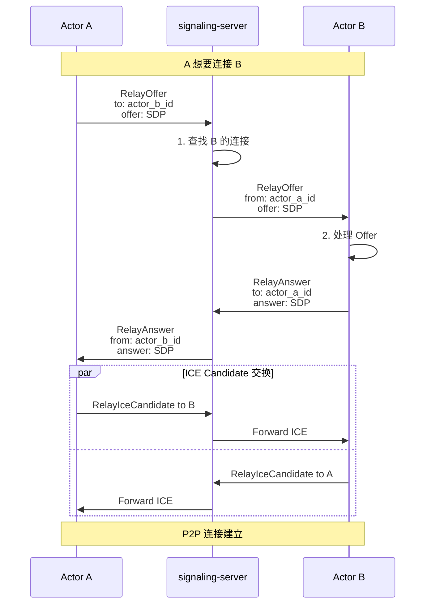

（路由/筛选策略）：
- availability/power_reserve/mailbox_backlog 用于排序与调度提示，不作为强制拒绝条件。
- 指标缺省时沿用上次值或默认策略，不因缺省而降级为 0；心跳超时或断线才标记下线。

## 1. 职责定位

`signaling-server` 是 actr 生态系统的中央协调节点，负责服务注册、发现和 WebRTC 信令中继。

**核心职责**：
- 服务注册与注销
- 服务发现与路由查询
- **兼容性协商**：执行并缓存服务间的兼容性检查，为客户端提供兼容的服务实例，并以此减轻客户端负担和抵御“惊群效应”。
- WebRTC 信令中继（Offer/Answer/ICE）
- 维护服务注册表

**边界**：
- 是独立的外部服务，不是框架库的一部分
- 只负责控制平面，不参与数据平面传输
- 使用 WebSocket 协议与 Actor 通信

## 2. 架构设计

### 2.1 核心组件



### 2.2 数据结构

#### 服务注册表

```rust
// src/registry.rs

use std::collections::HashMap;
use tokio::sync::RwLock;

/// 服务注册表
pub struct ServiceRegistry {
    /// ActrType -> 已注册的 Actor 列表
    services: RwLock<HashMap<ActrType, Vec<RegisteredActor>>>,
    /// ActrId -> WebSocket 连接
    connections: RwLock<HashMap<ActrId, WebSocketHandle>>,
}

/// 已注册的 Actor
pub struct RegisteredActor {
    pub actr_type: ActrType,
    pub realm: Realm,
    pub service_spec: Option<ServiceSpec>,
    pub acl: Option<Acl>,
    pub registered_at: i64,
    pub last_heartbeat: i64,
}

impl ServiceRegistry {
    /// 注册 Actor
    pub async fn register(
        &self,
        actor_id: ActrId,
        exports: Vec<ServiceSpec>,
        acl_rules: Vec<AclRule>,
        ws_handle: WebSocketHandle
    ) -> Result<()> {
        // 1. 分配 serial_number（如果未提供）
        let actor_id = self.assign_serial_number(actor_id).await?;

        // 2. 存储连接
        self.connections.write().await.insert(
            actor_id.clone(),
            ws_handle
        );

        // 3. 注册到服务表
        for service_spec in &exports {
            let actr_type = service_spec.actr_type.clone();
            let mut services = self.services.write().await;

            services.entry(actr_type)
                .or_insert_with(Vec::new)
                .push(RegisteredActor {
                    actor_id: actor_id.clone(),
                    exports: exports.clone(),
                    acl_rules: acl_rules.clone(),
                    registered_at: unix_timestamp(),
                    last_heartbeat: unix_timestamp(),
                });
        }

        Ok(())
    }

    /// 查询服务
    pub async fn discover(
        &self,
        target_type: &ActrType,
        required_fingerprint: Option<&str>
    ) -> Result<Vec<ActrId>> {
        let services = self.services.read().await;

        let candidates = services.get(target_type)
            .map(|actors| {
                actors.iter()
                    .filter(|actor| {
                        // fingerprint 匹配检查（如果指定）
                        if let Some(fp) = required_fingerprint {
                            actor.service_spec.as_ref()
                                .map(|spec| spec.fingerprint == fp)
                                .unwrap_or(false)
                        } else {
                            true  // 未指定 fingerprint，返回所有
                        }
                    })
                    .map(|actor| actor.actor_id.clone())
                    .collect()
            })
            .unwrap_or_default();

        Ok(candidates)
    }

    /// 注销 Actor
    pub async fn unregister(&self, actor_id: &ActrId) {
        // 移除连接
        self.connections.write().await.remove(actor_id);

        // 从服务表中移除
        let mut services = self.services.write().await;
        for (_, actors) in services.iter_mut() {
            actors.retain(|a| &a.actor_id != actor_id);
        }
    }
}
```

## 3. 核心流程

### 3.1 服务注册流程

```mermaid
sequenceDiagram
    participant Actor as Actor
    participant Server as signaling-server
    participant Registry as ServiceRegistry

    Actor->>Server: WebSocket 连接
    Server-->>Actor: 连接建立

    Actor->>Server: RegisterRequest<br/>actr_type + realm（无 serial_number）<br/>service_spec（可选）<br/>acl（可选）

    Server->>Registry: 1. 分配 serial_number
    Registry->>Registry: 2. 生成唯一序列号
    Registry-->>Server: 3. 完整的 ActrId

    Server->>Registry: 4. 注册服务
    Registry->>Registry: 5. 更新服务注册表
    Registry-->>Server: 6. 注册成功

    Server-->>Actor: RegisterResponse<br/>assigned_actor_id<br/>status: SUCCESS
```

**关键步骤**：
1. Actor 连接时提供 Realm 和 ActrType，但无 serial_number
2. Server 分配唯一的 serial_number
3. Server 维护服务注册表和 WebSocket 连接映射
4. 返回完整的 ActrId 给 Actor

### 3.2 服务发现流程

#### 3.2.1 响应载荷规范
- 标准字段：
  - service_fingerprint：按 package 指纹组合的服务指纹
  - service_version：组合服务版本字符串（确定性派生，便于快速兼容判定；不与“快车道”混淆）
  - packages：[{ name, version, fingerprint }]
  - availability（可选）：ServiceAvailabilityState
  - power_reserve/mailbox_backlog（可选）：0.0–1.0 的比例指标
- 匹配策略：
  - service_version 完全一致：快速兼容判定，直接归类为兼容。
  - 不一致：执行逐包兼容性分析（基于 actr-version），并缓存结果，仅返回 BackwardCompatible 的实例。
  - 注意：service_version 不一致时不得做近似推断，必须逐包展开。




**查询逻辑**：
- 按 manufacturer 过滤服务类型
- 返回所有可用的 fingerprints（包括历史版本）
- 客户端根据 tags 和发布时间选择合适的 fingerprint

### 3.3 WebRTC 信令中继流程



**中继规则**：
- Server 只负责转发，不解析 SDP 内容
- 根据 `to` 字段查找目标连接并转发
- 附加 `from` 字段标识发送者

## 4. 消息处理

### 4.1 消息路由器

```rust
// src/router.rs

use actr_protocol::SignalingEnvelope;

/// 消息路由器
pub struct MessageRouter {
    registry: Arc<ServiceRegistry>,
}

impl MessageRouter {
    /// 处理收到的消息
    pub async fn handle_message(
        &self,
        envelope: SignalingEnvelope,
        sender_id: Option<ActrId>
    ) -> Result<SignalingEnvelope> {
        match envelope.flow {
            Some(Flow::Register(req)) => {
                self.handle_register(req).await
            }

            Some(Flow::Discovery(req)) => {
                self.handle_discovery(req).await
            }

            Some(Flow::RouteCandidatesRequest(req)) => {
                self.handle_route_query(req).await
            }

            Some(Flow::RelayOffer(relay)) => {
                self.handle_relay_offer(relay, sender_id).await
            }

            Some(Flow::RelayAnswer(relay)) => {
                self.handle_relay_answer(relay, sender_id).await
            }

            Some(Flow::RelayIceCandidate(relay)) => {
                self.handle_relay_ice(relay, sender_id).await
            }

            _ => Err(RouterError::UnknownMessage),
        }
    }

    /// 处理注册请求
    async fn handle_register(
        &self,
        req: RegisterRequest
    ) -> Result<SignalingEnvelope> {
        let assigned_id = self.registry.register(
            req.actor_id,
            req.exports,
            req.acl_rules,
            // ... ws_handle
        ).await?;

        Ok(SignalingEnvelope {
            message_id: uuid::Uuid::new_v4().to_string(),
            flow: Some(Flow::RegisterResponse(RegisterResponse {
                assigned_actor_id: Some(assigned_id),
                status: ResponseStatus::Success as i32,
            })),
        })
    }

    /// 处理服务发现
    async fn handle_discovery(
        &self,
        req: DiscoveryRequest
    ) -> Result<SignalingEnvelope> {
        let entries = self.registry.discover_services(
            req.manufacturer.as_deref(),
            req.limit.unwrap_or(64) as usize
        ).await?;

        Ok(SignalingEnvelope {
            message_id: uuid::Uuid::new_v4().to_string(),
            flow: Some(Flow::DiscoveryResponse(DiscoveryResponse {
                result: Some(discovery_response::Result::Success(
                    discovery_response::DiscoveryOk { entries }
                ))
            })),
        })
    }

    /// 处理信令中继
    async fn handle_relay_offer(
        &self,
        relay: RelayOffer,
        sender_id: Option<ActrId>
    ) -> Result<()> {
        // 查找目标连接
        let target_ws = self.registry.get_connection(&relay.to).await?;

        // 构造转发消息
        let envelope = SignalingEnvelope {
            message_id: uuid::Uuid::new_v4().to_string(),
            flow: Some(Flow::RelayOffer(RelayOffer {
                from: sender_id,
                to: relay.to,
                offer: relay.offer,
            })),
        };

        // 转发
        target_ws.send(envelope).await?;
        Ok(())
    }
}
```

## 5. 实现细节

### 5.1 WebSocket 服务器

```rust
// src/main.rs

use tokio_tungstenite::accept_async;

#[tokio::main]
async fn main() -> Result<()> {
    let addr = "0.0.0.0:8081";
    let listener = TcpListener::bind(addr).await?;

    println!("Signaling server listening on: {}", addr);

    let registry = Arc::new(ServiceRegistry::new());
    let router = Arc::new(MessageRouter::new(registry.clone()));

    while let Ok((stream, peer_addr)) = listener.accept().await {
        let router = router.clone();
        let registry = registry.clone();

        tokio::spawn(async move {
            handle_connection(stream, peer_addr, router, registry).await
        });
    }

    Ok(())
}

async fn handle_connection(
    stream: TcpStream,
    peer_addr: SocketAddr,
    router: Arc<MessageRouter>,
    registry: Arc<ServiceRegistry>
) -> Result<()> {
    let ws_stream = accept_async(stream).await?;
    let (mut ws_sender, mut ws_receiver) = ws_stream.split();

    let mut actor_id: Option<ActrId> = None;

    while let Some(msg) = ws_receiver.next().await {
        let msg = msg?;

        if let Message::Binary(data) = msg {
            // 解析 SignalingEnvelope
            let envelope = SignalingEnvelope::decode(&data[..])?;

            // 路由处理
            match router.handle_message(envelope, actor_id.clone()).await {
                Ok(response) => {
                    // 编码并发送响应
                    let mut buf = Vec::new();
                    response.encode(&mut buf)?;
                    ws_sender.send(Message::Binary(buf)).await?;

                    // 如果是注册响应，保存 actor_id
                    if let Some(Flow::RegisterResponse(resp)) = response.flow {
                        actor_id = resp.assigned_actor_id;
                    }
                }
                Err(e) => {
                    error!("Router error: {}", e);
                }
            }
        }
    }

    // 连接关闭，注销 Actor
    if let Some(id) = actor_id {
        registry.unregister(&id).await;
    }

    Ok(())
}
```

### 5.2 心跳与健康检查

```rust
// src/health_check.rs

pub struct HealthChecker {
    registry: Arc<ServiceRegistry>,
    check_interval: Duration,
    timeout: Duration,
}

impl HealthChecker {
    /// 启动健康检查
    pub async fn start(self) {
        let mut interval = tokio::time::interval(self.check_interval);

        loop {
            interval.tick().await;
            self.check_all_actors().await;
        }
    }

    /// 检查所有 Actor
    async fn check_all_actors(&self) {
        let now = unix_timestamp();
        let services = self.registry.services.read().await;

        for (actr_type, actors) in services.iter() {
            for actor in actors {
                // 检查心跳超时
                if now - actor.last_heartbeat > self.timeout.as_secs() as i64 {
                    warn!("Actor {} timed out, unregistering", actor.actor_id);
                    self.registry.unregister(&actor.actor_id).await;
                }
            }
        }
    }
}
```

## 6. 配置

```toml
# signaling-server.toml

[server]
host = "0.0.0.0"
port = 8081

[health_check]
interval_secs = 30      # 健康检查间隔
timeout_secs = 90       # 心跳超时时间

[logging]
level = "info"
```

## 7. 部署

### 7.1 独立部署

```bash
# 编译
cargo build --release --bin signaling-server

# 运行
./target/release/signaling-server --config signaling-server.toml
```

### 7.2 Docker 部署

```dockerfile
FROM rust:1.75 as builder
WORKDIR /app
COPY . .
RUN cargo build --release --bin signaling-server

FROM debian:bookworm-slim
COPY --from=builder /app/target/release/signaling-server /usr/local/bin/
EXPOSE 8081
CMD ["signaling-server"]
```

## 8. 安全考虑

### 8.1 认证与授权

```rust
// 可选：实现 Token 认证
impl ServiceRegistry {
    async fn verify_token(&self, token: &str) -> Result<Realm> {
        // 验证 JWT 或其他认证令牌
        // 返回允许的 Realm
    }
}
```

### 8.2 ACL 检查

```rust
// 基于 ACL 规则过滤服务发现结果
impl ServiceRegistry {
    async fn filter_by_acl(
        &self,
        requester: &ActrId,
        candidates: Vec<RegisteredActor>
    ) -> Vec<RegisteredActor> {
        candidates.into_iter()
            .filter(|actor| {
                actor.acl_rules.iter().any(|rule| {
                    self.matches_acl(rule, requester)
                })
            })
            .collect()
    }
}
```

## 9. 监控与运维

### 9.1 指标采集

```rust
// 导出 Prometheus 指标
use prometheus::{IntCounter, IntGauge};

lazy_static! {
    static ref REGISTERED_ACTORS: IntGauge = IntGauge::new(
        "signaling_registered_actors",
        "Number of registered actors"
    ).unwrap();

    static ref DISCOVERY_REQUESTS: IntCounter = IntCounter::new(
        "signaling_discovery_requests_total",
        "Total discovery requests"
    ).unwrap();
}
```

### 9.2 日志

```rust
use tracing::{info, warn, error};

// 结构化日志
info!(
    actor_id = %actor_id,
    service_type = %actr_type,
    "Actor registered successfully"
);
```

## 10. 设计原则

### 10.1 无状态中继
只负责转发信令，不存储会话状态，便于水平扩展。

### 10.2 简单协议
使用 Protobuf + WebSocket，协议简单清晰。

### 10.3 容错优先
断线或心跳超时即标记下线（UNAVAILABLE），并触发下线事件；避免残留脏数据。

### 10.4 可观测性
提供完整的日志和指标，便于运维。
