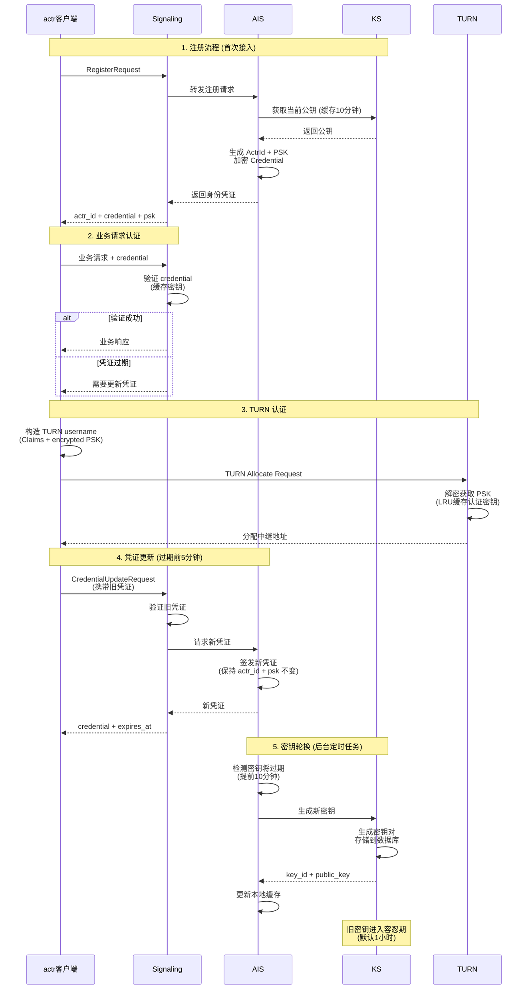

# 5. Actrix 安全与认证体系

本章节概述 Actrix 系统的完整安全认证架构，包括注册、认证、TURN 认证、凭证更新和密钥轮换五个核心流程。

## 5.1 系统架构概览

Actrix 认证系统由以下核心组件构成：

```
┌─────────┐     ┌──────────────┐     ┌────────┐     ┌────────┐
│  actr   │────▶│  Signaling   │────▶│  AIS   │────▶│   KS   │
│ 客户端   │     │  信令服务器   │     │ 认证服务│     │密钥服务 │
└─────────┘     └──────────────┘     └────────┘     └────────┘
     │                  │                   │             │
     │                  │                   │             │
     │                  ▼                   ▼             ▼
     │              路由转发            凭证签发       密钥管理
     │              凭证验证            身份验证       密钥轮换
     │
     │          ┌──────────────┐
     └─────────▶│     TURN     │
                │  中继服务器   │
                └──────────────┘
                        │
                        ▼
                  媒体中继认证
                  LRU 缓存
```

**核心组件职责**：

| 组件 | 职责 | 关键功能 |
|-----|------|---------|
| **actr 客户端** | 身份管理 | 持有凭证、发起认证、TURN 连接 |
| **Signaling** | 路由转发 | 消息路由、凭证验证、容忍期判断 |
| **AIS** | 凭证签发 | 生成凭证、身份验证、密钥缓存 |
| **KS** | 密钥管理 | 生成密钥对、密钥轮换、容忍期配置 |
| **TURN** | 媒体中继 | NAT 穿透、PSK 认证、缓存优化 |

**核心概念**：

| 概念 | 说明 |
|-----|------|
| **ActrId** | 全局唯一的 Actor 标识符（Snowflake 算法生成） |
| **Credential** | 加密的身份凭证（ECIES 加密的 IdentityClaims） |
| **PSK** | 预共享密钥，用于 TURN 认证（32 字节随机数） |
| **Key ID** | 密钥版本标识符，支持密钥轮换 |
| **Realm** | 安全域/租户，用于多租户隔离 |
| **Tolerance Period** | 容忍期，密钥过期后的缓冲时间（默认 3600 秒） |

---

## 5.2 完整认证流程图（简化版）



---

## 5.3 核心流程详解

### 5.3.1 注册流程

**目的**：首次接入系统，获取身份凭证

**关键步骤**：
1. actr 发送 `RegisterRequest`（包含 actr_type、realm）
2. Signaling 验证 Realm 有效性
3. AIS 从 KS 获取当前公钥（优先使用缓存）
4. AIS 生成唯一 ActrId（Snowflake 算法）
5. AIS 生成随机 PSK（32 字节）
6. AIS 使用公钥加密 IdentityClaims，生成 Credential
7. 返回 `actr_id` + `credential` + `psk`

**缓存优化**：
- CurrentKeyCache（AIS）：10 分钟 TTL
- 减少 99% 的 KS 调用

**关键代码位置**：
- `actrix/crates/signaling/src/server.rs` (Realm 验证)
- `actrix/crates/ais/src/issuer.rs` (凭证签发)

👉 **详细文档**：[5.1-registration-flow.md](./5.1-registration-flow.md)

---

### 5.3.2 业务请求认证

**目的**：验证每次业务请求的身份合法性

**关键步骤**：
1. actr 发送 `ActrToSignaling` 消息（携带 credential）
2. Signaling 提取 `token_key_id`
3. Signaling 从 SQLite 缓存或 KS 获取密钥信息（包含 `secret_key`、`expires_at`、`tolerance_seconds`）
4. Signaling 使用 ECIES 解密 credential
5. Signaling 验证 Claims（realm_id、actor_id、过期时间）
6. Signaling 判断密钥是否在容忍期内：
   - 如果 `expires_at < now <= expires_at + tolerance_seconds`，则在容忍期
   - 如果 `now > expires_at + tolerance_seconds`，密钥已完全失效
7. 如果密钥在容忍期内，向 actr 发送续期提示
8. 认证成功后处理业务逻辑

**缓存优化**：
- KeyCache（Signaling）：SQLite 持久化缓存（支持多版本密钥）
- 缓存包含：`secret_key`、`expires_at`、`tolerance_seconds`
- 缓存命中率 > 95%

**容忍期机制**：
- KS 返回真实的 `expires_at`（不再包含容忍期）
- KS 同时返回 `tolerance_seconds`（默认 3600 秒）
- Signaling 根据 `expires_at` 和 `tolerance_seconds` 自行判断是否在容忍期
- 容忍期内的密钥可以继续使用，但会提示客户端更新凭证
- 超过容忍期的密钥将被拒绝

**容忍期判断逻辑**：
```rust
// expires_at: 密钥过期时间（Unix 时间戳）
// tolerance_seconds: 容忍期时长（秒）
// now: 当前时间（Unix 时间戳）

let in_tolerance_period = if expires_at > 0 {
    // 在容忍期内：已过期但未超过容忍期
    expires_at < now && now <= expires_at + tolerance_seconds
} else {
    false // 永不过期的密钥不在容忍期
};
```

**关键代码位置**：
- `actrix/crates/common/src/aid/credential/validator.rs` (容忍期判断)
- `actrix/crates/common/src/aid/key_cache.rs` (SQLite 缓存)
- `actrix/crates/signaling/src/authenticator.rs` (认证流程)

👉 **详细文档**：[5.2-authentication-flow.md](./5.2-authentication-flow.md)

---

### 5.3.3 TURN 认证

**目的**：通过 TURN 协议建立媒体中继连接

**关键步骤**：
1. actr 构造 TURN username（JSON 格式的 Claims）
   - `tenant_id`：租户 ID
   - `key_id`：加密密钥 ID
   - `encrypted_token`：加密的 Token（包含 PSK）
2. actr 发送 TURN Allocate Request
3. TURN 服务器检查 LRU 缓存（容量 4096）
4. 缓存未命中时，解密 Token 获取 PSK
5. 计算认证密钥：`MD5(username:realm:psk)`
6. 缓存认证密钥供后续使用
7. 验证租户状态，分配中继地址

**缓存优化**：
- LRU Cache（TURN）：4096 条目
- 缓存命中率 > 90%
- 性能提升 9.6 倍

**关键代码位置**：
- `actrix/crates/turn/src/authenticator.rs`
- `actr/crates/protocol/src/turn.rs`

👉 **详细文档**：[5.3-turn-authentication.md](./5.3-turn-authentication.md)

---

### 5.3.4 凭证更新

**目的**：在凭证过期前无缝续期，保持身份连续性

**关键步骤**：
1. actr 监测凭证即将过期（默认提前 5 分钟）
2. actr 发送 `CredentialUpdateRequest`（携带旧凭证）
3. Signaling 验证旧凭证的有效性
4. Signaling 向 AIS 请求新凭证
5. AIS 查询 actr_id 的现有信息（验证一致性）
6. AIS 获取当前公钥（可能已轮换）
7. AIS 签发新凭证（**保持 actr_id 和 PSK 不变**）
8. 返回新 credential 和 expires_at

**连续性保证**：

| 字段 | 注册时 | 续期后 | 说明 |
|------|--------|--------|------|
| actr_id | 生成 | **不变** ✅ | 身份连续性 |
| psk | 生成 | **不变** ✅ | 加密密钥一致 |
| key_id | 当前密钥 | **可能变** | 密钥轮换时更新 |
| expires_at | T+1h | **延长** | 续期目的 |

**关键代码位置**：
- `actrix/crates/signaling/src/credential_verifier.rs`
- `actrix/crates/ais/src/issuer.rs`

👉 **详细文档**：[5.4-credential-update.md](./5.4-credential-update.md)

---

### 5.3.5 密钥轮换

**目的**：定期更换加密密钥，降低密钥泄露风险

**关键步骤**：
1. AIS 后台任务每 10 分钟检查密钥状态
2. 检测到密钥将在 10 分钟内过期
3. AIS 向 KS 发起 `GenerateKeyRequest`
4. KS 生成新 ECC 密钥对（secp256k1）
5. KS 存储密钥到 SQLite 数据库
6. KS 返回 `key_id` + `public_key` + `expires_at`
7. AIS 更新 CurrentKeyCache
8. 旧密钥进入容忍期（默认 1 小时）

**时间线示例**：

```
T0: 生成 key_id=5, expires_at=T0+24h
├─ T0+23h50m: AIS 检测到即将过期
│  └─ 触发生成 key_id=6
│  └─ AIS 切换到使用 key_id=6
│
├─ T0+24h: key_id=5 过期，进入容忍期
│  └─ 旧凭证仍可验证 ✅
│
└─ T0+25h: 容忍期结束
   └─ key_id=5 完全失效
```

**容忍期作用**：
- 保护已签发的凭证
- 容错缓冲（时钟偏差、缓存传播延迟）
- 平滑过渡（零中断轮换）

**关键代码位置**：
- `actrix/crates/ais/src/storage.rs` (轮换检测)
- `actrix/crates/ks/src/handlers.rs` (密钥生成)

👉 **详细文档**：[5.5-key-rotation.md](./5.5-key-rotation.md)