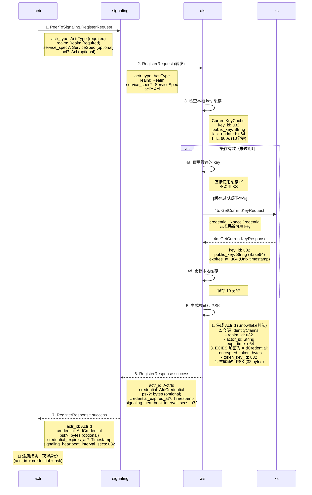

# Actrix 注册流程 (PeerToSignaling.RegisterRequest)

> **关于 `?` 符号**：在参数描述中，`?` 表示该字段是 **optional**（可选的），即该字段可以为空。  
> 例如：`service_spec?: ServiceSpec` 表示 `service_spec` 字段可以不提供。  
> 在 Protocol Buffers 中，对应 `optional` 修饰符。

## 流程概述

首次注册流程是 actr 向系统申请身份凭证的过程。actr 通过 signaling 服务器向 AIS（认证服务）发起注册请求，AIS 会生成唯一的 ActrId、加密的凭证（Credential）以及预共享密钥（PSK）。

## 时序图



---

## 协议详解

### 步骤 1-2: RegisterRequest

**Proto 定义** (`actr/crates/protocol/proto/actr.proto:130-137`):
```protobuf
message RegisterRequest {
  required ActrType actr_type = 1;      // Actor 类型（厂商 + 名称）
  required Realm realm = 2;             // 安全域/租户
  optional ServiceSpec service_spec = 3; // API 规范（可选）
  optional Acl acl = 4;                 // 访问控制列表（可选）
}

message ActrType {
  required string manufacturer = 1;  // 厂商名称，如 "apple"
  required string name = 2;          // 设备名称，如 "iphone"
}

message Realm {
  required uint32 realm_id = 1;      // 租户 ID
}
```

**流程**:
1. actr 构造 `RegisterRequest` 消息
2. 包装到 `PeerToSignaling` (用于未认证的 peer)
3. 通过 WebSocket 发送到 signaling 服务器
4. signaling 转发到 AIS 进行处理

---

### 步骤 3-4: 获取加密密钥

**缓存优化** (`actrix/crates/ais/src/issuer.rs`):

```rust
async fn get_current_public_key(&self) -> Result<(u32, String)> {
    // 1. 优先使用本地缓存
    {
        let cache = self.current_key_cache.read().await;
        if !self.is_cache_expired(&cache) {
            return Ok((cache.key_id, cache.public_key.clone()));  // ✅ 缓存命中
        }
    }
    
    // 2. 缓存过期，调用 KS
    let response = self.ks_client.get_current_key().await?;
    
    // 3. 更新缓存（10 分钟 TTL）
    let mut cache = self.current_key_cache.write().await;
    cache.key_id = response.key_id;
    cache.public_key = response.public_key;
    cache.last_updated = SystemTime::now().as_secs();
    
    Ok((cache.key_id, cache.public_key.clone()))
}
```

**性能优势**:
- **缓存命中率**: > 99%
- **KS 调用频率**: 每 10 分钟最多 1 次（而非每次注册）
- **并发性能**: 支持数千并发注册请求

**KS 响应** (`actrix/crates/actrix-proto/proto/keyserver.proto`):
```protobuf
message GetCurrentKeyResponse {
  required uint32 key_id = 1;        // 当前活跃的 key ID
  required string public_key = 2;    // Base64 编码的 ECIES 公钥
  required uint64 expires_at = 3;    // 密钥过期时间（Unix 时间戳）
}
```

---

### 步骤 5: 生成凭证和 PSK

**实现细节** (`actrix/crates/ais/src/issuer.rs:420-470`):

```rust
async fn issue_credential_inner(&self, request: &RegisterRequest) 
    -> Result<register_response::RegisterOk, AidError> 
{
    // 1. 生成唯一的 ActrId（Snowflake 算法，保证全局唯一）
    let actr_id = ActrId {
        realm: request.realm.clone(),
        serial_number: Snowflake::next_id(realm.realm_id),  // 64-bit 唯一 ID
        type: request.actr_type.clone(),
    };
    
    // 2. 创建身份声明
    let expr_time = SystemTime::now().as_secs() + self.config.token_ttl_secs; // 默认 3600s
    let claims = IdentityClaims {
        realm_id: request.realm.realm_id,
        actor_id: actr_id.to_string(),  // 格式: "manufacturer:name@serial_hex:realm_id"
        expr_time,
    };
    
    // 3. 使用 ECIES 加密 Claims
    let (key_id, public_key) = self.get_current_public_key().await?;
    let claims_json = serde_json::to_vec(&claims)?;
    let encrypted_token = ecies::encrypt(&public_key, &claims_json)?;
    
    // 4. 构造 AIdCredential
    let credential = AIdCredential {
        encrypted_token: Bytes::from(encrypted_token),
        token_key_id: key_id,
    };
    
    // 5. 生成随机 PSK（用于 TURN 认证）
    let mut psk = vec![0u8; 32];
    rand::thread_rng().fill_bytes(&mut psk);
    
    // 6. 返回注册成功响应
    Ok(register_response::RegisterOk {
        actr_id,
        credential,
        psk: Some(Bytes::from(psk)),
        credential_expires_at: Some(Timestamp {
            seconds: expr_time as i64,
            nanos: 0,
        }),
        signaling_heartbeat_interval_secs: self.config.signaling_heartbeat_interval_secs,
    })
}
```

**关键组件**:

1. **ActrId 结构**:
   ```
   示例: apple:iphone@1a2b3c4d5e6f:12345
   ├─ manufacturer: "apple"
   ├─ name: "iphone"
   ├─ serial_number: 0x1a2b3c4d5e6f (Snowflake ID)
   └─ realm_id: 12345
   ```

2. **IdentityClaims**:
   ```json
   {
     "realm_id": 12345,
     "actor_id": "apple:iphone@1a2b3c4d5e6f:12345",
     "expr_time": 1733700000
   }
   ```

3. **AIdCredential**:
   ```
   {
     "encrypted_token": [ECIES 加密的 IdentityClaims],
     "token_key_id": 5
   }
   ```

---

### 步骤 6-7: RegisterResponse

**Proto 定义** (`actr/crates/protocol/proto/actr.proto:139-156`):
```protobuf
message RegisterResponse {
  message RegisterOk {
    required ActrId actr_id = 1;                             // 分配的身份 ID
    required AIdCredential credential = 2;                    // 加密凭证
    optional bytes psk = 3;                                  // 预共享密钥（32 bytes）
    optional google.protobuf.Timestamp credential_expires_at = 4;  // 凭证过期时间
    required uint32 signaling_heartbeat_interval_secs = 5;   // 心跳间隔（通常 30 秒）
  }
  
  oneof result {
    RegisterOk success = 1;
    ErrorResponse error = 2;
  }
}
```

**客户端处理**:
```rust
// actr 收到响应后
match response.result {
    Some(register_response::Result::Success(ok)) => {
        // 保存身份信息
        self.actr_id = ok.actr_id;
        self.credential = ok.credential;
        self.psk = ok.psk.unwrap_or_default();
        self.credential_expires_at = ok.credential_expires_at;
        
        // 启动心跳定时器
        self.start_heartbeat(ok.signaling_heartbeat_interval_secs);
        
        info!("Registration successful: actr_id={}", self.actr_id);
    }
    Some(register_response::Result::Error(err)) => {
        error!("Registration failed: code={}, message={}", err.code, err.message);
    }
    None => {
        error!("Invalid RegisterResponse");
    }
}
```

---

## 安全性说明

### 1. 身份唯一性

- **Snowflake 算法**: 确保 serial_number 全局唯一
  - 时间戳（41 bits）
  - 机器 ID（10 bits）
  - 序列号（12 bits）
  - 每毫秒可生成 4096 个 ID

### 2. 凭证加密

- **ECIES (Elliptic Curve Integrated Encryption Scheme)**
  - 基于 secp256k1 椭圆曲线
  - 混合加密（ECDH + AES-GCM）
  - 前向安全性

### 3. PSK 随机性

- **加密安全的随机数生成器**
  - 256-bit 熵（32 bytes）
  - 用于 TURN 认证
  - 每次注册独立生成

---

## 配置参数

**AIS 配置** (`actrix/crates/ais/src/issuer.rs`):
```rust
pub struct IssuerConfig {
    pub token_ttl_secs: u64,                        // Credential 有效期（默认 3600s = 1小时）
    pub signaling_heartbeat_interval_secs: u32,     // 心跳间隔（默认 30s）
    pub key_refresh_interval_secs: u64,             // Key 缓存刷新（默认 600s = 10分钟）
}
```

**推荐配置**:
- **生产环境**: token_ttl = 3600s (1小时)
- **开发环境**: token_ttl = 7200s (2小时)
- **高安全场景**: token_ttl = 1800s (30分钟)

---

## 错误处理

### 常见错误

| 错误码 | 错误信息 | 原因 | 解决方案 |
|--------|---------|------|---------|
| 400 | Invalid realm | 租户不存在或已禁用 | 检查 realm_id |
| 403 | ACL validation failed | ACL 规则冲突 | 修正 ACL 配置 |
| 500 | Key generation failed | KS 不可用 | 检查 KS 服务状态 |
| 503 | Service unavailable | AIS 过载 | 重试或限流 |

### 客户端重试策略

```rust
async fn register_with_retry(&mut self) -> Result<()> {
    let mut retry_count = 0;
    let max_retries = 3;
    
    loop {
        match self.register().await {
            Ok(response) => return Ok(response),
            Err(e) if retry_count < max_retries => {
                warn!("Registration failed (attempt {}): {}", retry_count + 1, e);
                retry_count += 1;
                tokio::time::sleep(Duration::from_secs(2u64.pow(retry_count))).await;
            }
            Err(e) => return Err(e),
        }
    }
}
```

---

## 性能指标

### 注册性能

- **单次注册延迟**: < 50ms (99th percentile)
- **吞吐量**: > 1000 req/s (单 AIS 实例)
- **KS 调用频率**: 1 次 / 10分钟（缓存优化）

### 缓存效率

```
场景：1 分钟内 1000 个注册请求

无缓存：
├─ KS 调用次数: 1000 次
├─ 总延迟: ~5000ms (5ms × 1000)
└─ KS 成为瓶颈

有缓存：
├─ KS 调用次数: 1 次（首次）
├─ 后续 999 次缓存命中
├─ 总延迟: ~50ms (5ms + 999 × 0.05ms)
└─ 性能提升 100 倍 ✅
```

---

## 相关文档

- [业务请求认证流程](./2-authentication-flow.md)
- [TURN 认证流程](./3-turn-authentication.md)
- [凭证更新流程](./4-credential-update.md)
- [密钥轮换策略](./5-key-rotation.md)
