# Actrix 注册流程 (PeerToSignaling.RegisterRequest)

> **关于 `?` 符号**：在参数描述中，`?` 表示该字段是 **optional**（可选的），即该字段可以为空。  
> 例如：`service_spec?: ServiceSpec` 表示 `service_spec` 字段可以不提供。  
> 在 Protocol Buffers 中，对应 `optional` 修饰符。

## 流程概述

首次注册流程是 actr 向系统申请身份凭证的过程。actr 通过 signaling 服务器向 AIS（认证服务）发起注册请求，AIS 会生成唯一的 ActrId、加密的凭证（Credential）以及预共享密钥（PSK）。

## 时序图

```mermaid
sequenceDiagram
    participant actr as actr
    participant signaling as signaling
    participant ais as ais
    participant ks as ks

    %% ========== 首次注册流程 ==========
    actr->>signaling: 1. PeerToSignaling.RegisterRequest
    Note right of actr: actr_type: ActrType (required)<br/>realm: Realm (required)<br/>service_spec?: ServiceSpec (optional)<br/>acl?: Acl (optional)

    signaling->>signaling: 2. RealmEntity::validate_realm
    Note right of signaling: 验证 Realm 是否存在、未过期、状态正常

    signaling->>ais: 3. RegisterRequest (转发)
    Note right of signaling: actr_type: ActrType<br/>realm: Realm<br/>service_spec?: ServiceSpec<br/>acl?: Acl

    ais->>ais: 4. 检查本地 key 缓存
    Note right of ais: KeyCache:<br/>  key_id: u32<br/>  public_key: PublicKey<br/>  expires_at: u64<br/>  tolerance_seconds: u64

    alt 缓存有效（未过期）
        ais->>ais: 5a. 使用缓存的 key
        Note right of ais: 直接使用缓存 ✅<br/>不调用 KS
        
    else 缓存过期或不存在
        ais->>ks: 5b. GenerateKeyRequest
        Note right of ais: credential: NonceCredential<br/>请求最新可用 key
        
        ks-->>ais: 5c. GenerateKeyResponse
        Note left of ks: key_id: u32<br/>public_key: String (Base64)<br/>expires_at: u64 (Unix timestamp)<br/>tolerance_seconds: u64
        
        ais->>ais: 5d. 更新本地缓存
    end

    ais->>ais: 6. 生成凭证和 PSK
    Note right of ais: 1. 生成 ActrId (Snowflake算法)<br/>2. 创建 IdentityClaims:<br/>   - realm_id: u32<br/>   - actor_id: String<br/>   - expr_time: u64<br/>3. ECIES 加密为 AIdCredential:<br/>   - encrypted_token: bytes<br/>   - token_key_id: u32<br/>4. 生成随机 PSK (32 bytes)
    
    ais-->>signaling: 7. RegisterResponse.success
    Note left of ais: actr_id: ActrId<br/>credential: AIdCredential<br/>psk?: bytes (optional)<br/>credential_expires_at?: Timestamp<br/>signaling_heartbeat_interval_secs: u32
    
    signaling-->>actr: 8. RegisterResponse.success
    Note left of signaling: actr_id: ActrId<br/>credential: AIdCredential<br/>psk?: bytes (optional)<br/>credential_expires_at?: Timestamp<br/>signaling_heartbeat_interval_secs: u32

    Note over actr: 🔑 注册成功，获得身份<br/>(actr_id + credential + psk)
```



---

## 协议详解

### 步骤 1-2: RegisterRequest

**Proto 定义** (`actr/crates/protocol/proto/actr.proto:130-137`):
```protobuf
message RegisterRequest {
  required ActrType actr_type = 1;      // Actor 类型（厂商 + 名称）
  required Realm realm = 2;             // 安全域/租户
  optional ServiceSpec service_spec = 3; // API 规范（可选）
  optional Acl acl = 4;                 // 访问控制列表（可选）
}

message ActrType {
  required string manufacturer = 1;  // 厂商名称，如 "apple"
  required string name = 2;          // 设备名称，如 "iphone"
}

message Realm {
  required uint32 realm_id = 1;      // 租户 ID
}
```

**流程**:
1. actr 构造 `RegisterRequest` 消息
2. 包装到 `PeerToSignaling` (用于未认证的 peer)
3. 通过 WebSocket 发送到 signaling 服务器
4. signaling 服务器验证 Realm：调用 `RealmEntity::validate_realm(realm_id)` 检查 Realm 是否存在、未过期且状态正常
5. signaling 转发到 AIS 进行处理

---

### 步骤 2: Realm 验证

**实现位置** (`actrix/crates/signaling/src/server.rs:380-395`):

```rust
// 验证 RegisterRequest 中的 realm 是否存在、未过期、状态正常
let realm_id = register_request.realm.realm_id;
if let Err(e) = RealmEntity::validate_realm(realm_id).await {
    warn!("⚠️  RegisterRequest realm 验证失败: {}", e);
    // 使用 register-specific 错误响应
    send_register_error(
        client_id,
        403,
        &format!("Realm validation failed: {}", e),
        server,
        request_envelope_id,
    )
    .await?;
    return Ok(());
}
```

**验证逻辑** (`actrix/crates/common/src/realm/validation.rs:21-40`):

```rust
pub async fn validate_realm(realm_id: u32) -> Result<Realm, String> {
    let realm = Self::get_by_realm_id(realm_id)
        .await
        .map_err(|e| format!("Failed to query realm: {}", e))?
        .ok_or_else(|| format!("Realm {} not found", realm_id))?;

    if realm.is_expired() {
        return Err(format!("Realm {} has expired", realm_id));
    }

    if realm.status() != RealmStatus::Normal {
        return Err(format!(
            "Realm {} is not in Normal status (current: {})",
            realm_id,
            realm.status()
        ));
    }

    Ok(realm)
}
```

**验证规则**:
1. **存在性检查**: Realm ID 必须在数据库中存在
2. **过期检查**: `expires_at` 时间戳不能早于当前时间
3. **状态检查**: Realm 状态必须为 `Normal`（不能是 `Suspended` 或 `Terminated`）

**错误响应**:
- **403 Forbidden**: 当 Realm 验证失败时返回
- 错误信息包含具体的失败原因（不存在/过期/状态异常）
- 阻止请求继续转发到 AIS，避免无效注册

---

### 步骤 4-5: 获取加密密钥

**缓存优化** (`actrix/crates/ais/src/issuer.rs`):

```rust
/// 确保密钥已加载
async fn ensure_key_loaded(&self) -> Result<(), AidError> {
    // 先尝试从缓存加载
    if self.key_cache.read().await.is_some() {
        debug!("Key already in cache");
        return Ok(());
    }

    // 尝试从存储加载
    if let Some(record) = self.key_storage.get_current_key().await.map_err(|e| {
        AidError::GenerationFailed(format!("Failed to get key from storage: {e}"))
    })? {
        // 检查是否过期超出容忍时间
        if self
            .key_storage
            .is_expired_beyond_tolerance()
            .await
            .map_err(|e| AidError::GenerationFailed(e.to_string()))?
        {
            warn!("Stored key expired beyond tolerance, fetching new key from KS");
            self.refresh_key_from_ks().await?;
        } else {
            debug!("Loaded key from storage: key_id={}", record.key_id);
            self.load_key_from_record(&record)?;
        }
    } else {
        // 没有存储的密钥，从 KS 获取
        info!("No stored key found, fetching from KS");
        self.refresh_key_from_ks().await?;
    }

    Ok(())
}
```

**性能优势**:
- **缓存命中率**: > 99%
- **KS 调用频率**: 每 10 分钟最多 1 次（而非每次注册）
- **并发性能**: 支持数千并发注册请求

**KS 响应** (`actrix/crates/actrix-proto/proto/keyserver.proto`):
```protobuf
message GenerateKeyResponse {
  required uint32 key_id = 1;        // 生成的密钥 ID
  required string public_key = 2;    // Base64 编码的 ECIES 公钥
  required uint64 expires_at = 3;    // 密钥过期时间（Unix 时间戳）
  required uint64 tolerance_seconds = 4; // 容忍期（秒）
}
```

---

### 步骤 6-7: 生成凭证和 PSK

**实现细节** (`actrix/crates/ais/src/issuer.rs:419-494`):

```rust
/// 内部处理逻辑
async fn issue_credential_inner(
    &self,
    request: &RegisterRequest,
) -> Result<register_response::RegisterOk, AidError> {
    // 确保有可用的密钥
    self.ensure_key_loaded().await?;

    // 生成 ActrId
    let actr_id = self.generate_actr_id(&request.actr_type, &request.realm)?;

    // 生成过期时间
    let expr_time = self.calculate_expiry_time();

    // 生成 PSK (pre-shared key)
    let psk = self.generate_psk()?;

    // 创建 Claims（包含 PSK）
    let claims = IdentityClaims::from_actr_id(&actr_id, expr_time, psk.clone());

    // 从缓存获取密钥
    let (key_id, public_key) = {
        let cache = self.key_cache.read().await;
        let cache = cache
            .as_ref()
            .ok_or_else(|| AidError::GenerationFailed("No key available".to_string()))?;
        (cache.key_id, cache.public_key)
    };

    // 生成加密的 credential
    let encrypted_token = self.encrypt_claims(&claims, &public_key)?;

    // 创建 AIdCredential
    let credential = AIdCredential {
        encrypted_token: Bytes::from(encrypted_token),
        token_key_id: key_id,
    };

    // 创建过期时间的 Timestamp
    let credential_expires_at = Some(Timestamp {
        seconds: expr_time as i64,
        nanos: 0,
    });

    Ok(register_response::RegisterOk {
        actr_id,
        credential,
        psk: Some(Bytes::from(psk)),
        credential_expires_at,
        signaling_heartbeat_interval_secs: self.config.signaling_heartbeat_interval_secs,
    })
}
```

**关键组件**:

1. **ActrId 结构**:
   ```
   示例: apple:iphone@1a2b3c4d5e6f:12345
   ├─ manufacturer: "apple"
   ├─ name: "iphone"
   ├─ serial_number: 0x1a2b3c4d5e6f (Snowflake ID)
   └─ realm_id: 12345
   ```

2. **IdentityClaims**:
   ```json
   {
     "realm_id": 12345,
     "actor_id": "apple:iphone@1a2b3c4d5e6f:12345",
     "expr_time": 1733700000,
     "psk": [32 bytes PSK]
   }
   ```

3. **AIdCredential**:
   ```
   {
     "encrypted_token": [ECIES 加密的 IdentityClaims],
     "token_key_id": 5
   }
   ```

---

### 步骤 8: RegisterResponse

**Proto 定义** (`actr/crates/protocol/proto/actr.proto:139-156`):
```protobuf
message RegisterResponse {
  message RegisterOk {
    required ActrId actr_id = 1;                             // 分配的身份 ID
    required AIdCredential credential = 2;                    // 加密凭证
    optional bytes psk = 3;                                  // 预共享密钥（32 bytes）
    optional google.protobuf.Timestamp credential_expires_at = 4;  // 凭证过期时间
    required uint32 signaling_heartbeat_interval_secs = 5;   // 心跳间隔（通常 30 秒）
  }
  
  oneof result {
    RegisterOk success = 1;
    ErrorResponse error = 2;
  }
}
```

**客户端处理**:
```rust
// actr 收到响应后
match response.result {
    Some(register_response::Result::Success(ok)) => {
        // 保存身份信息
        self.actr_id = ok.actr_id;
        self.credential = ok.credential;
        self.psk = ok.psk.unwrap_or_default();
        self.credential_expires_at = ok.credential_expires_at;
        
        // 启动心跳定时器
        self.start_heartbeat(ok.signaling_heartbeat_interval_secs);
        
        info!("Registration successful: actr_id={}", self.actr_id);
    }
    Some(register_response::Result::Error(err)) => {
        error!("Registration failed: code={}, message={}", err.code, err.message);
    }
    None => {
        error!("Invalid RegisterResponse");
    }
}
```

---

## 安全性说明

### 1. 身份唯一性

- **Snowflake 算法**: 确保 serial_number 全局唯一（54-bit）
  - 时间戳（41 bits）：相对于 2023-01-01 的毫秒数
  - Worker ID（5 bits）：节点标识 (0-31)
  - 序列号（8 bits）：同毫秒内的序列号 (0-255)
  - 单节点支持 256K IDs/秒

### 2. 凭证加密

- **ECIES (Elliptic Curve Integrated Encryption Scheme)**
  - 基于 secp256k1 椭圆曲线
  - 混合加密（ECDH + AES-GCM）
  - 前向安全性

### 3. PSK 随机性

- **加密安全的随机数生成器**
  - 256-bit 熵（32 bytes）
  - 用于 TURN 认证
  - 每次注册独立生成

---

## 配置参数

**AIS 配置** (`actrix/crates/ais/src/issuer.rs`):
```rust
pub struct IssuerConfig {
    pub token_ttl_secs: u64,                        // Credential 有效期（默认 3600s = 1小时）
    pub signaling_heartbeat_interval_secs: u32,     // 心跳间隔（默认 30s）
    pub key_refresh_interval_secs: u64,             // Key 缓存刷新（默认 3600s = 1小时）
    pub key_storage_file: std::path::PathBuf,       // 密钥存储数据库文件路径
    pub enable_periodic_rotation: bool,             // 是否启用定期密钥轮替（默认 false）
    pub key_rotation_interval_secs: u64,            // 密钥轮替间隔（默认 86400s = 24小时）
}
```

**推荐配置**:
- **生产环境**: token_ttl = 3600s (1小时)
- **开发环境**: token_ttl = 7200s (2小时)
- **高安全场景**: token_ttl = 1800s (30分钟)

---

## 错误处理

### 常见错误

| 错误码 | 错误信息 | 原因 | 解决方案 |
|--------|---------|------|---------|
| 403 | Realm validation failed | Realm 不存在、已过期或状态异常 | 检查 realm_id 和 Realm 状态 |
| 403 | ACL validation failed | ACL 规则冲突 | 修正 ACL 配置 |
| 500 | Key generation failed | KS 不可用 | 检查 KS 服务状态 |
| 503 | Service unavailable | AIS 过载 | 重试或限流 |

### 客户端重试策略

```rust
async fn register_with_retry(&mut self) -> Result<()> {
    let mut retry_count = 0;
    let max_retries = 3;
    
    loop {
        match self.register().await {
            Ok(response) => return Ok(response),
            Err(e) if retry_count < max_retries => {
                warn!("Registration failed (attempt {}): {}", retry_count + 1, e);
                retry_count += 1;
                tokio::time::sleep(Duration::from_secs(2u64.pow(retry_count))).await;
            }
            Err(e) => return Err(e),
        }
    }
}
```

---

## 性能指标

### 注册性能

- **单次注册延迟**: < 50ms (99th percentile)
- **吞吐量**: > 1000 req/s (单 AIS 实例)
- **KS 调用频率**: 1 次 / 10分钟（缓存优化）

### 缓存效率

```
场景：1 分钟内 1000 个注册请求

无缓存：
├─ KS 调用次数: 1000 次
├─ 总延迟: ~5000ms (5ms × 1000)
└─ KS 成为瓶颈

有缓存：
├─ KS 调用次数: 1 次（首次）
├─ 后续 999 次缓存命中
├─ 总延迟: ~50ms (5ms + 999 × 0.05ms)
└─ 性能提升 100 倍 ✅
```

---

## 相关文档

- [业务请求认证流程](./2-authentication-flow.md)
- [TURN 认证流程](./3-turn-authentication.md)
- [凭证更新流程](./4-credential-update.md)
- [密钥轮换策略](./5-key-rotation.md)
