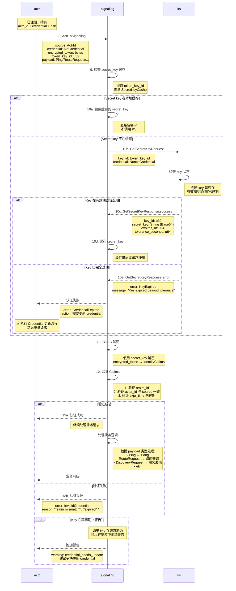

# Actrix 业务请求认证流程 (ActrToSignaling)

## 流程概述

在完成注册后，actr 需要在每次发送业务请求时携带 credential 进行身份认证。Signaling 服务器会验证 credential 的有效性，包括解密、验证身份声明、检查过期时间等。

## 时序图



---

## 协议详解

### 步骤 8: ActrToSignaling 消息

**Proto 定义** (`actr/crates/protocol/proto/signaling.proto:38-62`):
```protobuf
message ActrToSignaling {
  required actr.ActrId source = 1;          // 请求发起方的身份
  required actr.AIdCredential credential = 2; // 身份凭证
  
  oneof payload {
    actr.UnregisterRequest unregister_request = 3;
    actr.Ping ping = 4;
    actr.CredentialUpdateRequest credential_update_request = 5;
    actr.DiscoveryRequest discovery_request = 10;
    actr.RouteCandidatesRequest route_candidates_request = 11;
    actr.SubscribeActrUpRequest subscribe_actr_up_request = 20;
    actr.UnsubscribeActrUpRequest unsubscribe_actr_up_request = 21;
    actr.ErrorResponse error = 30;
  }
}
```

**客户端实现**:
```rust
// actr/crates/actr/src/signaling/client.rs
async fn send_ping(&mut self) -> Result<()> {
    let message = ActrToSignaling {
        source: self.actr_id.clone(),
        credential: self.credential.clone(),  // 每次请求都携带
        payload: Some(actr_to_signaling::Payload::Ping(Ping {
            timestamp: SystemTime::now().as_secs(),
        })),
    };
    
    self.send(message).await
}
```

---

### 步骤 9-10: 验证 Credential

**Signaling 使用 AIdCredentialValidator**:

```rust
// actrix/crates/common/src/aid/credential/validator.rs
pub struct AIdCredentialValidator {
    key_cache: Arc<KeyCache>,
    ks_client: Arc<RwLock<GrpcClient>>,
}

impl AIdCredentialValidator {
    /// 检查 credential (解密 + 验证有效性 + 容忍期检测)
    ///
    /// 使用 AIdCredential 进行验证，并返回密钥是否在容忍期
    pub async fn check(
        credential: &AIdCredential,
        realm_id: u32,
    ) -> Result<(IdentityClaims, bool), AidError> {
        let validator = Self::get_instance()?;
        let (secret_key, in_tolerance) = validator
            .get_secret_key_with_tolerance(credential.token_key_id)
            .await?;
        let claims = Self::check_with_key(credential, realm_id, &secret_key)?;
        Ok((claims, in_tolerance))
    }
    
    /// 根据 key_id 获取对应的密钥和容忍期状态
    async fn get_secret_key_with_tolerance(
        &self,
        key_id: u32,
    ) -> Result<(SecretKey, bool), AidError> {
        debug!("Fetching secret key for key_id: {}", key_id);

        // 1. 首先尝试从 SQLite 缓存获取
        match self.key_cache.get_cached_key(key_id).await? {
            Some((secret_key, expires_at, tolerance_seconds)) => {
                debug!("Found cached secret key for key_id: {}", key_id);
                // 计算是否在容忍期内
                let in_tolerance = Self::calculate_tolerance_status(expires_at, tolerance_seconds);
                return Ok((secret_key, in_tolerance));
            }
            None => {
                debug!(
                    "No cached key found for key_id: {}, fetching from KS",
                    key_id
                );
            }
        }

        // 2. 从 KS 服务获取密钥、过期时间和容忍期秒数
        let (secret_key, expires_at, tolerance_seconds) = {
            let mut client = self.ks_client.write().await;
            client.fetch_secret_key(key_id).await.map_err(|e| {
                error!("Failed to fetch secret key {} from KS: {}", key_id, e);
                AidError::DecryptionFailed(format!("KS error: {e}"))
            })?
        };

        // 3. 更新 SQLite 缓存（包含过期时间和容忍期秒数）
        if let Err(cache_err) = self
            .key_cache
            .cache_key(key_id, &secret_key, expires_at, tolerance_seconds)
            .await
        {
            error!("Failed to cache secret key {}: {}", key_id, cache_err);
        }

        // 4. 计算容忍期状态
        let in_tolerance = Self::calculate_tolerance_status(expires_at, tolerance_seconds);

        Ok((secret_key, in_tolerance))
    }
    
    /// 计算密钥是否在容忍期内
    fn calculate_tolerance_status(expires_at: u64, tolerance_seconds: u64) -> bool {
        if expires_at == 0 {
            return false; // 永不过期的密钥不在容忍期
        }

        let now = std::time::SystemTime::now()
            .duration_since(std::time::UNIX_EPOCH)
            .unwrap_or_default()
            .as_secs();

        // 在容忍期内：已过期但未超过容忍期
        expires_at < now && now <= expires_at + tolerance_seconds
    }
}
```

**KS 密钥状态判断**:

```rust
// actrix/crates/ks/src/grpc_handlers.rs
impl KeyServer for KsGrpcService {
    /// 获取指定 key_id 的私钥
    async fn get_secret_key(
        &self,
        request: Request<GetSecretKeyRequest>,
    ) -> Result<Response<GetSecretKeyResponse>, Status> {
        let req = request.into_inner();
        let key_id = req.key_id;

        info!("Received gRPC GetSecretKey request for key_id: {}", key_id);

        // 验证凭证
        let request_data = format!("get_secret_key:{key_id}");
        self.verify_credential(&req.credential, &request_data)
            .await
            .map_err(|e| Status::unauthenticated(format!("Authentication failed: {e}")))?;

        // 获取完整的密钥记录
        let key_record = self
            .storage
            .get_key_record(key_id)
            .await
            .map_err(|e| Status::internal(format!("Failed to get key record: {e}")))?
            .ok_or_else(|| Status::not_found(format!("Key not found: {key_id}")))?;

        // 检查密钥是否超过容忍期
        let tolerance_seconds = self.tolerance_seconds;

        if key_record.expires_at > 0 {
            let now = std::time::SystemTime::now()
                .duration_since(std::time::UNIX_EPOCH)
                .unwrap()
                .as_secs();

            // 检查是否超过了过期时间 + 容忍期
            if key_record.expires_at + tolerance_seconds < now {
                warn!("Key {} has expired beyond tolerance period", key_id);
                return Err(Status::not_found(format!("Key {key_id} has expired")));
            }

            // 记录是否在容忍期内
            if key_record.expires_at < now {
                warn!("Key {} is in tolerance period", key_id);
            }
        }

        // 获取私钥并返回
        let secret_key = self
            .storage
            .get_secret_key(key_id)
            .await
            .map_err(|e| Status::internal(format!("Failed to get secret key: {e}")))?
            .ok_or_else(|| Status::not_found(format!("Secret key not found: {key_id}")))?;

        let response = GetSecretKeyResponse {
            key_id,
            secret_key,
            expires_at: key_record.expires_at,
            tolerance_seconds,
        };

        Ok(Response::new(response))
    }
}
```

---

### 步骤 11-12: 解密和验证

**解密 Credential**:

```rust
// actrix/crates/common/src/aid/credential/validator.rs
/// 使用提供的密钥检查 credential (解密 + 验证有效性)
pub fn check_with_key(
    credential: &AIdCredential,
    realm_id: u32,
    secret_key: &SecretKey,
) -> Result<IdentityClaims, AidError> {
    // 将 SecretKey 转换为字节
    let secret_key_bytes = secret_key.serialize();

    // 解密
    let decrypted_bytes = decrypt(&secret_key_bytes, &credential.encrypted_token)
        .map_err(|e| AidError::DecryptionFailed(format!("Decryption error: {e}")))?;

    // 反序列化
    let claims: IdentityClaims = serde_json::from_slice(&decrypted_bytes)
        .map_err(|e| AidError::DecryptionFailed(format!("Deserialization error: {e}")))?;

    // 验证 credential 是否过期
    if claims.is_expired() {
        return Err(AidError::Expired);
    }

    // 验证 realm_id 是否匹配
    if claims.realm_id != realm_id {
        return Err(AidError::DecryptionFailed("Realm ID mismatch".to_string()));
    }

    Ok(claims)
}
```

**IdentityClaims 结构**:

```rust
// actrix/crates/common/src/aid/identity_claims.rs
#[derive(Debug, Clone, Serialize, Deserialize)]
pub struct IdentityClaims {
    /// Realm ID (安全域标识符)
    pub realm_id: u32,

    /// Actor ID 字符串表示
    /// 格式: {manufacturer}:{name}@{serial_number_hex}:{realm_id}
    pub actor_id: String,

    /// Token 过期时间 (Unix timestamp, seconds)
    pub expr_time: u64,

    /// Pre-shared key (PSK) for TURN authentication
    /// 256-bit (32 bytes) pre-shared key
    pub psk: Vec<u8>,
}

impl IdentityClaims {
    /// 检查 Token 是否过期
    pub fn is_expired(&self) -> bool {
        use std::time::{SystemTime, UNIX_EPOCH};
        let now = SystemTime::now()
            .duration_since(UNIX_EPOCH)
            .unwrap()
            .as_secs();
        now > self.expr_time
    }
}
```

---

## Key 容忍期机制

### 设计目的

容忍期（Grace Period）确保在 key 轮换时服务不中断：

```
时间线示例（假设 key 有效期 = 1 小时，容忍期 = 1 小时）：

Day 0 23:50 - actr_A 注册
├─ KS 生成 key_5，有效期到 Day 1 00:50
├─ 使用 key_5 加密 credential
└─ credential_expires_at = Day 1 23:50 (1小时)

Day 1 00:50 - key_5 过期
├─ key_5 进入容忍期（1小时）
├─ key_5 仍可解密，但不可用于新加密

Day 1 00:55 - actr_A 发送业务请求
├─ credential 中 token_key_id = 5
├─ Signaling 请求 key_5 → KS 返回 success（容忍期内）✅
├─ 解密成功，认证通过
└─ 附加警告：建议更新 credential

Day 1 01:50 - key_5 完全过期
├─ 超出容忍期（00:50 + 1:00 = 01:50）
├─ Signaling 请求 key_5 → KS 返回 error ❌
└─ actr_A 必须更新 credential

平滑过渡：
- actr_A 在 Day 1 00:50-01:50 之间收到警告
- 有 1 小时窗口期更新 credential
- 避免了 Day 1 00:50 时的服务中断
```

### 容忍期计算逻辑

**核心算法** (`actrix_common/src/aid/credential/validator.rs`):

```rust
/// 计算密钥是否在容忍期内
fn calculate_tolerance_status(expires_at: u64, tolerance_seconds: u64) -> bool {
    if expires_at == 0 {
        return false; // 永不过期的密钥不在容忍期
    }

    let now = std::time::SystemTime::now()
        .duration_since(std::time::UNIX_EPOCH)
        .unwrap_or_default()
        .as_secs();

    // 在容忍期内：已过期但未超过容忍期
    expires_at < now && now <= expires_at + tolerance_seconds
}
```

**KS 服务检查** (`actrix/crates/ks/src/grpc_handlers.rs`):

```rust
// 检查是否超过了过期时间 + 容忍期
if key_record.expires_at + tolerance_seconds < now {
    warn!("Key {} has expired beyond tolerance period", key_id);
    return Err(Status::not_found(format!("Key {key_id} has expired")));
}

// 记录是否在容忍期内
if key_record.expires_at < now {
    warn!("Key {} is in tolerance period", key_id);
}
```

**Signaling 警告机制** (`actrix/crates/signaling/src/server.rs`):

```rust
// 如果密钥在容忍期，添加警告
if in_tolerance_period {
    warn!("⚠️  Actor {} credential key is in tolerance period", source.serial_number);
    pong.credential_warning = Some(actr_protocol::CredentialWarning {
        r#type: actr_protocol::credential_warning::WarningType::KeyInTolerancePeriod as i32,
        message: "Your credential key is in tolerance period. Please update your credential soon.".to_string(),
    });
}
```

### 容忍期配置

**推荐值** (`actrix/crates/ks/src/config.rs`):
```rust
KsServiceConfig {
    storage: StorageConfig {
        backend: StorageBackend::Sqlite,
        key_ttl_seconds: 3600,  // 1 小时（key 有效期）
        // ...
    },
    tolerance_seconds: 3600,   // 1 小时（容忍期）
    // ...
}
```

**设计原则**:
- `key_ttl_seconds` 控制 key 的有效期（默认 1 小时）
- `tolerance_seconds` 控制容忍期长度（默认 1 小时）
- `tolerance_seconds >= credential_ttl` （确保所有 credential 都能在容忍期内更新）

---

## 性能优化

### 缓存策略

**Signaling 缓存统计**:
```
场景：1 分钟内 1000 个业务请求（使用 10 个不同的 key_id）

无缓存：
├─ KS 调用次数: 1000 次
├─ 平均延迟: 5ms × 1000 = 5000ms
└─ 成为性能瓶颈

有缓存：
├─ KS 调用次数: 10 次（每个 key_id 一次）
├─ 后续 990 次缓存命中
├─ 平均延迟: 50ms + 990 × 0.01ms ≈ 60ms
└─ 性能提升 83 倍 ✅
```

### 并发处理

```rust
// actrix/crates/common/src/aid/key_cache.rs
// 使用 SQLite 作为缓存存储，支持并发访问
#[derive(Debug, Clone)]
pub struct KeyCache {
    pool: SqlitePool,
    last_cleanup_time: Arc<Mutex<u64>>,
}

impl KeyCache {
    /// 从缓存中获取密钥及元数据
    pub async fn get_cached_key(
        &self,
        key_id: u32,
    ) -> Result<Option<(SecretKey, u64, u64)>, AidError> {
        // 检查是否需要清理过期缓存
        self.maybe_cleanup().await;

        let now = SystemTime::now()
            .duration_since(UNIX_EPOCH)
            .unwrap()
            .as_secs();

        // 查询缓存（包括容忍期内的密钥）
        let row = sqlx::query(
            r#"
            SELECT secret_key, expires_at, tolerance_seconds
            FROM key_cache
            WHERE key_id = ?
            AND (expires_at = 0 OR expires_at + tolerance_seconds > ?)
            "#,
        )
        .bind(key_id as i64)
        .bind(now as i64)
        .fetch_optional(&self.pool)
        .await
        .map_err(|e| AidError::DecryptionFailed(format!("Cache query failed: {e}")))?;

        // ...解析并返回结果
    }
    
    /// 缓存密钥
    pub async fn cache_key(
        &self,
        key_id: u32,
        secret_key: &SecretKey,
        expires_at: u64,
        tolerance_seconds: u64,
    ) -> Result<(), AidError> {
        // 使用 upsert 避免重复插入
        sqlx::query(
            r#"
            INSERT OR REPLACE INTO key_cache 
                (key_id, secret_key, cached_at, expires_at, tolerance_seconds)
            VALUES (?, ?, ?, ?, ?)
            "#,
        )
        .bind(key_id as i64)
        .bind(BASE64_STANDARD.encode(secret_key.serialize()))
        .bind(now as i64)
        .bind(expires_at as i64)
        .bind(tolerance_seconds as i64)
        .execute(&self.pool)
        .await
        .map_err(|e| AidError::DecryptionFailed(format!("Cache insert failed: {e}")))?;

        Ok(())
    }
}
```

---

## 错误处理

### 常见错误

| 错误类型 | 原因 | 处理方式 |
|---------|------|---------|
| **CredentialExpired** | credential 过期 | 更新 credential 后重试 |
| **KeyExpired** | key 超出容忍期 | 必须更新 credential |
| **RealmMismatch** | realm_id 不匹配 | 重新注册 |
| **DecryptionFailed** | 密文损坏或 key 错误 | 重新注册 |

### 客户端重试逻辑

```rust
async fn send_with_retry(&mut self, payload: Payload) -> Result<Response> {
    let mut attempts = 0;
    
    loop {
        let result = self.send_request(payload.clone()).await;
        
        match result {
            Ok(response) => return Ok(response),
            
            Err(Error::CredentialExpired) if attempts == 0 => {
                // 首次遇到过期，尝试更新 credential
                warn!("Credential expired, updating...");
                self.update_credential().await?;
                attempts += 1;
                continue;  // 重试
            }
            
            Err(Error::KeyExpired) => {
                // Key 完全过期，必须更新
                error!("Key expired, forcing credential update");
                self.update_credential().await?;
                attempts += 1;
                
                if attempts < 3 {
                    continue;  // 重试
                } else {
                    return Err(Error::MaxRetriesExceeded);
                }
            }
            
            Err(e) => return Err(e),  // 其他错误不重试
        }
    }
}
```

---

## 监控指标

### 关键指标

```rust
use prometheus::{Histogram, IntCounter, IntGauge};

struct AuthMetrics {
    // 认证延迟
    auth_duration: Histogram,
    
    // 认证成功/失败计数
    auth_success: IntCounter,
    auth_failure: IntCounter,
    
    // 缓存命中率
    cache_hits: IntCounter,
    cache_misses: IntCounter,
    
    // 当前缓存的 key 数量
    cached_keys_count: IntGauge,
    
    // 失败原因分布
    failure_reason_expired: IntCounter,
    failure_reason_realm_mismatch: IntCounter,
    failure_reason_decryption_failed: IntCounter,
}
```

### 告警规则

```yaml
alerts:
  - name: high_auth_failure_rate
    expr: rate(auth_failure_total[5m]) / rate(auth_success_total[5m]) > 0.05
    severity: warning
    
  - name: low_cache_hit_rate
    expr: rate(cache_hits_total[5m]) / (rate(cache_hits_total[5m]) + rate(cache_misses_total[5m])) < 0.90
    severity: info
    
  - name: credential_expiration_spike
    expr: rate(failure_reason_expired_total[5m]) > 100
    severity: warning
```

---

## 安全考虑

### 1. 防重放攻击

虽然当前设计未包含 nonce，但 credential 的短生命周期（1小时）限制了重放窗口。

**增强方案**（可选）:
```rust
// 在 IdentityClaims 中添加 nonce
pub struct IdentityClaims {
    pub realm_id: u32,
    pub actor_id: String,
    pub expr_time: u64,
    pub nonce: String,  // 新增：每次请求不同
}

// Signaling 维护 nonce 缓存（Redis）
async fn validate_nonce(&self, nonce: &str) -> Result<()> {
    if self.nonce_cache.exists(nonce).await? {
        return Err(Error::NonceReused);
    }
    
    // 记录 nonce（TTL = credential 有效期）
    self.nonce_cache.set(nonce, true, 3600).await?;
    Ok(())
}
```

### 2. 审计日志

```rust
async fn log_auth_event(&self, event: AuthEvent) {
    let log = json!({
        "timestamp": SystemTime::now().as_secs(),
        "actr_id": event.actr_id,
        "realm_id": event.realm_id,
        "success": event.success,
        "failure_reason": event.failure_reason,
        "key_id": event.key_id,
        "ip_address": event.source_ip,
    });
    
    audit_logger::log(log).await;
}
```

---

## 相关文档

- [注册流程](./1-registration-flow.md)
- [TURN 认证流程](./3-turn-authentication.md)
- [凭证更新流程](./4-credential-update.md)
- [密钥轮换策略](./5-key-rotation.md)
