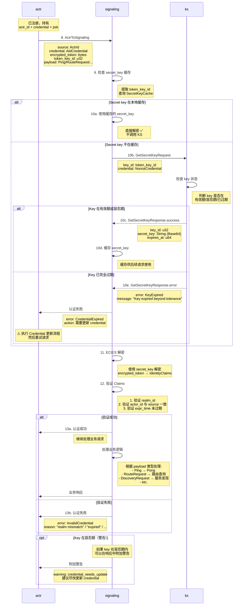

# Actrix 业务请求认证流程 (ActrToSignaling)

## 流程概述

在完成注册后，actr 需要在每次发送业务请求时携带 credential 进行身份认证。Signaling 服务器会验证 credential 的有效性，包括解密、验证身份声明、检查过期时间等。

## 时序图



---

## 协议详解

### 步骤 8: ActrToSignaling 消息

**Proto 定义** (`actr/crates/protocol/proto/signaling.proto:38-62`):
```protobuf
message ActrToSignaling {
  required actr.ActrId source = 1;          // 请求发起方的身份
  required actr.AIdCredential credential = 2; // 身份凭证
  
  oneof payload {
    actr.UnregisterRequest unregister_request = 3;
    actr.Ping ping = 4;
    actr.CredentialUpdateRequest credential_update_request = 5;
    actr.DiscoveryRequest discovery_request = 10;
    actr.RouteCandidatesRequest route_candidates_request = 11;
    actr.SubscribeActrUpRequest subscribe_actr_up_request = 20;
    actr.UnsubscribeActrUpRequest unsubscribe_actr_up_request = 21;
    actr.ErrorResponse error = 30;
  }
}
```

**客户端实现**:
```rust
// actr/crates/actr/src/signaling/client.rs
async fn send_ping(&mut self) -> Result<()> {
    let message = ActrToSignaling {
        source: self.actr_id.clone(),
        credential: self.credential.clone(),  // 每次请求都携带
        payload: Some(actr_to_signaling::Payload::Ping(Ping {
            timestamp: SystemTime::now().as_secs(),
        })),
    };
    
    self.send(message).await
}
```

---

### 步骤 9-10: 验证 Credential

**Signaling 缓存机制**:

```rust
// actrix/crates/signaling/src/authenticator.rs
pub struct Authenticator {
    // 缓存解密用的 secret_keys
    secret_key_cache: Arc<RwLock<HashMap<u32, CachedSecretKey>>>,
    ks_client: KsClient,
}

struct CachedSecretKey {
    secret_key: Vec<u8>,
    expires_at: u64,
    cached_at: u64,
}

impl Authenticator {
    async fn get_secret_key(&self, key_id: u32) -> Result<Vec<u8>> {
        // 1. 检查缓存
        {
            let cache = self.secret_key_cache.read().await;
            if let Some(cached) = cache.get(&key_id) {
                // 检查是否过期
                if !Self::is_cache_expired(cached) {
                    return Ok(cached.secret_key.clone());  // ✅ 缓存命中
                }
            }
        }
        
        // 2. 缓存未命中或已过期，调用 KS
        let response = self.ks_client.get_secret_key(key_id).await?;
        
        // 3. 解码并缓存
        let secret_key = base64::decode(&response.secret_key)?;
        
        let mut cache = self.secret_key_cache.write().await;
        cache.insert(key_id, CachedSecretKey {
            secret_key: secret_key.clone(),
            expires_at: response.expires_at,
            cached_at: SystemTime::now().as_secs(),
        });
        
        Ok(secret_key)
    }
    
    fn is_cache_expired(cached: &CachedSecretKey) -> bool {
        let now = SystemTime::now().as_secs();
        
        // 如果 key 已完全过期（超出容忍期）
        if now > cached.expires_at {
            return true;
        }
        
        // 缓存本身的 TTL（可选，例如 1 小时）
        let cache_age = now - cached.cached_at;
        cache_age > 3600
    }
}
```

**KS 密钥状态判断**:

```rust
// actrix/crates/keyserver/src/server.rs
impl KeyServer {
    async fn get_secret_key(&self, key_id: u32) -> Result<GetSecretKeyResponse> {
        let key = self.storage.get_key(key_id).await?;
        let now = SystemTime::now().as_secs();
        
        // 判断密钥状态（容忍期由 KS 配置并在服务配置中以 `tolerance_seconds` 命名）
        // NOTE: KS 返回的容忍判定也会通过 GetSecretKeyResponse.in_tolerance_period
        let status = if now < key.expires_at {
            KeyStatus::Active  // 有效期内
        } else if now < key.expires_at + self.config.tolerance_seconds {
            KeyStatus::TolerancePeriod  // 容忍期内
        } else {
            KeyStatus::Expired  // 完全过期
        };
        
        match status {
            KeyStatus::Active | KeyStatus::TolerancePeriod => {
                Ok(GetSecretKeyResponse {
                    key_id: key.key_id,
                    secret_key: key.secret_key.clone(),
                    expires_at: key.expires_at,
                })
            }
            KeyStatus::Expired => {
                Err(Error::KeyExpired {
                    key_id,
                    expired_at: key.expires_at,
                })
            }
        }
    }
}
```

---

### 步骤 11-12: 解密和验证

**解密 Credential**:

```rust
// actrix/crates/signaling/src/authenticator.rs
async fn verify_credential(&self, credential: &AIdCredential) -> Result<IdentityClaims> {
    // 1. 获取 secret_key
    let secret_key = self.get_secret_key(credential.token_key_id).await?;
    
    // 2. ECIES 解密
    let decrypted = ecies::decrypt(&secret_key, &credential.encrypted_token)
        .map_err(|e| Error::DecryptionFailed(e.to_string()))?;
    
    // 3. 反序列化为 IdentityClaims
    let claims: IdentityClaims = serde_json::from_slice(&decrypted)
        .map_err(|e| Error::InvalidClaims(e.to_string()))?;
    
    Ok(claims)
}
```

**验证 Claims**:

```rust
async fn validate_claims(&self, claims: &IdentityClaims, source: &ActrId) -> Result<()> {
    // 1. 验证 realm_id
    if claims.realm_id != source.realm.realm_id {
        return Err(Error::RealmMismatch {
            expected: source.realm.realm_id,
            actual: claims.realm_id,
        });
    }
    
    // 2. 验证 actor_id
    let expected_actor_id = source.to_string_repr();
    if claims.actor_id != expected_actor_id {
        return Err(Error::ActorIdMismatch {
            expected: expected_actor_id,
            actual: claims.actor_id.clone(),
        });
    }
    
    // 3. 验证过期时间
    let now = SystemTime::now().as_secs();
    if now > claims.expr_time {
        return Err(Error::CredentialExpired {
            expired_at: claims.expr_time,
            now,
        });
    }
    
    Ok(())
}
```

---

## Key 容忍期机制

### 设计目的

容忍期（Grace Period）确保在 key 轮换时服务不中断：

```
时间线示例：

Day 0 23:50 - actr_A 注册
├─ 使用 key_5 加密 credential
└─ credential_expires_at = Day 1 23:50 (1小时)

Day 1 00:00 - KS 自动轮换
├─ 生成 key_6
├─ key_5 过期，进入容忍期（1小时）
└─ key_5 仍可解密，但不可加密

Day 1 00:10 - actr_A 发送业务请求
├─ credential 中 token_key_id = 5
├─ Signaling 请求 key_5 → KS 返回 success（容忍期内）✅
├─ 解密成功，认证通过
└─ 附加警告：建议更新 credential

Day 1 01:00 - key_5 完全过期
├─ 超出容忍期
├─ Signaling 请求 key_5 → KS 返回 error ❌
└─ actr_A 必须更新 credential

平滑过渡：
- actr_A 在 Day 1 00:10-01:00 之间收到警告
- 有 50 分钟窗口期更新 credential
- 避免了 Day 1 00:00 时的服务中断
```

### 容忍期配置

**推荐值**:
```rust
KeyServerConfig {
    key_validity_period_secs: 86400,  // 24 小时
    key_tolerance_secs: 3600,         // 1 小时
}

CredentialConfig {
    token_ttl_secs: 3600,  // 1 小时（小于 key 有效期）
}
```

**设计原则**:
- `credential_ttl < key_validity_period`
- `tolerance >= credential_ttl` （确保所有 credential 都能在容忍期内更新）

---

## 性能优化

### 缓存策略

**Signaling 缓存统计**:
```
场景：1 分钟内 1000 个业务请求（使用 10 个不同的 key_id）

无缓存：
├─ KS 调用次数: 1000 次
├─ 平均延迟: 5ms × 1000 = 5000ms
└─ 成为性能瓶颈

有缓存：
├─ KS 调用次数: 10 次（每个 key_id 一次）
├─ 后续 990 次缓存命中
├─ 平均延迟: 50ms + 990 × 0.01ms ≈ 60ms
└─ 性能提升 83 倍 ✅
```

### 并发处理

```rust
// 高并发场景下避免缓存击穿
use tokio::sync::Semaphore;

impl Authenticator {
    // 每个 key_id 一个信号量，避免重复调用 KS
    fetching_keys: Arc<DashMap<u32, Arc<Semaphore>>>,
    
    async fn get_secret_key(&self, key_id: u32) -> Result<Vec<u8>> {
        // 1. 快速检查缓存
        if let Some(cached) = self.secret_key_cache.read().await.get(&key_id) {
            return Ok(cached.secret_key.clone());
        }
        
        // 2. 获取或创建信号量
        let semaphore = self.fetching_keys
            .entry(key_id)
            .or_insert_with(|| Arc::new(Semaphore::new(1)))
            .clone();
        
        // 3. 串行化同一 key_id 的 KS 调用
        let _permit = semaphore.acquire().await?;
        
        // 4. 再次检查缓存（可能其他线程已获取）
        if let Some(cached) = self.secret_key_cache.read().await.get(&key_id) {
            return Ok(cached.secret_key.clone());
        }
        
        // 5. 调用 KS
        let response = self.ks_client.get_secret_key(key_id).await?;
        
        // 6. 缓存并返回
        // ...
    }
}
```

---

## 错误处理

### 常见错误

| 错误类型 | 原因 | 处理方式 |
|---------|------|---------|
| **CredentialExpired** | credential 过期 | 更新 credential 后重试 |
| **KeyExpired** | key 超出容忍期 | 必须更新 credential |
| **RealmMismatch** | realm_id 不匹配 | 重新注册 |
| **ActorIdMismatch** | actor_id 被篡改 | 拒绝请求，记录安全事件 |
| **DecryptionFailed** | 密文损坏或 key 错误 | 重新注册 |

### 客户端重试逻辑

```rust
async fn send_with_retry(&mut self, payload: Payload) -> Result<Response> {
    let mut attempts = 0;
    
    loop {
        let result = self.send_request(payload.clone()).await;
        
        match result {
            Ok(response) => return Ok(response),
            
            Err(Error::CredentialExpired) if attempts == 0 => {
                // 首次遇到过期，尝试更新 credential
                warn!("Credential expired, updating...");
                self.update_credential().await?;
                attempts += 1;
                continue;  // 重试
            }
            
            Err(Error::KeyExpired) => {
                // Key 完全过期，必须更新
                error!("Key expired, forcing credential update");
                self.update_credential().await?;
                attempts += 1;
                
                if attempts < 3 {
                    continue;  // 重试
                } else {
                    return Err(Error::MaxRetriesExceeded);
                }
            }
            
            Err(e) => return Err(e),  // 其他错误不重试
        }
    }
}
```

---

## 监控指标

### 关键指标

```rust
use prometheus::{Histogram, IntCounter, IntGauge};

struct AuthMetrics {
    // 认证延迟
    auth_duration: Histogram,
    
    // 认证成功/失败计数
    auth_success: IntCounter,
    auth_failure: IntCounter,
    
    // 缓存命中率
    cache_hits: IntCounter,
    cache_misses: IntCounter,
    
    // 当前缓存的 key 数量
    cached_keys_count: IntGauge,
    
    // 失败原因分布
    failure_reason_expired: IntCounter,
    failure_reason_realm_mismatch: IntCounter,
    failure_reason_decryption_failed: IntCounter,
}
```

### 告警规则

```yaml
alerts:
  - name: high_auth_failure_rate
    expr: rate(auth_failure_total[5m]) / rate(auth_success_total[5m]) > 0.05
    severity: warning
    
  - name: low_cache_hit_rate
    expr: rate(cache_hits_total[5m]) / (rate(cache_hits_total[5m]) + rate(cache_misses_total[5m])) < 0.90
    severity: info
    
  - name: credential_expiration_spike
    expr: rate(failure_reason_expired_total[5m]) > 100
    severity: warning
```

---

## 安全考虑

### 1. 防重放攻击

虽然当前设计未包含 nonce，但 credential 的短生命周期（1小时）限制了重放窗口。

**增强方案**（可选）:
```rust
// 在 IdentityClaims 中添加 nonce
pub struct IdentityClaims {
    pub realm_id: u32,
    pub actor_id: String,
    pub expr_time: u64,
    pub nonce: String,  // 新增：每次请求不同
}

// Signaling 维护 nonce 缓存（Redis）
async fn validate_nonce(&self, nonce: &str) -> Result<()> {
    if self.nonce_cache.exists(nonce).await? {
        return Err(Error::NonceReused);
    }
    
    // 记录 nonce（TTL = credential 有效期）
    self.nonce_cache.set(nonce, true, 3600).await?;
    Ok(())
}
```

### 2. 审计日志

```rust
async fn log_auth_event(&self, event: AuthEvent) {
    let log = json!({
        "timestamp": SystemTime::now().as_secs(),
        "actr_id": event.actr_id,
        "realm_id": event.realm_id,
        "success": event.success,
        "failure_reason": event.failure_reason,
        "key_id": event.key_id,
        "ip_address": event.source_ip,
    });
    
    audit_logger::log(log).await;
}
```

---

## 相关文档

- [注册流程](./1-registration-flow.md)
- [TURN 认证流程](./3-turn-authentication.md)
- [凭证更新流程](./4-credential-update.md)
- [密钥轮换策略](./5-key-rotation.md)
