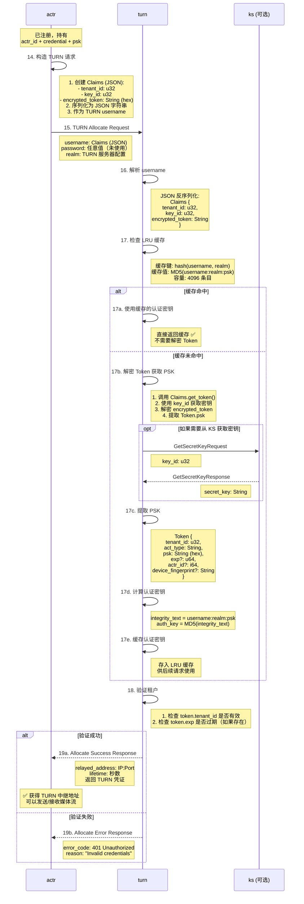

# Actrix TURN 认证流程

## 流程概述

TURN (Traversal Using Relays around NAT) 是一种 NAT 穿透协议，用于在无法建立直连时通过中继服务器转发媒体流。Actrix 使用自定义的认证机制，将 actr 的身份信息（PSK）嵌入到 TURN username 中，通过 MD5 计算认证密钥。

## 时序图



---

## 协议详解

### 步骤 14: 构造 TURN 请求

**Claims 结构** (来自 `actr_protocol::turn`):

```rust
// actr/crates/protocol/src/turn.rs
use serde::{Deserialize, Serialize};

#[derive(Debug, Clone, Serialize, Deserialize)]
pub struct Claims {
    /// 租户 ID（realm_id）
    #[serde(rename = "tid")]
    pub tenant_id: u32,
    
    /// Token 加密使用的 key ID
    #[serde(rename = "kid")]
    pub key_id: u32,
    
    /// 加密的 Token（hex 编码）
    #[serde(rename = "token")]
    pub encrypted_token: String,
}

impl Claims {
    /// 解密获取 Token
    /// 
    /// # 参数
    /// * `secret_key` - 用于 ECIES 解密的密钥（需要提前从 KS 获取或使用缓存）
    pub fn get_token(&self, secret_key: &[u8]) -> Result<Token, Error> {
        // 1. Hex 解码
        let encrypted_bytes = hex::decode(&self.encrypted_token)?;
        
        // 2. ECIES 解密
        let decrypted = ecies::decrypt(secret_key, &encrypted_bytes)?;
        
        // 3. JSON 反序列化
        let token: Token = serde_json::from_slice(&decrypted)?;
        
        Ok(token)
    }
}
```

**Token 结构**:

```rust
#[derive(Debug, Clone, Serialize, Deserialize)]
pub struct Token {
    /// 租户 ID（应该与 Claims.tenant_id 一致）
    #[serde(rename = "tid")]
    pub tenant_id: u32,
    
    /// Actor 类型（如 "apple:iphone"）
    #[serde(rename = "type")]
    pub act_type: String,
    
    /// 预共享密钥（hex 字符串）
    #[serde(rename = "key")]
    pub psk: String,
    
    /// 过期时间（Unix 时间戳，秒）
    #[serde(rename = "exp", skip_serializing_if = "Option::is_none")]
    pub exp: Option<u64>,
    
    /// Actor ID（Snowflake ID）
    #[serde(rename = "id", skip_serializing_if = "Option::is_none")]
    pub actr_id: Option<i64>,
    
    /// 设备指纹（可选）
    #[serde(rename = "fp", skip_serializing_if = "Option::is_none")]
    pub device_fingerprint: Option<String>,
}
```

**客户端构造 username** (需要实现):

```rust
// actr/crates/actr/src/turn/client.rs (待实现)
use std::time::{SystemTime, UNIX_EPOCH};

async fn create_turn_credentials(&self) -> Result<(String, String)> {
    // 1. 构造 Token
    let token = Token {
        tenant_id: self.tenant_id,
        act_type: format!("{}:{}", self.device_info.manufacturer, self.device_info.model),
        psk: hex::encode(&self.psk),  // PSK 转 hex
        exp: Some(SystemTime::now().duration_since(UNIX_EPOCH).unwrap().as_secs() + 3600),
        actr_id: Some(self.actr_id),  // i64 类型
        device_fingerprint: None,
    };
    
    let token_json = serde_json::to_vec(&token)?;
    let encrypted = ecies::encrypt(&self.current_public_key, &token_json)?;
    
    // 2. 构造 Claims
    let claims = Claims {
        tenant_id: self.realm_id,
        key_id: self.current_key_id,
        encrypted_token: hex::encode(&encrypted),
    };
    
    // 3. 序列化为 JSON 作为 username
    let username = serde_json::to_string(&claims)?;
    
    // 4. password 可以是任意值（TURN 不使用）
    let password = "unused".to_string();
    
    Ok((username, password))
}
```

**示例 username** (JSON 序列化后):
```json
{
  "tid": 12345,
  "kid": 5,
  "token": "0450a1b2c3d4...f9e8d7c6b5a4"
}
```

---

### 步骤 15-17: TURN 服务器认证

**认证流程** (`actrix/crates/turn/src/authenticator.rs`):

```rust
use turn_crate::auth::AuthHandler;
use lru::LruCache;

pub struct Authenticator {
    // 可选：KS 客户端（用于获取解密密钥，建议启动时预加载到缓存）
    ks_client: Option<Arc<KsClient>>,
    
    // 本地密钥缓存（key_id -> secret_key）
    key_cache: Arc<RwLock<HashMap<u32, Vec<u8>>>>,
    
    // 可选：租户验证器（检查租户激活状态）
    tenant_validator: Option<Arc<TenantValidator>>,
}

// 全局 LRU 缓存
const AUTH_CACHE_CAPACITY: usize = 4096;

static AUTH_KEY_CACHE: Lazy<Mutex<LruCache<u128, Vec<u8>>>> = Lazy::new(|| {
    let cap = NonZeroUsize::new(AUTH_CACHE_CAPACITY).unwrap();
    Mutex::new(LruCache::new(cap))
});

/// 计算缓存键
fn compute_cache_key(username: &str, realm: &str) -> u128 {
    let mut h1 = XxHash64::with_seed(0);
    h1.write(username.as_bytes());
    let k1 = h1.finish();
    
    let mut h2 = XxHash64::with_seed(0);
    h2.write(realm.as_bytes());
    let k2 = h2.finish();
    
    ((k1 as u128) << 64) | (k2 as u128)
}

impl Authenticator {
    /// 从缓存中同步获取密钥（启动时应预加载密钥）
    fn get_secret_key_sync(&self, key_id: u32) -> Result<Vec<u8>> {
        self.key_cache.read().unwrap()
            .get(&key_id)
            .cloned()
            .ok_or(Error::KeyNotFound(key_id))
    }
    
    /// 验证 Token 的有效性
    fn verify_token(&self, token: &Token) -> Result<()> {
        // 检查过期时间
        if let Some(exp) = token.exp {
            let now = SystemTime::now()
                .duration_since(UNIX_EPOCH)
                .unwrap()
                .as_secs();
            
            if now > exp {
                return Err(Error::TokenExpired { expired_at: exp, now });
            }
        }
        
        // 检查租户状态（如果配置了验证器）
        if let Some(validator) = &self.tenant_validator {
            if !validator.is_active(token.tenant_id) {
                return Err(Error::TenantInactive(token.tenant_id));
            }
        }
        
        Ok(())
    }
}

impl AuthHandler for Authenticator {
    fn auth_handle(
        &self,
        username: &str,
        server_realm: &str,
        src_addr: SocketAddr,
    ) -> Result<Vec<u8>, Error> {
        debug!("TURN auth: username={}, realm={}, src={}", username, server_realm, src_addr);
        
        // 1️⃣ 首先尝试缓存（仅基于 username + realm）
        let cache_key = compute_cache_key(username, server_realm);
        if let Some(cached) = AUTH_KEY_CACHE.lock().unwrap().get(&cache_key).cloned() {
            debug!("TURN auth cache hit: username={}", username);
            return Ok(cached);
        }
        
        // 2️⃣ 缓存未命中，解析 Claims
        let claims: Claims = serde_json::from_str(username)
            .map_err(|e| Error::Other(format!("Failed to parse claims: {}", e)))?;
        
        // 3️⃣ 获取解密密钥（从缓存或 KS）
        let secret_key = self.get_secret_key_sync(claims.key_id)
            .map_err(|e| Error::Other(format!("Failed to get secret key: {}", e)))?;
        
        // 4️⃣ 解密 Token 获取 PSK
        let token: Token = claims.get_token(&secret_key)
            .map_err(|e| Error::Other(format!("Failed to decrypt token: {}", e)))?;
        
        let psk = token.psk;
        
        debug!("Token decrypted: tenant_id={}, act_type={}, psk_len={}",
               token.tenant_id, token.act_type, psk.len());
        
        // 5️⃣ 验证 Token（租户状态、过期时间）
        self.verify_token(&token)?;
        
        // 6️⃣ 计算认证密钥: MD5(username:realm:psk)
        let integrity_text = format!("{}:{}:{}", username, server_realm, psk);
        let digest = md5::compute(integrity_text.as_bytes());
        let result = digest.to_vec();
        
        // 7️⃣ 存入缓存
        AUTH_KEY_CACHE.lock().unwrap().put(cache_key, result.clone());
        
        debug!("TURN auth success: username={}, cache_size={}/{}",
               username,
               AUTH_KEY_CACHE.lock().unwrap().len(),
               AUTH_CACHE_CAPACITY);
        
        Ok(result)
    }
}
```

---

### 步骤 18: 验证租户

**租户验证**:

```rust
impl Authenticator {
    fn verify_token(&self, token: &Token) -> Result<()> {
        // 1. 检查租户是否存在且未禁用
        if !self.is_tenant_active(token.tenant_id) {
            return Err(Error::TenantDisabled(token.tenant_id));
        }
        
        // 2. 检查过期时间（如果存在）
        if let Some(exp) = token.exp {
            let now = SystemTime::now().as_secs();
            if now > exp {
                return Err(Error::TokenExpired {
                    expired_at: exp,
                    now,
                });
            }
        }
        
        // 3. 可选：速率限制
        if !self.check_rate_limit(token.tenant_id, &token.act_type) {
            return Err(Error::RateLimitExceeded);
        }
        
        Ok(())
    }
}
```

---

## 缓存优化

### LRU 缓存策略

**缓存设计**:
- **容量**: 4096 条目
- **策略**: LRU (Least Recently Used)
- **键**: `hash(username, realm)` → u128
- **值**: `MD5(username:realm:psk)` → Vec<u8>
- **线程安全**: `Mutex<LruCache>`

**缓存效果**:

```
场景：1 分钟内 1000 个 TURN Allocate 请求（100 个不同用户）

无缓存：
├─ Token 解密次数: 1000 次
├─ 每次解密耗时: ~2ms
├─ 总耗时: 2000ms
└─ 成为性能瓶颈

有缓存：
├─ Token 解密次数: 100 次（首次）
├─ 后续 900 次缓存命中
├─ 缓存命中耗时: ~0.01ms
├─ 总耗时: 200ms + 9ms ≈ 209ms
└─ 性能提升 9.6 倍 ✅

长期运行（缓存稳定后）：
├─ 缓存命中率: > 95%
├─ 平均延迟: < 0.1ms
└─ 支持 10,000+ req/s
```

---

## TURN 协议交互

### Allocate 请求示例

**STUN 消息格式**:

```
TURN Allocate Request:
├─ Message Type: 0x0003 (Allocate Request)
├─ Transaction ID: 随机 96-bit
├─ Attributes:
│  ├─ USERNAME: JSON Claims
│  ├─ REALM: "actrix.turn"
│  ├─ NONCE: 服务器提供
│  ├─ MESSAGE-INTEGRITY: HMAC-SHA1(message, auth_key)
│  └─ REQUESTED-TRANSPORT: UDP (0x11)
```

**认证流程**:

1. 客户端发送 Allocate Request（无 auth）
2. 服务器返回 401 Unauthorized + REALM + NONCE
3. 客户端使用 `auth_key = MD5(username:realm:psk)` 计算 MESSAGE-INTEGRITY
4. 客户端重新发送带 MESSAGE-INTEGRITY 的请求
5. 服务器验证 MESSAGE-INTEGRITY，成功则分配中继地址

---

## 安全考虑

### 1. PSK 加密传输

- PSK 不会明文出现在网络中
- 嵌入在加密的 Token 中（ECIES 加密）
- 只有持有 secret_key 的服务器才能解密

### 2. 防重放攻击

**TURN 层面**:
- NONCE 机制（TURN 协议标准）
- MESSAGE-INTEGRITY 包含 Transaction ID

**Token 层面**:
- 可选的 `exp` 字段限制 Token 生命周期
- 通常设置为几小时（如 3600s）

### 3. 租户隔离

```rust
impl Authenticator {
    fn is_tenant_active(&self, tenant_id: u32) -> bool {
        // 查询租户状态（数据库或缓存）
        self.tenant_status_cache
            .get(&tenant_id)
            .map(|status| status.is_active)
            .unwrap_or(false)
    }
}
```

---

## 配置示例

### TURN 服务器配置

```yaml
# actrix/deploy/turn/turnserver.conf
listening-port=3478
tls-listening-port=5349
realm=actrix.turn

# 外部认证（通过 Authenticator）
use-auth-secret
static-auth-secret=shared-secret-between-turn-and-ais

# 中继地址池
relay-ip=10.0.1.100
external-ip=203.0.113.10

# 速率限制
max-bps=1000000
user-quota=10
total-quota=100
```

### 客户端配置

```rust
// actr/crates/actr/src/turn/config.rs
pub struct TurnConfig {
    pub servers: Vec<TurnServer>,
    pub credential_ttl: Duration,  // Credential 有效期（默认 3600s）
}

pub struct TurnServer {
    pub uri: String,  // "turn:turn.example.com:3478"
    pub realm: String,  // "actrix.turn"
    pub transport: Transport,  // UDP / TCP / TLS
}
```

---

## 错误处理

### 常见错误

| 错误码 | 原因 | 处理方式 |
|--------|------|---------|
| **401 Unauthorized** | 认证失败（PSK 错误） | 检查 PSK 是否正确 |
| **437 Allocation Mismatch** | 重复分配 | 释放旧分配后重试 |
| **438 Stale Nonce** | Nonce 过期 | 使用新 Nonce 重试 |
| **441 Wrong Credentials** | Token 解密失败 | 检查 key_id 和加密逻辑 |
| **486 Allocation Quota Exceeded** | 超出配额 | 等待或联系管理员 |

### 客户端重试逻辑

```rust
async fn allocate_with_retry(&mut self) -> Result<RelayedAddress> {
    let mut nonce: Option<String> = None;
    let mut attempts = 0;
    
    loop {
        match self.send_allocate_request(nonce.clone()).await {
            Ok(addr) => return Ok(addr),
            
            Err(TurnError::Unauthorized { new_nonce, .. }) => {
                // 401: 更新 nonce 并重试
                nonce = Some(new_nonce);
                continue;
            }
            
            Err(TurnError::StaleNonce) if attempts < 3 => {
                // 438: 清除 nonce 并重试
                nonce = None;
                attempts += 1;
                continue;
            }
            
            Err(e) => return Err(e),
        }
    }
}
```

---

## 监控指标

### TURN 认证指标

```rust
use prometheus::{IntCounter, Histogram};

struct TurnAuthMetrics {
    // 认证请求总数
    auth_requests_total: IntCounter,
    
    // 认证成功/失败
    auth_success_total: IntCounter,
    auth_failure_total: IntCounter,
    
    // 缓存命中/未命中
    cache_hits_total: IntCounter,
    cache_misses_total: IntCounter,
    
    // Token 解密延迟
    token_decrypt_duration: Histogram,
    
    // 认证总延迟
    auth_duration: Histogram,
}
```

### 告警规则

```yaml
alerts:
  - name: high_turn_auth_failure_rate
    expr: rate(turn_auth_failure_total[5m]) / rate(turn_auth_requests_total[5m]) > 0.1
    severity: warning
    
  - name: low_turn_cache_hit_rate
    expr: rate(cache_hits_total[5m]) / rate(cache_misses_total[5m]) < 0.8
    severity: info
    
  - name: slow_token_decryption
    expr: histogram_quantile(0.99, turn_token_decrypt_duration_seconds) > 0.01
    severity: warning
```

---

## 性能优化建议

### 1. 预热缓存

```rust
// 启动时加载高频用户的认证密钥
async fn preheat_cache(&self) -> Result<()> {
    let hot_users = self.db.get_top_active_users(1000).await?;
    
    for user in hot_users {
        let cache_key = compute_cache_key(&user.username, &user.realm);
        let auth_key = self.compute_auth_key(&user).await?;
        
        AUTH_KEY_CACHE.lock().unwrap().put(cache_key, auth_key);
    }
    
    info!("Cache preheated with {} entries", hot_users.len());
    Ok(())
}
```

### 2. 异步解密

```rust
// 使用线程池处理 CPU 密集型解密操作
use tokio::task::spawn_blocking;

async fn decrypt_token_async(&self, encrypted: &[u8]) -> Result<Token> {
    let secret_key = self.secret_key.clone();
    let encrypted = encrypted.to_vec();
    
    let decrypted = spawn_blocking(move || {
        ecies::decrypt(&secret_key, &encrypted)
    }).await??;
    
    let token = serde_json::from_slice(&decrypted)?;
    Ok(token)
}
```

### 3. 批量验证

对于同一租户的多个请求，可以批量查询租户状态，减少数据库访问。

---

## 相关文档

- [注册流程](./1-registration-flow.md)
- [业务请求认证流程](./2-authentication-flow.md)
- [凭证更新流程](./4-credential-update.md)
- [密钥轮换策略](./5-key-rotation.md)
