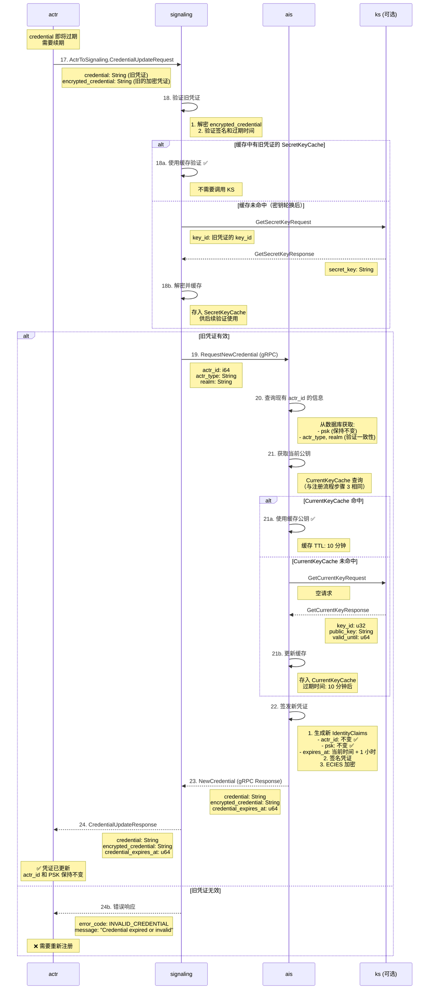

# Actrix 凭证更新流程

## 流程概述

凭证更新是 Actrix 认证系统的关键功能，允许已认证的 actr 客户端在凭证即将过期时无缝获取新凭证。这个过程确保了 **actr_id** 和 **PSK** 的连续性，只更新了 **credential** 和 **expires_at**，从而保持身份和加密密钥不变。

## 时序图



---

## 协议详解

### 步骤 17: 客户端发起更新请求

**CredentialUpdateRequest 定义** (`actr/crates/protocol/proto/actr.proto`):

```protobuf
// 从 actr 到 Signaling 的消息
message ActrToSignaling {
  oneof message {
    // ... 其他消息类型
    
    CredentialUpdateRequest credential_update_request = 4;
  }
}

message CredentialUpdateRequest {
  // 当前（即将过期的）凭证（明文）
  required string credential = 1;
  
  // 当前凭证的加密版本（ECIES 加密）
  required string encrypted_credential = 2;
}
```

**客户端发送时机**:

```rust
// actr/crates/actr/src/credential_manager.rs
use tokio::time::{interval, Duration};

pub struct CredentialManager {
    credential: Option<AIdCredential>,
    credential_expires_at: Option<u64>,
    
    // 更新触发阈值（默认 5 分钟）
    renewal_threshold: Duration,
}

impl CredentialManager {
    /// 后台任务：监控凭证过期
    pub async fn start_renewal_task(&mut self) {
        let mut check_interval = interval(Duration::from_secs(60));
        
        loop {
            check_interval.tick().await;
            
            if self.should_renew_credential() {
                match self.renew_credential().await {
                    Ok(new_credential) => {
                        info!("Credential renewed: expires_at={}", new_credential.expires_at);
                        self.credential = Some(new_credential);
                    }
                    Err(e) => {
                        error!("Failed to renew credential: {}", e);
                        // 触发重新注册
                        self.trigger_reregistration().await;
                    }
                }
            }
        }
    }
    
    /// 判断是否需要续期
    fn should_renew_credential(&self) -> bool {
        if let Some(expires_at) = self.credential_expires_at {
            let now = SystemTime::now().as_secs();
            let time_until_expiry = expires_at.saturating_sub(now);
            
            // 如果剩余时间 < 5 分钟，触发续期
            time_until_expiry < self.renewal_threshold.as_secs()
        } else {
            false
        }
    }
    
    /// 发送更新请求
    async fn renew_credential(&self) -> Result<AIdCredential> {
        let request = CredentialUpdateRequest {
            credential: self.credential.as_ref().unwrap().to_string(),
            encrypted_credential: self.encrypted_credential.clone(),
        };
        
        let message = ActrToSignaling {
            message: Some(actr_to_signaling::Message::CredentialUpdateRequest(request)),
        };
        
        self.signaling_client.send(message).await?;
        
        // 等待响应（超时 10 秒）
        let response = timeout(Duration::from_secs(10), self.wait_for_response()).await??;
        
        Ok(response.credential)
    }
}
```

---

### 步骤 18-19: Signaling 验证旧凭证

**验证逻辑** (`actrix/crates/signaling/src/credential_verifier.rs`):

```rust
use actr_protocol::AIdCredential;
use actrix_ks_client::KsClient;

pub struct CredentialVerifier {
    ks_client: KsClient,
    
    // 密钥缓存（支持多版本）
    secret_key_cache: Arc<RwLock<HashMap<u32, SecretKeyEntry>>>,
}

#[derive(Clone)]
struct SecretKeyEntry {
    secret_key: Vec<u8>,
    cached_at: SystemTime,
    // 密钥永久有效，不需要 TTL
}

impl CredentialVerifier {
    /// 验证凭证
    pub async fn verify_credential(
        &self,
        credential: &str,
        encrypted_credential: &str,
    ) -> Result<IdentityClaims> {
        // 1. Base64 解码
        let encrypted_bytes = base64::decode(encrypted_credential)?;
        
        // 2. 提取 key_id（加密数据的前 4 字节）
        let key_id = u32::from_be_bytes(encrypted_bytes[0..4].try_into()?);
        
        // 3. 获取解密密钥（缓存优先）
        let secret_key = self.get_secret_key(key_id).await?;
        
        // 4. ECIES 解密
        let decrypted = ecies::decrypt(&secret_key, &encrypted_bytes)?;
        
        // 5. JSON 反序列化
        let claims: IdentityClaims = serde_json::from_slice(&decrypted)?;
        
        // 6. 验证签名（与明文 credential 比对）
        let expected_credential = claims.to_credential_string();
        if credential != expected_credential {
            return Err(Error::SignatureMismatch);
        }
        
        // 7. 检查过期时间
        let now = SystemTime::now().as_secs();
        if now > claims.credential_expires_at {
            return Err(Error::CredentialExpired {
                expired_at: claims.credential_expires_at,
                now,
            });
        }
        
        Ok(claims)
    }
    
    /// 获取解密密钥（缓存优先）
    async fn get_secret_key(&self, key_id: u32) -> Result<Vec<u8>> {
        // 1️⃣ 检查缓存
        if let Some(entry) = self.secret_key_cache.read().await.get(&key_id) {
            debug!("SecretKeyCache hit: key_id={}", key_id);
            return Ok(entry.secret_key.clone());
        }
        
        // 2️⃣ 缓存未命中，调用 KS
        debug!("SecretKeyCache miss: key_id={}, calling KS", key_id);
        
        let request = GetSecretKeyRequest { key_id };
        let response = self.ks_client.get_secret_key(request).await?;
        
        let secret_key = base64::decode(&response.secret_key)?;
        
        // 3️⃣ 存入缓存（密钥永久有效，直到服务器重启）
        self.secret_key_cache.write().await.insert(key_id, SecretKeyEntry {
            secret_key: secret_key.clone(),
            cached_at: SystemTime::now(),
        });
        
        info!("SecretKeyCache updated: key_id={}, cache_size={}",
              key_id, self.secret_key_cache.read().await.len());
        
        Ok(secret_key)
    }
}
```

**为什么需要 SecretKeyCache？**

```
场景：密钥轮换后，旧凭证的验证

时间线：
├─ T0: KS 生成 key_id=5，AIS 缓存 public_key_5
├─ T0+1h: 客户端 A 注册，获得凭证（key_id=5, expires_at=T0+2h）
├─ T0+24h: KS 轮换到 key_id=6，CurrentKeyCache 更新
├─ T0+25h: 客户端 A 的凭证即将过期（key_id=5），发起续期
│
└─ 此时 Signaling 需要验证 key_id=5 的旧凭证
   └─ 如果没有 SecretKeyCache：
      ├─ 需要调用 KS GetSecretKey(key_id=5)
      ├─ 如果大量客户端同时续期，KS 压力巨大
      └─ 性能瓶颈 ❌

   └─ 有 SecretKeyCache：
      ├─ Signaling 已经缓存了 secret_key_5
      ├─ 直接解密验证，无需调用 KS
      └─ 性能优化 ✅

缓存效果：
├─ 1000 个凭证续期请求（key_id=5）
├─ 无缓存：1000 次 KS 调用
├─ 有缓存：1 次 KS 调用（首次）
└─ 减少 99.9% 的 KS 负载
```

---

### 步骤 20-23: AIS 签发新凭证

**新凭证生成** (`actrix/crates/ais/src/issuer.rs`):

```rust
impl Issuer {
    /// 为已存在的 actr_id 签发新凭证
    pub async fn renew_credential(
        &self,
        actr_id: i64,
        actr_type: &str,
        realm: &str,
    ) -> Result<CredentialResponse> {
        // 1️⃣ 查询现有信息（验证一致性）
        let existing = self.db.get_actor_info(actr_id).await?;
        
        if existing.actr_type != actr_type || existing.realm != realm {
            return Err(Error::ActorInfoMismatch {
                expected_type: existing.actr_type,
                provided_type: actr_type.to_string(),
                expected_realm: existing.realm,
                provided_realm: realm.to_string(),
            });
        }
        
        // 2️⃣ 获取当前公钥（与注册流程相同）
        let (key_id, public_key, valid_until) = self.get_current_public_key().await?;
        
        // 3️⃣ 签发新凭证
        let now = SystemTime::now().as_secs();
        let credential_expires_at = now + self.config.credential_ttl;  // 默认 3600s
        
        let claims = IdentityClaims {
            actr_id,  // ✅ 保持不变
            tenant_id: existing.tenant_id,
            actr_type: actr_type.to_string(),
            psk: existing.psk,  // ✅ 保持不变
            key_id,
            issued_at: now,
            credential_expires_at,
            key_valid_until: valid_until,
        };
        
        let credential = claims.to_credential_string();
        let encrypted_credential = self.encrypt_claims(&claims, &public_key)?;
        
        // 4️⃣ 更新数据库（记录最新凭证过期时间）
        self.db.update_credential_expiry(actr_id, credential_expires_at).await?;
        
        info!("Credential renewed: actr_id={}, expires_at={}", actr_id, credential_expires_at);
        
        Ok(CredentialResponse {
            credential,
            encrypted_credential,
            credential_expires_at,
        })
    }
    
    /// 获取当前公钥（与注册流程共享）
    async fn get_current_public_key(&self) -> Result<(u32, String, u64)> {
        // 与注册流程步骤 3-4 完全相同
        // ... (见 1-registration-flow.md)
    }
}
```

**数据库更新**:

```sql
-- 更新凭证过期时间（不更新 psk）
UPDATE actors
SET 
  credential_expires_at = $1,
  updated_at = NOW()
WHERE actr_id = $2;

-- 注意：psk 字段保持不变 ✅
```

---

## 凭证连续性保证

### 不变的字段

| 字段 | 注册时 | 续期后 | 说明 |
|------|--------|--------|------|
| **actr_id** | Snowflake 生成 | **不变** ✅ | 保证身份连续性 |
| **psk** | 随机生成 | **不变** ✅ | 保证加密密钥一致 |
| **tenant_id** | 来自 realm | **不变** ✅ | 租户归属不变 |
| **actr_type** | 客户端提供 | **不变** ✅ | 设备类型不变 |
| **key_id** | CurrentKeyCache | **可能变** ⚠️ | 如果密钥已轮换 |
| **credential_expires_at** | 签发时间 + 1h | **更新** 🔄 | 延长有效期 |
| **key_valid_until** | 密钥有效期 | **可能变** ⚠️ | 如果密钥已轮换 |

### 为什么 key_id 可能变化？

```
场景：凭证续期时密钥已轮换

时间线：
├─ T0: 客户端注册
│  └─ 获得凭证: key_id=5, credential_expires_at=T0+1h
│
├─ T0+45min: 客户端发起凭证续期
│  ├─ 此时 KS 仍在使用 key_id=5（未轮换）
│  └─ 新凭证: key_id=5, credential_expires_at=T0+1h45min ✅
│
├─ T0+24h: KS 自动轮换到 key_id=6
│  └─ CurrentKeyCache 更新为 key_id=6
│
├─ T0+24h+30min: 客户端再次续期
│  ├─ AIS 从 CurrentKeyCache 获取 key_id=6
│  └─ 新凭证: key_id=6, credential_expires_at=T0+25h30min ✅
│
└─ 结果：key_id 从 5 变为 6，但 actr_id 和 psk 始终不变
```

**客户端适配**:

客户端需要能够处理 `key_id` 变化，但应该确保 `actr_id` 和 `psk` 始终匹配。

```rust
impl CredentialManager {
    /// 验证新凭证的连续性
    fn validate_renewed_credential(
        &self,
        old_claims: &IdentityClaims,
        new_claims: &IdentityClaims,
    ) -> Result<()> {
        // 1. actr_id 必须相同
        if old_claims.actr_id != new_claims.actr_id {
            return Err(Error::ActorIdMismatch);
        }
        
        // 2. PSK 必须相同
        if old_claims.psk != new_claims.psk {
            return Err(Error::PskMismatch);
        }
        
        // 3. key_id 允许变化（密钥轮换）
        if old_claims.key_id != new_claims.key_id {
            warn!("Key rotated: old_key_id={}, new_key_id={}",
                  old_claims.key_id, new_claims.key_id);
        }
        
        // 4. credential_expires_at 必须延长
        if new_claims.credential_expires_at <= old_claims.credential_expires_at {
            return Err(Error::CredentialNotExtended);
        }
        
        Ok(())
    }
}
```

---

## 错误处理

### 常见错误场景

#### 1. 旧凭证已过期

```rust
Error::CredentialExpired {
    expired_at: 1735689600,
    now: 1735693200,
}
```

**原因**:
- 客户端未及时续期
- 网络中断导致续期请求失败

**处理**:
- 客户端需要重新注册（步骤 1-7）
- 会获得新的 `actr_id` 和 `psk`（身份重置）

---

#### 2. 签名不匹配

```rust
Error::SignatureMismatch
```

**原因**:
- `credential` 和 `encrypted_credential` 内容不一致
- 可能是中间人攻击或传输错误

**处理**:
- 拒绝续期请求
- 记录安全事件日志

---

#### 3. ActorInfo 不一致

```rust
Error::ActorInfoMismatch {
    expected_type: "apple:iphone",
    provided_type: "google:android",
    expected_realm: "realm1",
    provided_realm: "realm2",
}
```

**原因**:
- 客户端伪造了 `actr_type` 或 `realm`
- 可能是恶意请求

**处理**:
- 拒绝续期请求
- 可能封禁该 `actr_id`

---

#### 4. KS 不可用

```rust
Error::KsUnavailable
```

**原因**:
- KS 服务宕机或网络故障
- CurrentKeyCache 和 SecretKeyCache 均未命中

**处理**:
- Signaling/AIS 返回临时错误
- 客户端延迟重试（指数退避）

```rust
async fn renew_with_exponential_backoff(&mut self) -> Result<AIdCredential> {
    let mut delay = Duration::from_secs(1);
    let max_delay = Duration::from_secs(60);
    let mut attempts = 0;
    
    loop {
        match self.renew_credential().await {
            Ok(credential) => return Ok(credential),
            
            Err(Error::KsUnavailable) if attempts < 5 => {
                warn!("KS unavailable, retrying in {:?}", delay);
                tokio::time::sleep(delay).await;
                
                delay = std::cmp::min(delay * 2, max_delay);
                attempts += 1;
            }
            
            Err(e) => return Err(e),
        }
    }
}
```

---

## 性能优化

### 1. 缓存策略对比

| 组件 | 缓存类型 | 缓存内容 | TTL | 命中率 |
|------|---------|---------|-----|--------|
| **AIS** | CurrentKeyCache | 当前公钥 | 10 分钟 | >99% |
| **Signaling** | SecretKeyCache | 历史私钥 | 永久（直到重启） | >95% |
| **TURN** | LRU Cache | 认证密钥 | LRU 淘汰 | >90% |

**缓存收益**:

```
场景：1 分钟内 1000 个凭证续期请求

无缓存（Signaling 每次调用 KS GetSecretKey）：
├─ KS GetSecretKey 调用: 1000 次
├─ 每次调用耗时: ~5ms（网络 + 查询）
├─ 总耗时: 5000ms
└─ KS 成为瓶颈 ❌

有 SecretKeyCache（>95% 命中率）：
├─ KS GetSecretKey 调用: ~50 次（5% miss）
├─ 缓存命中耗时: ~0.1ms（内存查询）
├─ 总耗时: 950ms + 250ms ≈ 1200ms
└─ 性能提升 4.2 倍 ✅
```

---

### 2. 预续期策略

**提前续期时间计算**:

```rust
impl CredentialManager {
    /// 计算续期时机（默认提前 5 分钟）
    fn calculate_renewal_time(&self) -> SystemTime {
        let expires_at = self.credential_expires_at.unwrap();
        let renewal_threshold = self.config.renewal_threshold;  // 5 分钟
        
        SystemTime::from_secs(expires_at - renewal_threshold.as_secs())
    }
    
    /// 动态调整续期阈值（基于网络延迟）
    fn adjust_renewal_threshold(&mut self, network_latency: Duration) {
        // 如果网络延迟高，提前更多时间续期
        let min_threshold = Duration::from_secs(60);  // 最少提前 1 分钟
        let max_threshold = Duration::from_secs(600);  // 最多提前 10 分钟
        
        let adjusted = network_latency * 10;  // 10 倍网络延迟
        self.config.renewal_threshold = adjusted.clamp(min_threshold, max_threshold);
    }
}
```

**收益**:
- 避免在过期临界点大量并发续期
- 提供缓冲时间处理网络故障
- 平滑分散续期请求

---

### 3. 批量续期（未来优化）

对于同一租户的多个客户端，可以考虑批量续期接口：

```protobuf
message BatchCredentialUpdateRequest {
  repeated CredentialUpdateItem items = 1;
}

message CredentialUpdateItem {
  required string credential = 1;
  required string encrypted_credential = 2;
}

message BatchCredentialUpdateResponse {
  repeated CredentialUpdateResult results = 1;
}

message CredentialUpdateResult {
  optional string credential = 1;
  optional string encrypted_credential = 2;
  optional uint64 credential_expires_at = 3;
  optional string error = 4;  // 如果失败
}
```

**收益**:
- 减少网络往返次数
- 共享 CurrentKeyCache 查询
- 适用于服务器端管理多个 actr 的场景

---

## 监控指标

### 续期成功率

```rust
use prometheus::{IntCounter, Histogram};

struct CredentialRenewalMetrics {
    // 续期请求总数
    renewal_requests_total: IntCounter,
    
    // 续期成功/失败
    renewal_success_total: IntCounter,
    renewal_failure_total: IntCounter,
    
    // 失败原因分类
    renewal_failure_expired_total: IntCounter,
    renewal_failure_ks_unavailable_total: IntCounter,
    renewal_failure_signature_mismatch_total: IntCounter,
    
    // 续期延迟
    renewal_duration: Histogram,
    
    // 缓存命中率
    secret_key_cache_hits_total: IntCounter,
    secret_key_cache_misses_total: IntCounter,
}
```

### 告警规则

```yaml
alerts:
  - name: high_credential_renewal_failure_rate
    expr: rate(renewal_failure_total[5m]) / rate(renewal_requests_total[5m]) > 0.05
    severity: warning
    message: "凭证续期失败率超过 5%"
    
  - name: credential_expiry_without_renewal
    expr: |
      (time() - actor_credential_expires_at) > 300
      and actor_last_renewal_attempt_time < (time() - 600)
    severity: critical
    message: "存在凭证已过期 5 分钟但未尝试续期的 actr"
    
  - name: low_secret_key_cache_hit_rate
    expr: |
      rate(secret_key_cache_hits_total[5m]) 
      / (rate(secret_key_cache_hits_total[5m]) + rate(secret_key_cache_misses_total[5m])) < 0.9
    severity: info
    message: "SecretKeyCache 命中率低于 90%"
```

---

## 安全考虑

### 1. 旧凭证验证的必要性

**为什么不能跳过验证？**

```
恶意场景：攻击者伪造续期请求

如果不验证旧凭证：
├─ 攻击者发送任意 actr_id
├─ AIS 直接签发新凭证
├─ 攻击者获得合法身份
└─ 身份盗用 ❌

有旧凭证验证：
├─ 攻击者无法提供有效的 encrypted_credential
├─ 解密失败或签名不匹配
├─ 续期请求被拒绝
└─ 安全 ✅
```

---

### 2. 凭证过期容忍度

**不建议实现过期容忍**:

虽然密钥轮换有 1 小时宽限期，但凭证过期后不应继续接受续期请求。原因：

1. **一致性**: 凭证过期即表示失效，不应有"灰色地带"
2. **安全性**: 容忍过期凭证增加了窗口期攻击风险
3. **简化逻辑**: 明确的过期边界便于监控和排查

**替代方案**:
- 客户端提前续期（默认提前 5 分钟）
- 如果真的过期，重新注册即可

---

### 3. 防止重放攻击

**当前机制**:
- 凭证包含 `issued_at` 和 `credential_expires_at`
- 续期后旧凭证自动失效（不需要显式撤销）

**可选增强**:
- 在数据库中记录每个 `actr_id` 的最新凭证版本号
- 续期时验证版本号单调递增

```rust
// 数据库表增加字段
ALTER TABLE actors ADD COLUMN credential_version INT DEFAULT 1;

// 续期时检查
pub async fn renew_credential(&self, actr_id: i64, old_version: i32) -> Result<CredentialResponse> {
    let current_version = self.db.get_credential_version(actr_id).await?;
    
    if old_version != current_version {
        return Err(Error::CredentialVersionMismatch);
    }
    
    let new_version = current_version + 1;
    // ... 签发新凭证
    
    self.db.update_credential_version(actr_id, new_version).await?;
    
    Ok(response)
}
```

---

## 相关文档

- [注册流程](./1-registration-flow.md)
- [业务请求认证流程](./2-authentication-flow.md)
- [TURN 认证流程](./3-turn-authentication.md)
- [密钥轮换策略](./5-key-rotation.md)
