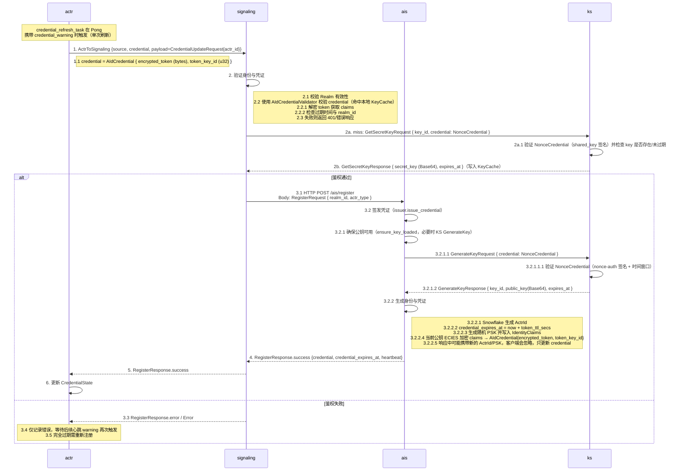

# Actrix 凭证更新流程

## 流程概述

1) 续期请求复用 `ActrToSignaling` 的鉴权，payload 只包含 `CredentialUpdateRequest.actr_id`，envelope 携带当前的 `AIdCredential`（`encrypted_token` + `token_key_id`）用于鉴权。  
2) Signaling 在鉴权通过后将请求转给 AIS，AIS 重新签发 `AIdCredential` 并通过 `RegisterResponse` 返回（响应中可能包含新的 ActrId/PSK）；actr 端只写回 credential，不替换本地 ActrId/PSK。  
3) 心跳驱动续期：Signaling 在 Pong 中携带 `CredentialWarning`（当前仅 `KEY_IN_TOLERANCE_PERIOD`）时，runtime 立即发起一次 `CredentialUpdateRequest` 并写回新的 credential。
4) 新凭证可能因为密钥轮换而携带新的 `token_key_id`，客户端自动接受并用于后续心跳、路由和重连；PSK 不会被覆盖。

## 时序图



---

## 协议与消息

### Proto 关键字段

```protobuf
// actr/proto/actr.proto
message AIdCredential {
  required bytes encrypted_token = 1;
  required uint32 token_key_id = 2;
}

// actr/proto/actr.proto
message CredentialUpdateRequest {
  required ActrId actr_id = 1;
}

// actr/proto/actr.proto
message RegisterResponse {
  message RegisterOk {
    required ActrId actr_id = 1;
    required AIdCredential credential = 2;
    optional bytes psk = 3;
    optional google.protobuf.Timestamp credential_expires_at = 4;
    required uint32 signaling_heartbeat_interval_secs = 5;
  }
  oneof result {
    RegisterOk success = 1;
    ErrorResponse error = 2;
  }
}

// actr/proto/signaling.proto
message ActrToSignaling {
  required actr.ActrId source = 1;
  required actr.AIdCredential credential = 2; // 续期也必须携带
  oneof payload {
    actr.CredentialUpdateRequest credential_update_request = 5;
    // ...
  }
}

// actr/proto/actr.proto
message Ping {
  required ServiceAvailabilityState availability = 1;
  required float power_reserve = 2;
  required float mailbox_backlog = 3;
}

// actr/proto/actr.proto
message Pong {
  required uint64 seq = 1;
  optional uint32 suggest_interval_secs = 2;
  optional CredentialWarning credential_warning = 3; // Signaling 用于提示续期
}

// actr/proto/actr.proto
message CredentialWarning {
  enum WarningType {
    KEY_IN_TOLERANCE_PERIOD = 0;
  }
  required WarningType type = 1;
  required string message = 2;
}

// actrix-proto/proto/keyserver.proto
message GetSecretKeyRequest {
  required uint32 key_id = 1;
  required supervisor.v1.NonceCredential credential = 2;
}

message GetSecretKeyResponse {
  required uint32 key_id = 1;
  required string secret_key = 2;    // Base64
  required uint64 expires_at = 3;    // Unix seconds
}

// 验证 NonceCredential 的签名与时间窗口依赖 nonce-auth crate（共享密钥签名 + 重放保护）
// actrix-proto/proto/supervisor.proto
message NonceCredential {
  required uint64 timestamp = 1;
  required bytes nonce = 2;
  required bytes signature = 3;
}

```

### Struct 关键字段（runtime）

```rust
// crates/runtime/src/lifecycle/actr_node.rs
// 在客户端侧维护的凭证状态（内部通过 Arc<RwLock<...>> 共享）
#[derive(Clone)]
pub struct CredentialState {
  inner: Arc<RwLock<CredentialStateInner>>,
}

#[derive(Clone)]
struct CredentialStateInner {
  credential: AIdCredential,
  expires_at: Option<prost_types::Timestamp>,
  /// This is updated together with credential when credential is refreshed
  psk: Option<Bytes>,
}

impl CredentialState {
  /// Update credential along with PSK
  /// This should be called when credential is refreshed and a new PSK is provided
  pub(crate) async fn update(
    &self,
    credential: AIdCredential,
    expires_at: Option<prost_types::Timestamp>,
    psk: Option<Bytes>,
  ) {
    let mut guard = self.inner.write().await;
    guard.credential = credential;
    guard.expires_at = expires_at;
    if psk.is_some() {
      guard.psk = psk;
    }
  }
}
```

- 续期响应直接复用 `RegisterResponse`，actr 收到后用其中的 credential/可选过期时间/可选 PSK 更新 `CredentialState`；因 `CredentialState` 通过 `Arc<RwLock<...>>` 共享，新的凭证会扩散到所有使用方。
- 响应中若含有新的 PSK，会写回 `CredentialState`（用于 TURN 认证）；ActrId 不会被覆盖。

### AIS HTTP 接口

- Signaling 调用 AIS `/ais/register`（HTTP POST，`Content-Type: application/octet-stream`）发送 `RegisterRequest`：

```protobuf
// actr/proto/actr.proto
message RegisterRequest {
  required ActrType actr_type = 1;
  required Realm realm = 2;
  optional ServiceSpec service_spec = 3;
  optional Acl acl = 4;
}

// actrix-proto/proto/keyserver.proto
message GetSecretKeyRequest {
  required uint32 key_id = 1;
  required supervisor.v1.NonceCredential credential = 2;
}

message GetSecretKeyResponse {
  required uint32 key_id = 1;
  required string secret_key = 2;    // Base64
  required uint64 expires_at = 3;    // Unix seconds
}

// actrix-proto/proto/keyserver.proto
message GenerateKeyRequest {
  required supervisor.v1.NonceCredential credential = 1;
}

message GenerateKeyResponse {
  required uint32 key_id = 1;
  required string public_key = 2; // Base64 compressed
  required uint64 expires_at = 3;
}

// actrix-proto/proto/supervisor.proto
message NonceCredential {
  required uint64 timestamp = 1;
  required bytes nonce = 2;
  required bytes signature = 3;
}

// 验证 NonceCredential 的签名与时间窗口依赖 nonce-auth crate（共享密钥签名 + 重放保护）
```

### AIS /register 处理流程（register_actr）

1) 解码 `RegisterRequest`（protobuf），失败返回 `RegisterResponse::Error{code=400}`。  
2) 调用 `issuer.issue_credential`（时序图已描述 ensure_key_loaded / GenerateKey / 生成 ActrId+PSK+credential_expires_at+ECIES 加密）。  
3) 过程错误映射为 `RegisterResponse::Error{code=500, message=...}`；成功/失败一律编码为 protobuf bytes 返回。

### Signaling / AIS 处理要点

- Signaling 对续期请求沿用业务请求的鉴权流程：根据 `token_key_id` 命中 SecretKeyCache，未命中则向 KS 拉取密钥，解密 token 后校验 `ActrId` 与有效期。
- AIS 依赖 `realm_id` 与 `actr_type`，用当前公钥重新生成 `AIdCredential`（生成的 PSK 在 Signaling 回包时被置为 None）；如果 KS 已轮换，返回的 `token_key_id` 会更新。
- Signaling 以 HTTP POST `/ais/register` 方式调用 AIS（Body: `RegisterRequest`），非 200、解码失败或 `RegisterResponse::Error` 时向 Actor 返回错误；成功则用返回的 `RegisterResponse` 更新内存中的客户端 credential 并回传。

---

## actr-runtime 客户端实现

### 心跳驱动的触发与处理

心跳逻辑已独立为 `crates/runtime/src/lifecycle/heartbeat.rs` 模块。

- 注册后由心跳任务 `heartbeat_task` 负责周期性发送 Ping 并监听续期信号。
- 心跳间隔取自 `RegisterResponse.signaling_heartbeat_interval_secs`（默认 30s），等待 Pong 的超时时间为间隔的 40%；超时或发送失败只记录 warn 并进入下一轮。
- `send_heartbeat` 返回 `Pong`，其中可选携带 `CredentialWarning` 来提示凭证进入容忍期。
- 当 Pong 含 `credential_warning` 时，心跳任务会异步触发一次 `credential_refresh_task(client, actor_id, credential_state)`，刷新结果写回共享状态。
- 刷新失败不会立即重试；后续心跳若继续收到 warning，会再次触发刷新。

`crates/runtime/src/lifecycle/heartbeat.rs` 中 `send_heartbeat_and_handle_response` 函数片段：

```rust
async fn send_heartbeat_and_handle_response(
    client: &Arc<dyn SignalingClient>,
    actor_id: &ActrId,
    credential_state: &CredentialState,
    mailbox: &Arc<dyn Mailbox>,
    heartbeat_interval: Duration,
) {
    // Get current credential from shared state
    let current_credential = credential_state.credential().await;

    // Get power reserve, mailbox backlog and calculate availability
    let (power_reserve, mailbox_backlog, availability) =
        get_power_reserve_and_availability(mailbox).await;

    let ping_timeout_secs = (heartbeat_interval.as_secs() as f64 * 0.4) as u64;
    let pong_response = tokio::time::timeout(
        Duration::from_secs(ping_timeout_secs),
        client.send_heartbeat(
            actor_id.clone(),
            current_credential.clone(),
            availability,
            power_reserve,
            mailbox_backlog,
        ),
    )
    .await;

    let pong = match pong_response {
        Ok(Ok(pong)) => pong,
        Ok(Err(e)) => {
            tracing::warn!("⚠️ Failed to send heartbeat or receive Pong: {}", e);
            return;
        }
        Err(_) => {
            tracing::warn!("⚠️ Heartbeat timeout after {}s", ping_timeout_secs);
            return;
        }
    };

    // Handle credential_warning
    if let Some(warning) = pong.credential_warning {
        tracing::warn!(
            "⚠️ Credential warning received: type={:?}, message={}",
            warning.r#type(),
            warning.message
        );

        // Trigger immediate credential refresh in a spawned task
        tokio::spawn(credential_refresh_task(
            client.clone(),
            actor_id.clone(),
            credential_state.clone(),
        ));
    }
}
```

`credential_refresh_task`（`crates/runtime/src/lifecycle/heartbeat.rs`）实现为单次刷新：

```rust
async fn credential_refresh_task(
    client: Arc<dyn SignalingClient>,
    actor_id: ActrId,
    credential_state: CredentialState,
) {
    tracing::info!(
        "🔑 Refreshing credential for Actor {}",
        actor_id.to_string_repr()
    );

    match client
        .send_credential_update_request(actor_id.clone(), credential_state.credential().await)
        .await
    {
        Ok(register_response) => {
            match register_response.result {
                Some(actr_protocol::register_response::Result::Success(register_ok)) => {
                    let new_credential = register_ok.credential;
                    let new_expires_at = register_ok.credential_expires_at;
                    let new_psk = register_ok.psk;

                    // Update shared state including PSK
                    credential_state
                        .update(new_credential.clone(), new_expires_at, new_psk.clone())
                        .await;

                    tracing::info!(
                        "✅ Credential refreshed successfully for Actor {} (new key_id: {})",
                        actor_id.serial_number,
                        new_credential.token_key_id
                    );

                    if new_psk.is_some() {
                        tracing::debug!("🔑 PSK updated for TURN authentication");
                    }

                    if let Some(expires_at) = &new_expires_at {
                        tracing::debug!("⏰ New credential expires at: {}s", expires_at.seconds);
                    }
                }
                Some(actr_protocol::register_response::Result::Error(err)) => {
                    tracing::error!(
                        "❌ Credential refresh failed: code={}, message={}",
                        err.code,
                        err.message
                    );
                }
                None => {
                    tracing::error!("❌ Credential refresh response missing result");
                }
            }
        }
        Err(e) => {
            tracing::warn!("⚠️ Failed to send credential update request: {}", e);
        }
    }
}
```

---

## 凭证连续性与轮换影响

- **身份稳定**：ActrId 续期前后保持不变，响应中即便携带新的 ActrId 也不会覆盖本地存储。
- **密钥轮换友好**：`token_key_id` 会随 KS 轮换而变化，新的 credential 立即用于心跳、路由、重连 URL。
- **过期时间留存**：服务器返回的 `credential_expires_at` 会写入 `CredentialState` 供日志/监控使用，刷新则由 Pong 携带的 `credential_warning` 触发。
- **PSK 可更新**：若响应中携带新的 PSK，会写回 `CredentialState` 用于 TURN 认证；若响应中未携带 PSK，则保留原有值。

---

## 错误处理与恢复

- Pong 携带 `credential_warning` 时触发的刷新若返回 `Error`/缺失 result，只记录日志，不自动重试；后续心跳若仍返回 warning 会再次触发刷新。
- 心跳发送失败或等待 Pong 超时只会 warn 并进入下一轮；如果长期无 Pong，需检查信令连接或考虑重新注册。
- 若 Signaling/AIS 在处理 `CredentialUpdateRequest` 时鉴权失败，凭证保持旧值，后续业务请求可能因过期被拒绝，此时需要重新注册或等待新一次警告后刷新成功。

---

## 相关文档

- [注册流程](./5.1-registration-flow.md)
- [业务请求认证流程](./5.2-authentication-flow.md)
- [密钥轮换策略](./5.5-key-rotation.md)
