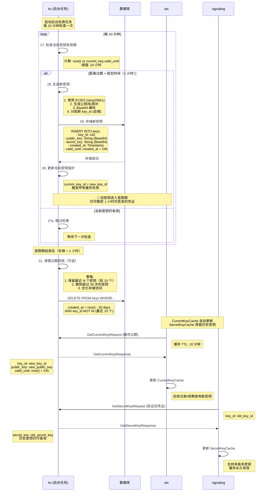

# Actrix 密钥轮换策略

## 概述

密钥轮换是 Actrix 认证系统的核心安全机制，通过定期更换加密密钥来降低密钥泄露的风险。Key Server (KS) 负责自动管理密钥的生成、轮换和过期，而其他服务（AIS、Signaling、TURN）通过缓存机制高效地使用这些密钥。

## 时序图



---

## 核心概念

### 密钥生命周期

```
密钥时间线：
├─ T0: 密钥生成
│  ├─ key_id: 5
│  ├─ valid_until: T0 + 24h
│  └─ status: ACTIVE
│
├─ T0 - 24h + 1h (距离过期 1 小时): 触发轮换
│  ├─ 生成 key_id=6
│  ├─ current_key_id: 5 → 6
│  └─ key_id=5 进入宽限期 (GRACE_PERIOD)
│
├─ T0 - 24h: key_id=5 正式过期
│  ├─ 不再用于签发新凭证
│  ├─ 仍可解密在宽限期内签发的凭证
│  └─ status: EXPIRED
│
├─ T0 - 24h + 1h: 宽限期结束
│  ├─ 使用 key_id=5 签发的最后一批凭证过期
│  └─ key_id=5 可以被清理 (status: DEPRECATED)
│
└─ T0 + 30 days: 清理策略
   ├─ 如果 key_id=5 不在最近 10 个密钥中
   └─ 从数据库删除
```

---

### 时间参数配置

| 参数 | 默认值 | 说明 |
|------|--------|------|
| **KEY_VALIDITY** | 86400s (24h) | 密钥有效期 |
| **KEY_GRACE_PERIOD** | 3600s (1h) | 密钥轮换宽限期 |
| **ROTATION_CHECK_INTERVAL** | 600s (10min) | 轮换任务检查间隔 |
| **CREDENTIAL_TTL** | 3600s (1h) | 凭证有效期 |
| **CURRENT_KEY_CACHE_TTL** | 600s (10min) | AIS 公钥缓存 TTL |
| **HISTORICAL_KEY_RETENTION** | 10 keys | 保留历史密钥数量 |
| **KEY_ARCHIVE_DAYS** | 30 days | 密钥归档时间 |

**时间关系约束**:
```
CREDENTIAL_TTL ≤ KEY_GRACE_PERIOD ≤ KEY_VALIDITY

原因：
1. 凭证必须在密钥宽限期内过期，确保可验证
2. 宽限期必须在密钥有效期内，避免使用完全失效的密钥
```

---

## KS 实现详解

### 步骤 27-28: 轮换触发逻辑

**后台任务** (`actrix/crates/keyserver/src/server.rs`):

```rust
use tokio::time::{interval, Duration};

pub struct KeyServer {
    config: Config,
    storage: Arc<KeyStorage>,
    current_key_id: Arc<RwLock<u32>>,
}

#[derive(Clone)]
pub struct Config {
    /// 密钥有效期（默认 24 小时）
    pub key_validity: Duration,
    
    /// 轮换宽限期（默认 1 小时）
    pub grace_period: Duration,
    
    /// 轮换检查间隔（默认 10 分钟）
    pub rotation_check_interval: Duration,
    
    /// 历史密钥保留数量（默认 10）
    pub historical_key_retention: usize,
    
    /// 密钥归档天数（默认 30 天）
    pub key_archive_days: u64,
}

impl KeyServer {
    /// 启动自动轮换任务
    pub async fn start_auto_rotation(&self) {
        let mut check_interval = interval(self.config.rotation_check_interval);
        
        loop {
            check_interval.tick().await;
            
            if let Err(e) = self.check_and_rotate_if_needed().await {
                error!("Failed to check/rotate key: {}", e);
            }
        }
    }
    
    /// 检查并轮换密钥
    async fn check_and_rotate_if_needed(&self) -> Result<()> {
        let current_key_id = *self.current_key_id.read().await;
        
        // 1. 获取当前密钥信息
        let current_key = self.storage.get_key(current_key_id).await?;
        
        // 2. 检查是否需要轮换
        let now = SystemTime::now().as_secs();
        let time_until_expiry = current_key.valid_until.saturating_sub(now);
        
        if time_until_expiry <= self.config.grace_period.as_secs() {
            info!(
                "Key rotation triggered: current_key_id={}, time_until_expiry={}s",
                current_key_id, time_until_expiry
            );
            
            self.rotate_key().await?;
        } else {
            debug!(
                "Key still valid: current_key_id={}, time_until_expiry={}s",
                current_key_id, time_until_expiry
            );
        }
        
        Ok(())
    }
    
    /// 执行密钥轮换
    async fn rotate_key(&self) -> Result<()> {
        // 1. 生成新密钥对
        let (secret_key, public_key) = self.generate_keypair()?;
        
        // 2. 计算有效期
        let now = SystemTime::now().as_secs();
        let valid_until = now + self.config.key_validity.as_secs();
        
        // 3. 分配新 key_id（自增）
        let new_key_id = self.storage.get_next_key_id().await?;
        
        // 4. 存储到数据库
        let key_entry = KeyEntry {
            key_id: new_key_id,
            public_key: base64::encode(&public_key),
            secret_key: base64::encode(&secret_key),
            created_at: now,
            valid_until,
        };
        
        self.storage.store_key(key_entry).await?;
        
        // 5. 更新当前密钥指针
        *self.current_key_id.write().await = new_key_id;
        
        info!(
            "Key rotated successfully: old_key_id={}, new_key_id={}, valid_until={}",
            new_key_id - 1, new_key_id, valid_until
        );
        
        // 6. 可选：清理过期密钥
        self.cleanup_expired_keys().await?;
        
        Ok(())
    }
    
    /// 生成 ECIES 密钥对
    fn generate_keypair(&self) -> Result<(Vec<u8>, Vec<u8>)> {
        use secp256k1::{Secp256k1, SecretKey, PublicKey};
        use rand::rngs::OsRng;
        
        let secp = Secp256k1::new();
        let mut rng = OsRng;
        
        // 1. 生成私钥（32 字节）
        let secret_key = SecretKey::new(&mut rng);
        
        // 2. 派生公钥（33 字节，压缩格式）
        let public_key = PublicKey::from_secret_key(&secp, &secret_key);
        
        Ok((
            secret_key.secret_bytes().to_vec(),
            public_key.serialize().to_vec(),
        ))
    }
}
```

---

### 步骤 29: 密钥存储

**数据库 Schema**:

```sql
CREATE TABLE keys (
    key_id INTEGER PRIMARY KEY,
    public_key TEXT NOT NULL,        -- Base64 编码的公钥
    secret_key TEXT NOT NULL,        -- Base64 编码的私钥（加密存储）
    created_at BIGINT NOT NULL,      -- Unix timestamp (秒)
    valid_until BIGINT NOT NULL,     -- Unix timestamp (秒)
    INDEX idx_valid_until (valid_until)
);

-- 当前密钥指针（单行表）
CREATE TABLE current_key (
    id INTEGER PRIMARY KEY DEFAULT 1,
    key_id INTEGER NOT NULL,
    updated_at BIGINT NOT NULL,
    FOREIGN KEY (key_id) REFERENCES keys(key_id)
);
```

**存储实现**:

```rust
use sqlx::SqlitePool;

pub struct KeyStorage {
    pool: SqlitePool,
}

impl KeyStorage {
    /// 存储新密钥
    pub async fn store_key(&self, entry: KeyEntry) -> Result<()> {
        sqlx::query!(
            "INSERT INTO keys (key_id, public_key, secret_key, created_at, valid_until)
             VALUES (?, ?, ?, ?, ?)",
            entry.key_id,
            entry.public_key,
            entry.secret_key,
            entry.created_at,
            entry.valid_until,
        )
        .execute(&self.pool)
        .await?;
        
        // 更新当前密钥指针
        self.set_current_key_id(entry.key_id).await?;
        
        Ok(())
    }
    
    /// 获取密钥
    pub async fn get_key(&self, key_id: u32) -> Result<KeyEntry> {
        let row = sqlx::query!(
            "SELECT key_id, public_key, secret_key, created_at, valid_until
             FROM keys WHERE key_id = ?",
            key_id,
        )
        .fetch_one(&self.pool)
        .await?;
        
        Ok(KeyEntry {
            key_id: row.key_id as u32,
            public_key: row.public_key,
            secret_key: row.secret_key,
            created_at: row.created_at as u64,
            valid_until: row.valid_until as u64,
        })
    }
    
    /// 获取当前密钥 ID
    pub async fn get_current_key_id(&self) -> Result<u32> {
        let row = sqlx::query!("SELECT key_id FROM current_key WHERE id = 1")
            .fetch_one(&self.pool)
            .await?;
        
        Ok(row.key_id as u32)
    }
    
    /// 设置当前密钥 ID
    async fn set_current_key_id(&self, key_id: u32) -> Result<()> {
        let now = SystemTime::now().as_secs();
        
        sqlx::query!(
            "INSERT OR REPLACE INTO current_key (id, key_id, updated_at)
             VALUES (1, ?, ?)",
            key_id,
            now,
        )
        .execute(&self.pool)
        .await?;
        
        Ok(())
    }
    
    /// 获取下一个 key_id
    pub async fn get_next_key_id(&self) -> Result<u32> {
        let row = sqlx::query!("SELECT COALESCE(MAX(key_id), 0) + 1 as next_id FROM keys")
            .fetch_one(&self.pool)
            .await?;
        
        Ok(row.next_id as u32)
    }
}
```

---

### 步骤 31: 密钥清理策略

**清理逻辑**:

```rust
impl KeyServer {
    /// 清理过期密钥
    async fn cleanup_expired_keys(&self) -> Result<()> {
        let now = SystemTime::now().as_secs();
        let archive_threshold = now - (self.config.key_archive_days * 86400);
        
        // 1. 获取最近 N 个密钥的 ID（不删除）
        let recent_key_ids = self.storage.get_recent_key_ids(
            self.config.historical_key_retention
        ).await?;
        
        // 2. 删除超过归档天数且不在保留列表中的密钥
        let deleted = self.storage.delete_keys_before(
            archive_threshold,
            &recent_key_ids,
        ).await?;
        
        if deleted > 0 {
            info!("Cleaned up {} expired keys", deleted);
        }
        
        Ok(())
    }
}

impl KeyStorage {
    /// 获取最近 N 个密钥的 ID
    pub async fn get_recent_key_ids(&self, limit: usize) -> Result<Vec<u32>> {
        let rows = sqlx::query!(
            "SELECT key_id FROM keys
             ORDER BY created_at DESC
             LIMIT ?",
            limit as i64,
        )
        .fetch_all(&self.pool)
        .await?;
        
        Ok(rows.into_iter().map(|r| r.key_id as u32).collect())
    }
    
    /// 删除指定时间之前的密钥（排除保留列表）
    pub async fn delete_keys_before(
        &self,
        before: u64,
        except: &[u32],
    ) -> Result<u64> {
        // 构造 NOT IN 子句
        let placeholders = except.iter().map(|_| "?").collect::<Vec<_>>().join(",");
        let query = format!(
            "DELETE FROM keys WHERE created_at < ? AND key_id NOT IN ({})",
            placeholders
        );
        
        let mut query = sqlx::query(&query).bind(before as i64);
        for key_id in except {
            query = query.bind(*key_id as i64);
        }
        
        let result = query.execute(&self.pool).await?;
        Ok(result.rows_affected())
    }
}
```

**清理策略示例**:

```
当前时间: 2024-01-31 12:00:00
归档阈值: 2024-01-01 12:00:00 (30 天前)
保留数量: 10 个

数据库中的密钥:
├─ key_id=1, created_at=2023-12-01 (60 天前) ❌ 删除
├─ key_id=2, created_at=2023-12-15 (46 天前) ❌ 删除
├─ key_id=3, created_at=2024-01-05 (26 天前) ✅ 保留（最近 10 个）
├─ ...
├─ key_id=11, created_at=2024-01-29 (2 天前) ✅ 保留（最近 10 个）
└─ key_id=12, created_at=2024-01-31 (当前) ✅ 保留（当前密钥）

清理结果:
├─ 删除 key_id=1, 2
├─ 保留 key_id=3-12
└─ 节省存储空间
```

---

## 缓存同步机制

### CurrentKeyCache (AIS)

**更新触发**:

```rust
impl Issuer {
    /// 获取当前公钥（缓存优先）
    async fn get_current_public_key(&self) -> Result<(u32, String, u64)> {
        // 1️⃣ 检查缓存
        if let Some(cached) = self.current_key_cache.read().await.as_ref() {
            let now = SystemTime::now();
            
            if now < cached.expires_at {
                debug!("CurrentKeyCache hit: key_id={}", cached.key_id);
                return Ok((
                    cached.key_id,
                    cached.public_key.clone(),
                    cached.valid_until,
                ));
            } else {
                debug!("CurrentKeyCache expired, refreshing");
            }
        }
        
        // 2️⃣ 缓存未命中或过期，调用 KS
        let request = GetCurrentKeyRequest {};
        let response = self.ks_client.get_current_key(request).await?;
        
        // 3️⃣ 更新缓存
        let cache_entry = CurrentKeyEntry {
            key_id: response.key_id,
            public_key: response.public_key.clone(),
            valid_until: response.valid_until,
            expires_at: SystemTime::now() + Duration::from_secs(600),  // 10 分钟
        };
        
        *self.current_key_cache.write().await = Some(cache_entry);
        
        info!("CurrentKeyCache updated: key_id={}", response.key_id);
        
        Ok((response.key_id, response.public_key, response.valid_until))
    }
}
```

**轮换后缓存更新时间线**:

```
T0: KS 轮换密钥 (key_id: 5 → 6)
├─ current_key_id 更新为 6
│
├─ T0+1s: AIS1 发起注册请求
│  ├─ CurrentKeyCache 仍缓存 key_id=5（未过期）
│  ├─ 使用 key_id=5 签发凭证 ✅ (在宽限期内)
│  └─ 凭证 valid_until: T0+1h（在 key_id=5 宽限期内）
│
├─ T0+10min: AIS1 的 CurrentKeyCache 过期
│  ├─ 下次注册时调用 GetCurrentKey
│  ├─ KS 返回 key_id=6
│  └─ 更新缓存为 key_id=6
│
├─ T0+5min: AIS2 发起注册请求
│  ├─ CurrentKeyCache 过期（刚启动）
│  ├─ 调用 GetCurrentKey → key_id=6
│  └─ 使用 key_id=6 签发凭证 ✅
│
└─ T0+1h: 所有 AIS 实例的缓存都已更新为 key_id=6
```

---

### SecretKeyCache (Signaling)

**多版本支持**:

```rust
pub struct CredentialVerifier {
    secret_key_cache: Arc<RwLock<HashMap<u32, SecretKeyEntry>>>,
}

impl CredentialVerifier {
    /// 验证凭证（支持历史密钥）
    pub async fn verify_credential(
        &self,
        credential: &str,
        encrypted_credential: &str,
    ) -> Result<IdentityClaims> {
        let encrypted_bytes = base64::decode(encrypted_credential)?;
        let key_id = u32::from_be_bytes(encrypted_bytes[0..4].try_into()?);
        
        // 获取解密密钥（可能是旧版本）
        let secret_key = self.get_secret_key(key_id).await?;
        
        // ... 解密和验证
    }
    
    /// 获取解密密钥（支持多版本缓存）
    async fn get_secret_key(&self, key_id: u32) -> Result<Vec<u8>> {
        // 1️⃣ 检查缓存（永久有效）
        if let Some(entry) = self.secret_key_cache.read().await.get(&key_id) {
            debug!("SecretKeyCache hit: key_id={}", key_id);
            return Ok(entry.secret_key.clone());
        }
        
        // 2️⃣ 缓存未命中，调用 KS GetSecretKey
        let request = GetSecretKeyRequest { key_id };
        let response = self.ks_client.get_secret_key(request).await?;
        
        let secret_key = base64::decode(&response.secret_key)?;
        
        // 3️⃣ 存入缓存（不设置过期时间）
        self.secret_key_cache.write().await.insert(key_id, SecretKeyEntry {
            secret_key: secret_key.clone(),
            cached_at: SystemTime::now(),
        });
        
        info!("SecretKeyCache updated: key_id={}, cache_size={}",
              key_id, self.secret_key_cache.read().await.len());
        
        Ok(secret_key)
    }
}
```

**为什么 SecretKeyCache 永久有效？**

1. **历史凭证验证**: 旧凭证在有效期内仍需验证
2. **密钥不变性**: 一旦生成，secret_key 永不改变
3. **内存可控**: 只保留最近 10 个密钥，内存占用 < 1KB

---

## 宽限期详解

### 宽限期的作用

**场景 1: 平滑过渡**

```
无宽限期：
├─ T0: KS 轮换密钥 (key_id: 5 → 6)
├─ T0+1s: AIS1 缓存仍是 key_id=5
│  └─ 使用 key_id=5 签发凭证
│  └─ Signaling 无法验证（key_id=5 已删除）❌
│  └─ 客户端认证失败
│
└─ 结果：服务中断

有宽限期：
├─ T0: KS 轮换密钥 (key_id: 5 → 6)
├─ T0+1s: AIS1 缓存仍是 key_id=5
│  └─ 使用 key_id=5 签发凭证 ✅
│  └─ Signaling 可以验证（key_id=5 在宽限期内）
│  └─ 客户端认证成功
│
├─ T0+10min: AIS1 缓存更新为 key_id=6
│  └─ 后续使用 key_id=6 签发凭证
│
└─ T0+1h: 所有 key_id=5 的凭证都已过期
   └─ key_id=5 可以安全删除
```

---

**场景 2: 并发请求一致性**

```
无宽限期：
├─ T0: KS 轮换密钥
├─ T0+1ms: 客户端 A 注册（使用 key_id=5）
├─ T0+2ms: 客户端 B 注册（使用 key_id=6）
│  └─ 两个客户端获得不同 key_id 的凭证
│  └─ 如果 key_id=5 立即失效，客户端 A 立即无法认证 ❌
│
└─ 结果：部分客户端认证失败

有宽限期：
├─ T0: KS 轮换密钥
├─ T0+1ms: 客户端 A 注册（使用 key_id=5）✅
├─ T0+2ms: 客户端 B 注册（使用 key_id=6）✅
│  └─ 两个凭证都有效
│
├─ T0+1h: 客户端 A 的凭证过期（自动续期）
│  └─ 续期时使用 key_id=6
│
└─ 结果：零中断
```

---

### 宽限期时间选择

**为什么选择 1 小时？**

1. **凭证有效期**: 凭证 TTL 是 1 小时，宽限期 ≥ 凭证 TTL 可确保所有凭证可验证
2. **缓存刷新**: CurrentKeyCache TTL 是 10 分钟，1 小时可容纳 6 次缓存刷新
3. **容错空间**: 允许短时间的网络故障或服务重启

**如果宽限期 < 凭证 TTL 会怎样？**

```
配置:
├─ KEY_GRACE_PERIOD: 30 分钟
└─ CREDENTIAL_TTL: 1 小时

时间线:
├─ T0: KS 轮换 (key_id: 5 → 6)
├─ T0+1min: 客户端注册（使用 key_id=5, expires_at=T0+1h）
├─ T0+30min: 宽限期结束，key_id=5 被标记为完全过期
├─ T0+31min: 客户端尝试使用凭证
│  └─ Signaling 调用 GetSecretKey(key_id=5)
│  └─ KS 拒绝返回（已过期）❌
│  └─ 认证失败
│
└─ 结果：合法凭证无法使用
```

---

## KS gRPC 接口

### GetCurrentKeyRequest/Response

**定义**:

```protobuf
message GetCurrentKeyRequest {
  // 空请求
}

message GetCurrentKeyResponse {
  required uint32 key_id = 1;
  required string public_key = 2;  // Base64 编码
  required uint64 valid_until = 3;  // Unix timestamp (秒)
}
```

**实现**:

```rust
use tonic::{Request, Response, Status};

#[tonic::async_trait]
impl KeyService for KeyServer {
    async fn get_current_key(
        &self,
        _request: Request<GetCurrentKeyRequest>,
    ) -> Result<Response<GetCurrentKeyResponse>, Status> {
        let current_key_id = *self.current_key_id.read().await;
        
        let key = self.storage.get_key(current_key_id).await
            .map_err(|e| Status::internal(format!("Failed to get key: {}", e)))?;
        
        Ok(Response::new(GetCurrentKeyResponse {
            key_id: key.key_id,
            public_key: key.public_key,
            valid_until: key.valid_until,
        }))
    }
}
```

---

### GetSecretKeyRequest/Response

**定义**:

```protobuf
message GetSecretKeyRequest {
  required uint32 key_id = 1;
}

message GetSecretKeyResponse {
  required string secret_key = 1;  // Base64 编码
}
```

**实现**:

```rust
#[tonic::async_trait]
impl KeyService for KeyServer {
    async fn get_secret_key(
        &self,
        request: Request<GetSecretKeyRequest>,
    ) -> Result<Response<GetSecretKeyResponse>, Status> {
        let key_id = request.get_ref().key_id;
        
        let key = self.storage.get_key(key_id).await
            .map_err(|e| Status::not_found(format!("Key not found: {}", e)))?;
        
        // 可选：检查密钥是否在宽限期内
        let now = SystemTime::now().as_secs();
        let grace_period_end = key.valid_until + self.config.grace_period.as_secs();
        
        if now > grace_period_end {
            return Err(Status::not_found(format!(
                "Key expired beyond grace period: key_id={}, grace_period_end={}",
                key_id, grace_period_end
            )));
        }
        
        Ok(Response::new(GetSecretKeyResponse {
            secret_key: key.secret_key,
        }))
    }
}
```

---

## 安全考虑

### 1. 私钥存储安全

**问题**: 数据库中的 `secret_key` 是明文存储的，如果数据库泄露，所有密钥都会泄露。

**解决方案**:

```rust
use aes_gcm::{Aes256Gcm, Key, Nonce};
use aes_gcm::aead::{Aead, NewAead};

pub struct KeyStorage {
    pool: SqlitePool,
    master_key: Key<Aes256Gcm>,  // 从环境变量或 KMS 获取
}

impl KeyStorage {
    /// 存储密钥（加密私钥）
    pub async fn store_key(&self, entry: KeyEntry) -> Result<()> {
        // 1. 加密 secret_key
        let cipher = Aes256Gcm::new(&self.master_key);
        let nonce = Nonce::from_slice(b"unique nonce");  // 实际应随机生成
        
        let encrypted_secret = cipher.encrypt(nonce, entry.secret_key.as_bytes())
            .map_err(|e| Error::EncryptionFailed(e))?;
        
        // 2. 存储加密后的私钥
        sqlx::query!(
            "INSERT INTO keys (key_id, public_key, secret_key, created_at, valid_until)
             VALUES (?, ?, ?, ?, ?)",
            entry.key_id,
            entry.public_key,
            base64::encode(&encrypted_secret),  // 存储加密后的
            entry.created_at,
            entry.valid_until,
        )
        .execute(&self.pool)
        .await?;
        
        Ok(())
    }
    
    /// 获取密钥（解密私钥）
    pub async fn get_key(&self, key_id: u32) -> Result<KeyEntry> {
        let row = sqlx::query!("SELECT * FROM keys WHERE key_id = ?", key_id)
            .fetch_one(&self.pool)
            .await?;
        
        // 解密 secret_key
        let cipher = Aes256Gcm::new(&self.master_key);
        let nonce = Nonce::from_slice(b"unique nonce");
        
        let encrypted = base64::decode(&row.secret_key)?;
        let decrypted = cipher.decrypt(nonce, encrypted.as_slice())
            .map_err(|e| Error::DecryptionFailed(e))?;
        
        Ok(KeyEntry {
            key_id: row.key_id as u32,
            public_key: row.public_key,
            secret_key: String::from_utf8(decrypted)?,
            created_at: row.created_at as u64,
            valid_until: row.valid_until as u64,
        })
    }
}
```

---

### 2. 轮换失败处理

**问题**: 如果 KS 在轮换过程中崩溃，可能导致状态不一致。

**解决方案: 事务保证**

```rust
impl KeyServer {
    async fn rotate_key(&self) -> Result<()> {
        // 使用数据库事务确保原子性
        let mut tx = self.storage.pool.begin().await?;
        
        // 1. 生成新密钥
        let (secret_key, public_key) = self.generate_keypair()?;
        let now = SystemTime::now().as_secs();
        let valid_until = now + self.config.key_validity.as_secs();
        let new_key_id = self.storage.get_next_key_id().await?;
        
        // 2. 插入新密钥（事务内）
        sqlx::query!(
            "INSERT INTO keys (key_id, public_key, secret_key, created_at, valid_until)
             VALUES (?, ?, ?, ?, ?)",
            new_key_id,
            base64::encode(&public_key),
            base64::encode(&secret_key),
            now,
            valid_until,
        )
        .execute(&mut *tx)
        .await?;
        
        // 3. 更新当前密钥指针（事务内）
        sqlx::query!(
            "UPDATE current_key SET key_id = ?, updated_at = ? WHERE id = 1",
            new_key_id,
            now,
        )
        .execute(&mut *tx)
        .await?;
        
        // 4. 提交事务
        tx.commit().await?;
        
        // 5. 更新内存状态（只在事务成功后）
        *self.current_key_id.write().await = new_key_id;
        
        info!("Key rotated successfully: new_key_id={}", new_key_id);
        Ok(())
    }
}
```

---

### 3. 时钟同步

**问题**: 如果 KS、AIS、Signaling 的系统时钟不同步，可能导致验证失败。

**解决方案**:

1. **使用 NTP**: 确保所有服务器时钟同步
2. **时间容忍度**: 验证时允许 ±5 分钟的时间差

```rust
const TIME_TOLERANCE: u64 = 300;  // 5 分钟

impl CredentialVerifier {
    fn verify_expiry(&self, credential_expires_at: u64) -> Result<()> {
        let now = SystemTime::now().as_secs();
        
        // 允许 5 分钟的时钟偏差
        if now > credential_expires_at + TIME_TOLERANCE {
            return Err(Error::CredentialExpired {
                expired_at: credential_expires_at,
                now,
            });
        }
        
        Ok(())
    }
}
```

---

## 监控指标

### 轮换健康度

```rust
use prometheus::{IntCounter, IntGauge, Histogram};

struct KeyRotationMetrics {
    // 轮换次数
    rotations_total: IntCounter,
    
    // 轮换成功/失败
    rotation_success_total: IntCounter,
    rotation_failure_total: IntCounter,
    
    // 当前密钥 ID
    current_key_id: IntGauge,
    
    // 当前密钥剩余有效时间（秒）
    current_key_time_until_expiry: IntGauge,
    
    // 轮换延迟
    rotation_duration: Histogram,
    
    // 历史密钥数量
    historical_keys_count: IntGauge,
}
```

### 告警规则

```yaml
alerts:
  - name: key_expiring_soon
    expr: current_key_time_until_expiry < 7200  # 小于 2 小时
    severity: warning
    message: "当前密钥即将过期，但未触发轮换"
    
  - name: key_rotation_failure
    expr: increase(rotation_failure_total[1h]) > 0
    severity: critical
    message: "密钥轮换失败"
    
  - name: current_key_cache_stale
    expr: time() - current_key_cache_updated_at > 1200  # 超过 20 分钟未更新
    severity: warning
    message: "CurrentKeyCache 可能未正确更新"
    
  - name: too_many_historical_keys
    expr: historical_keys_count > 50
    severity: info
    message: "历史密钥数量过多，建议清理"
```

---

## 配置示例

### KS 配置文件

```toml
# actrix/crates/keyserver/config.toml

[key_rotation]
# 密钥有效期（默认 24 小时）
validity_seconds = 86400

# 轮换宽限期（默认 1 小时）
grace_period_seconds = 3600

# 轮换检查间隔（默认 10 分钟）
check_interval_seconds = 600

# 历史密钥保留数量（默认 10）
historical_retention = 10

# 密钥归档天数（默认 30 天）
archive_days = 30

[storage]
# 数据库路径
database_url = "sqlite:///var/lib/actrix/keys.db"

# 主加密密钥（从环境变量获取）
# master_key_env = "ACTRIX_MASTER_KEY"

[grpc]
# gRPC 监听地址
listen_addr = "0.0.0.0:50051"
```

---

## 相关文档

- [注册流程](./1-registration-flow.md)
- [业务请求认证流程](./2-authentication-flow.md)
- [TURN 认证流程](./3-turn-authentication.md)
- [凭证更新流程](./4-credential-update.md)
