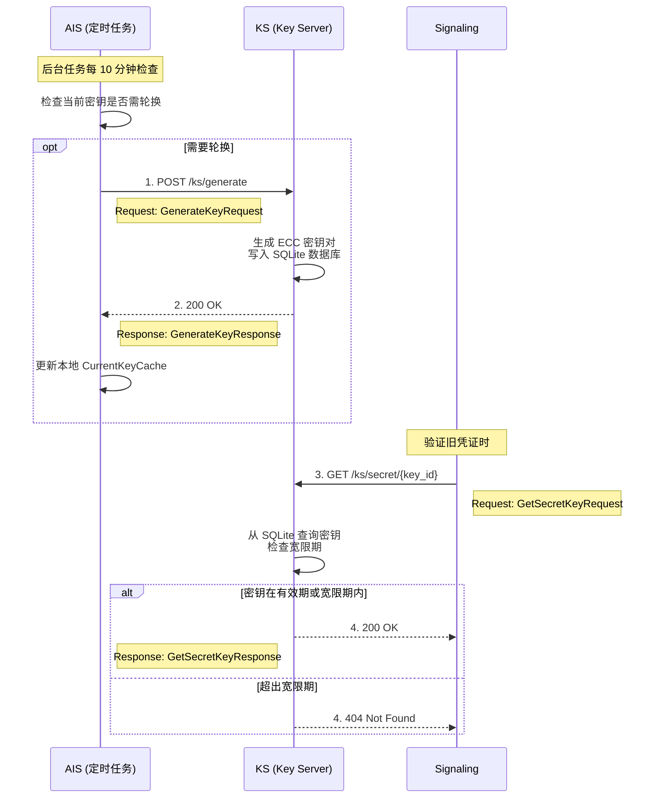

# Actrix 密钥轮换策略

## 概述

密钥轮换是 Actrix 认证系统的核心安全机制，通过定期更换加密密钥来降低密钥泄露的风险。目前的实现采用**被动轮换**策略，由 **AIS (Actor Identity Service)** 内部的定时任务负责触发。

AIS 周期性地（默认每 10 分钟）检查当前使用的密钥状态。当检测到密钥将在 10 分钟内过期时，AIS 会向 Key Server (KS) 发起生成新密钥的请求。KS 负责密钥的生成和持久化存储，并支持配置**容忍期（Tolerance Period）**：

- **容忍期**：密钥过期**后**的缓冲时间，允许旧密钥继续用于验证，确保在密钥切换期间服务的平滑过渡，避免认证中断。

## 时序图



---

## 核心概念

### 密钥生命周期

```
密钥时间线：
├─ T0: AIS 触发生成密钥 (POST /generate)
│  ├─ key_id: 5
│  ├─ expires_at: T0 + 24h (默认有效期)
│  └─ status: ACTIVE
│
├─ T0 + 23h50m: AIS 检测到密钥即将过期
│  ├─ 距离过期 < 10 分钟 (KEY_REFRESH_ADVANCE_SECS)
│  ├─ AIS 触发轮换，生成 key_id=6
│  └─ AIS 切换到使用 key_id=6
│
├─ T0 + 24h: key_id=5 正式过期
│  ├─ 进入容忍期 (Tolerance Period)
│  ├─ key_id=5 仍可用于验证旧凭证
│  └─ status: EXPIRED (但在容忍期内)
│
├─ T0 + 25h: 容忍期结束
│  ├─ key_id=5 完全失效
│  ├─ GetSecretKey 返回 404 Not Found
│  └─ status: DEPRECATED
│
└─ Lazy Cleanup: 惰性清理
   ├─ 在生成新密钥时触发
   └─ 物理删除
```

### 存储与安全

- **存储方式**: 默认情况下，密钥以**明文**形式存储在 SQLite 数据库中。
- **加密选项**: 如果配置了 KEK (Key Encryption Key)，私钥将被加密存储。
- **传输安全**: 建议在生产环境中通过 HTTPS 部署 KS 服务，以保护密钥在传输过程中的安全。

### 提前轮换机制

AIS 使用硬编码的提前时间（`KEY_REFRESH_ADVANCE_SECS = 600` 秒，即 10 分钟）来触发密钥轮换。

**判断逻辑** (`actrix/crates/ais/src/storage.rs`):
```rust
const KEY_REFRESH_ADVANCE_SECS: u64 = 600; // 10 分钟

pub async fn should_refresh(&self) -> Result<bool> {
    let key = self.get_current_key().await?;
    let now = SystemTime::now().as_secs();
    
    // 提前刷新：在密钥过期前 10 分钟触发
    let refresh_threshold = key.expires_at.saturating_sub(KEY_REFRESH_ADVANCE_SECS);
    
    if now >= refresh_threshold {
        return Ok(true);
    }
    
    Ok(false)
}
```

**示例时间线**:
```
假设: key_ttl_seconds = 86400 (24h)

T0: 生成 key_id=5, expires_at=T0+24h
├─ T0+23h40m: 距离过期还有 20 分钟，不触发轮换
├─ T0+23h50m: 距离过期 < 10 分钟
│  └─ AIS 检测到 should_refresh() = true
│  └─ 调用 KS 生成 key_id=6
│  └─ 更新 CurrentKey 为 key_id=6
├─ T0+24h: key_id=5 过期，进入宽限期
│  └─ 旧凭证仍可验证（使用 key_id=5）
└─ T0+25h: 宽限期结束，key_id=5 完全失效
```

### 容忍期 (Tolerance Period)

容忍期是一个配置项 (`tolerance_seconds`)，默认为 3600 秒（1 小时）。它的作用是：

1. **保护已签发的凭证**：密钥过期后，在容忍期内使用旧密钥签发的凭证仍然可以验证
2. **容错缓冲**：允许分布式系统中的时钟偏差和缓存传播延迟
3. **平滑过渡**：确保在密钥轮换期间，客户端和服务端有足够的缓冲时间

**实现位置**: `actrix/crates/ks/src/handlers.rs`

```rust
// 检查是否超过了过期时间 + 容忍期
if key_record.expires_at + app_state.tolerance_seconds < now {
    return Err(KsError::KeyNotFound(key_id));
}
// 在宽限期内仍然返回密钥
```

### 时间参数配置

| 参数 | 默认值 | 说明 |
|------|--------|------|
| **key_ttl_seconds** | 86400s (24h) | 密钥有效期 |
| **KEY_REFRESH_ADVANCE_SECS** | 600s (10min) | 提前轮换时间（硬编码） |
| **tolerance_seconds** | 3600s (1h) | 容忍期（过期后仍可用） |
| **KEY_REFRESH_CHECK_INTERVAL_SECS** | 600s (10min) | AIS 检查间隔（硬编码） |
| **credential_ttl** | 3600s (1h) | 凭证有效期 |

**时间关系约束**:
```
tolerance_seconds ≥ credential_ttl

原因：
容忍期必须大于等于凭证有效期，确保所有使用旧密钥签发的凭证
在其生命周期内都能被验证。

示例：
- T0: 使用 key_id=5 签发凭证，expires_at = T0 + 1h
- T0+10min: key_id=5 过期，进入容忍期
- T0+1h: 凭证过期，客户端续期（使用新密钥 key_id=6）
- T0+1h10min: key_id=5 容忍期结束，可以安全删除
```

---

## 协议详解

### 1. 触发轮换 (AIS -> KS)

AIS 通过调用 KS 的生成接口来触发新密钥的产生。

**HTTP 接口**:
- **Method**: `POST`
- **Path**: `/ks/generate`
- **Content-Type**: `application/json`

**请求参数 (GenerateKeyRequest)**:

```json
{
  "credential": {
    "nonce": "r7s8...random_string",
    "timestamp": 1706700000,
    "signature": "base64_signature_string...",
    "requester_id": "ais-service-01"
  }
}
```

| 字段 | 类型 | 说明 |
|------|------|------|
| `credential` | Object | Nonce-Auth 认证凭证 |
| `credential.nonce` | String | 随机字符串，防止重放 |
| `credential.timestamp` | Number | 请求时间戳 (秒) |
| `credential.signature` | String | 请求签名 (HMAC-SHA256) |

**响应参数 (GenerateKeyResponse)**:

```json
{
    "key_id": 6,
    "public_key": "MFkwEwYHKoZIzj0CAQYIKoZIzj0DAQcDQgAE...",
    "expires_at": 1706786400,
    "tolerance_seconds": 3600
}
```

`GenerateKeyResponse` 现在还包含 `tolerance_seconds` 字段（单位：秒），表明 KS 返回的容忍期长度。AIS 会在本地存储中保存该值并使用它来替代原来在 AIS 中硬编码或单独配置的容忍时间。

| 字段 | 类型 | 说明 |
|------|------|------|
| `key_id` | Number | 新生成的密钥唯一标识符 |
| `public_key` | String | Base64 编码的公钥 (X.509 SubjectPublicKeyInfo) |
| `expires_at` | Number | 密钥过期时间戳 (Unix Timestamp) |

---

### 2. 获取私钥 (Signaling -> KS)

Signaling 服务在验证凭证时，如果本地缓存未命中，需向 KS 获取私钥。

**HTTP 接口**:
- **Method**: `GET`
- **Path**: `/ks/secret/{key_id}`
- **Content-Type**: `application/json`

**请求参数 (GetSecretKeyRequest)**:

URL 示例: `/ks/secret/5?key_id=5&credential=%7B%22nonce%22%3A...%7D`

| 参数位置 | 字段 | 类型 | 说明 |
|----------|------|------|------|
| **Path** | `key_id` | Number | 要获取的密钥 ID |
| **Query** | `key_id` | Number | 必须与 Path 中的 ID 一致 |
| **Query** | `credential` | String | URL 编码的 JSON 字符串 (NonceCredential) |

**响应参数 (GetSecretKeyResponse)**:

```json
{
  "key_id": 5,
  "secret_key": "MIGTAgEAMBMGByqGSM49AgEGCCqGSM49AwEHBHkwdwIBAQQg...",
  "expires_at": 1706700000
}
```

| 字段 | 类型 | 说明 |
|------|------|------|
| `key_id` | Number | 密钥 ID |
| `secret_key` | String | Base64 编码的私钥 (PKCS#8 / SEC1) |
| `expires_at` | Number | 密钥过期时间戳 |

> **注意**: 
> - 如果密钥在有效期或容忍期内，KS 返回 200 OK
> - 如果超出容忍期，则返回 404 Not Found

---

## KS 实现详解

### 轮换触发逻辑

**AIS 定时任务** (`actrix/crates/ais/src/issuer.rs`):

```rust
const KEY_REFRESH_CHECK_INTERVAL_SECS: u64 = 600; // 10 分钟

// 后台任务：定期检查并刷新密钥
fn spawn_key_refresh_task(&self) {
    let key_storage = self.key_storage.clone();
    let ks_client = self.ks_client.clone();
    
    tokio::spawn(async move {
        let mut interval = tokio::time::interval(
            Duration::from_secs(KEY_REFRESH_CHECK_INTERVAL_SECS)
        );
        
        loop {
            interval.tick().await;
            
            // 检查是否需要刷新（基于 KEY_REFRESH_ADVANCE_SECS）
            if key_storage.should_refresh().await? {
                info!("Key expiring soon, triggering rotation");
                // 调用 KS 生成新密钥并更新本地存储
                // ... 轮换逻辑
            }
        }
    });
}
```

**AIS 提前轮换检查** (`actrix/crates/ais/src/storage.rs`):

```rust
const KEY_REFRESH_ADVANCE_SECS: u64 = 600; // 10 分钟

pub async fn should_refresh(&self) -> Result<bool> {
    let key = self.get_current_key().await?;
    let now = SystemTime::now()
        .duration_since(UNIX_EPOCH)
        .unwrap()
        .as_secs();
    
    // 提前刷新：在密钥过期前 10 分钟触发
    let refresh_threshold = key.expires_at.saturating_sub(KEY_REFRESH_ADVANCE_SECS);
    
    if now >= refresh_threshold {
        return Ok(true);
    }
    
    Ok(false)
}
```

**KS HTTP Handler** (`actrix/crates/ks/src/handlers.rs`):

```rust
async fn generate_key_handler(
    State(app_state): State<KSState>,
    Json(request): Json<GenerateKeyRequest>,
) -> Result<Json<GenerateKeyResponse>, KsError> {
    // 1. 验证凭据
    app_state.verify_credential(&request.credential, &request_data).await?;
    
    // 2. 生成并存储密钥
    let key_pair = app_state.storage.generate_and_store_key().await?;
    
    // 3. 惰性清理过期密钥
    app_state.maybe_cleanup_expired_keys().await;
    
    Ok(Json(GenerateKeyResponse {
        key_id: key_pair.key_id,
        public_key: key_pair.public_key,
        expires_at: key_pair.expires_at,
    }))
}

async fn get_secret_key_handler(
    State(app_state): State<KSState>,
    Path(key_id): Path<u32>,
    Query(request): Query<GetSecretKeyRequest>,
) -> Result<Json<GetSecretKeyResponse>, KsError> {
    // 验证凭据
    app_state.verify_credential(&request.credential, &request_data).await?;
    
    let key_record = app_state.storage.get_key_record(key_id).await?
        .ok_or_else(|| KsError::KeyNotFound(key_id))?;
    
    // 容忍期检查
    if key_record.expires_at > 0 {
        let now = SystemTime::now().as_secs();
        
        // 检查是否超过了过期时间 + 容忍期
        if key_record.expires_at + app_state.tolerance_seconds < now {
            warn!("Key {} has expired beyond tolerance period", key_id);
            return Err(KsError::KeyNotFound(key_id));
        }
    }
    
    // 获取私钥
    let secret_key = app_state.storage.get_secret_key(key_id).await?
        .ok_or_else(|| KsError::KeyNotFound(key_id))?;
    
    Ok(Json(GetSecretKeyResponse {
        key_id,
        secret_key,
        expires_at: key_record.expires_at,
    }))
}
```

### 密钥存储

**数据库 Schema (SQLite)**:

```sql
CREATE TABLE IF NOT EXISTS keys (
    key_id INTEGER PRIMARY KEY AUTOINCREMENT,
    expires_at INTEGER NOT NULL      -- Unix timestamp (秒)
);
```

**存储实现** (`actrix/crates/ks/src/storage/sqlite.rs`):

```rust
#[async_trait]
impl KeyStorageBackend for SqliteBackend {
    async fn generate_and_store_key(&self) -> KsResult<KeyPair> {…}
}
```


---

## 缓存同步机制

### CurrentKeyCache (AIS)

**更新触发**:

```rust
impl Issuer {
    /// 获取当前公钥（缓存优先）
    async fn get_current_public_key(&self) -> Result<(u32, String, u64)> {
        // 1️⃣ 检查缓存
        if let Some(cached) = self.current_key_cache.read().await.as_ref() {
            let now = SystemTime::now();
            
            if now < cached.expires_at {
                debug!("CurrentKeyCache hit: key_id={}", cached.key_id);
                return Ok((
                    cached.key_id,
                    cached.public_key.clone(),
                    cached.valid_until,
                ));
            } else {
                debug!("CurrentKeyCache expired, refreshing");
            }
        }
        
        // 2️⃣ 缓存未命中或过期，调用 KS
        let request = GenerateKeyRequest {};
        let response = self.ks_client.generate_key(request).await?;
        
        // 3️⃣ 更新缓存
        let cache_entry = CurrentKeyEntry {
            key_id: response.key_id,
            public_key: response.public_key.clone(),
            valid_until: response.valid_until,
            expires_at: SystemTime::now() + Duration::from_secs(600),  // 10 分钟
        };
        
        *self.current_key_cache.write().await = Some(cache_entry);
        
        info!("CurrentKeyCache updated: key_id={}", response.key_id);
        
        Ok((response.key_id, response.public_key, response.valid_until))
    }
}
```

**轮换后缓存更新时间线**:

```
T0: KS 轮换密钥 (key_id: 5 → 6)
├─ current_key_id 更新为 6
│
├─ T0+1s: AIS1 发起注册请求
│  ├─ CurrentKeyCache 仍缓存 key_id=5（未过期）
│  ├─ 使用 key_id=5 签发凭证 ✅ (在宽限期内)
│  └─ 凭证 valid_until: T0+1h（在 key_id=5 宽限期内）
│
├─ T0+10min: AIS1 的 CurrentKeyCache 过期
│  ├─ 下次注册时调用 GetCurrentKey
│  ├─ KS 返回 key_id=6
│  └─ 更新缓存为 key_id=6
│
├─ T0+5min: AIS2 发起注册请求
│  ├─ CurrentKeyCache 过期（刚启动）
│  ├─ 调用 GetCurrentKey → key_id=6
│  └─ 使用 key_id=6 签发凭证 ✅
│
└─ T0+1h: 所有 AIS 实例的缓存都已更新为 key_id=6
```

---

### SecretKeyCache (Signaling)

**多版本支持**:

```rust
pub struct CredentialVerifier {
    secret_key_cache: Arc<RwLock<HashMap<u32, SecretKeyEntry>>>,
}

impl CredentialVerifier {
    /// 验证凭证（支持历史密钥）
    pub async fn verify_credential(
        &self,
        credential: &str,
        encrypted_credential: &str,
    ) -> Result<IdentityClaims> {
        let encrypted_bytes = base64::decode(encrypted_credential)?;
        let key_id = u32::from_be_bytes(encrypted_bytes[0..4].try_into()?);
        
        // 获取解密密钥（可能是旧版本）
        let secret_key = self.get_secret_key(key_id).await?;
        
        // ... 解密和验证
    }
    
    /// 获取解密密钥（支持多版本缓存）
    async fn get_secret_key(&self, key_id: u32) -> Result<Vec<u8>> {
        // 1️⃣ 检查缓存（永久有效）
        if let Some(entry) = self.secret_key_cache.read().await.get(&key_id) {
            debug!("SecretKeyCache hit: key_id={}", key_id);
            return Ok(entry.secret_key.clone());
        }
        
        // 2️⃣ 缓存未命中，调用 KS GetSecretKey
        let request = GetSecretKeyRequest { key_id };
        let response = self.ks_client.get_secret_key(request).await?;
        
        let secret_key = base64::decode(&response.secret_key)?;
        
        // 3️⃣ 存入缓存（不设置过期时间）
        self.secret_key_cache.write().await.insert(key_id, SecretKeyEntry {
            secret_key: secret_key.clone(),
            cached_at: SystemTime::now(),
        });
        
        info!("SecretKeyCache updated: key_id={}, cache_size={}",
              key_id, self.secret_key_cache.read().await.len());
        
        Ok(secret_key)
    }
}
```

**为什么 SecretKeyCache 永久有效？**

1. **历史凭证验证**: 旧凭证在有效期内仍需验证
2. **密钥不变性**: 一旦生成，secret_key 永不改变
3. **内存可控**: 只保留最近 10 个密钥，内存占用 < 1KB

---

## 宽限期详解

### 宽限期的作用

**场景 1: 平滑过渡**

```
无宽限期：
├─ T0: KS 轮换密钥 (key_id: 5 → 6)
├─ T0+1s: AIS1 缓存仍是 key_id=5
│  └─ 使用 key_id=5 签发凭证
│  └─ Signaling 无法验证（key_id=5 已删除）❌
│  └─ 客户端认证失败
│
└─ 结果：服务中断

有宽限期：
├─ T0: KS 轮换密钥 (key_id: 5 → 6)
├─ T0+1s: AIS1 缓存仍是 key_id=5
│  └─ 使用 key_id=5 签发凭证 ✅
│  └─ Signaling 可以验证（key_id=5 在宽限期内）
│  └─ 客户端认证成功
│
├─ T0+10min: AIS1 缓存更新为 key_id=6
│  └─ 后续使用 key_id=6 签发凭证
│
└─ T0+1h: 所有 key_id=5 的凭证都已过期
   └─ key_id=5 可以安全删除
```

---

**场景 2: 并发请求一致性**

```
无宽限期：
├─ T0: KS 轮换密钥
├─ T0+1ms: 客户端 A 注册（使用 key_id=5）
├─ T0+2ms: 客户端 B 注册（使用 key_id=6）
│  └─ 两个客户端获得不同 key_id 的凭证
│  └─ 如果 key_id=5 立即失效，客户端 A 立即无法认证 ❌
│
└─ 结果：部分客户端认证失败

有宽限期：
├─ T0: KS 轮换密钥
├─ T0+1ms: 客户端 A 注册（使用 key_id=5）✅
├─ T0+2ms: 客户端 B 注册（使用 key_id=6）✅
│  └─ 两个凭证都有效
│
├─ T0+1h: 客户端 A 的凭证过期（自动续期）
│  └─ 续期时使用 key_id=6
│
└─ 结果：零中断
```

---

### 容忍期时间选择

**为什么选择 1 小时？**

1. **凭证有效期**: 凭证 TTL 是 1 小时，容忍期 ≥ 凭证 TTL 可确保所有凭证可验证
2. **缓存刷新**: CurrentKeyCache TTL 是 10 分钟，1 小时可容纳 6 次缓存刷新
3. **容错空间**: 允许短时间的网络故障或服务重启

**如果容忍期 < 凭证 TTL 会怎样？**

```
配置:
├─ KEY_TOLERANCE_PERIOD: 30 分钟
└─ CREDENTIAL_TTL: 1 小时

时间线:
├─ T0: KS 轮换 (key_id: 5 → 6)
├─ T0+1min: 客户端注册（使用 key_id=5, expires_at=T0+1h）
├─ T0+30min: 容忍期结束，key_id=5 被标记为完全过期
├─ T0+31min: 客户端尝试使用凭证
│  └─ Signaling 调用 GetSecretKey(key_id=5)
│  └─ KS 拒绝返回（已过期）❌
│  └─ 认证失败
│
└─ 结果：合法凭证无法使用
```

---

## KS HTTP 接口

### POST /generate

触发生成新密钥。

**Request**:
```json
{
  "credential": { ... },
  "nonce": "..."
}
```

**Response (200 OK)**:
```json
{
  "key_id": 6,
  "public_key": "base64_encoded_public_key...",
  "expires_at": 1706702400
}
```

### GET /secret/{key_id}

获取指定 ID 的私钥。

**Request**:
- Path Param: `key_id` (u32)
- Query Param: `credential` (JSON string)

**Response (200 OK)**:
```json
{
  "key_id": 5,
  "secret_key": "base64_encoded_secret_key...",
  "expires_at": 1706616000
}
```

**Response (404 Not Found)**:
- 密钥不存在
- 密钥已过期且超过容忍期

---

## 安全考虑

### 1. 私钥存储安全

**问题**: 默认情况下，数据库中的 `secret_key` 是明文存储的。

**解决方案**: 配置 KEK (Key Encryption Key)。

```toml
[ks]
# ...
kek_env = "KS_KEK"  # 从环境变量读取 KEK
```

当配置了 KEK 时，KS 会使用 AES-GCM 加密私钥后再存储到数据库。

### 2. 传输安全

建议在生产环境中使用 HTTPS 部署 KS 服务，或者在反向代理（如 Nginx）后配置 TLS，以防止私钥在传输过程中被窃听。

---

## 配置示例

### KS 配置文件

```toml
# actrix-config.toml

[services.ks]
# 容忍期（秒），默认 3600
tolerance_seconds = 3600

# 数据库配置
[services.ks.storage]
backend = "sqlite"
key_ttl_seconds = 86400  # 24 小时

# KEK 配置（可选）
# kek_env = "KS_KEK"
# kek_file = "/path/to/kek"
```

### AIS 配置说明

AIS 使用硬编码的常量（在代码中定义，不可配置）：

```rust
// actrix/crates/ais/src/storage.rs
const KEY_REFRESH_ADVANCE_SECS: u64 = 600; // 10 分钟

// actrix/crates/ais/src/issuer.rs
const KEY_REFRESH_CHECK_INTERVAL_SECS: u64 = 600; // 10 分钟
```

---

## 监控指标

### 服务指标

KS 暴露了以下 Prometheus 指标：

| 指标名称 | 类型 | 标签 | 说明 |
|---------|------|------|------|
| `actrix_keys_generated_total` | Counter | `key_type` | 生成的密钥总数 |
| `actrix_request_duration_seconds` | Histogram | `service`, `method`, `path`, `status` | HTTP 请求耗时分布 |
| `actrix_requests_total` | Counter | `service`, `method`, `path`, `status` | HTTP 请求总数 |
| `actrix_auth_failures_total` | Counter | `service`, `reason` | 认证失败次数 |

### 告警规则示例

```yaml
groups:
- name: actrix-ks
  rules:
  - alert: HighAuthFailureRate
    expr: rate(actrix_auth_failures_total[5m]) > 0.1
    for: 1m
    labels:
      severity: warning
    annotations:
      summary: "High authentication failure rate on KS"
      
  - alert: KeyGenerationFailed
    expr: rate(actrix_requests_total{path="/generate", status!~"2.."}[5m]) > 0
    for: 1m
    labels:
      severity: critical
    annotations:
      summary: "Key generation is failing"
      
  - alert: NoKeyRotation
    expr: time() - actrix_keys_generated_total > 86400
    for: 1h
    labels:
      severity: warning
    annotations:
      summary: "No key rotation in the last 24 hours"
```

---

## 相关文档

- [注册流程](./1-registration-flow.md)
- [业务请求认证流程](./2-authentication-flow.md)
- [TURN 认证流程](./3-turn-authentication.md)
- [凭证更新流程](./4-credential-update.md)
