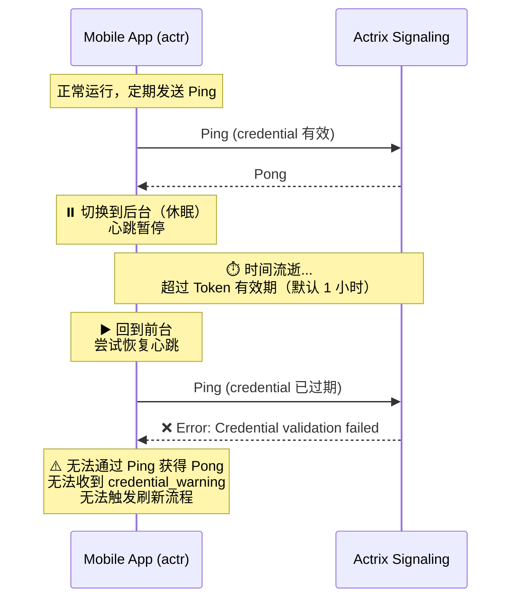

# 移动端后台休眠导致的凭证过期问题

## 问题概述

当使用 actr binding 的移动应用切换到后台（类似休眠状态）时，心跳（Ping）消息会暂停发送。如果后台停留时间超过 Token 有效期，当应用重新回到前台时，由于 Actrix 服务端会校验所有 `ActrToSignaling` 消息中的 credential（包括 Ping），导致已过期的凭证无法通过验证，从而无法触发正常的凭证刷新流程。

### 问题时序



---

## 问题根因分析

### 当前凭证刷新机制

根据现有设计（参见 [5.4-credential-update.md](5.4-credential-update.md)），凭证刷新是**按需触发**的：

1. 客户端定期发送 `Ping` 心跳消息
2. 服务端收到 `Ping` 后，验证 credential：
   - 如果密钥在**容忍期**（expired + tolerance_seconds 范围内），返回 `Pong` 并携带 `credential_warning`
   - 如果密钥**完全过期**（超出容忍期），返回 `Error`
3. 客户端收到带 `credential_warning` 的 `Pong` 后，触发 `credential_refresh_task`

### 核心问题

| 组件 | 当前行为 | 问题 |
|------|----------|------|
| **actr (客户端)** | 后台休眠时停止 Ping | 无法维持心跳 |
| **actrix (服务端)** | 所有 `ActrToSignaling` 消息都校验 credential | Ping 失败后无法执行任何操作 |
| **Token 设计** | 有固定有效期（默认 1 小时） | 后台时间超过有效期则过期 |

### 相关代码位置

**Actrix 服务端验证逻辑** ([signaling/src/server.rs](../../../actrix/crates/signaling/src/server.rs)):

```rust
// handle_actr_to_server 函数
// 验证 credential 并获取容忍期状态
let in_tolerance_period = match AIdCredentialValidator::check(
    &actr_to_server.credential,
    source.realm.realm_id,
)
.await
{
    Ok((_claims, in_tolerance)) => in_tolerance,
    Err(e) => {
        // 验证失败，返回错误
        send_error_response(..., 401, &format!("Credential validation failed: {e}"), ...).await?;
        return Ok(());
    }
};
```

**Token 过期检查** ([common/src/aid/identity_claims.rs](../../../actrix/crates/common/src/aid/identity_claims.rs)):

```rust
impl IdentityClaims {
    pub fn is_expired(&self) -> bool {
        let now = SystemTime::now()
            .duration_since(UNIX_EPOCH)
            .unwrap()
            .as_secs();
        now > self.expr_time  // 超过 expr_time 即过期
    }
}
```

**容忍期计算** ([common/src/aid/credential/validator.rs](../../../actrix/crates/common/src/aid/credential/validator.rs)):

```rust
fn calculate_tolerance_status(expires_at: u64, tolerance_seconds: u64) -> bool {
    // 在容忍期内：已过期但未超过容忍期
    expires_at < now && now <= expires_at + tolerance_seconds
}
```

---

## 解决方案

### 移动端 ping 失败后重新注册

当检测到凭证完全过期时，自动发起重新注册流程。

#### 客户端实现

```rust
// 在心跳失败处理中
async fn send_heartbeat_and_handle_response(...) {
    let pong_response = client.send_heartbeat(...).await;

    match pong_response {
        Ok(Ok(pong)) => { /* 正常处理 */ },
        Ok(Err(e)) if is_credential_expired_error(&e) => {
            // 凭证过期，尝试使用 CredentialRefreshRequest 刷新
            tracing::warn!("⚠️ Credential expired during heartbeat, attempting register");
            let new_credential = signaling_client.register(register_request).await?;
        },
        // ...
    }
}
```

#### 优点

- 可处理任意长时间的后台休眠
- 逻辑简单直接

#### 缺点

- 重新注册可能获得新的 Actor ID（取决于实现）
- 可能丢失服务端缓存的状态
- 用户体验不佳（需要重新建立连接）


---

## 参考文档

- [5.1-registration-flow.md](5.1-registration-flow.md) - 注册流程
- [5.2-authentication-flow.md](5.2-authentication-flow.md) - 认证流程
- [5.4-credential-update.md](5.4-credential-update.md) - 凭证更新流程
- [5.5-key-rotation.md](5.5-key-rotation.md) - 密钥轮换
