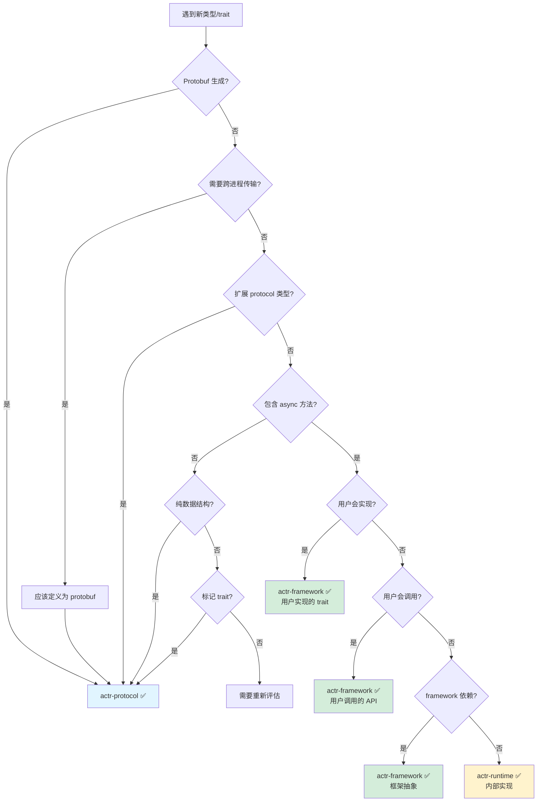

# Crate 分层原则：protocol vs framework vs runtime

> **核心问题**：如何判断一个类型、trait 或功能应该放在哪个 crate？
>
> **目标读者**：actr 框架开发者、贡献者

---

## 0. 为什么分层如此重要？

### 0.1 错误分层的代价

```rust
// ❌ 反面案例：protocol 依赖 framework
// actr-protocol/src/lib.rs
use actr_framework::Context;  // ❌ 循环依赖！

pub struct ActrId {
    pub async fn send_message(&self, ctx: &Context) -> ... // ❌ 职责混乱！
}
```

**后果**：
- 🔴 **循环依赖**：protocol ← framework ← protocol（编译失败）
- 🔴 **过度耦合**：修改 protocol 需要重新编译整个系统
- 🔴 **测试困难**：无法独立测试 protocol（需要启动完整 runtime）
- 🔴 **版本演化受阻**：无法独立升级各 crate

### 0.2 正确分层的价值

```
┌─────────────────────────────────────────────┐
│  actr-protocol (数据层)                      │
│  • 独立编译 (7 秒)                           │
│  • 独立测试（无需 tokio）                    │
│  • 版本稳定（很少变动）                      │
└─────────────────────────────────────────────┘
                    ↑ 单向依赖
┌─────────────────────────────────────────────┐
│  actr-framework (接口层)                     │
│  • 编译速度快（只依赖 protocol）             │
│  • Mock 测试（无需真实 runtime）             │
│  • API 演化（配合语义化版本）                │
└─────────────────────────────────────────────┘
                    ↑ 单向依赖
┌─────────────────────────────────────────────┐
│  actr-runtime (实现层)                       │
│  • 性能优化（不影响用户代码）                │
│  • Bug 修复（patch 版本升级）                │
│  • 实现替换（满足 framework 接口即可）       │
└─────────────────────────────────────────────┘
```

**收益**：
- ✅ **编译时间**：protocol 变更只需重新编译 7 秒，而非整个系统
- ✅ **测试速度**：protocol 测试无需启动 tokio（毫秒级）
- ✅ **团队协作**：不同团队可以并行开发各层
- ✅ **版本管理**：可以独立升级 runtime（性能优化）而不破坏 API

---

## 1. 三层架构的本质

### 1.1 分层哲学

```
┌──────────────────────────────────────────────────────────┐
│  actr-protocol: "What is it?"（它是什么？）               │
│  ━━━━━━━━━━━━━━━━━━━━━━━━━━━━━━━━━━━━━━━━━━━━━━━━━━━  │
│  职责：定义数据结构和类型系统                             │
│  特征：                                                   │
│    • 纯数据定义（struct/enum）                           │
│    • Protobuf 生成的类型                                 │
│    • 无状态的工具函数                                     │
│    • 零运行时依赖                                        │
│  依赖：prost, serde, bytes                               │
│  变化频率：低（基础契约，很少变动）                       │
└──────────────────────────────────────────────────────────┘

┌──────────────────────────────────────────────────────────┐
│  actr-framework: "How to use it?"（如何使用？）           │
│  ━━━━━━━━━━━━━━━━━━━━━━━━━━━━━━━━━━━━━━━━━━━━━━━━━━━  │
│  职责：定义编程接口和用户契约                             │
│  特征：                                                   │
│    • Trait 定义（用户实现或调用）                        │
│    • Context API（用户交互界面）                         │
│    • 生命周期钩子                                        │
│    • 只定义接口，不包含实现                               │
│  依赖：actr-protocol, async-trait, tokio (仅类型)        │
│  变化频率：中（API 演化需要向后兼容）                     │
└──────────────────────────────────────────────────────────┘

┌──────────────────────────────────────────────────────────┐
│  actr-runtime: "How does it work?"（如何工作？）          │
│  ━━━━━━━━━━━━━━━━━━━━━━━━━━━━━━━━━━━━━━━━━━━━━━━━━━━  │
│  职责：实现框架接口，提供运行时功能                       │
│  特征：                                                   │
│    • 实现 framework 的 trait                             │
│    • 调度器、邮箱、网络 I/O                              │
│    • 状态管理和生命周期                                   │
│    • 性能优化和资源管理                                   │
│  依赖：actr-framework, actr-transport, tokio, sqlx       │
│  变化频率：高（性能优化、bug 修复频繁）                   │
└──────────────────────────────────────────────────────────┘
```

### 1.2 依赖方向原则

```
用户代码
   ↓ 依赖
runtime  ←─ 可替换实现（如：测试用 mock runtime）
   ↓ 依赖
framework  ←─ 稳定的 API 契约
   ↓ 依赖
protocol  ←─ 基础的数据定义

✅ 允许：下层依赖上层
❌ 禁止：上层依赖下层（会导致循环依赖）
```

**关键规则**：
- protocol **绝对不能**依赖 framework 或 runtime
- framework **绝对不能**依赖 runtime（只能定义 trait，由 runtime 实现）
- runtime 可以依赖 framework 和 protocol

---

## 2. 四层决策框架

遇到一个类型/trait 时，按以下流程判断：

```
第一层：来源判断
│
├─ 是由 protoc 从 .proto 文件生成的吗？
│  └─ 是 → actr-protocol ✅ (结束)
│
└─ 否，是 Rust 代码定义的 → 继续第二层

━━━━━━━━━━━━━━━━━━━━━━━━━━━━━━━━━━━━━━━━━━━━━

第二层：用途判断
│
├─ 需要跨进程/网络传输吗？
│  ├─ 是 → 应该定义为 protobuf message
│  │       → actr-protocol ✅ (结束)
│  └─ 否 → 继续
│
├─ 是对已有 protocol 类型的扩展吗？
│  │  （如 ActrIdExt trait 为 ActrId 添加格式化功能）
│  └─ 是 → actr-protocol ✅ (结束)
│
└─ 只在进程内使用 → 继续第三层

━━━━━━━━━━━━━━━━━━━━━━━━━━━━━━━━━━━━━━━━━━━━━

第三层：性质判断
│
├─ 是纯数据结构吗？（struct/enum，无 async 方法）
│  ├─ 只有无状态方法（如 to_string, from_str）
│  │  → actr-protocol ✅ (结束)
│  └─ 包含状态或异步逻辑 → 继续
│
├─ 是 trait 定义吗？
│  ├─ 无 async 方法，纯标记 trait
│  │  → actr-protocol ✅ (结束)
│  └─ 包含 async 方法 → 继续第四层
│
└─ 包含异步逻辑或运行时依赖 → 继续第四层

━━━━━━━━━━━━━━━━━━━━━━━━━━━━━━━━━━━━━━━━━━━━━

第四层：角色判断
│
├─ 用户会直接实现这个 trait 吗？
│  │  （如 Dispatcher, StreamHandler）
│  └─ 是 → actr-framework ✅ (结束)
│
├─ 用户会直接调用这个 API 吗？
│  │  （如 Context::call, Context::tell）
│  └─ 是 → actr-framework ✅ (结束)
│
├─ 是框架层对运行时层的抽象吗？
│  ├─ 是，且被 framework 其他部分依赖
│  │  → actr-framework ✅ (结束)
│  └─ 是，但只是内部实现细节
│      → actr-runtime ✅ (结束)
│
└─ 只是 runtime 内部的实现细节
   → actr-runtime ✅ (结束)
```

---

## 3. 判断标准速查表

### 3.1 actr-protocol 检查清单

**✅ 应该放在 protocol 的内容**：

| 类型 | 标准 | 示例 |
|------|------|------|
| **Protobuf 生成的类型** | 任何来自 .proto 的 message/enum | `ActrId`, `ActrType`, `RpcEnvelope`, `Realm` |
| **基础数据结构** | 无 async 方法，可序列化 | `LaneType`, `Priority` |
| **类型扩展 trait** | 为 protocol 类型添加辅助方法 | `ActrIdExt::to_string_repr()` |
| **基础错误类型** | 与数据验证相关的错误 | `ActrError::InvalidFormat` |
| **类型别名** | 简化类型签名 | `pub type ActorResult<T> = Result<T, ActrError>` |
| **常量定义** | 全局配置常量 | `MAX_ROUTE_KEY_LEN: usize` |

**✅ 判断标准**：
1. 可以独立编译（无 tokio 依赖）
2. 可以独立测试（无需启动 runtime）
3. 只依赖 prost, serde, bytes 等基础库
4. 无 async 函数（除非是纯标记 trait）

**❌ 不应该放在 protocol 的内容**：
- ❌ 包含 async 方法的 trait
- ❌ 依赖 tokio 的类型
- ❌ 运行时状态管理
- ❌ 生命周期管理逻辑

---

### 3.2 actr-framework 检查清单

**✅ 应该放在 framework 的内容**：

| 类型 | 标准 | 示例 |
|------|------|------|
| **核心编程 trait** | 用户需要实现的接口 | `Dispatcher`, `Workload`, `StreamHandler` |
| **用户 API** | 用户调用的接口 | `Context` struct 和它的方法 |
| **生命周期钩子** | 用户可选实现的钩子 | `Lifecycle::on_start/on_stop` |
| **Fast Path 接口** | 用户实现的回调 | `StreamHandler::on_data` |
| **进程内数据结构** | 不跨进程传输的结构 | `StreamChunk`, `MediaFrame` (如果是 Rust 定义) |

**✅ 判断标准**：
1. 定义了用户与框架交互的契约
2. 包含 async 方法（用户实现或调用）
3. 可以用 mock 实现测试（无需真实 runtime）
4. 只定义接口，不包含具体实现

**❌ 不应该放在 framework 的内容**：
- ❌ 具体的运行时实现（如 `ActrSystem`）
- ❌ 调度器、邮箱等内部组件
- ❌ 网络传输逻辑
- ❌ SQLite、文件 I/O 等具体实现

---

### 3.3 actr-runtime 检查清单

**✅ 应该放在 runtime 的内容**：

| 类型 | 标准 | 示例 |
|------|------|------|
| **核心运行时组件** | 系统的具体实现 | `ActrSystem`, `ActrNode<W>` |
| **调度器** | 消息调度逻辑 | `Scheduler`, `Mailbox` |
| **内部状态管理** | 运行时状态 | `LifecycleManager`, `ContextFactory` |
| **性能优化实现** | 具体的优化逻辑 | 连接池、缓存等 |

**✅ 判断标准**：
1. 实现了 framework 定义的 trait
2. 包含具体的业务逻辑和状态管理
3. 依赖外部资源（网络、数据库、文件系统）
4. 用户不直接依赖（通过 framework API 间接使用）

---

## 4. 案例深度分析

### 4.1 案例 1: RpcEnvelope

```rust
#[derive(Debug, Clone, Message)]
pub struct RpcEnvelope {
    #[prost(string, tag = "1")]
    pub route_key: String,

    #[prost(bytes = "bytes", tag = "2")]
    pub payload: Bytes,

    #[prost(string, optional, tag = "100")]
    pub traceparent: Option<String>,

    #[prost(string, optional, tag = "101")]
    pub tracestate: Option<String>,

    // ... other fields
}
```

**决策过程**：
1. ✅ **来源判断**：是 protobuf message（`#[derive(Message)]`）
2. ✅ **用途判断**：需要跨进程传输（Actor 间通信）
3. ✅ **性质判断**：纯数据结构，无行为逻辑

**结论**：`actr-protocol` ✅

**推理**：
- RpcEnvelope 是跨进程通信的基础契约
- 需要 protobuf 序列化/反序列化
- 版本演化需要 protobuf 的向后兼容性
- 被 framework 和 runtime 共同使用

**重新导出策略**：
```rust
// actr-protocol/src/lib.rs
pub mod envelope;
pub use envelope::RpcEnvelope;

// actr-framework/src/lib.rs
pub use actr_protocol::RpcEnvelope;  // 重新导出以方便用户
```

---

### 4.2 案例 2: Dispatcher trait

```rust
pub trait Dispatcher: Send + Sync + 'static {
    type Workload: Send + Sync + 'static;

    async fn dispatch(
        workload: &Self::Workload,
        envelope: RpcEnvelope,
        ctx: &Context,
    ) -> ActorResult<Bytes>;
}
```

**决策过程**：
1. ❌ **来源判断**：不是 protobuf 生成的
2. ❌ **用途判断**：不跨进程传输（只在进程内）
3. ✅ **性质判断**：是 trait，包含 async 方法
4. ✅ **角色判断**：框架核心抽象，由代码生成器实现

**结论**：`actr-framework` ✅

**推理**：
- Dispatcher 定义了消息分发的契约
- 由代码生成器生成实现（不是用户手写）
- 是零成本抽象的核心（编译时静态分发）
- Context 和 runtime 都依赖这个抽象

**为什么不是 protocol？**
- 包含 async 方法（protocol 应避免 async）
- 依赖 Context（属于 framework 层）
- 是行为定义，不是数据定义

**为什么不是 runtime？**
- 是接口定义，不是具体实现
- 由代码生成器生成（属于框架的一部分）
- 用户需要理解这个概念（属于编程模型）

---

### 4.3 案例 3: StreamChunk / MediaFrame

```rust
pub struct StreamChunk {
    pub stream_id: String,
    pub sequence: u64,
    pub payload: Bytes,
    pub metadata: HashMap<String, String>,
}

pub struct MediaFrame {
    pub track_id: String,
    pub frame_type: FrameType,
    pub timestamp: u64,
    pub payload: Bytes,
}
```

**关键问题**：这些结构会被序列化传输吗？

#### 场景分析 A：作为 Protobuf Message

```protobuf
// actr-protocol/proto/fast_path.proto
message StreamChunk {
    string stream_id = 1;
    uint64 sequence = 2;
    bytes payload = 3;
    map<string, string> metadata = 4;
}

message MediaFrame {
    string track_id = 1;
    FrameType frame_type = 2;
    uint64 timestamp = 3;
    bytes payload = 4;
}
```

**如果是这样**：
- Lane 传输 protobuf 编码的 StreamChunk
- FLG1 接收后反序列化为 StreamChunk
- → **放在 `actr-protocol`** ✅

**优势**：
- 版本演化（可以添加字段）
- 跨语言兼容（未来可能有其他语言实现）
- 类型安全（编译时验证）

#### 场景分析 B：作为 Rust 内部结构

```rust
// Lane 传输的是 raw bytes（应用自定义格式）
// FLG1 不做反序列化，只是包装成 StreamChunk 传递给用户
```

**如果是这样**：
- StreamChunk 只是 Rust 侧的便利结构
- 不需要跨语言兼容
- → **放在 `actr-framework`** ✅

**优势**：
- 更灵活（可以用 Rust 特性）
- 无序列化开销（如果不需要持久化）

#### **我的建议**

基于 actr 的设计哲学（配置驱动 + 重量级生成），**建议采用场景 A**：

```protobuf
// actr-protocol/proto/fast_path.proto
syntax = "proto3";
package actr.fast_path;

message StreamChunk {
    string stream_id = 1;
    uint64 sequence = 2;
    bytes payload = 3;
    map<string, string> metadata = 4;
}

message MediaFrame {
    string track_id = 1;
    FrameType frame_type = 2;
    uint64 timestamp = 3;
    bytes payload = 4;
    RtpMetadata rtp_metadata = 5;
}

enum FrameType {
    FRAME_TYPE_UNSPECIFIED = 0;
    AUDIO = 1;
    VIDEO = 2;
}

message RtpMetadata {
    uint32 ssrc = 1;
    uint32 payload_type = 2;
    uint32 sequence_number = 3;
}
```

**结论**：`StreamChunk` 和 `MediaFrame` → **`actr-protocol`** ✅

---

### 4.4 案例 4: StreamHandler / TrackHandler

```rust
#[async_trait]
pub trait StreamHandler: Send + Sync {
    async fn on_data(
        &self,
        parcel: StreamChunk,
        ctx: &Context,
    ) -> ActorResult<()>;
}

#[async_trait]
pub trait TrackHandler: Send + Sync {
    async fn on_frame(
        &self,
        frame: MediaFrame,
        ctx: &Context,
    ) -> ActorResult<()>;
}
```

**决策过程**：
1. ❌ **来源判断**：不是 protobuf 生成的
2. ❌ **用途判断**：不跨进程传输
3. ✅ **性质判断**：是 trait，包含 async 方法
4. ✅ **角色判断**：用户需要实现（处理 Fast Path 数据）

**结论**：`actr-framework` ✅

**推理**：
- 用户实现这些 trait 来处理快车道数据
- 属于编程模型的一部分
- 依赖 Context（framework 层）
- runtime 会调用这些实现

**位置**：
```rust
// actr-framework/src/fast_path.rs

pub use actr_protocol::{StreamChunk, MediaFrame};  // 重新导出数据类型

#[async_trait]
pub trait StreamHandler: Send + Sync {
    async fn on_data(&self, parcel: StreamChunk, ctx: &Context) -> ActorResult<()>;
}

#[async_trait]
pub trait TrackHandler: Send + Sync {
    async fn on_frame(&self, frame: MediaFrame, ctx: &Context) -> ActorResult<()>;
}
```

---


```rust
    async fn send_request(
        &self,
        target: &ActrId,
        envelope: RpcEnvelope,
    ) -> ActorResult<Bytes>;

    async fn send_oneway(
        &self,
        target: &ActrId,
        envelope: RpcEnvelope,
    ) -> ActorResult<()>;

    async fn discover_service(
        &self,
        service_type: &ActrType,
    ) -> ActorResult<ActrId>;
}
```

**决策过程**：
1. ❌ **来源判断**：不是 protobuf 生成的
2. ❌ **用途判断**：不跨进程传输（进程内抽象）
3. ✅ **性质判断**：是 trait，包含 async 方法
4. 🤔 **角色判断**：这是关键...

**关键问题**：用户会直接使用吗？

**分析**：

**两种观点**：

**观点 A**：放在 `actr-runtime`
- 理由：用户不直接使用，是内部实现细节
- 问题：Context 依赖它，会导致 framework → runtime 依赖（违反分层）

**观点 B**：放在 `actr-framework` ✅
- 理由：定义了框架层的路由契约
- Context 依赖它（framework 内部依赖）
- runtime 实现它（依赖倒置原则）

**结论**：`actr-framework` ✅

**依赖倒置原则的体现**：
```
Context (framework)
   ↓ 依赖
   ↑ 实现
```

这样 framework 不依赖 runtime，符合分层原则。

---

### 4.6 案例 6: Context struct

```rust
pub struct Context {
    actor_id: ActrId,
    caller_id: Option<ActrId>,
    // 追踪信息由 OpenTelemetry 框架管理
    request_id: String,
    // ...
}

impl Context {
    pub async fn call(...) -> ...;
    pub async fn tell(...) -> ...;
    pub fn log_info(...);
    // ...
}
```

**决策过程**：
1. ❌ **来源判断**：不是 protobuf 生成的
2. ❌ **用途判断**：不跨进程传输
3. ✅ **性质判断**：包含 async 方法
4. ✅ **角色判断**：用户直接调用的核心 API

**结论**：`actr-framework` ✅

**推理**：
- Context 是用户与框架交互的**唯一接口**
- 定义了"请求，而非命令"的编程模型
- 所有副作用都通过 Context 进行
- 是框架最核心的 API

**为什么不是 runtime？**
- 用户代码中到处都是 `ctx: &Context`
- 如果放在 runtime，用户需要 `use actr_runtime::Context`（不直观）
- Context 是编程模型的一部分，不是实现细节

---

## 5. 最佳实践

### 5.1 设计新功能时的思考顺序

```
步骤 1：定义数据契约
└─ 需要跨进程传输吗？
   ├─ 是 → 在 .proto 中定义 → protocol
   └─ 否 → 继续

步骤 2：定义行为接口
└─ 用户需要实现或调用吗？
   ├─ 是 → 定义 trait → framework
   └─ 否 → 继续

步骤 3：实现具体逻辑
└─ 实现 framework 的 trait → runtime
```

**示例：添加 "任务调度" 功能**

```rust
// 步骤 1：定义数据契约（protocol）
// actr-protocol/proto/scheduler.proto
message ScheduleRequest {
    string task_id = 1;
    int64 delay_ms = 2;
    RpcEnvelope task = 3;
}

// 步骤 2：定义行为接口（framework）
// actr-framework/src/scheduler.rs
pub trait Scheduler: Send + Sync {
    async fn schedule(&self, req: ScheduleRequest) -> ActorResult<()>;
}

impl Context {
    pub async fn schedule_task(&self, task: RpcEnvelope, delay: Duration) -> ActorResult<()> {
        // 使用内部的 scheduler
    }
}

// 步骤 3：具体实现（runtime）
// actr-runtime/src/scheduler_impl.rs
pub struct ActrScheduler {
    timer_wheel: TimerWheel,
    // ...
}

impl Scheduler for ActrScheduler {
    async fn schedule(&self, req: ScheduleRequest) -> ActorResult<()> {
        // 具体实现
    }
}
```

### 5.2 重新导出策略

**原则**：让用户只需 `use actr_framework::prelude::*` 即可。

```rust
// actr-protocol/src/lib.rs
pub struct RpcEnvelope { ... }
pub struct ActrId { ... }

// actr-framework/src/lib.rs
// 重新导出常用的 protocol 类型
pub use actr_protocol::{RpcEnvelope, ActrId, ActrType, ActorError};

pub mod prelude {
    // 用户只需这一个 import
    pub use crate::*;
    pub use actr_protocol::{RpcEnvelope, ActrId, ActrType};
    // ...
}
```

**用户代码**：
```rust
use actr_framework::prelude::*;

// ✅ 无需 use actr_protocol::*;
// ✅ 所有常用类型都可用
```

### 5.3 依赖管理

**Cargo.toml 的依赖声明**：

```toml
# actr-protocol/Cargo.toml
[dependencies]
prost = "0.12"
bytes = "1.5"
serde = { version = "1.0", features = ["derive"] }
# ❌ 不应该有 tokio, async-trait

# actr-framework/Cargo.toml
[dependencies]
actr-protocol = { path = "crates/protocol" }
async-trait = "0.1"
tokio = { version = "1.0", features = ["sync", "time"] }  # 仅类型，不启动 runtime
bytes = "1.5"
# ❌ 不应该有 sqlx, tonic 等具体实现库

# actr-runtime/Cargo.toml
[dependencies]
actr-framework = { path = "crates/framework" }
actr-protocol = { path = "crates/protocol" }
tokio = { version = "1.0", features = ["full"] }
sqlx = { version = "0.7", features = ["sqlite"] }
# ✅ 可以依赖任何实现需要的库
```

---

## 6. 常见反模式

### 6.1 反模式 1：protocol 包含 async 方法

```rust
// ❌ 错误
// actr-protocol/src/actor_id.rs
impl ActrId {
    pub async fn send_message(&self, msg: RpcEnvelope) -> ActorResult<()> {
        // ❌ protocol 不应有异步逻辑
    }
}
```

**问题**：
- protocol 依赖 tokio（增加编译时间）
- 无法独立测试（需要启动 runtime）
- 职责混乱（数据类型不应有行为）

**正确做法**：
```rust
// ✅ 正确
// actr-framework/src/context.rs
impl Context {
    pub async fn send_to(&self, target: &ActrId, msg: RpcEnvelope) -> ActorResult<()> {
        // 通过 Context 提供行为
    }
}
```

---

### 6.2 反模式 2：framework 包含具体实现

```rust
// ❌ 错误
// actr-framework/src/context.rs
impl Context {
    pub async fn call(&self, target: &ActrId, msg: RpcEnvelope) -> ActorResult<Bytes> {
        // ❌ 直接使用 tokio::sync::mpsc 发送
        let (tx, rx) = tokio::sync::oneshot::channel();
        self.internal_sender.send((msg, tx)).await.unwrap();
        rx.await.unwrap()
    }
}
```

**问题**：
- framework 包含具体实现（应该由 runtime 提供）
- 无法 mock 测试
- 无法替换实现

**正确做法**：
```rust
// ✅ 正确
// actr-framework/src/context.rs
impl Context {
    pub async fn call(&self, target: &ActrId, msg: RpcEnvelope) -> ActorResult<Bytes> {
        self.outbound_gate.send_request(target, msg).await
    }
}

// actr-framework/src/outbound_gate.rs
    async fn send_request(&self, target: &ActrId, msg: RpcEnvelope) -> ActorResult<Bytes>;
}

// actr-runtime/src/outbound_gate_impl.rs
    // 具体实现
}

    async fn send_request(&self, target: &ActrId, msg: RpcEnvelope) -> ActorResult<Bytes> {
        // 具体的发送逻辑
    }
}
```

---

### 6.3 反模式 3：类型放错层导致的重复定义

```rust
// ❌ 错误：同一个概念在多个 crate 中重复定义

// actr-protocol/src/error.rs
pub enum ActorError {
    NotFound,
    Timeout,
}

// actr-framework/src/error.rs
pub enum FrameworkError {  // ❌ 重复
    ActorNotFound,         // ❌ 与 ActorError::NotFound 重复
    RequestTimeout,        // ❌ 与 ActorError::Timeout 重复
}

// actr-runtime/src/error.rs
pub enum RuntimeError {    // ❌ 重复
    ActorNotFound,         // ❌ 又重复了
}
```

**问题**：
- 错误类型分散，用户困惑
- 互相转换麻烦
- 无法统一处理

**正确做法**：
```rust
// ✅ 正确：在 protocol 中定义统一的错误类型

// actr-protocol/src/error.rs
#[derive(Error, Debug)]
pub enum ActorError {
    #[error("Actor not found: {0}")]
    NotFound(String),

    #[error("Request timeout after {0:?}")]
    Timeout(Duration),

    #[error("Serialization error: {0}")]
    SerializationError(String),

    #[error("Unknown route: {route_key}")]
    UnknownRoute { route_key: String },

    // ... 所有可能的错误
}

// framework 和 runtime 都使用这个错误类型
pub type ActorResult<T> = Result<T, ActorError>;
```

---

### 6.4 反模式 4：测试依赖整个系统

```rust
// ❌ 错误：测试 protocol 需要启动完整 runtime

#[cfg(test)]
mod tests {
    use actr_runtime::ActrSystem;  // ❌ 测试 protocol 不应依赖 runtime

    #[tokio::test]
    async fn test_actor_id_format() {
        let system = ActrSystem::new(...).await.unwrap();  // ❌ 太重了
        // ...
    }
}
```

**正确做法**：
```rust
// ✅ 正确：protocol 测试完全独立

// actr-protocol/src/actor_id.rs
#[cfg(test)]
mod tests {
    use super::*;

    #[test]  // ✅ 不是 tokio::test
    fn test_actor_id_format() {
        let id = ActrId {
            realm: Realm { realm_id: 1 },
            serial_number: 0x1234,
            r#type: ActrType {
                manufacturer: "acme".to_string(),
                name: "echo".to_string(),
            },
        };

        assert_eq!(id.to_string_repr(), "acme:echo@1234:1");
    }
}

// ✅ 正确：framework 测试使用 mock

// actr-framework/src/context.rs
#[cfg(test)]
mod tests {
    use super::*;


    #[async_trait]
        async fn send_request(&self, ...) -> ActorResult<Bytes> {
            Ok(Bytes::from("mock response"))
        }
    }

    #[tokio::test]
    async fn test_context_call() {
        let result = ctx.call(...).await;
        assert!(result.is_ok());
    }
}
```

---

## 7. 测试独立性验证

### 7.1 protocol 测试标准

```bash
# ✅ protocol 应该能独立编译和测试
cd actr-protocol
cargo test --no-default-features

# ✅ 不应该需要 tokio runtime
# ✅ 测试应该是同步的（非 #[tokio::test]）
# ✅ 编译时间应该很短（< 10 秒）
```

**检查清单**：
- [ ] 所有测试都是 `#[test]`（不是 `#[tokio::test]`）
- [ ] 没有 `tokio::spawn` 或 `.await`
- [ ] `cargo build --no-default-features` 成功
- [ ] 编译时间 < 10 秒

---

### 7.2 framework 测试标准

```bash
# ✅ framework 应该能用 mock 测试
cd actr-framework
cargo test

# ✅ 可以使用 tokio，但不需要真实 runtime
# ✅ 使用 mock 实现 trait
```

**检查清单**：
- [ ] 所有 trait 都可以用 mock 实现
- [ ] 测试不依赖 actr-runtime
- [ ] 测试不需要网络或数据库
- [ ] `cargo test` 全部通过（< 30 秒）

---

### 7.3 runtime 测试标准

```bash
# ✅ runtime 可以依赖所有层
cd actr-runtime
cargo test

# ✅ 可以使用真实的网络、数据库
# ✅ 集成测试可以启动完整系统
```

---

## 8. 重构指南

### 8.1 发现分层错误怎么办？

**步骤 1：识别问题**
```bash
# 检查依赖方向
cargo tree --invert actr-protocol
# ✅ 应该只看到 framework 和 runtime 依赖它

cargo tree --invert actr-framework
# ✅ 应该只看到 runtime 依赖它
# ❌ 如果看到 protocol 依赖它 → 循环依赖！
```

**步骤 2：制定迁移计划**
```
1. 确定目标位置（protocol/framework/runtime）
2. 评估影响范围（多少文件依赖）
3. 创建新位置的定义
4. 逐步迁移依赖方
5. 删除旧定义
```

**步骤 3：执行迁移**


```rust
// 1. 在 framework 中创建新定义
// actr-framework/src/outbound_gate.rs
    async fn send_request(...) -> ...;
}

// 2. 更新 Context 的依赖
// actr-framework/src/context.rs

// 3. 在 runtime 中实现新 trait
// actr-runtime/src/outbound_gate_impl.rs

    // 实现不变
}

// 4. 删除 runtime 中的旧定义
// actr-runtime/src/outbound_gate.rs
// ❌ 删除这个文件
```

---

## 9. 检查清单

### 9.1 新增类型时的自检

在添加新类型前，回答以下问题：

```
□ 这个类型是 protobuf 生成的吗？
  └─ 是 → protocol

□ 这个类型需要跨进程传输吗？
  └─ 是 → 应该定义为 protobuf → protocol

□ 这个类型是对 protocol 类型的扩展吗？
  └─ 是 → protocol

□ 这个类型包含 async 方法吗？
  ├─ 否 → protocol
  └─ 是 → 继续

□ 用户会直接实现或调用这个类型吗？
  ├─ 是 → framework
  └─ 否 → runtime

□ 这个类型是框架对 runtime 的抽象吗？
  ├─ 是，且被 framework 其他部分依赖 → framework
  └─ 否，只是 runtime 内部细节 → runtime
```

### 9.2 代码审查清单

审查 PR 时检查：

```
□ 依赖方向正确（protocol ← framework ← runtime）

□ protocol 中：
  □ 无 async 方法
  □ 无 tokio 依赖
  □ 可独立编译和测试

□ framework 中：
  □ 只定义 trait，无具体实现
  □ 所有 trait 可以 mock
  □ Context API 保持简洁

□ runtime 中：
  □ 实现了 framework 的 trait
  □ 用户不直接依赖 runtime 类型

□ 测试：
  □ protocol 测试不依赖 tokio
  □ framework 测试使用 mock
  □ runtime 测试可以集成测试
```

---

## 10. FAQ

### Q1: 为什么不把所有东西都放在一个 crate？

**A**: 单体 crate 的问题：
- 🔴 编译时间长（修改任何代码都要重新编译整个系统）
- 🔴 测试慢（所有测试都需要启动完整 runtime）
- 🔴 职责不清（很难理解哪些是接口，哪些是实现）
- 🔴 版本管理困难（无法独立升级各部分）

分层 crate 的优势：
- ✅ 增量编译（只重新编译修改的层）
- ✅ 快速测试（protocol 测试毫秒级）
- ✅ 清晰架构（依赖图一目了然）
- ✅ 独立演化（可以优化 runtime 而不影响用户代码）

---

### Q2: RpcEnvelope 既是数据又是核心抽象，为什么放在 protocol？

**A**: 技术实现优先于概念抽象。

**理由**：
1. RpcEnvelope **必须**是 protobuf message（技术要求）
2. 需要跨进程序列化（技术要求）
3. 需要版本演化（技术要求）

**解决方案**：在 framework 中重新导出
```rust
// actr-framework/src/lib.rs
pub use actr_protocol::RpcEnvelope;

pub mod prelude {
    pub use actr_protocol::RpcEnvelope;  // 用户无感知
}
```

用户视角：RpcEnvelope 是 framework 的一部分
技术实现：RpcEnvelope 在 protocol 中定义

---

### Q3: 如果一个 trait 只有 runtime 实现，用户不使用，应该放哪？

**A**: 看是否被 framework 其他部分依赖。

**场景 A**：framework 依赖它
```rust
impl Context {
}
```
→ 放在 **framework**（依赖倒置原则）

**场景 B**：只是 runtime 内部接口
```rust
// 假设有一个 InternalScheduler trait
// 只在 runtime 内部组件间使用
// framework 完全不知道它
```
→ 放在 **runtime**

---

### Q4: 错误类型应该放哪一层？

**A**: 根据错误的语义层次。

```rust
// protocol: 基础的、与数据相关的错误
pub enum ActorError {
    InvalidFormat(String),      // 数据格式错误
    DeserializationError(String),  // 反序列化错误
    UnknownRoute { route_key: String },  // 路由不存在
}

// framework: 与编程模型相关的错误
// （如果需要特殊的错误，可以扩展 ActorError）
// 但通常直接使用 ActorError

// runtime: 与具体实现相关的错误
// （通常转换为 ActorError 返回给用户）
impl From<sqlx::Error> for ActorError {
    fn from(e: sqlx::Error) -> Self {
        ActorError::InternalError(e.to_string())
    }
}
```

**建议**：统一使用 `ActorError`（定义在 protocol），runtime 的具体错误转换为 ActorError。

---

### Q5: 宏应该放在哪一层？

**A**: 看宏生成的代码属于哪一层。

```rust
// protocol: 辅助定义数据的宏（如果需要）
// 例如：简化 protobuf 扩展的宏

// framework: 辅助用户编程的宏
#[macro_export]
macro_rules! message {
    // 生成用户消息定义
}

// runtime: 内部使用的宏
macro_rules! spawn_actor_task {
    // runtime 内部使用，不导出
}
```

---

## 11. 总结

### 11.1 核心原则

1. **依赖方向**：protocol ← framework ← runtime（绝不反向）
2. **职责分离**：数据（protocol）→ 接口（framework）→ 实现（runtime）
3. **测试独立**：每层都可以独立测试
4. **版本演化**：各层可以独立升级

### 11.2 快速记忆

```
遇到新类型，问自己：

1. Protobuf？ → protocol
2. 跨进程？ → protocol
3. 用户用？ → framework
4. 内部用？ → runtime
```

### 11.3 金科玉律

> **"当有疑问时，选择更底层的 crate"**

理由：
- 向上迁移容易（添加依赖）
- 向下迁移困难（可能破坏依赖方）

所以：
- 不确定是 protocol 还是 framework → 先放 protocol
- 不确定是 framework 还是 runtime → 先放 framework

后续需要时再向上迁移。

---

## 附录 A：分层决策树（完整版）



---

## 附录 B：重要类型分层索引

| 类型 | 位置 | 理由 |
|------|------|------|
| `ActrId` | protocol | Protobuf message |
| `ActrType` | protocol | Protobuf message |
| `RpcEnvelope` | protocol | Protobuf message，跨进程 |
| `ActorError` | protocol | 基础错误类型 |
| `ActrIdExt` trait | protocol | 扩展 protocol 类型 |
| `Dispatcher` trait | framework | 用户（代码生成器）实现 |
| `Workload` trait | framework | 用户实现 |
| `Context` struct | framework | 用户调用的核心 API |
| `StreamHandler` trait | framework | 用户实现的回调 |
| `TrackHandler` trait | framework | 用户实现的回调 |
| `StreamChunk` | protocol | Protobuf message（建议）|
| `MediaFrame` | protocol | Protobuf message（建议）|
| `ActrSystem` | runtime | 具体实现 |
| `ActrNode<W>` | runtime | 具体实现 |
| `Scheduler` | runtime | 内部组件 |
| `Mailbox` | runtime | 内部组件 |

---

**相关文档**：
- [4.5-actr-framework.zh.md](./4.5-actr-framework.zh.md) - Framework 接口设计
- [4.6-actr-runtime.zh.md](./4.6-actr-runtime.zh.md) - Runtime 架构实现
- [3.7-State-Path-Scheduling.zh.md](./3.7-state-path-scheduling.zh.md) - Scheduler 机制详解
