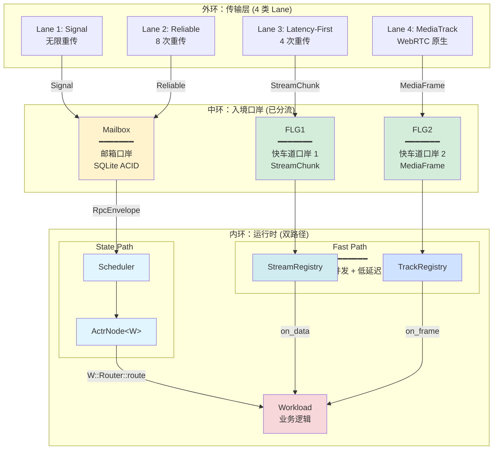

# actr-runtime 完整结构设计

> **⚠️ 文档性质**：设计文档（Design Document）
> **实现状态**：部分实现
> - ✅ **已实现**：ActrSystem/ActrNode 核心生命周期、Mailbox、WebRTC 传输层、DataStream 路由
> - ⚠️ **开发中**：StreamRegistry/TrackRegistry（Fast Path 注册表）
> - 📋 **规划中**：部分高级特性
>
> 本文档描述 actr-runtime 的目标架构，与当前实现可能存在差异。生产代码请参考实际 API 文档和示例。

**设计目标**：基于架构审查结果，重新设计 actr-runtime 的完整结构
**设计原则**：one-actor-per-instance + 零成本抽象 + 三环架构

---

## 📐 设计概览

### 核心架构公式

```
ActrSystem (无泛型基础设施)
    + attach(Workload)
    ↓
ActrNode<W: Workload> (泛型化完整节点)
    ↓
handle_incoming(RpcEnvelope)
    ↓
W::MessageRouter::route() (编译时静态分发)
    ↓
用户业务方法
```

### 三环数据流



---

## 📦 模块结构设计

### 目标目录树

```
actr-runtime/
├── Cargo.toml                      # 主 crate 配置
├── src/
│   ├── lib.rs                      # 模块入口和重导出
│   │
│   ├── actor_system.rs             # ActrSystem（无泛型基础设施）
│   ├── actor_node.rs               # ActrNode<W>（泛型化完整节点）
│   ├── actr_ref.rs             # ActrRef<W>（运行中状态）
│   │
│   ├── scheduler.rs                # State Path 调度器
│   ├── handler_registry.rs         # 处理器注册表
│   │
│   ├── stream_registry.rs          # Fast Path 数据流注册表
│   ├── track_registry.rs           # Fast Path 媒体轨注册表
│   │
│   ├── outbound_gate.rs            # OutboundGate 实现
│   ├── context_factory.rs          # Context 工厂
│   │
│   ├── resource.rs                 # 资源管理（保留）
│   ├── monitoring.rs               # 监控指标（保留）
│   ├── error.rs                    # 错误定义
│   │
│   └── prelude.rs                  # 便利导出
│
├── mailbox/                        # 子 crate：SQLite 邮箱
│   ├── Cargo.toml
│   └── src/
│       ├── lib.rs
│       ├── mailbox.rs              # Mailbox trait
│       ├── sqlite.rs               # SqliteMailbox 实现
│       └── error.rs
│
└── transport/                      # 子 crate：WebRTC 传输
    ├── Cargo.toml
    └── src/
        ├── lib.rs
        ├── transport.rs            # Transport trait
        ├── webrtc.rs               # WebRTC 实现
        ├── signaling.rs            # 信令客户端
        ├── discovery.rs            # 服务发现
        ├── connection.rs           # 连接管理
        └── error.rs
```

### 删除的文件

```
❌ src/input_handler.rs             # 违反三环架构
❌ src/supervisor.rs                # 不提供监督树
❌ src/routing.rs                   # 职责混乱，拆分为多个文件
❌ src/runtime.rs                   # 定位不清，职责由 ActrSystem 承担
❌ src/concurrent_handle.rs         # 移到单独文档说明，不作为核心结构
```

---

## 🏗️ 核心类型设计

### 1. ActrSystem - 无泛型基础设施

**职责**：
- 创建和初始化所有运行时组件
- 连接信令服务器
- 提供 `attach()` 方法转换为 ActrNode<W>

**类型定义**：

```rust
// src/actor_system.rs

use actr_framework::Workload;
use actr_config::Config;
use crate::{Mailbox, Scheduler, Transport, ContextFactory};

/// ActrSystem - 运行时基础设施（无泛型）
///
/// # 设计理念
/// - 阶段 1：创建纯粹的运行时框架
/// - 不知道任何业务逻辑类型
/// - 通过 attach() 转换为 ActrNode<W>
pub struct ActrSystem {
    /// 配置信息
    config: Config,

    /// SQLite 持久化邮箱
    mailbox: Mailbox,

    /// State Path 调度器
    scheduler: Scheduler,

    /// WebRTC 传输层
    transport: Transport,

    /// Context 工厂
    context_factory: ContextFactory,

    /// 信令客户端
    signaling_client: SignalingClient,

    /// StreamRegistry（Fast Path 数据流）
    stream_registry: StreamRegistry,

    /// TrackRegistry（Fast Path 媒体轨）
    track_registry: TrackRegistry,
}

impl ActrSystem {
    /// 创建新的 ActrSystem
    ///
    /// # 错误
    /// - 配置解析失败
    /// - Mailbox 初始化失败
    /// - Transport 初始化失败
    pub fn new(config: Config) -> ActorResult<Self> {
        tracing::info!("🚀 Initializing ActrSystem");

        // 初始化 Mailbox
        let mailbox_path = config.data_dir.join("mailbox.db");
        let mailbox = Mailbox::new(&mailbox_path)?;

        // 初始化 Scheduler
        let scheduler = Scheduler::new();

        // 初始化 Transport
        let transport = Transport::new(&config.transport)?;

        // 初始化 Context 工厂
        let context_factory = ContextFactory::new();

        // 初始化信令客户端
        let signaling_client = SignalingClient::new(&config.signaling)?;

        // 初始化 Fast Path Registry
        let stream_registry = StreamRegistry::new();
        let track_registry = TrackRegistry::new();

        Ok(Self {
            config,
            mailbox,
            scheduler,
            transport,
            context_factory,
            signaling_client,
            stream_registry,
            track_registry,
        })
    }

    /// 附加 Workload，转换为 ActrNode<W>
    ///
    /// # 类型推导
    /// - 从 W 推导出 W::MessageRouter
    /// - 编译器单态化 ActrNode<W>
    /// - 完全零 dyn，全链内联
    ///
    /// # 消费 self
    /// - 通过 move 确保只能调用一次
    /// - 体现 one-actor-per-instance 原则
    pub fn attach<W: Workload>(self, workload: W) -> ActrNode<W> {
        tracing::info!("📦 Attaching workload: {:?}", workload.claim());

        ActrNode {
            workload: Arc::new(workload),
            config: self.config,
            mailbox: self.mailbox,
            scheduler: self.scheduler,
            transport: self.transport,
            context_factory: self.context_factory,
            signaling_client: self.signaling_client,
            stream_registry: self.stream_registry,
            track_registry: self.track_registry,
            actor_id: None,  // 启动后获得
        }
    }
}
```

---

### 2. ActrNode<W> - 泛型化完整节点

**职责**：
- 持有 Workload 实例
- 处理传入的 RpcEnvelope
- 通过类型系统静态分发
- 启动运行时

**类型定义**：

```rust
// src/actor_node.rs

use std::sync::Arc;
use actr_framework::{Workload, MessageRouter, Lifecycle, Context};
use actr_protocol::{ActorResult, ActrId, RpcEnvelope, ActrType};
use bytes::Bytes;

/// ActrNode - ActrSystem + Workload（1:1 组合）
///
/// # 泛型参数
/// - `W`: Workload 类型
///
/// # MessageRouter 关联
/// - 通过 W::MessageRouter 静态关联
/// - 不存储 MessageRouter 实例（连 ZST 都不需要）
/// - route 调用完全通过类型系统
pub struct ActrNode<W: Workload> {
    /// Workload 实例（唯一的业务逻辑）
    pub(crate) workload: Arc<W>,

    /// 配置信息
    pub(crate) config: Config,

    /// SQLite 持久化邮箱
    pub(crate) mailbox: Mailbox,

    /// State Path 调度器
    pub(crate) scheduler: Scheduler,

    /// WebRTC 传输层
    pub(crate) transport: Transport,

    /// Context 工厂
    pub(crate) context_factory: ContextFactory,

    /// 信令客户端
    pub(crate) signaling_client: SignalingClient,

    /// StreamRegistry（Fast Path 数据流）
    pub(crate) stream_registry: StreamRegistry,

    /// TrackRegistry（Fast Path 媒体轨）
    pub(crate) track_registry: TrackRegistry,

    /// Actor ID（启动后获得）
    pub(crate) actor_id: Option<ActrId>,
}

impl<W: Workload> ActrNode<W> {
    /// 处理传入的消息信封
    ///
    /// # 性能分析
    /// 1. create_context: ~10ns
    /// 2. W::MessageRouter::route: ~5-10ns (静态 match，可内联)
    /// 3. 用户业务逻辑: 变量
    ///
    /// 框架开销：~15-20ns（相比传统方案的 50-100ns）
    ///
    /// # 零成本抽象
    /// - 编译器可内联整个调用链
    /// - match 分支可以直接展开
    /// - 最终生成的代码接近手写的 match 表达式
    pub async fn handle_incoming(&self, envelope: RpcEnvelope) -> ActorResult<Bytes> {
        // 创建 Context
        let ctx = self.context_factory.create(
            self.actor_id.as_ref().unwrap(),
            envelope.caller_id.as_ref(),
            &envelope.trace_id,
            &envelope.request_id,
        );

        // 🚀 静态调用，无需 MessageRouter 实例
        // 编译器可内联整个调用链：
        //   route() → match route_key → decode → user_method → encode
        W::MessageRouter::route(&self.workload, envelope, &ctx).await
    }

    /// 启动系统
    ///
    /// # 启动流程
    /// 1. 连接信令服务器并注册
    /// 2. 初始化传输层
    /// 3. 调用生命周期钩子 on_start
    /// 4. 启动 Scheduler
    /// 5. 启动传输层
    pub async fn start(mut self) -> ActorResult<ActrRef<W>> {
        tracing::info!("🚀 Starting ActrNode");

        // ━━━━━━━━━━━━━━━━━━━━━━━━━━━━━━━━━━━━━━━━━━━
        // 1. 连接信令服务器并注册
        // ━━━━━━━━━━━━━━━━━━━━━━━━━━━━━━━━━━━━━━━━━━━
        self.signaling_client
            .connect(&self.config.signaling.server_url)
            .await?;

        let actr_type = workload.claim();
        let register_response = self
            .signaling_client
            .register(actr_type, &self.config.realm)
            .await?;

        self.actor_id = Some(register_response.actor_id);
        tracing::info!("✅ Registered as: {:?}", self.actor_id);

        // ━━━━━━━━━━━━━━━━━━━━━━━━━━━━━━━━━━━━━━━━━━━
        // 2. 初始化传输层
        // ━━━━━━━━━━━━━━━━━━━━━━━━━━━━━━━━━━━━━━━━━━━
        self.transport.initialize().await?;

        // ━━━━━━━━━━━━━━━━━━━━━━━━━━━━━━━━━━━━━━━━━━━
        // 3. 调用生命周期钩子（如果实现了 Lifecycle）
        // ━━━━━━━━━━━━━━━━━━━━━━━━━━━━━━━━━━━━━━━━━━━
        if let Some(lifecycle) = (&*self.workload) as &dyn std::any::Any {
            if let Some(lc) = lifecycle.downcast_ref::<dyn Lifecycle>() {
                let ctx = self.context_factory.create_bootstrap(
                    self.actor_id.as_ref().unwrap(),
                );
                lc.on_start(&ctx).await?;
            }
        }

        // ━━━━━━━━━━━━━━━━━━━━━━━━━━━━━━━━━━━━━━━━━━━
        // 4. 启动 Scheduler（State Path）
        // ━━━━━━━━━━━━━━━━━━━━━━━━━━━━━━━━━━━━━━━━━━━
        let node_ref = Arc::new(self);
        node_ref.scheduler.start(
            node_ref.clone(),
            node_ref.mailbox.clone(),
        ).await?;

        // ━━━━━━━━━━━━━━━━━━━━━━━━━━━━━━━━━━━━━━━━━━━
        // 5. 启动传输层
        // ━━━━━━━━━━━━━━━━━━━━━━━━━━━━━━━━━━━━━━━━━━━
        node_ref.transport.start().await?;

        tracing::info!("✅ ActrNode started successfully");

        Ok(ActrRef { node: node_ref })
    }
}
```

---

### 3. ActrRef<W> - 运行中状态

**职责**：
- 表示运行中的节点
- 提供事件循环
- 处理优雅关闭

**类型定义**：

```rust
// src/actr_ref.rs

use std::sync::Arc;
use actr_framework::Workload;

/// 运行中的节点
///
/// # 生命周期
/// - 由 ActrNode::start() 返回
/// - 持有 ActrNode 的 Arc 引用
/// - 提供运行和关闭方法
pub struct ActrRef<W: Workload> {
    node: Arc<ActrNode<W>>,
}

impl<W: Workload> ActrRef<W> {
    /// 运行主事件循环
    ///
    /// # 事件处理
    /// - State Path: Scheduler 已经在后台运行
    /// - Fast Path: Registry 已经在后台处理
    /// - 此方法主要等待关闭信号
    pub async fn run_loop(&self) -> ActorResult<()> {
        tracing::info!("🔄 Entering main event loop");

        // 等待关闭信号
        tokio::signal::ctrl_c().await?;

        tracing::info!("📥 Received shutdown signal");
        Ok(())
    }

    /// 等待关闭信号
    ///
    /// # 阻塞行为
    /// - 阻塞当前任务直到收到关闭信号
    /// - 可以是 Ctrl+C、SIGTERM 等
    pub async fn wait_for_shutdown(&self) -> ActorResult<()> {
        self.run_loop().await
    }

    /// 优雅关闭
    ///
    /// # 关闭顺序
    /// 1. 停止接收新消息
    /// 2. 处理完队列中的消息
    /// 3. 调用 on_stop 生命周期钩子
    /// 4. 关闭传输层
    /// 5. 关闭 Scheduler
    pub async fn shutdown(self) -> ActorResult<()> {
        tracing::info!("🛑 Shutting down ActrNode");

        // 1. 停止传输层（不再接收新消息）
        self.node.transport.stop().await?;

        // 2. 停止 Scheduler（处理完队列消息）
        self.node.scheduler.stop().await?;

        // 3. 调用 on_stop 生命周期钩子
        if let Some(lifecycle) = (&*self.node.workload) as &dyn std::any::Any {
            if let Some(lc) = lifecycle.downcast_ref::<dyn Lifecycle>() {
                let ctx = self.node.context_factory.create_bootstrap(
                    self.node.actor_id.as_ref().unwrap(),
                );
                lc.on_stop(&ctx).await?;
            }
        }

        // 4. 断开信令连接
        self.node.signaling_client.disconnect().await?;

        tracing::info!("✅ ActrNode shutdown completed");
        Ok(())
    }
}
```

---

### 4. Scheduler - State Path 调度器

**职责**：
- 从 Mailbox 取出消息
- 实现偏向性优先级调度
- 串行执行保证
- 调用 ActrNode::handle_incoming()

**类型定义**：

```rust
// src/scheduler.rs

use std::sync::Arc;
use tokio::sync::broadcast;
use actr_framework::Workload;
use actr_protocol::{ActorResult, Priority};

/// State Path 调度器
///
/// # 设计原则
/// - 从 Mailbox 取出 RpcEnvelope
/// - 偏向性优先级调度（高优先级总是优先）
/// - 串行执行（await 确保顺序性）
/// - 调用 ActrNode::handle_incoming()
pub struct Scheduler {
    /// 关闭信号
    shutdown_tx: broadcast::Sender<()>,
    shutdown_rx: broadcast::Receiver<()>,
}

impl Scheduler {
    pub fn new() -> Self {
        let (shutdown_tx, shutdown_rx) = broadcast::channel(1);
        Self {
            shutdown_tx,
            shutdown_rx,
        }
    }

    /// 启动调度循环
    ///
    /// # 后台运行
    /// - spawn 一个 tokio 任务
    /// - 持有 ActrNode<W> 的 Arc 引用
    /// - 持有 Mailbox 的引用
    pub async fn start<W: Workload>(
        &self,
        node: Arc<ActrNode<W>>,
        mailbox: Mailbox,
    ) -> ActorResult<()> {
        let mut shutdown_rx = self.shutdown_tx.subscribe();

        tokio::spawn(async move {
            tracing::info!("📋 Scheduler started");

            loop {
                tokio::select! {
                    biased;  // 🔥 关键：偏向性调度

                    // 优先检查高优先级队列
                    high_result = mailbox.dequeue(Priority::High) => {
                        if let Ok(Some(envelope)) = high_result {
                            tracing::debug!("🔴 Processing HIGH priority message");
                            Self::dispatch(&node, envelope).await;
                        }
                    },

                    // 仅当高优先级为空时，处理普通消息
                    normal_result = mailbox.dequeue(Priority::Normal) => {
                        if let Ok(Some(envelope)) = normal_result {
                            tracing::debug!("🟢 Processing NORMAL priority message");
                            Self::dispatch(&node, envelope).await;
                        }
                    },

                    // 监听关闭信号
                    _ = shutdown_rx.recv() => {
                        tracing::info!("📋 Scheduler received shutdown signal");
                        break;
                    },

                    // 所有队列为空，短暂休眠避免 CPU 空转
                    else => {
                        tokio::time::sleep(tokio::time::Duration::from_millis(5)).await;
                    }
                }
            }

            tracing::info!("📋 Scheduler stopped");
        });

        Ok(())
    }

    /// 派发消息到 ActrNode（串行执行）
    ///
    /// # 零成本抽象
    /// - 调用 node.handle_incoming(envelope)
    /// - → W::MessageRouter::route()
    /// - → match route_key
    /// - → 用户方法（可内联）
    async fn dispatch<W: Workload>(node: &ActrNode<W>, envelope: RpcEnvelope) {
        let start = std::time::Instant::now();

        match node.handle_incoming(envelope).await {
            Ok(response) => {
                tracing::debug!(
                    "✅ Message processed successfully in {:?}",
                    start.elapsed()
                );
                // TODO: 发送响应
            }
            Err(e) => {
                tracing::error!("❌ Message processing error: {:?}", e);
            }
        }
    }

    /// 停止调度器
    pub async fn stop(&self) -> ActorResult<()> {
        let _ = self.shutdown_tx.send(());
        Ok(())
    }
}
```

---

### 5. StreamRegistry - Fast Path 数据流注册表

**职责**：
- 接收 FLG1 传来的 StreamChunk
- 维护 stream_id → callback 映射
- 并发调用用户回调

**类型定义**：

```rust
// src/stream_registry.rs

use dashmap::DashMap;
use std::sync::Arc;
use actr_framework::Context;
use actr_protocol::{ActorResult, StreamChunk};

/// StreamChunk 回调类型
pub type StreamChunkCallback = Arc<
    dyn Fn(StreamChunk, Arc<Context>) -> BoxFuture<'static, ActorResult<()>>
        + Send
        + Sync
>;

/// StreamRegistry - 数据流回调管理器
///
/// # 职责
/// - 接收 FLG1 传来的 StreamChunk（应用层数据包）
/// - 维护 stream_id → callback 映射
/// - 并发调用用户注册的数据流回调
///
/// # 典型场景
/// - Streaming RPC（服务端推送流）
/// - 实时协作（多人编辑同步）
/// - 游戏状态流（位置更新、事件流）
/// - 日志流、指标流
pub struct StreamRegistry {
    /// stream_id → 回调函数的并发映射
    callbacks: DashMap<String, StreamChunkCallback>,
}

impl StreamRegistry {
    pub fn new() -> Self {
        Self {
            callbacks: DashMap::new(),
        }
    }

    /// 注册流回调
    ///
    /// # 参数
    /// - `stream_id`: 流标识符（全局唯一）
    /// - `callback`: 数据包处理回调
    pub fn register(&self, stream_id: String, callback: StreamChunkCallback) {
        self.callbacks.insert(stream_id.clone(), callback);
        tracing::info!("📡 Registered StreamChunk stream: {}", stream_id);
    }

    /// 注销流回调
    ///
    /// # 参数
    /// - `stream_id`: 要注销的流标识符
    pub fn unregister(&self, stream_id: &str) {
        self.callbacks.remove(stream_id);
        tracing::info!("🚫 Unregistered StreamChunk stream: {}", stream_id);
    }

    /// 派发数据包到回调（并发执行）
    ///
    /// # 性能
    /// - 直接调用回调，无队列开销
    /// - 延迟：~10μs
    /// - 并发执行，不阻塞其他流
    pub async fn dispatch(&self, parcel: StreamChunk, ctx: Arc<Context>) {
        let start = std::time::Instant::now();

        if let Some(callback) = self.callbacks.get(&parcel.stream_id) {
            let callback = callback.clone();
            tokio::spawn(async move {
                if let Err(e) = callback(parcel, ctx).await {
                    tracing::error!("❌ StreamChunk callback error: {:?}", e);
                }
            });

            tracing::debug!(
                "🚀 Dispatched StreamChunk in {:?}",
                start.elapsed()
            );
        } else {
            tracing::warn!(
                "⚠️  No callback registered for stream: {}",
                parcel.stream_id
            );
        }
    }

    /// 获取活跃流数量
    pub fn active_streams(&self) -> usize {
        self.callbacks.len()
    }
}
```

---

### 6. TrackRegistry - Fast Path 媒体轨注册表

**职责**：
- 接收 FLG2 传来的 MediaFrame
- 维护 track_id → callback 映射
- 并发调用用户回调

**类型定义**：

```rust
// src/track_registry.rs

use dashmap::DashMap;
use std::sync::Arc;
use actr_framework::Context;
use actr_protocol::{ActorResult, MediaFrame};

/// MediaFrame 回调类型
pub type MediaFrameCallback = Arc<
    dyn Fn(MediaFrame, Arc<Context>) -> BoxFuture<'static, ActorResult<()>>
        + Send
        + Sync
>;

/// TrackRegistry - 媒体轨回调管理器
///
/// # 职责
/// - 接收 FLG2 传来的原生 WebRTC MediaFrame
/// - 维护 track_id → callback 映射
/// - 并发调用用户注册的媒体帧回调
///
/// # 典型场景
/// - 实时音视频通话
/// - 屏幕共享
/// - 音视频录制
/// - 媒体转码
pub struct TrackRegistry {
    /// track_id → 回调函数的并发映射
    callbacks: DashMap<String, MediaFrameCallback>,
}

impl TrackRegistry {
    pub fn new() -> Self {
        Self {
            callbacks: DashMap::new(),
        }
    }

    /// 注册轨道回调
    ///
    /// # 参数
    /// - `track_id`: 轨道标识符（全局唯一）
    /// - `callback`: 媒体帧处理回调
    pub fn register(&self, track_id: String, callback: MediaFrameCallback) {
        self.callbacks.insert(track_id.clone(), callback);
        tracing::info!("🎬 Registered MediaFrame track: {}", track_id);
    }

    /// 注销轨道回调
    ///
    /// # 参数
    /// - `track_id`: 要注销的轨道标识符
    pub fn unregister(&self, track_id: &str) {
        self.callbacks.remove(track_id);
        tracing::info!("🚫 Unregistered MediaFrame track: {}", track_id);
    }

    /// 派发媒体帧到回调（并发执行）
    ///
    /// # 性能
    /// - 直接调用回调，无队列开销
    /// - 延迟：~5μs（比 StreamChunk 更快）
    /// - 并发执行，不阻塞其他轨道
    pub async fn dispatch(&self, frame: MediaFrame, ctx: Arc<Context>) {
        let start = std::time::Instant::now();

        if let Some(callback) = self.callbacks.get(&frame.track_id) {
            let callback = callback.clone();
            tokio::spawn(async move {
                if let Err(e) = callback(frame, ctx).await {
                    tracing::error!("❌ MediaFrame callback error: {:?}", e);
                }
            });

            tracing::debug!(
                "🎬 Dispatched MediaFrame in {:?}",
                start.elapsed()
            );
        } else {
            tracing::warn!(
                "⚠️  No callback registered for track: {}",
                frame.track_id
            );
        }
    }

    /// 获取活跃轨道数量
    pub fn active_tracks(&self) -> usize {
        self.callbacks.len()
    }
}
```

---

### 7. OutboundGate 实现

**职责**：
- 实现 framework 定义的 OutboundGate trait
- 选择合适的 Lane 发送消息
- 与 Transport 集成

**类型定义**：

```rust
// src/outbound_gate.rs

use async_trait::async_trait;
use std::sync::Arc;
use bytes::Bytes;
use actr_framework::OutboundGate;
use actr_protocol::{ActorResult, ActrId, RpcEnvelope};
use crate::Transport;

/// TransportGate - OutboundGate 的具体实现
///
/// # 职责
/// - 实现 OutboundGate trait
/// - 根据消息类型选择 Lane
/// - 调用 Transport 发送消息
pub struct TransportGate {
    transport: Arc<Transport>,
}

impl TransportGate {
    pub fn new(transport: Arc<Transport>) -> Self {
        Self { transport }
    }
}

#[async_trait]
impl OutboundGate for TransportGate {
    /// 发送请求并等待响应（双向通信）
    async fn send_request(
        &self,
        target: &ActrId,
        envelope: RpcEnvelope,
    ) -> ActorResult<Bytes> {
        // 1. 根据 route_key 或配置选择 Lane
        let lane = self.select_lane(&envelope);

        // 2. 调用 Transport 发送并等待响应
        self.transport
            .send_and_wait(target, envelope, lane)
            .await
    }

    /// 发送单向消息（不等待响应）
    async fn send_message(
        &self,
        target: &ActrId,
        envelope: RpcEnvelope,
    ) -> ActorResult<()> {
        // 1. 根据 route_key 或配置选择 Lane
        let lane = self.select_lane(&envelope);

        // 2. 调用 Transport 发送单向消息
        self.transport
            .send_oneway(target, envelope, lane)
            .await
    }
}

impl TransportGate {
    /// 选择 Lane
    ///
    /// # 策略
    /// - 从 protobuf option 读取 lane_type
    /// - 默认使用 RELIABLE Lane
    fn select_lane(&self, envelope: &RpcEnvelope) -> LaneType {
        // TODO: 从 envelope.metadata 或配置中获取 lane_type
        LaneType::Reliable
    }
}
```

---

### 8. ContextFactory

**职责**：
- 创建 Context 实例
- 注入 OutboundGate
- 管理追踪信息

**类型定义**：

```rust
// src/context_factory.rs

use std::sync::Arc;
use actr_framework::{Context, OutboundGate};
use actr_protocol::ActrId;

/// Context 工厂
///
/// # 职责
/// - 创建 Context 实例
/// - 注入 OutboundGate
/// - 管理默认配置
pub struct ContextFactory {
    gate: Arc<dyn OutboundGate>,
    default_timeout_ms: i64,
}

impl ContextFactory {
    pub fn new(gate: Arc<dyn OutboundGate>) -> Self {
        Self {
            gate,
            default_timeout_ms: 30000,  // 默认 30 秒
        }
    }

    /// 创建 Context（用于消息处理）
    pub fn create(
        &self,
        self_id: &ActrId,
        caller_id: Option<&ActrId>,
        trace_id: &str,
        request_id: &str,
    ) -> Context {
        Context::new(
            self_id.clone(),
            caller_id.cloned(),
            trace_id.to_string(),
            request_id.to_string(),
            self.gate.clone(),
        )
    }

    /// 创建引导 Context（用于生命周期钩子）
    pub fn create_bootstrap(&self, self_id: &ActrId) -> Context {
        Context::new(
            self_id.clone(),
            None,
            uuid::Uuid::new_v4().to_string(),
            uuid::Uuid::new_v4().to_string(),
            self.gate.clone(),
        )
    }
}
```

---

## 🔌 模块集成

### lib.rs 重导出

```rust
// src/lib.rs

//! # Actor-RTC Runtime
//!
//! actr 框架的核心实现层，负责将 actr-framework 中定义的抽象接口
//! 转化为具体、高性能的运行时实现。
//!
//! # 核心职责
//!
//! - 提供 ActrSystem 和 ActrNode<W> 的完整实现
//! - 实现双路径处理架构（State Path + Fast Path）
//! - 管理消息调度、网络 I/O 和状态持久化
//! - 实现服务发现客户端逻辑

// ━━━━━━━━━━━━━━━━━━━━━━━━━━━━━━━━━━━━━━━━━━━━━━━━━━━━━━
// 模块声明
// ━━━━━━━━━━━━━━━━━━━━━━━━━━━━━━━━━━━━━━━━━━━━━━━━━━━━━━

// 核心结构
mod actor_system;
mod actor_node;
mod running_node;

// State Path
mod scheduler;
mod handler_registry;

// Fast Path
mod stream_registry;
mod track_registry;

// 系统接口
mod outbound_gate;
mod context_factory;

// 工具模块
mod resource;
mod monitoring;
mod error;

// 预导入
pub mod prelude;

// ━━━━━━━━━━━━━━━━━━━━━━━━━━━━━━━━━━━━━━━━━━━━━━━━━━━━━━
// 重导出
// ━━━━━━━━━━━━━━━━━━━━━━━━━━━━━━━━━━━━━━━━━━━━━━━━━━━━━━

// 核心结构
pub use actor_system::ActrSystem;
pub use actor_node::ActrNode;
pub use running_node::ActrRef;

// State Path
pub use scheduler::Scheduler;
pub use handler_registry::HandlerRegistry;

// Fast Path
pub use stream_registry::{StreamRegistry, StreamChunkCallback};
pub use track_registry::{TrackRegistry, MediaFrameCallback};

// 系统接口
pub use outbound_gate::TransportGate;
pub use context_factory::ContextFactory;

// 子 crate
pub use actr_mailbox as mailbox;
pub use actr_transport as transport;

// 基础类型（从 framework 重导出）
pub use actr_framework::{
    Workload, MessageRouter, Lifecycle, Context, OutboundGate,
    StreamChunkDispatcher, MediaFrameDispatcher,
};

// 协议类型
pub use actr_protocol::{
    ActorResult, ActrId, ActrType, RpcEnvelope,
    StreamChunk, MediaFrame, ProtocolError,
};

// 错误类型
pub use error::{RuntimeError, RuntimeResult};
```

---

## 📝 使用示例

### 完整的启动流程

```rust
use actr_framework::prelude::*;
use actr_runtime::prelude::*;
use actr_config::Config;

// 1. 用户实现的服务
pub struct MyChatService {
    rooms: Arc<RwLock<HashMap<String, Vec<String>>>>,
}

// 2. 实现代码生成器生成的 Handler trait
#[async_trait]
impl ChatServiceHandler for MyChatService {
    async fn send_message(
        &self,
        req: SendMessageRequest,
        ctx: &Context,
    ) -> ActorResult<SendMessageResponse> {
        // 业务逻辑
        Ok(SendMessageResponse { success: true })
    }
}

// 3. 启动系统
#[tokio::main]
async fn main() -> ActorResult<()> {
    // 加载配置
    // CLI 场景示例：
let config = Config::from_file("Actr.toml")?; // SDK 作为库不直接读取配置

    // 创建服务实例
    let service = MyChatService::new();

    // 两阶段构造：ActrSystem + Workload = ActrNode
    let result = ActrSystem::new(config)?
        .attach(service)  // → ActrNode<MyChatService>
        .start()          // → ActrRef<MyChatService>
        .await?;

    // 运行直到关闭
    result.wait_for_shutdown().await?;

    Ok(())
}
```

### Fast Path 使用示例

```rust
// 注册数据流回调（在 State Path 消息处理中）
#[async_trait]
impl ChatServiceHandler for MyChatService {
    async fn open_stream(
        &self,
        req: OpenStreamRequest,
        ctx: &Context,
    ) -> ActorResult<OpenStreamResponse> {
        let stream_id = uuid::Uuid::new_v4().to_string();

        // 注册回调到 StreamRegistry
        let rooms = self.rooms.clone();
        ctx.stream_registry().register(
            stream_id.clone(),
            Arc::new(move |parcel, ctx| {
                let rooms = rooms.clone();
                Box::pin(async move {
                    // Fast Path 处理
                    let msg: ChatMessage = serde_json::from_slice(&parcel.payload)?;
                    rooms.write().await.broadcast(&msg);
                    Ok(())
                })
            }),
        );

        Ok(OpenStreamResponse { stream_id })
    }

    async fn close_stream(
        &self,
        req: CloseStreamRequest,
        ctx: &Context,
    ) -> ActorResult<CloseStreamResponse> {
        // 注销回调
        ctx.stream_registry().unregister(&req.stream_id);
        Ok(CloseStreamResponse { success: true })
    }
}
```

---

## ✅ 设计验证

### 1. 架构原则验证

| 原则 | 验证 |
|------|------|
| **one-actor-per-instance** | ✅ ActrSystem::attach() 消费 self，只能调用一次 |
| **零成本抽象** | ✅ ActrNode<W> 泛型化，编译时单态化，全链内联 |
| **三环架构** | ✅ Mailbox, FLG1, FLG2 分别对应三个口岸 |
| **双路径处理** | ✅ State Path (Scheduler) + Fast Path (Registry) |
| **依赖 framework** | ✅ 实现所有 framework trait |

### 2. 性能目标验证

| 指标 | 目标 | 实现方式 |
|------|------|---------|
| **消息分发延迟** | ~15-20ns | W::MessageRouter::route() 静态调用 + 内联 |
| **Fast Path 延迟** | ~10μs (数据流) | StreamRegistry 直接回调，无队列 |
| **Fast Path 延迟** | ~5μs (媒体轨) | TrackRegistry 直接回调，无队列 |
| **State Path 吞吐** | 中等 | SQLite ACID + 优先级调度 |
| **Fast Path 吞吐** | 极高 | 并发处理，无锁竞争 |

### 3. 职责边界验证

| 模块 | 职责 | 不应包含 |
|------|------|---------|
| **ActrSystem** | 创建运行时组件 | ❌ 业务逻辑 |
| **ActrNode<W>** | 持有 Workload，处理消息 | ❌ 多 actor 管理 |
| **Scheduler** | State Path 调度 | ❌ Fast Path 处理 |
| **StreamRegistry** | 数据流回调 | ❌ 媒体帧处理 |
| **TrackRegistry** | 媒体轨回调 | ❌ 数据流处理 |

---

## 📚 下一步

1. **实现 ActrSystem 和 ActrNode**（P0）
2. **实现 OutboundGate**（P0）
3. **拆分 Fast Path Registry**（P1）
4. **重构 Scheduler**（P1）
5. **集成测试**（P2）

---

**设计完成时间**：2025-10-09
**设计者**：Claude (Anthropic AI)
**审核状态**：待审核
