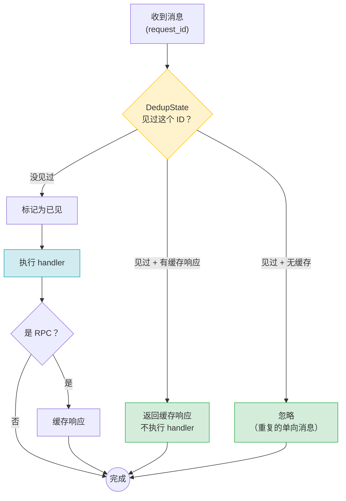

# Transient 错误自动重试设计(待确认)

> **版本**: v1.0 | **状态**: 方案评审 | **更新**: 2026-02-06
>
> **待决策**：接收端去重方案（[方案一](#方案一业务层自行去重) vs [方案二](#方案二框架内置去重)）

---

## 1. 问题

网络短暂中断时（WiFi→4G 切换、信号波动），框架能自动重连，但**正在发送的请求已经丢了**：

```
调用方发送请求 → 网络断开 → 请求失败，错误抛给调用方
                                       ↑
                  与此同时，后台已自动重连成功 ← 但请求已经失败了
```

根因很简单：**框架只做了"自动重连"，没做"自动重发"**。

| 能力 | 现状 |
|------|------|
| 断线重连 | ✅ 已实现（WirePool 自动重连） |
| 失败重发 | ❌ 未实现（错误直接抛给调用方） |

---

## 2. 解决方案：发送端自动重试

思路：遇到 Transient 错误时，框架自动在发送端重试。发送端无需改动；
### 哪些方法需要重试（⏳ 待确认）

| 方法 | 加入重试 | 说明 |
|------|---------|------|
| `send_request()` | ✅ 计划加入 | RPC 请求，Transient 错误时自动重发 |
| `send_message()` | ✅ 计划加入 | 单向消息，Transient 错误时自动重发 |
| `send_data_stream()` | ❌ 不加入 | Fast Path 低延迟通道，重试与其设计冲突 |
| `send_media_sample()` | ❌ 不加入 | RTP 协议自身处理重传 |

### 什么是 Transient 错误

只有**网络瞬断类**错误才重试，其他错误重试也没用，直接返回。

| 可重试（Transient） | 不重试 |
|-------|--------|
| `TransportError` — 连接断开、写入失败 | `Timeout` — 已超时，重试无意义 |
| `ConnectionReset` — 对端重置连接 | `SerializationError` — 数据格式错误 |
| `ChannelClosed` — WebSocket/DataChannel 意外关闭 | `ActorNotFound` — 目标不存在 |
| | `PermissionDenied` — 权限不足 |

### 重试策略

采用**指数退避 + 随机抖动**，在 deadline 内最多重试 3 次：

- 每次重试间隔翻倍（1s → 2s → 4s），叠加随机抖动避免同时重试
- 所有重试必须在原始 timeout 内完成（deadline 模式）
- 每个请求独立重试，互不影响
- 重试时保持相同的 `request_id`，方便接收端识别重复

```
例：timeout = 30s

第 1 次发送 → 失败 (TransportError)
  等 ~1s
第 2 次发送 → 失败 (TransportError)
  等 ~2s
第 3 次发送 → 成功 ✅（总耗时 ~3s）

失败场景：
  3 次都失败 → 返回最后一次错误
  deadline 先到 → 返回 Timeout
```

---

## 3. 重试带来的新问题

自动重试解决了丢消息的问题，但同时引入了一系列新问题：

| 问题 | 说明 | 如何解决 |
|------|------|---------|
| **消息重复** | 发送端以为失败了重试，但第 1 次其实到达了接收端 → 接收端收到两次 | 接收端去重（见 [§4](#4-接收端去重方案待决策)） |
| **重试风暴** | 大量客户端同时遇到网络抖动，集体重试 → 瞬间流量翻倍，压垮服务端 | 指数退避 + 随机抖动，打散重试时间点 |
| **延迟放大** | 重试需要等待退避间隔，调用方感知到的延迟增大 | deadline 模式：所有重试必须在原始 timeout 内完成，不额外延长等待 |
| **级联故障** | 下游服务已过载，重试进一步加剧负载 → 雪崩 | 最多 3 次重试 + deadline 兜底；后续可扩展熔断机制（Circuit Breaker） |

其中**消息重复**是需要在框架层面决策的核心问题，下面详细展开。

### 消息重复的典型场景

```
发送端                        接收端
  │── 请求 (id=abc) ──────────→│  ← 第 1 次：接收端正常处理
  │                   ←─ 响应 ──│
  │         ✗ 响应丢失          │
  │                             │
  │   （以为失败了，重试）        │
  │── 请求 (id=abc) ──────────→│  ← 第 2 次：同一条消息，又来了
```

**需要决策：由谁来处理去重？** 下面给出两个方案。

---

## 4. 接收端去重方案（⏳ 待决策）

### 方案一：业务层自行去重

框架只保证重试时 `request_id` 不变，**去重逻辑由业务 handler 自己实现**。

- **优势**：框架零侵入、无额外内存开销、业务层完全掌控去重粒度
- **劣势**：每个 handler 都可能需要自己写去重逻辑
- **适合**：天然幂等的业务（读操作、覆盖写入）、已有去重机制（如 DB 唯一约束）
- **框架改动**：无

```rust
// 示例：利用 DB 唯一约束去重
async fn handle_transfer(&mut self, req: TransferRequest, ctx: &impl Context) -> ActorResult<Bytes> {
    match self.db.insert_transfer(&req.transfer_id, &req).await {
        Ok(_) => { /* 首次请求，正常处理 */ }
        Err(DbError::DuplicateKey) => {
            // 重复请求，直接返回之前的结果
            return self.db.get_transfer_result(&req.transfer_id).await;
        }
    }
    // ...
}
```

### 方案二：框架内置去重

> 参考：[Proto.Actor DeduplicationContext](https://github.com/asynkron/protoactor-go/blob/dev/actor/deduplication_context.go)

框架在 handler 执行前自动拦截重复消息，**业务层完全无感知**。

- **优势**：业务层零改动、零锁（利用 Actor 串行处理）、无并发竞态
- **劣势**：重复消息仍会进入 Mailbox（去重在出队后执行）、额外内存开销
- **适合**：大部分常规业务、开发者不想关心去重
- **框架改动**：新增 `DedupState` + 改造 `handle_incoming`

去重流程：



关键设计点：

- `DedupState` 是 ActrNode 的普通字段（`HashMap`），不需要 `Mutex`
- Actor 的 `handle_incoming` 在 Mailbox 出队循环中串行调用，天然无竞态
- 检查 + 标记在同一步完成，没有 TOCTOU 窗口
- 过期条目惰性清理（每次检查时顺带清理）

### 方案对比

| | 方案一：业务层去重 | 方案二：框架内置去重 |
|------|------------------|-------------------|
| **思路** | 框架保证 `request_id` 不变，业务自行去重 | 框架自动拦截重复消息 |
| **优势** | 零侵入、无额外开销 | 业务零感知、零锁 |
| **劣势** | 每个 handler 可能要写去重 | 重复消息仍进入 Mailbox |
| **框架改动** | 无 | 新增 `DedupState` + 改造 `handle_incoming` |
| **适合** | 天然幂等业务 | 大部分常规业务 |

---

## 5. 实施计划

### Phase 1：发送端重试

| 任务 | 说明 |
|------|------|
| 实现 `ExponentialBackoff` | 指数退避 + 随机抖动 |
| 实现 `retry_with_backoff()` | 通用重试函数，遵守 deadline |
| 改造 `send_request()` | 加入重试逻辑 |
| 改造 `send_message()` | 加入重试逻辑 |

### Phase 2：接收端去重（⏳ 取决于方案决策）

| 决策 | 后续工作 |
|------|---------|
| 选方案一 | 无需框架改动，补充文档说明即可 |
| 选方案二 | 实现 `DedupState` 并集成到 `ActrNode.handle_incoming()` |

---

## 附录 A：发送端参考代码

### A.1 重试常量

```rust
// outbound/retry.rs

use std::time::Duration;

const MAX_ATTEMPTS: u32 = 3;
const INITIAL_DELAY: Duration = Duration::from_millis(1000);
const MAX_DELAY: Duration = Duration::from_secs(5);
const MULTIPLIER: f64 = 2.0;
const JITTER_FACTOR: f64 = 0.2;
const MESSAGE_DEFAULT_TIMEOUT: Duration = Duration::from_secs(30);
```

### A.2 指数退避

```rust
// outbound/backoff.rs

use std::time::Duration;
use rand::Rng;

pub struct ExponentialBackoff {
    current: Duration,
    max: Duration,
    multiplier: f64,
    jitter_factor: f64,
    retries: u32,
    max_retries: u32,
}

impl ExponentialBackoff {
    pub fn new() -> Self {
        Self {
            current: INITIAL_DELAY,
            max: MAX_DELAY,
            multiplier: MULTIPLIER,
            jitter_factor: JITTER_FACTOR,
            retries: 0,
            max_retries: MAX_ATTEMPTS,
        }
    }

    pub fn next_delay(&mut self) -> Option<Duration> {
        if self.retries >= self.max_retries {
            return None;
        }

        let base_ms = self.current.as_millis() as f64;
        let jitter = rand::thread_rng()
            .gen_range(-self.jitter_factor..self.jitter_factor);
        let delay_ms = (base_ms * (1.0 + jitter)).max(0.0) as u64;
        let delay = Duration::from_millis(delay_ms);

        let next_ms = (base_ms * self.multiplier) as u64;
        self.current = Duration::from_millis(next_ms).min(self.max);

        self.retries += 1;
        Some(delay)
    }
}
```

### A.3 通用重试函数

```rust
// outbound/retry.rs

use std::future::Future;
use tokio::time::{self, Instant};

/// 带退避的重试执行器（严格遵守 deadline）
pub async fn retry_with_backoff<T, E, F, Fut>(
    deadline: Instant,
    mut operation: F,
    is_retryable: fn(&E) -> bool,
    timeout_error: fn() -> E,
) -> Result<T, E>
where
    F: FnMut(Duration) -> Fut,
    Fut: Future<Output = Result<T, E>>,
    E: std::fmt::Debug,
{
    let mut backoff = ExponentialBackoff::new();
    let mut last_error: Option<E> = None;

    loop {
        let remaining = deadline.saturating_duration_since(Instant::now());
        if remaining.is_zero() {
            break;
        }

        let attempt = time::timeout(remaining, operation(remaining)).await;

        match attempt {
            Ok(Ok(result)) => return Ok(result),
            Ok(Err(e)) if is_retryable(&e) => {
                last_error = Some(e);
                let remaining = deadline.saturating_duration_since(Instant::now());
                if remaining.is_zero() { break; }
                match backoff.next_delay() {
                    Some(delay) => time::sleep(delay.min(remaining)).await,
                    None => break,
                }
            }
            Ok(Err(e)) => return Err(e),
            Err(_) => break, // deadline 截断
        }
    }

    Err(last_error.unwrap_or_else(timeout_error))
}
```

### A.4 send_request / send_message 重试

```rust
// outbound/outproc_out_gate.rs

impl OutprocOutGate {
    pub async fn send_request(&self, target: &ActrId, envelope: RpcEnvelope) -> ActorResult<Bytes> {
        let deadline = Instant::now() + Duration::from_millis(envelope.timeout_ms as u64);
        let request_id = envelope.request_id.clone();

        // 注册 response waiter（只注册一次，重试复用同一个 channel）
        let (tx, mut rx) = oneshot::channel();
        self.pending_requests.write().await
            .insert(request_id.clone(), tx);

        let mut backoff = ExponentialBackoff::new();
        let mut last_error: Option<ProtocolError> = None;

        loop {
            let remaining = deadline.saturating_duration_since(Instant::now());
            if remaining.is_zero() {
                self.pending_requests.write().await.remove(&request_id);
                return Err(last_error.unwrap_or(ProtocolError::Timeout).into());
            }

            // 发送
            if let Err(e) = self.do_send(target, PayloadType::RpcReliable, &envelope).await {
                if Self::is_retryable_transport(&e) {
                    last_error = Some(e);
                    if let Some(delay) = backoff.next_delay() {
                        let remaining = deadline.saturating_duration_since(Instant::now());
                        time::sleep(delay.min(remaining)).await;
                        continue;
                    } else {
                        break;
                    }
                } else {
                    self.pending_requests.write().await.remove(&request_id);
                    return Err(e.into());
                }
            }

            // 等响应
            let wait = time::sleep(remaining);
            tokio::pin!(wait);

            select! {
                biased;
                res = &mut rx => {
                    self.pending_requests.write().await.remove(&request_id);
                    return res
                        .map_err(|_| ProtocolError::TransportError("channel closed".into()))
                        .map(Into::into);
                }
                _ = &mut wait => {
                    self.pending_requests.write().await.remove(&request_id);
                    return Err(ProtocolError::Timeout.into());
                }
            }
        }

        self.pending_requests.write().await.remove(&request_id);
        Err(last_error.unwrap_or(ProtocolError::Timeout).into())
    }

    pub async fn send_message(&self, target: &ActrId, envelope: RpcEnvelope) -> ActorResult<()> {
        let deadline = Instant::now() + MESSAGE_DEFAULT_TIMEOUT;
        retry_with_backoff(
            deadline,
            |_remaining| self.do_send(target, PayloadType::RpcReliable, &envelope),
            Self::is_retryable_transport,
            || ProtocolError::Timeout,
        ).await
    }

    fn is_retryable_transport(e: &ProtocolError) -> bool {
        matches!(e, ProtocolError::TransportError(_))
    }
}
```

---

## 附录 B：接收端去重参考代码（方案二）

### B.1 DedupState

```rust
// lifecycle/dedup.rs

use bytes::Bytes;
use std::collections::HashMap;
use std::time::{Duration, Instant};

const DEDUP_TTL: Duration = Duration::from_secs(120);

enum DedupResult {
    New,                        // 首次收到
    DuplicateRequest(Bytes),    // 重复 RPC，返回缓存响应
    DuplicateMessage,           // 重复单向消息，忽略
}

/// Per-Actor 去重状态（无需 Mutex，Actor 串行保证安全）
///
/// 参考：Proto.Actor DeduplicationContext
/// - 普通 HashMap + TTL，惰性清理
/// - check-and-mark 一步完成，无竞态
struct DedupState {
    seen: HashMap<String, (Instant, Option<Bytes>)>,
    ttl: Duration,
}

impl DedupState {
    fn new() -> Self {
        Self { seen: HashMap::new(), ttl: DEDUP_TTL }
    }

    fn check(&mut self, request_id: &str) -> DedupResult {
        self.cleanup();

        if let Some((ts, cached)) = self.seen.get_mut(request_id) {
            if ts.elapsed() < self.ttl {
                *ts = Instant::now();
                return match cached {
                    Some(resp) => DedupResult::DuplicateRequest(resp.clone()),
                    None => DedupResult::DuplicateMessage,
                };
            }
        }

        self.seen.insert(request_id.to_string(), (Instant::now(), None));
        DedupResult::New
    }

    fn cache_response(&mut self, request_id: &str, response: Bytes) {
        if let Some(entry) = self.seen.get_mut(request_id) {
            entry.0 = Instant::now();
            entry.1 = Some(response);
        }
    }

    fn cleanup(&mut self) {
        let ttl = self.ttl;
        self.seen.retain(|_, (ts, _)| ts.elapsed() < ttl);
    }
}
```

### B.2 ActrNode 集成

```rust
// lifecycle/actr_node.rs

impl<W: Workload> ActrNode<W> {
    // 新增字段: dedup_state: DedupState

    pub async fn handle_incoming(
        &mut self,
        envelope: RpcEnvelope,
        caller_id: Option<&ActrId>,
    ) -> ActorResult<Bytes> {
        // 去重拦截
        match self.dedup_state.check(&envelope.request_id) {
            DedupResult::DuplicateRequest(cached) => return Ok(cached),
            DedupResult::DuplicateMessage => return Ok(Bytes::new()),
            DedupResult::New => {}
        }

        // 正常处理
        let ctx = self.context_factory.create(/* ... */);
        let result = W::Dispatcher::dispatch(&self.workload, envelope.clone(), &ctx).await;

        // 缓存 RPC 响应
        if let Ok(ref response) = result {
            self.dedup_state.cache_response(&envelope.request_id, response.clone());
        }

        result
    }
}
```

---

## 附录 C：测试用例

### C.1 发送端重试

```rust
#[tokio::test]
async fn test_retry_succeeds_on_second_attempt() {
    // 第一次 TransportError，第二次成功 → 返回成功
}

#[tokio::test]
async fn test_no_retry_for_non_transport_error() {
    // SerializationError → 不重试，直接返回错误
}

#[tokio::test]
async fn test_retry_stops_at_deadline() {
    // 持续失败 + 短 timeout → 在 deadline 内停止
}

#[tokio::test]
async fn test_independent_retry_per_request() {
    // 请求 A 重试中，请求 B 正常发送 → 互不影响
}
```

### C.2 接收端去重（方案二）

```rust
#[tokio::test]
async fn test_first_request_passes_through() {
    // 首次 request_id → DedupResult::New
}

#[tokio::test]
async fn test_duplicate_rpc_returns_cached() {
    // 相同 request_id 再次到达 → 返回缓存响应
}

#[tokio::test]
async fn test_duplicate_message_ignored() {
    // 相同 request_id 的 message → 忽略
}

#[tokio::test]
async fn test_expired_entry_treated_as_new() {
    // TTL 过期后 → 当作新请求处理
}
```
