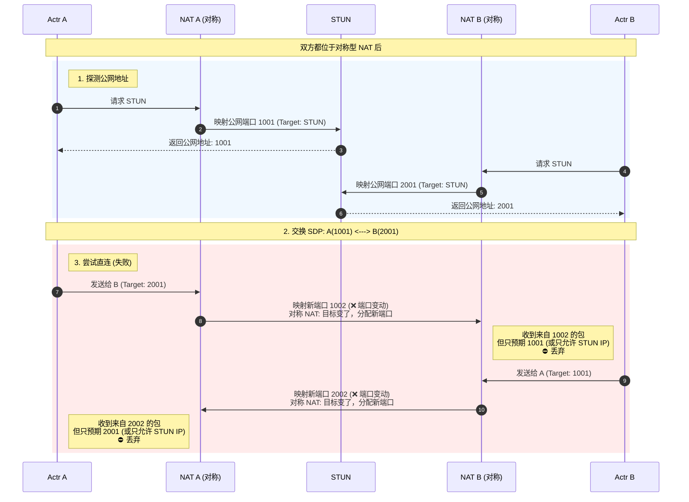

# Actr WebRTC 配置指南

Actr 的 WebRTC 配置非常灵活：通常情况下只需配置 STUN/TURN 服务器即可；如果作为服务端部署在 NAT 后需要提高直连率，则需额外配置 UDP 端口范围。

> **术语**：`host`（内网直连）、`srflx`（公网映射）、`relay`（TURN 中继）

---

## 1. 配置说明 (Configuration Overview)

**不配置端口范围**。系统随机分配端口，开箱即用。适合作为**主动发起连接的一方**（如手机、电脑客户端），或者在公网（有独立ip 非nat后的服务）直接运行的程序。


> **注意**：当通信双方 (**ActrA** 与 **ActrB**) **都未配置端口范围**（随机端口）时，**直连**连通性如下表所示：
>
> | A \ B 环境 | **公网** (Public) | **锥型 NAT** (普通) | **对称型 NAT** (4G/企业) |
> | :--- | :--- | :--- | :--- |
> | **公网** | ✅ **直连** | ✅ **直连** | ✅ **直连** |
> | **锥型 NAT** | ✅ **直连** | ✅ **直连** | ✅ **直连** |
> | **对称型 NAT** | ✅ **直连** | ✅ **直连** | ❗ **中继** |
>
> *   **中继**：指无法建立 P2P 直连，**必须依赖 TURN 中继**才能通信。

<details open>
<summary><b>图解：为什么双端对称型 NAT 无法直连？</b></summary>


</details>

*   **配置示例**：
    ```toml
    [system.webrtc]
    stun_urls = ["stun:stun.example.com:3478"]
    turn_urls = ["turn:turn.example.com:3478"]
    ```
*   **参数说明**：
    无。

*   **原理**：
    Actr 使用webrtc库的默认实现，只需要填入stun和turn服务器地址即可。
*   **优点**：
    *   只需要基础配置即可
*   **缺点**：
    *   **无法做端口映射**：因端口随机，无法在路由器/宿主机配置静态映射，导致在 NAT 或容器内无法作为服务端被直连。
    *   **双端对称 NAT 不通**：如上表所示，若双方都处于 **对称型 NAT** (如双端 4G) 环境下，直连必然失败。
*   **适用场景**：
    *   移动端 App。
    *   桌面客户端。
    *   浏览器

### 1.2 指定端口范围 (With Port Range)

**服务端部署推荐配置**。通过配置固定的 UDP 端口范围配合公网映射，严格遵循 ICE 协议标准，完美解决了服务端在 NAT 后的直连难题。这是目前**兼容性最好、穿透成功率最高**的配置方案。

> **效果分析**：通过**固定端口映射**，能显著提升连通性。
>
> **情况一：混合场景**
> 假设 **ActrA (无固定端口)** 连接 **ActrB (有固定端口映射)**。
> 此时 ActrB 等同于公网节点，ActrA 能够主动建立连接：
>
> | A(随机端口) \ B(固定端口) | **公网** | **锥型 NAT** | **对称型 NAT** |
> | :--- | :--- | :--- | :--- |
> | **公网** | ✅ **直连** | ✅ **直连** | ✅ **直连** |
> | **锥型 NAT** | ✅ **直连** | ✅ **直连** | ✅ **直连** |
> | **对称型 NAT** | ✅ **直连** | ✅ **直连** | ✅ **直连** |
>
> *   **核心优势**：只要**服务端**配置了端口范围并做好了映射，即可解决客户端处于对称 NAT 或复杂网络环境下的直连难题。
>
> **情况二：双端固定端口**
> 假设 **ActrA** 与 **ActrB** **都有固定端口映射**，此时双方连通性**等同于公网互连**：
>
> | A \ B 环境 (固定端口) | **公网** | **锥型 NAT** | **对称型 NAT** |
> | :--- | :--- | :--- | :--- |
> | **公网** | ✅ **直连** | ✅ **直连** | ✅ **直连** |
> | **锥型 NAT** | ✅ **直连** | ✅ **直连** | ✅ **直连** |
> | **对称型 NAT** | ✅ **直连** | ✅ **直连** | ✅ **直连** |
>
> *   **结论**：这是**最完美**的配置方案。只要映射正确，无论双方处于何种网络环境（包括双端对称 NAT），均可实现**直连**。

*   **配置示例**：
    ```toml
    [system.webrtc]
    port_range_start = 50000
    port_range_end = 50100
    public_ips = ["203.0.113.10"] # NAT后必填
    
    turn_urls = ["turn:turn.example.com:3478"]
    stun_urls = ["stun:stun.example.com:3478"]
    ice_relay_acceptance_min_wait = 2000 # 服务端直连优先
    ```
*   **参数说明**：
    *   `port_range_start`: (必填) 端口范围起始值。
    *   `port_range_end`: (必填) 端口范围结束值。建议范围大小至少 100 个。
    *   `public_ips`: (可选) 如果服务器在 NAT 后，必须填入公网 IP，格式 `["PUBLIC"]`。如果服务器直接拥有公网 IP，可不填。
*   **原理**：
    Actr 为每个客户端连接分配一个**独立**的 UDP 端口（从配置范围中选择）。
*   **优点**：
    *   **连接质量最好**：独立端口无干扰，传输效率最高。
    *   **灵活的部署模式**：既支持 **Host 内网连接**（局域网高速互通），也支持 **公网连接**（通过映射公网 IP 供外网访问）。
*   **缺点**：
    *   **防火墙配置繁琐**：需要在防火墙/安全组开放较大的端口范围（如 100 个端口）。
*   **适用场景**：
    *   拥有公网 IP 的服务端。
    *   可以配置 NAT 端口段映射的网关。


---

## 2. 快速选择 (Quick Select)

| 你的场景                | 关键配置                     |
| ----------------------- | ---------------------------- |
| **移动端 / 客户端**     | STUN/TURN (不配端口)         |
| **服务端（有公网 IP）** | 端口段 + STUN/TURN           |
| **服务端（NAT 后）**    | 端口段 + `public_ips` + TURN |

---

## 3. 配置模板

根据你的场景，直接复制以下配置。

### 场景 A：移动端 / 客户端

无需配置特定的端口，但**建议配置** STUN/TURN 以确保连通性。

```toml
[system.webrtc]
stun_urls = ["stun:stun.example.com:3478"]
turn_urls = ["turn:turn.example.com:3478"]
ice_relay_acceptance_min_wait = 100         # 客户端推荐速度优先
```

---

### 场景 B：服务端（有公网 IP）

机器直接拥有公网 IP，无 NAT。

```toml
[system.webrtc]
port_range_start = 50000
port_range_end = 50100

stun_urls = ["stun:stun.example.com:3478"]  # 帮助对方发现公网 IP
turn_urls = ["turn:turn.example.com:3478"]
ice_relay_acceptance_min_wait = 2000        # 直连优先
```

---

### 场景 C：服务端（NAT 后）

机器使用内网 IP，通过路由器的公网 IP 访问。

```toml
[system.webrtc]
port_range_start = 50000
port_range_end = 50100
public_ips = ["203.0.113.10"]  # 必须配置：["公网IP"]

stun_urls = ["stun:stun.example.com:3478"]
turn_urls = ["turn:turn.example.com:3478"]  # TURN 兜底
ice_relay_acceptance_min_wait = 2000        # 直连优先
```

> **要求**：必须在路由器/防火墙上配置 **静态端口映射**（映射整个端口段）。

---


---

## 4. 常见问题 (FAQ)

### Q: NAT 后配置了 `public_ips` 还需要 STUN 吗？
**不需要，也不能要**。`public_ips` 显式指定了公网 IP，STUN 会产生冲突（webrtc-rs 限制）。


### Q: ICE 等待时间怎么设？
- **直连优先**（服务端）：`2000` ms。等待更长时间以建立直连，节省 TURN 流量。
- **速度优先**（客户端）：`100` ms。快速建立连接，不惜使用 TURN。

### Q: 怎么验证配置是否成功？
1. **检查 IP**：`curl ifconfig.me`（公网）和 `ip addr`（内网）确保填写的 IP 正确。
2. **检查端口**：确保防火墙/云厂商安全组已开放对应 UDP 端口（段）。

---

## 5. 故障排查

| 现象              | 可能原因                                    | 解决                                  |
| ----------------- | ------------------------------------------- | ------------------------------------- |
| **无法直连**      | 端口未开放、`public_ips` 写错、未做端口映射 | 检查防火墙和映射配置                  |
| **连接很慢**      | ICE 等待时间太长、直连超时                  | 改为 `100` ms，或检查直连配置         |
| **流量全走 TURN** | 直连一直失败                                | 使用 `ephemeral_ports` 并检查端口映射 |

---

## 总结

- 服务端部署**强烈建议**配置端口范围 (`port_range_start/end`)。
- 移动端/客户端一般**无需配置**端口。